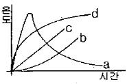

# 소방설비기사(전기분야)20150308(교사용) - 소방원론

> 원본: `소방설비기사(전기분야)20150308(교사용).pdf`
> 개인학습용 변환본.

## 1. 문제

1. 소방안전관리대상물에 대한 소방안전관리자의 업무가 아닌 
것은?
   ① 소방계획서의 작성
② 자위소방대의 구성
   ③ 소방훈련 및 교육
❹ 소방용수시설의 지정

### 정답

1번

### 해설

정답은 1번입니다. 선택지의 핵심개념 을 확인하세요.

### 그림

## 2. 문제

2. 부촉매소화에 관한 설명으로 옳은 것은?
   ① 산소의 농도를 낮추어 소화하는 방법이다.
   ② 화학반응으로 발생한 탄산가스에 의한 소화방법이다.
   ❸ 활성기(Free radical)의 생성을 억제하는 소화방법이다.
   ④ 용융잠열에 의한 냉각효과를 이용하여 소화하는 방법이
다.

### 정답

1번

### 해설

정답은 1번입니다. 선택지의 핵심개념 을 확인하세요.

### 그림

## 3. 문제

3. 이산화탄소의 증기비중은 약 얼마인가?
   ① 0.81
❷ 1.52
   ③ 2.02
④ 2.51

### 정답

1번

### 해설

정답은 1번입니다. 선택지의 핵심개념 을 확인하세요.

### 그림

## 4. 문제

4. 축압식 분말소화기의 충전압력이 정상인 것은?
   ① 지시압력계의 지침이 노란색부분을 가리키면 정상이다.
   ② 지시압력계의 지침이 흰색부분을 가리키면 정상이다.
   ③ 지시압력계의 지침이 빨간색부분을 가리키면 정상이다.
   ❹ 지시압력계의 지침이 녹색부분을 가리키면 정상이다.

### 정답

1번

### 해설

정답은 1번입니다. 선택지의 핵심개념 을 확인하세요.

### 그림

## 5. 문제

5. 착화에너지가 충분하지 않아 가연물이 발화되지 못하고 다량
의 연기가 발생되는 연소형태는?
   ❶ 훈소
② 표면연소
   ③ 분해연소
④ 증발연소

### 정답

1번

### 해설

정답은 1번입니다. 선택지의 핵심개념 을 확인하세요.

### 그림

## 6. 문제

6. 가연성 액화가스의 용기가 과열로 파손되어 가스가 분출된 
후 불이 폭발하는 현상은?
   ❶ 블레비(BLEVE)
   ② 보일오버(Boil over)
   ③ 슬롭오버(Slop over)
   ④ 플래시오버(Flash over)

### 정답

1번

### 해설

정답은 1번입니다. 선택지의 핵심개념 을 확인하세요.

### 그림

## 7. 문제

7. 위험물안전관리법령상 제4류 위험물인 알코올류에 속하지 않
는 것은?
   ① C2H5OH
❷ C4H9OH
   ③ CH3OH
④ C3H7OH

### 정답

1번

### 해설

정답은 1번입니다. 선택지의 핵심개념 을 확인하세요.

### 그림

## 8. 문제

8. 불활성가스 청정소화약제인 IG-541의 성분이 아닌 것은?
   ① 질소
② 아르곤
   ❸ 헬륨
④ 이산화탄소

### 정답

1번

### 해설

정답은 1번입니다. 선택지의 핵심개념 을 확인하세요.

### 그림

## 9. 문제

9. 위험물안전관리법령상 옥외 탱크저장소에 설치하는 방유제의 
면적기준으로 옳은 것은?
   ① 30000 m2 이하
② 50000m2 이하
   ❸ 80000m2 이하
④ 100000m2 이하

### 정답

1번

### 해설

정답은 1번입니다. 선택지의 핵심개념 을 확인하세요.

### 그림

## 10. 문제

10. 건축물의 주요 구조부에 해당되지 않는 것은?
    ① 기둥
❷ 작은 보
    ③ 지붕틀
④ 바닥

### 정답

1번

### 해설

정답은 1번입니다. 선택지의 핵심개념 을 확인하세요.

### 그림

## 11. 문제

11. 간이소화용구에 해당되지 않는 것은?
    ❶ 이산화탄소소화기
② 마른모래
    ③ 팽창질석
④ 팽창진주암

### 정답

1번

### 해설

정답은 1번입니다. 선택지의 핵심개념 을 확인하세요.

### 그림

## 12. 문제

12. 가연물이 되기 쉬운 조건이 아닌 것은?
    ① 발열량이 커야 한다.
    ❷ 열전도율이 커야 한다.
    ③ 산소와 친화력이 좋아야 한다.
    ④ 활성화에너지가 작아야 한다.

### 정답

1번

### 해설

정답은 1번입니다. 선택지의 핵심개념 을 확인하세요.

### 그림

## 13. 문제

13. 화재 시 불티가 바람에 날리거나 상승하는 열기류에 휩쓸려 
멀리 있는 가연물에 착화되는 현상은?
    ❶ 비화
② 전도
    ③ 대류
④ 복사

### 정답

1번

### 해설

정답은 1번입니다. 선택지의 핵심개념 을 확인하세요.

### 그림

## 14. 문제

14. 할로겐화합물 소화약제에 관한 설명으로 틀린 것은?
    ① 비열, 기화열이 작기 때문에 냉각효과는 물보다 작다.
    ② 할로겐 원자는 활성기의 생성을 억제하여 연쇄반응을 차
단한다.
    ③ 사용 후에도 화재현장을 오염시키지 않기 때문에 통신 
기기실 등에 적합하다.
    ❹ 약제의 분자 중에 포함되어 있는 할로겐 원자의 소화 효
과는 F >Cl >Br >I 의 순이다.

### 정답

1번

### 해설

정답은 1번입니다. 선택지의 핵심개념 을 확인하세요.

### 그림

## 15. 문제

15. 유류탱크 화재 시 발생하는 슬롭오버(Slop over) 현상에 관
한 설명으로 틀린 것은?
    ① 소화 시 외부에서 방사하는 포에 의해 발생한다.
    ② 연소유가 비산되어 탱크 외부까지 화재가 확산된다.
    ❸ 탱크의 바닥에 고인 물의 비등 팽창에 의해 발생한다.
    ④ 연소면의 온도가 100℃ 이상일 때 물을 주수하면 발생한
다.

### 정답

1번

### 해설

정답은 1번입니다. 선택지의 핵심개념 을 확인하세요.

### 그림

## 16. 문제

16. 마그네슘에 관한 설명으로 옳지 않은 것은?
    ① 마그네슘의 지정수량은 500kg이다.
    ② 마그네슘 화재 시 주수하면 폭발이 일어날 수도 있다.
    ❸ 마그네슘 화재 시 이산화탄소 소화약제를 사용하여 소화
한다.
    ④ 마그네슘의 저장·취급 시 산화제와의 접촉을 피한다.

### 정답

1번

### 해설

정답은 1번입니다. 선택지의 핵심개념 을 확인하세요.

### 그림

## 17. 문제

17. 할로겐화합물 소화약제의 분자식이 틀린 것은?
    ① 할론 2402 : C2F4Br2
    ❷ 할론 1211 : CCl2FBr
    ③ 할론 1301 : CF3Br
    ④ 할론 104 : CCl4

### 정답

1번

### 해설

정답은 1번입니다. 선택지의 핵심개념 을 확인하세요.

### 그림

## 18. 문제

18. 그림에서 내화조 건물의 표준 화재 온도-시간 곡선은?
    
    ① a
② b
    ③ c
❹ d
1과목 : 소방원론

소방설비기사(전기분야)
◐2015년 03월 08일 필기 기출문제 ◑
전자문제집 CBT : www.comcbt.com
최강 자격증 기출문제 전자문제집 CBT : www.comcbt.com

### 정답

1번

### 해설

정답은 1번입니다. 선택지의 핵심개념 을 확인하세요.

### 그림

## 19. 문제

19. 벤젠의 소화에 필요한 CO2의 이론소화농도가 공기 중에서 
37 vol% 일 때 한계산소농도는 약 몇 vol% 인가?
    ❶ 13.2
② 14.5
    ③ 15.5
④ 16.5

### 정답

1번

### 해설

정답은 1번입니다. 선택지의 핵심개념 을 확인하세요.

### 그림

## 20. 문제

20. 가연성물질별 소화에 필요한 이산화탄소 소화약제의 설계농
도로 틀린 것은?
    ① 메탄 : 34 vol%
② 천연가스 : 37 vol%
    ③ 에틸렌 : 49 vol%
❹ 아세틸렌 : 53 vol%

### 정답

1번

### 해설

정답은 1번입니다. 선택지의 핵심개념 을 확인하세요.

### 그림

