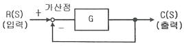
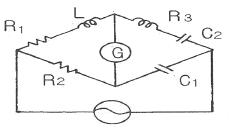
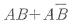
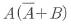
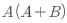
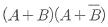
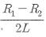
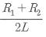
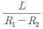
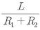

# 소방설비기사(전기분야)20160306(교사용) - 소방원론

> 원본: `소방설비기사(전기분야)20160306(교사용).pdf`
> 개인학습용 변환본.

## 1. 문제

1. 일반적인 자연발화의 방지법으로 틀린 것은?
   ❶ 습도를 높일 것
   ② 저장실의 온도를 낮출 것
   ③ 정촉매 작용을 하는 물질을 피할 것
   ④ 통풍을 원활하게 하여 열축적을 방지할것

### 정답

1번

### 해설

정답은 1번입니다. 선택지의 핵심개념 을 확인하세요.

## 2. 문제

2. 위험물안전관리법령상 제4류 위험물의 화재에 적응성이 있는 
것은?
   ① 옥내소화전설비
② 옥외소화전설비
   ③ 봉상수소화기
❹ 물분무소화설비

### 정답

1번

### 해설

정답은 1번입니다. 선택지의 핵심개념 을 확인하세요.

## 3. 문제

3. 화학적 소화방법에 해당하는 것은?
   ① 모닥불에 물을 뿌려 소화한다.
   ② 모닥불을 모래로 덮어 소화한다.
   ❸ 유류화재를 할론 1301로 소화한다.
   ④ 지하실 화재를 이산화탄소로 소화한다.

### 정답

1번

### 해설

정답은 1번입니다. 선택지의 핵심개념 을 확인하세요.

## 4. 문제

4. 목조건축물에서 발생하는 옥외출화 시기를 나타낸 것으로 옳
은 것은?
   ❶ 창, 출입구 등에 발염 착화한 때
   ② 천장 속, 벽 속 등에서 발염 착화한 때
   ③ 가옥 구조에서는 천장면에 발염 착화한 때
   ④ 불연 천장인 경우 실내의 그 뒷면에 발염 착화한 때

### 정답

1번

### 해설

정답은 1번입니다. 선택지의 핵심개념 을 확인하세요.

## 5. 문제

5. 무창층 여부를 판단하는 개구부로서 갖추어야 할 조건으로 
옳은 것은?
   ① 개구부 크기가 지름 30cm 의 원이 내접할 수 있는 것
   ② 해당 층의 바닥면으로부터 개구부 밑 부분까지의 높이가 
1.5m 인 것
   ❸ 내부 또는 외부에서 쉽게 파괴 또는 개방할 수 있을 것
   ④ 창에 방범을 위하여 40cm 간격으로 창살을 설치한 것

### 정답

1번

### 해설

정답은 1번입니다. 선택지의 핵심개념 을 확인하세요.

## 6. 문제

6. 건물화재 시 패닉(panic)의 발생원인과 직접적인 관계가 없는 
것은?
   ① 연기에 의한 시계 제한   ② 유독가스에 의한 호흡 장애
   ③ 외부와 단절되어 고립    ❹ 불연내장재의 사용

### 정답

1번

### 해설

정답은 1번입니다. 선택지의 핵심개념 을 확인하세요.

## 7. 문제

7. 화 재 발생 시 주수소화가 적합하지 않은 물질은?
   ① 적린
❷ 마그네슘 분말
   ③ 과염소산칼륨
④ 유황

### 정답

1번

### 해설

정답은 1번입니다. 선택지의 핵심개념 을 확인하세요.

## 8. 문제

8. 공기 중에서 수소의 연소범위로 옳은 것은?
   ① 0.4 ~ 4 vol%
② 1 ~ 12.5 vol%
   ❸ 4 ~ 75 vol%
④ 67 ~ 92 vol%

### 정답

1번

### 해설

정답은 1번입니다. 선택지의 핵심개념 을 확인하세요.

## 9. 문제

9. 가연성가스나 산소의 농도를 낮추어 소화하는 방법은?
   ❶ 질식소화
② 냉각소화
   ③ 제거소화
④ 억제소화

### 정답

1번

### 해설

정답은 1번입니다. 선택지의 핵심개념 을 확인하세요.

## 10. 문제

10. 이산화탄소(CO2)에 대한 설명으로 틀린 것은?
    ❶ 임계온도는 97.5℃ 이다.
    ② 고체의 형태로 존재할 수 있다.
    ③ 불연성가스로 공기보다 무겁다.
    ④ 상온, 상압에서 기체 상태로 존재한다.

### 정답

1번

### 해설

정답은 1번입니다. 선택지의 핵심개념 을 확인하세요.

## 11. 문제

11. 분말 소화약제 중 A급, B급, C급 화재에 모두 사용할 수 있
는 것은?
    ① Na2CO3    
❷ NH4H2PO4
    ③ KHCO3    
④ NaHCO3

### 정답

1번

### 해설

정답은 1번입니다. 선택지의 핵심개념 을 확인하세요.

## 12. 문제

12. 증기비중의 정의로 옳은 것은? (단, 보기에서 분자, 분모의 
단위는 모두 g/mol 이다.)
    ① 분자량/22.4
❷ 분자량/29
    ③ 분자량/44.8
④ 분자량/100

### 정답

1번

### 해설

정답은 1번입니다. 선택지의 핵심개념 을 확인하세요.

## 13. 문제

13. 화재발생 시 건축물의 화재를 확대시키는 주요인이 아닌 것
은?
    ① 비화
② 복사열
    ③ 화염의 접촉(접염)
❹ 흡착열에 의한 발화

### 정답

1번

### 해설

정답은 1번입니다. 선택지의 핵심개념 을 확인하세요.

## 14. 문제

14. 위험물안전관리법령상 위험물 유별에 따른 성질이 잘못 연
결된 것은?
    ① 제1류 위험물 - 산화성고체
    ② 제2류 위험물 - 가연성고체
    ③ 제4류 위험물 - 인화성액체
    ❹ 제6류 위험물 - 자기반응성물질

### 정답

1번

### 해설

정답은 1번입니다. 선택지의 핵심개념 을 확인하세요.

## 15. 문제

15. 가연성 가스가 아닌 것은?
    ① 일산화탄소
② 프로판
    ③ 수소
❹ 아르곤

### 정답

1번

### 해설

정답은 1번입니다. 선택지의 핵심개념 을 확인하세요.

## 16. 문제

16. 화재 최성기 때의 농도로 유도등이 보이지 않을 정도의 연
기농도는? (단, 감광계수로 나타낸다.)
    ① 0.1m-1
② 1m-1
    ❸ 10m-1
④ 30m-1

### 정답

1번

### 해설

정답은 1번입니다. 선택지의 핵심개념 을 확인하세요.

## 17. 문제

17. 황린의 보관 방법으로 옳은 것은?
    ❶ 물 속에 보관
    ② 이황화탄소 속에 보관
    ③ 수산화칼륨 속에 보관
    ④ 통풍이 잘 되는 공기 중에 보관

### 정답

1번

### 해설

정답은 1번입니다. 선택지의 핵심개념 을 확인하세요.

## 18. 문제

18. 공기 중의 산소의 농도는 약 몇 vol% 인가?
    ① 10
② 13
    ③ 17
❹ 21

### 정답

1번

### 해설

정답은 1번입니다. 선택지의 핵심개념 을 확인하세요.

## 19. 문제

19. 제거소화의 예가 아닌 것은?
    ❶ 유류화재 시 다량의 포를 방사한다.
    ② 전기화재 시 신속하게 전원을 차단한다.
    ③ 가연성가스 화재 시 가스의 밸브를 닫는다.
    ④ 산림화재 시 확산을 막기 위하여 산림의 일부를 벌목한
다.

### 정답

1번

### 해설

정답은 1번입니다. 선택지의 핵심개념 을 확인하세요.

## 20. 문제

20. 제2종 분말 소화약제가 열분해되었을 때 생성되는 물질이 
아닌 것은?
    ① CO2
② H2O
    ❸ H3PO4
④ K2CO3
1과목 : 소방원론

소방설비기사(전기분야)
◐2016년 03월 06일 필기 기출문제 ◑
전자문제집 CBT : www.comcbt.com
최강 자격증 기출문제 전자문제집 CBT : www.comcbt.com

### 정답

1번

### 해설

정답은 1번입니다. 선택지의 핵심개념 을 확인하세요.

### 그림

