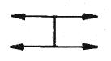
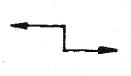
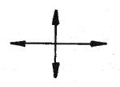
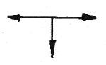

# 소방설비기사(전기분야)20170305(해설집) - 소방원론

> 원본: `소방설비기사(전기분야)20170305(해설집).pdf`
> 개인학습용 변환본.

## 1. 문제

1. 고층 건축물 내 연기거동 중 굴뚝효과에 영향을 미치는 요소
가 아닌 것은?
   ① 건물 내ㆍ외의 온도차
② 화재실의 온도
   ③ 건물의 높이
④ 층의 면적
<문제 해설>
굴뚝효과에 영향을 미치는 요인

### 정답

1번

### 해설

정답은 1번입니다. 선택지의 핵심개념 을 확인하세요.

## 4. 문제

4. A급, B급, C급 화재에 사용이 가능한 제3종 분말 소화약제의 
분자식은?
   ① NaHCO3
② KHCO3
   ③ NH4H2PO4
④ Na2CO3
<문제 해설>

### 정답

1번

### 해설

정답은 1번입니다. 선택지의 핵심개념 을 확인하세요.

## 5. 문제

5. 할론 (Halon) 1301의 분자식은?
   ① CH3Cl
② CH3Br
   ③ CF3Cl
④ CF3Br
<문제 해설>
1301 C F CL BR 순서대로 입력
[해설작성자 : 켈빔]

### 정답

1번

### 해설

정답은 1번입니다. 선택지의 핵심개념 을 확인하세요.

## 6. 문제

6. 소화약제의 방출수단에 대한 설명으로 가장 옳은 것은?
   ① 액체 화학반응을 이용하여 발생되는 열로 방출한다.
   ② 기체의 압력으로 폭발, 기화작용 등을 이용하여 방출한다.
   ③ 외기의 온도, 습도, 기압 등을 이용하여 방출한다.
   ④ 가스압력, 동력, 사람의 손 등에 의하여 방출한다.
<문제 해설>
소화약제의 방출수단

### 정답

1번

### 해설

정답은 1번입니다. 선택지의 핵심개념 을 확인하세요.

## 7. 문제

7. 다음 중 가연성 가스가 아닌 것은?
   ① 일산화탄소
② 프로판
   ③ 아르곤
④ 수소
<문제 해설>
가연성 가스; 수소. 메탄. 일산화탄소. 천연가스. 부탄. 에탄. 암
모니아. 프로판
[해설작성자 : 합격]
*지연성가스(조연성가스)
산소,공기,염소,오존,불소
[해설작성자 : adf]

### 정답

1번

### 해설

정답은 1번입니다. 선택지의 핵심개념 을 확인하세요.

## 8. 문제

8. 1기압, 100℃에서의 물 1g의 기화잠열은 약 몇 cal 인가?
   ① 425
② 539
   ③ 647
④ 734
<문제 해설>
물의 증발잠열 : 539cal/g
[해설작성자 : 합격이당]

### 정답

1번

### 해설

정답은 1번입니다. 선택지의 핵심개념 을 확인하세요.

## 9. 문제

9. 건축물의 화재 시 피난자들의 집중으로 패닉(panic) 현상이 
일어날 수 있는 피난방향은?
1과목 : 소방원론

본 해설집은 최강 자격증 기출문제 전자문제집 CBT 해설달기 프로젝트에 의해서 만들어진 자료입니다. 해설을 제공해 주신 모든 분들께 감사 드립니다.
소방설비기사(전기분야)
◐2017년 03월 05일 필기 기출문제 및 해설집◑
전자문제집 CBT : www.comcbt.com
기출문제 해설은 최강 자격증 기출문제 전자문제집 CBT : www.comcbt.com 통해서 실시간으로 변경됩니다.
   ① 
   ② 
   ③ 
④ 
<문제 해설>
피난 방향 : 4가지 경로
- T형 : 피난 자에게 피난경로를 확실하게 알려주는 형태
- X형 : 양방향으로 피난할 수 있는 확실한 형태
- H형 : 피난 자의 집중으로 패닉 현상을 일으킬 수 있는 형태
- Z형 : 중앙복도형 건물에서의 피난경로로서 코너식 중 제일 
안전한 형태
[해설작성자 : 시나브로]

### 정답

1번

### 해설

정답은 1번입니다. 선택지의 핵심개념 을 확인하세요.

### 그림

## 10. 문제

10. 연기의 감광계수(m-1)에 대한 설명으로 옳은 것은?
    ① 0.5는 거의 앞이 보이지 않을 정도이다.
    ② 10은 화재 최성기 때의 농도이다.
    ③ 0.5는 가시거리가 20~30m 정도이다.
    ④ 10은 연기감지기가 작동하기 직전의 농도이다.
<문제 해설>
0.1 20~30m 연기감지기 작동 / 익숙하지 않은 사람도 피난 가
능
0.3 5m 건물 내부에 익숙한 사람이 피난 가능
10 0.2~0.5M 화재최성기
(M는 가시거리 입니다.)
[해설작성자 : 의정부소방관]

### 정답

1번

### 해설

정답은 1번입니다. 선택지의 핵심개념 을 확인하세요.

### 그림

## 11. 문제

11. 위험물의 저장 방법으로 틀린 것은?
    ① 금속나트륨 - 석유류에 저장
    ② 이황화탄소 - 수조 물탱크에 저장
    ③ 알킬알루미늄 - 벤젠액에 희석하여 저장
    ④ 산화프로필렌 - 구리 용기에 넣고 불연성 가스를 봉입하
여 저장
<문제 해설>
산화프로필렌의 저장 및 취급방법 4가지는? 답: ∙구리, 수은, 은, 
마그네슘 및 이들의 합금용기는 사용치 말 것.
∙저장용기 내부에는불연성가스(N2)를 봉입시켜 연소범위내의 증
기형성을
방지한다..
∙증기 및 액체누설에 주의한다..
∙불꽃, 가열, 타격등, 점화원으로부터 이격하여 보관한다..
∙용기는 밀전하여 냉암소에 저장한다..

### 정답

1번

### 해설

정답은 1번입니다. 선택지의 핵심개념 을 확인하세요.

### 그림

## 12. 문제

12. 건축방화계획에서 건축구조 및 재료를 불연화하여 화재를 
미연에 방지하고자 하는 공간적 대응방법은?
    ① 회피성 대응
② 도피성 대응
    ③ 대항성 대응
④ 설비적 대응
<문제 해설>
공간적대응과 설비적대응
공간적대응 대항성,회피성,도피성 대항성은 내화구조,방연성능,
방호구획계획 등,회피성은 난연,불연화,방화훈련, 도피성은 방재
계획,피난설비
설비적대응 대항성,도피성 대항성은 제연설비,방화문,방화셧터 
도피성은 피난유도설비
[해설작성자 : 이나사항]

### 정답

1번

### 해설

정답은 1번입니다. 선택지의 핵심개념 을 확인하세요.

### 그림

## 13. 문제

13. 할론 가스 45kg과 함께 기동가스로 질소2kg을 충전하였다. 
이 때 질소가스의 몰분율은? (단, 할론 가스의 분자량은 
149이다.)
    ① 0.19
② 0.24
    ③ 0.31
④ 0.39
<문제 해설>
질소 몰 수 = 2/28 = 0.0714 kmol
할론가스의 몰 수 =    45/149 = 0.302 kmol
질소의 몰 분율 = 0.0714/(0.302 + 0.0714)
= 0.19
[해설작성자 : 챠디]
1.질소 N2분자량 = 14x2=28kg/kmol
2.몰수
             질량(kg)
몰수 = ----------------
         분자량(kg/kmol)
    a.할론가스 몰수 = 45/149=0.3    
    b.질소가스 몰수 = 2/28=0.07
3.몰분율
          성분의 몰수         0.07
몰분율 = ----------- = ----------- = 0.19
           전체 몰수        (0.3+ 0.07)
[해설작성자 : adf]

### 정답

1번

### 해설

정답은 1번입니다. 선택지의 핵심개념 을 확인하세요.

### 그림

## 14. 문제

14. 다음 중 착화온도가 가장 낮은 것은?
    ① 에틸알코올
② 톨루엔
    ③ 등유
④ 가솔린
<문제 해설>

본 해설집은 최강 자격증 기출문제 전자문제집 CBT 해설달기 프로젝트에 의해서 만들어진 자료입니다. 해설을 제공해 주신 모든 분들께 감사 드립니다.
소방설비기사(전기분야)
◐2017년 03월 05일 필기 기출문제 및 해설집◑
전자문제집 CBT : www.comcbt.com
기출문제 해설은 최강 자격증 기출문제 전자문제집 CBT : www.comcbt.com 통해서 실시간으로 변경됩니다.
에탈알코올 423°C
톨루엔        480°C
등유         210°C
가솔린        300°C

### 정답

1번

### 해설

정답은 1번입니다. 선택지의 핵심개념 을 확인하세요.

### 그림

## 15. 문제

15. B급 화재 시 사용할 수 없는 소화방법은?
    ① CO2 소화약제로 소화한다.
    ② 봉상 주수로 소화한다.
    ③ 3종 분말약제로 소화한다.
    ④ 단백포로 소화한다.
<문제 해설>
일반가연물 화재(A급 화재)
- 주로 물에 의한 냉각소화 또는 분말소화약제를 사용한다.
유류 및 가스화재(B급 화재)
- 공기를 차단시켜 질식소화하는 방법으로 포소화약제를 이용하
거나, 할로겐화합물, 이산화탄소, 분말소화약제 등을 사용한다.
전기화재(C급 화재)
- 소화방법 이산화탄소, 할로겐화물소화약제, 분말소화약제를 
사용한다.
금속화재(D급 화재)
- 소화방법 팽창질석, 팽창진주암, 마른 모래 등을 사용한다.
[해설작성자 : 악동]
봉상주수 - 소방용(소화전) 방수 노즐을 이용하여 굵은 물줄기 
형태로 방출하는것
[해설작성자 : 명품유격]

### 정답

1번

### 해설

정답은 1번입니다. 선택지의 핵심개념 을 확인하세요.

## 16. 문제

16. 가연물의 제거와 가장 관련이 없는 소화방법은?
    ① 촛불을 입김으로 불어서 끈다.
    ② 산불 화재 시 나무를 잘라 없앤다.
    ③ 팽창 진주암을 사용하여 진화한다.
    ④ 가스화재 시 중간밸브를 잠근다.
<문제 해설>

### 정답

1번

### 해설

정답은 1번입니다. 선택지의 핵심개념 을 확인하세요.

## 17. 문제

17. 유류 저장탱크의 화재에서 일어날 수 있는 현상이 아닌 것
은?
    ① 플래시 오버(Flash Over)
    ② 보일 오버(Boil Over)
    ③ 슬롭 오버(Slop Over)
    ④ 후로스 오버(Froth Over)
<문제 해설>
탱크화재시 일어나는 현상
1.보일오버(Boil-over)
2.슬롭오버(Slop-over)
3.블래비(BLEVE)현상
4.증기운폭발5.후루스오버(Froth-over)
[해설작성자 : 기미댓]
플래시오버, 백드래프트 - 건축물 내에서 발생
블래비 - 가스탱크
[해설작성자 : 곰돌이]

### 정답

1번

### 해설

정답은 1번입니다. 선택지의 핵심개념 을 확인하세요.

## 18. 문제

18. 분말소화약제 중 탄산수소칼륨(KHCO3)과 요소(CO(NH2)2)와
의 반응물을 주성분으로 하는 소화약제는?
    ① 제1종 분말
② 제2종 분말
    ③ 제3종 분말
④ 제4종 분말
<문제 해설>
1종:탄산수소나트륨(NaHCO3)/백색
2종:탄산수소칼륨(KHCO3)/보라색
3종:인산암모늄(NH4H2PO4)/분홍색
4종:탄산수소칼륨+요소(KHCO3+CO(NH2)2)/회색
[해설작성자 : 기미댓]
1종:탄산수소나트륨(NaHCO3)/백색
2종:탄산수소칼륨(KHCO3)/담자색
3종:제일인산암모늄(NH4H2PO4)/담홍색
4종:탄산수소칼륨+요소(KHCO3+(NH2)2CO)/회색
[해설작성자 : 학쉥이야]

### 정답

1번

### 해설

정답은 1번입니다. 선택지의 핵심개념 을 확인하세요.

## 19. 문제

19. 소화효과를 고려하였을 경우 화재 시 사용할 수 있는 물질
이 아닌 것은?
    ① 이산화탄소
② 아세틸렌
    ③ Halon 1211
④ Halon 1301
<문제 해설>
아세틸렌은 가연성기체로 화재에 사용하면 화재가 확산됩니다
[해설작성자 : 불은 조심]

### 정답

1번

### 해설

정답은 1번입니다. 선택지의 핵심개념 을 확인하세요.

## 20. 문제

20. 인화성 액체의 연소점, 인화점, 발화점을 온도가 높은 것부
터 옳게 나열한 것은?
    ① 발화점> 연소점> 인화점
    ② 연소점> 인화점> 발화점
    ③ 인화점> 발화점> 연소점
    ④ 인화점> 연소점> 발화점
<문제 해설>
⑴ 발화점：가연성 물질에 불꽃을 접하지 아니하였을 때 연소가 
가능한 최저온도 착화온도 착화점 발화온도 발화점
⑵ 인화점：휘발성 물질에 불꽃을 접하여 연소가 가능한 최저온
도
⑶ 연소점：어떤 인화성 액체가 공기중에서 열을 받아 점화원의 
존재 하에 5초 이상 지속적인 연소반응을 일으킬 수 있는 온도
(인화점보다 10℃ 높다), 가연성 액체에 점화원을 가져가서 인화
된 후에 점화원을 제거하여도 가연물이 계속 연소되는 최저온도
[해설작성자 : saaaab]

본 해설집은 최강 자격증 기출문제 전자문제집 CBT 해설달기 프로젝트에 의해서 만들어진 자료입니다. 해설을 제공해 주신 모든 분들께 감사 드립니다.
소방설비기사(전기분야)
◐2017년 03월 05일 필기 기출문제 및 해설집◑
전자문제집 CBT : www.comcbt.com
기출문제 해설은 최강 자격증 기출문제 전자문제집 CBT : www.comcbt.com 통해서 실시간으로 변경됩니다.

### 정답

1번

### 해설

정답은 1번입니다. 선택지의 핵심개념 을 확인하세요.

### 그림

