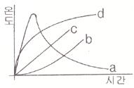

# 소방설비기사(전기분야)20180304(교사용) - 소방원론

> 원본: `소방설비기사(전기분야)20180304(교사용).pdf`
> 개인학습용 변환본.

## 1. 문제

1. pH9 정도의 물을 보호액으로 하여 보호액 속에 저장하는 물
질은?
   ① 나트륨
② 탄화칼슘
   ③ 칼륨
❹ 황린

### 정답

1번

### 해설

정답은 1번입니다. 선택지의 핵심개념 을 확인하세요.

### 그림

## 2. 문제

2. 고분자 재료와 열적 특성의 연결이 옳은 것은?
   ❶ 풀리염화비닐 수지 - 열가소성
   ② 페놀 수지 - 열가소성
   ③ 폴리에틸렌 수지 - 열경화성
   ④ 멜라민 수진 - 열가소성

### 정답

1번

### 해설

정답은 1번입니다. 선택지의 핵심개념 을 확인하세요.

### 그림

## 3. 문제

3. 소화약제로 물을 사용하는 주된 이유는?
   ① 촉매역할을 하기 떄문에   ❷ 증발잠열이 크기 때문에
   ③ 연소작용을 하기 때문에   ④ 제거작용을 하기 때문에

### 정답

1번

### 해설

정답은 1번입니다. 선택지의 핵심개념 을 확인하세요.

### 그림

## 4. 문제

4. 대두유가 침적된 기름 걸레를 쓰레기통에 장시간 방치한 결
과 자연발화에 의하여 화재가발생한 경우 그 이유로 옳은 것
은?
   ① 분해열 축적
❷ 산화열 축적
   ③ 흡착열 축적
④ 발효열 축적

### 정답

1번

### 해설

정답은 1번입니다. 선택지의 핵심개념 을 확인하세요.

### 그림

## 5. 문제

5. 다음 그림에서 목조 건물의 표준 화재 온도 시간 곡선으로 
옳은 것은?
   
   ❶ a
② b
   ③ c
④ d

### 정답

1번

### 해설

정답은 1번입니다. 선택지의 핵심개념 을 확인하세요.

### 그림

## 6. 문제

6. 포소화약제가 갖추어야 할 조건이 아닌 것은?
   ① 부착성이 있을 것
   ② 유동성과 내열성이 있을 것
   ③ 응집성과 안정성이 있을 것
   ❹ 소포성이 있고 기화가 용이할 것

### 정답

1번

### 해설

정답은 1번입니다. 선택지의 핵심개념 을 확인하세요.

### 그림

## 7. 문제

7. 탄화칼슘이 물과 반응 시 발생하는 가연성 가스는?
   ① 메탄
② 포스핀
   ❸ 아세틸렌
④ 수소

### 정답

1번

### 해설

정답은 1번입니다. 선택지의 핵심개념 을 확인하세요.

### 그림

## 8. 문제

8. 건축물의 바깥쪽에 설치하는 피난계단의 구조 기준 중 계단
의 유효너비는 몇 m 이상으로 하여야 하는가?
   ① 0.6
② 0.7
   ③ 0.8
❹ 0.9

### 정답

1번

### 해설

정답은 1번입니다. 선택지의 핵심개념 을 확인하세요.

### 그림

## 9. 문제

9. 0℃, latm 상태에서 부탄(C4H10)1 mol을 완전연소 시키기 위
해 필요한 산소의 mol 수는?
   ① 2
② 4
   ③ 5.5
❹ 6.5

### 정답

1번

### 해설

정답은 1번입니다. 선택지의 핵심개념 을 확인하세요.

### 그림

## 10. 문제

10. 상온, 상압에서 액체인 물질은?
    ① CO2
② Halon 1301
    ③ Halon 1211
❹ Halon 2402

### 정답

1번

### 해설

정답은 1번입니다. 선택지의 핵심개념 을 확인하세요.

### 그림

## 11. 문제

11. MOC(Minimum Oxygen Concentration : 최소 산소 농도)가 
가장 작은 물질은?
    ❶ 메탄
② 에탄
    ③ 프로판
④ 부탄

### 정답

1번

### 해설

정답은 1번입니다. 선택지의 핵심개념 을 확인하세요.

### 그림

## 12. 문제

12. 분진폭발의 위험성이 가장 낮은 것은?
    ① 알루미늄분
② 유황
    ❸ 팽창질석
④ 소맥분

### 정답

1번

### 해설

정답은 1번입니다. 선택지의 핵심개념 을 확인하세요.

### 그림

## 13. 문제

13. 소화의 방법으로 틀린 것은?
    ① 가연성 물질을 제거한다.
    ② 불연성 가스의 공기 중 농도를 높인다.
    ❸ 산소의 공급을 원활히 한다.
    ④ 가연성 물질을 냉각시킨다.

### 정답

1번

### 해설

정답은 1번입니다. 선택지의 핵심개념 을 확인하세요.

### 그림

## 14. 문제

14. 수성막포 소화약제의 특성에 대한 설명으로 틀린 것은?
    ❶ 내열성이 우수하여 고온에서 수성막의 형성이 용이하다.
    ② 기름에 의한 오염이 적다.
    ③ 다른 소화약제와 병용하여 사용이 가능하다.
    ④ 불소계 계면활성제가 주성분이다.

### 정답

1번

### 해설

정답은 1번입니다. 선택지의 핵심개념 을 확인하세요.

### 그림

## 15. 문제

15. 1기압상태에서, 100℃ 물 1g이 모두 기체로 변할 떄 필요한 
열량은 몇 cal 인가?
    ① 429
② 499
    ❸ 539
④ 639

### 정답

1번

### 해설

정답은 1번입니다. 선택지의 핵심개념 을 확인하세요.

### 그림

## 16. 문제

16. 다음 중 발화점이 가장 낮은 물질은?
    ① 휘발유
② 이황화탄소
    ③ 적린
❹ 황린

### 정답

1번

### 해설

정답은 1번입니다. 선택지의 핵심개념 을 확인하세요.

### 그림

## 17. 문제

17. 위험물안전관리법령에서 정하는 위험물의 한계에 대한 정의
로 틀린 것은?
    ① 유황은 순도가 60 중량퍼센트 이상인 것
    ② 인화성고체는 고형알코올 그 밖에 1기압에서 인화점이 
섭씨 40도 미만인 고체
    ❸ 과산화수소는 그 농도가 35 중량퍼센트 이상인 것
    ④ 제1석유류는 아세톤, 휘발유 그 밖에 1기압에서 인화점
이 섭씨 21도 미만인것

### 정답

1번

### 해설

정답은 1번입니다. 선택지의 핵심개념 을 확인하세요.

### 그림

## 18. 문제

18. 건축물 내 방화벽에 설치하는 출입문의 너비 및 높이의 기
준은 각각 몇 m 이하인가?
    ❶ 2.5
② 3.0
    ③ 3.5
④ 4.0

### 정답

1번

### 해설

정답은 1번입니다. 선택지의 핵심개념 을 확인하세요.

### 그림

## 19. 문제

19. Fourier법칙(전도)에 대한 설명으로 틀린 것은?
    ① 이동열량은 전열체의 단면적에 비례한다.
    ❷ 이동열량은 전열체의 두께에 비례한다.
    ③ 이동열량은 전열체의 열전도도에 비례한다.
    ④ 이동열량은 전열체 내ㆍ외부의 온도차에 비례한다.
1과목 : 소방원론

소방설비기사(전기분야)
◐2018년 03월 04일 필기 기출문제 ◑
전자문제집 CBT : www.comcbt.com
최강 자격증 기출문제 전자문제집 CBT : www.comcbt.com

### 정답

1번

### 해설

정답은 1번입니다. 선택지의 핵심개념 을 확인하세요.

### 그림

## 20. 문제

20. 다음의 가연성 물질 중 위험도가 가장 높은 것은?
    ① 수소
② 에틸렌
    ③ 아세틸렌
❹ 이황화탄소

### 정답

1번

### 해설

정답은 1번입니다. 선택지의 핵심개념 을 확인하세요.

### 그림

