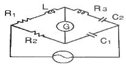
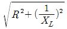
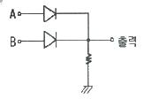
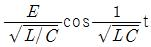
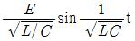
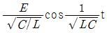

# 소방설비기사(전기분야)20180428(학생용) - 소방원론

> 원본: `소방설비기사(전기분야)20180428(학생용).pdf`
> 개인학습용 변환본.

## 1. 문제

1. 다음의 소화약제 중 오존 파괴 지수(ODP)가 가장 큰 것은?
   ① 할론 104
② 할론 1301
   ③ 할론 1211
④ 할론 2402

### 정답

1번

### 해설

정답은 1번입니다. 선택지의 핵심개념 을 확인하세요.

## 2. 문제

2. 자연발화 방지대책에 대한 설명 중 틀린 것은?
   ① 저장실의 온도를 낮게 유지한다.
   ② 저장실의 환기를 원활히 시킨다.
   ③ 촉매물질과의 접촉을 피한다.
   ④ 저장실의 습도를 높게 유지한다.

### 정답

1번

### 해설

정답은 1번입니다. 선택지의 핵심개념 을 확인하세요.

## 3. 문제

3. 건축물의 화재발생 시 인간의 피난 특성으로 틀린 것은?
   ① 평상 시 사용하는 출입구나 통로를 사용하는 경향이 있
다.
   ② 화재의 공포감으로 인하여 빛을 피해 어두운 곳으로 몸을 
숨기는 경향이 있다.
   ③ 화염, 연기에 대한 공포감으로 발화지점의 반대방향으로 
이동하는 경향이 있다.
   ④ 화재 시 최초로 행동을 개시한 사람을 따라 전체가 움직
이는 경향이 있다.

### 정답

1번

### 해설

정답은 1번입니다. 선택지의 핵심개념 을 확인하세요.

## 4. 문제

4. 건축물에 설치하는 방화구획의 설치기준 중 스프링클러설비
를 설치한 11층 이상의 층은 바닥면적 몇 m2 이내마다 방화
구획을 하여야 하는가? (단, 벽 및 반자의 실내에 접히는 부
분의 마감은 불연재료가 아닌 경우이다.)
   ① 200
② 600
   ③ 1000
④ 3000

### 정답

1번

### 해설

정답은 1번입니다. 선택지의 핵심개념 을 확인하세요.

## 5. 문제

5. 인화점이 낮은 것부터 높은 순서로 옳게 나열된 것은?
   ① 에틸알코올 ＜ 이황화탄소 ＜ 아세톤
   ② 이황화탄소 ＜ 에틸알코올 ＜ 아세톤
   ③ 에틸알코올 ＜ 아세톤 ＜ 이황화탄소
   ④ 이황화탄소 ＜ 아세톤 ＜ 에틸알코올

### 정답

1번

### 해설

정답은 1번입니다. 선택지의 핵심개념 을 확인하세요.

## 6. 문제

6. 분말소화약제로서 ABC급 화재에 적응성이 있는 소화약제의 
종류는?
   ① NH4H2PO4   
② NaHCO3
   ③ Na2CO3   
④ KHCO3

### 정답

1번

### 해설

정답은 1번입니다. 선택지의 핵심개념 을 확인하세요.

## 7. 문제

7. 조연성 가스에 해당되는 것은?
   ① 일산화탄소
② 산소
   ③ 수소
④ 부탄

### 정답

1번

### 해설

정답은 1번입니다. 선택지의 핵심개념 을 확인하세요.

## 8. 문제

8. 액화석유가스(LPG)에 대한 성질로 틀린 것은?
   ① 주성분은 프로판, 부탄이다.
   ② 천연고무를 잘 녹인다.
   ③ 물에 녹지 않으나 유기용매에 용해된다.
   ④ 공기보다 1.5배 가볍다.

### 정답

1번

### 해설

정답은 1번입니다. 선택지의 핵심개념 을 확인하세요.

## 9. 문제

9. 과산화칼륨이 물과 접촉하였을 때 발생하는 것은?
   ① 산소
② 수소
   ③ 메탄
④ 아세틸렌

### 정답

1번

### 해설

정답은 1번입니다. 선택지의 핵심개념 을 확인하세요.

## 10. 문제

10. 제2류 위험물에 해당되는 것은?
    ① 유황
② 질산칼륨
    ③ 칼륨
④ 톨루엔

### 정답

1번

### 해설

정답은 1번입니다. 선택지의 핵심개념 을 확인하세요.

## 11. 문제

11. 물리적 폭발에 해당되는 것은?
    ① 분해폭발
② 분진폭발
    ③ 증기운 폭발
④ 수증기 폭발

### 정답

1번

### 해설

정답은 1번입니다. 선택지의 핵심개념 을 확인하세요.

## 12. 문제

12. 산림화재 시 소화효과를 증대시키기 위해 물에 첨가하는 증
점제로서 적합한 것은?
    ① Ethylene Glycol
    ② Potassium Carbonate
    ③ Ammonium Phosphate
    ④ Sodium Carboxy Methyl Cellulose

### 정답

1번

### 해설

정답은 1번입니다. 선택지의 핵심개념 을 확인하세요.

## 13. 문제

13. 물과 반응하여 가연성 기체를 발생하지 않는 것은?
    ① 칼륨
② 인화아연
    ③ 산화칼슘
④ 탄화알루미늄

### 정답

1번

### 해설

정답은 1번입니다. 선택지의 핵심개념 을 확인하세요.

## 14. 문제

14. 피난계획의 일반원칙 중 Fool Proof 원칙에 대한 설명으로 
옳은 것은?
    ① 1가지가 고장이 나도 다른 수단을 이용하는 원칙
    ② 2방향의 피난동선을 항상 확보하는 원칙
    ③ 피난수단을 이동식 시설로 하는 원칙
    ④ 피난수단을 조작이 간편한 원시적 방법으로 하는 원칙

### 정답

1번

### 해설

정답은 1번입니다. 선택지의 핵심개념 을 확인하세요.

## 15. 문제

15. 물체의 표면온도가 250℃에서 650℃로 상승하면 열 복사량
은 약 몇 배 정도 상승하는가?
    ① 2.5
② 5.7
    ③ 7.5
④ 9.7

### 정답

1번

### 해설

정답은 1번입니다. 선택지의 핵심개념 을 확인하세요.

## 16. 문제

16. 화재발생 시 발생하는 연기에 대한 설명으로 틀린 것은?
    ① 연기의 유동속도는 수평방향이 수직방향보다 빠르다.
    ② 동일한 가연물에 있어 환기지배형 화재가 연료지배형 화
재에 비하여 연기발생량이 많다.
    ③ 고온상태의 연기는 유동확산이 빨라 화재전파의 원인이 
되기도 한다.
    ④ 연기는 일반적으로 불완전 연소시에 발생한 고체, 액체, 
기체 생성물의 집합체이다.

### 정답

1번

### 해설

정답은 1번입니다. 선택지의 핵심개념 을 확인하세요.

## 17. 문제

17. 소화방법 중 제거소화에 해당되지 않는 것은?
    ① 산불이 발생하면 화재의 진행방향을 앞질러 벌목
    ② 방안에서 화재가 발생하면 이불이나 담요로 덮음
    ③ 가스 화재 시 밸브를 잠궈 가스흐름을 차단
    ④ 불타지 않는 장작더미 속에서 아직 타지 않는 것을 안전
한 곳으로 운반

### 정답

1번

### 해설

정답은 1번입니다. 선택지의 핵심개념 을 확인하세요.

## 18. 문제

18. 주수소화 시 가연물에 따라 발생하는 가연성 가스의 연결이 
틀린 것은?
    ① 탄화칼슘 - 아세틸렌  ② 탄화알루미늄 - 프로판
    ③ 인화칼슘 - 포스핀
  ④ 수소화리튬 - 수소

### 정답

1번

### 해설

정답은 1번입니다. 선택지의 핵심개념 을 확인하세요.

## 19. 문제

19. 포소화약제의 적응성이 있는 것은?
    ① 칼륨 화재
② 알킬리튬 화재
    ③ 가솔린 화재
④ 인화알루미늄 화재
1과목 : 소방원론

소방설비기사(전기분야)
◐2018년 04월 28일 필기 기출문제 ◑
전자문제집 CBT : www.comcbt.com
최강 자격증 기출문제 전자문제집 CBT : www.comcbt.com

### 정답

1번

### 해설

정답은 1번입니다. 선택지의 핵심개념 을 확인하세요.

### 그림

## 20. 문제

20. 위험물안전관리법령상 지정된 동식물유류의 성질에 대한 설
명으로 틀린 것은?
    ① 요오드가가 작을수록 자연발화의 위험성이 크다.
    ② 상온에서 모두 액체이다.
    ③ 물에는 불용성이지만 에테르 및 벤젠등의 유기용매에는 
잘 녹는다.
    ④ 인화점은 1기압하에서 250℃ 미만이다.

### 정답

1번

### 해설

정답은 1번입니다. 선택지의 핵심개념 을 확인하세요.

### 그림

