# 소방설비기사(전기분야)20180915(학생용) - 소방원론

> 원본: `소방설비기사(전기분야)20180915(학생용).pdf`
> 개인학습용 변환본.

## 1. 문제

1. 피난로의 안전구획 중 2차 안전구획에 속하는 것은?
   ① 복도   
② 계단부속실(계단전실)
   ③ 계단   
④ 피난층에서 외부와 직면한 현관

### 정답

1번

### 해설

정답은 1번입니다. 선택지의 핵심개념 을 확인하세요.

## 2. 문제

2. 어떤 기체가 0℃, 1기압에서 부피가 11.2L, 기체질량이 22g 
이었다면 이 기체의 분자량은? (단, 이상기체로 가정한다.)
   ① 22
② 35
   ③ 44
④ 56

### 정답

1번

### 해설

정답은 1번입니다. 선택지의 핵심개념 을 확인하세요.

## 3. 문제

3. 제3종 분말소화약제에 대한 설명으로 틀린 것은?
   ① A, B, C급 화재에 모두 적응한다.
   ② 주성분은 탄산수소칼륨과 요소이다.
   ③ 열분해시 발생되는 불연성 가스에 의한 질식효과가 있다.
   ④ 분말운무에 의한 열방사를 차단하는 효과가 있다.

### 정답

1번

### 해설

정답은 1번입니다. 선택지의 핵심개념 을 확인하세요.

## 4. 문제

4. 연소의 4요소 중 자유활성기(free radical)의 생성을 저하시켜 
연쇄반응을 중지시키는 소화방법은?
   ① 제거소화
② 냉각소화
   ③ 질식소화
④ 억제소화

### 정답

1번

### 해설

정답은 1번입니다. 선택지의 핵심개념 을 확인하세요.

## 5. 문제

5. 할론계 소화약제의 주된 소화효과 및 방법에 대한 설명으로 
옳은 것은?
   ① 소화약제의 증발잠열에 의한 소화방법이다.
   ② 산소의 농도를 15% 이하로 낮게 하는 소화방법이다.
   ③ 소화약제의 열분해에 의해 발생하는 이산화탄소에 의한 
소화방법이다.
   ④ 자유활성기(free radical)의 생성을 억제하는 소화방법이
다.

### 정답

1번

### 해설

정답은 1번입니다. 선택지의 핵심개념 을 확인하세요.

## 6. 문제

6. 다음 중 분진폭발의 위험성이 가장 낮은 것은?
   ① 소석회
② 알루미늄분
   ③ 석탄분말
④ 밀가루

### 정답

1번

### 해설

정답은 1번입니다. 선택지의 핵심개념 을 확인하세요.

## 7. 문제

7. 갑종방화문과 을종방화문의 비차열 성능은 각각 최소 몇 분 
이상이어야 하는가?
   ① 갑종 : 90분, 을종 : 40분  ② 갑종 : 60분, 을종 : 30분
   ③ 갑종 : 45분, 을종 : 20분  ④ 갑종 : 30분, 을종 : 10분

### 정답

1번

### 해설

정답은 1번입니다. 선택지의 핵심개념 을 확인하세요.

## 8. 문제

8. 경유화재가 발생했을 때 주수소화가 오히려 위험할 수 있는 
이유는?
   ① 경유는 물과 반응하여 유독가스를 발생하므로
   ② 경유의 연소열로 인하여 산소가 방출되어 연소를 돕기 때
문에
   ③ 경유는 물보다 비중이 가벼워 화재면의 확대 우려가 있으
므로
   ④ 경유가 연소할 때 수소가스를 발생하여 연소를 돕기 때문
에

### 정답

1번

### 해설

정답은 1번입니다. 선택지의 핵심개념 을 확인하세요.

## 9. 문제

9. 비열이 가장 큰 물질은?
   ① 구리
② 수은
   ③ 물
④ 철

### 정답

1번

### 해설

정답은 1번입니다. 선택지의 핵심개념 을 확인하세요.

## 10. 문제

10. TLV(Threshold Limit Value)가 가장 높은 가스는?
    ① 시안화수소
② 포스겐
    ③ 일산화탄소
④ 이산화탄소

### 정답

1번

### 해설

정답은 1번입니다. 선택지의 핵심개념 을 확인하세요.

## 11. 문제

11. 화재예방, 소방시설 설치ㆍ유지 및 안전관리에 관한 법령에 
따른 개구부의 기준으로 틀린 것은?
    ① 해당 층의 바닥면으로부터 개구부 밑부분까지의 높이가 
1.5m 이내일 것
    ② 크기는 지름 50㎝ 이상의 원이 내접할수 있는 크기일 것
    ③ 도로 또는 차량이 진입할 수 있는 빈터를 향할 것
    ④ 내부 또는 외부에서 쉽게 부수거나 열수 있을 것

### 정답

1번

### 해설

정답은 1번입니다. 선택지의 핵심개념 을 확인하세요.

## 12. 문제

12. 소화약제로 사용할 수 없는 것은?
    ① KHCO3
② NaHCO3
    ③ CO2
④ NH3

### 정답

1번

### 해설

정답은 1번입니다. 선택지의 핵심개념 을 확인하세요.

## 13. 문제

13. 염소산염류, 과염소산염류, 알칼리 금속의 과산화물, 질산염
류, 과망간산염류의 특징과 화재 시 소화방법에 대한 설명 
중 틀린 것은?
    ① 가열 등에 의해 분해하여 산소를 발생하고 화재 시 산소
의 공급원 역할을 한다.
    ② 가연물, 유기물, 기타 산화하기 쉬운 물질과 혼합물은 가
열, 충격, 마찰 등에 의해 폭발하는 수도 있다.
    ③ 알칼리금속의 과산화물을 제외하고 다량의 물로 냉각소
화한다.
    ④ 그 자체가 가연성이며 폭발성을 지니고 있어 화약류 취
급 시와 같이 주의를 요한다.

### 정답

1번

### 해설

정답은 1번입니다. 선택지의 핵심개념 을 확인하세요.

## 14. 문제

14. 내화구조에 해당하지 않는 것은?
    ① 철근콘크리트조로 두께가 10㎝ 이상인 벽
    ② 철근콘크리트조로 두께가 5㎝ 이상인 외벽 중 비내력벽
    ③ 벽돌조로서 두께가 19㎝ 이상인 벽
    ④ 철골철근콘크리트조로서 두께가 10㎝ 이상인 벽

### 정답

1번

### 해설

정답은 1번입니다. 선택지의 핵심개념 을 확인하세요.

## 15. 문제

15. 소방시설 중 피난설비에 해당하지 않는 것은?
    ① 무선통신보조설비
② 완강기
    ③ 구조대
④ 공기안전매트

### 정답

1번

### 해설

정답은 1번입니다. 선택지의 핵심개념 을 확인하세요.

## 16. 문제

16. 폭연에서 폭굉으로 전이되기 위한 조건에 대한 설명으로 틀
린 것은?
    ① 정상연소속도가 작은 가스일수록 폭굉으로 전이가 용이
하다.
    ② 배관 내에 장애물이 존재할 경우 폭굉으로 전이가 용이
하다.
    ③ 배관의 관경이 가늘수록 폭굉으로 전이가 용이하다.
    ④ 배관내 압력이 높을수록 폭굉으로 전이가 용이하다.

### 정답

1번

### 해설

정답은 1번입니다. 선택지의 핵심개념 을 확인하세요.

## 17. 문제

17. 어떤 유기화합물을 원소 분석한 결과 중량백분율이 C : 
39.9%, H : 6.7%, O : 53.4%인 경우 이 화합물의 분자식
은? (단, 원자량은 C=12, O=16, H=1이다.)
    ① C3H8O2    
② C2H4O2
    ③ C2H4O    
④ C2H6O2

### 정답

1번

### 해설

정답은 1번입니다. 선택지의 핵심개념 을 확인하세요.

## 18. 문제

18. 유류 탱크의 화재 시 탱크 저부의 물이 뜨거운 열유층에 의
하여 수증기로 변하면서 급작스런 부피 팽창을 일으켜 유류
가 탱크 외부로 분출하는 현상은?
    ① 슬롭 오버(Slop Over)
② 블레비(BLEVE)
    ③ 보일 오버(Boil Over)
④ 파이어 볼(Fire Ball)
1과목 : 소방원론

소방설비기사(전기분야)
◐2018년 09월 15일 필기 기출문제 ◑
전자문제집 CBT : www.comcbt.com
최강 자격증 기출문제 전자문제집 CBT : www.comcbt.com

### 정답

1번

### 해설

정답은 1번입니다. 선택지의 핵심개념 을 확인하세요.

### 그림

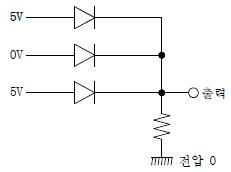
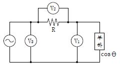
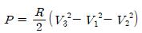
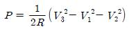
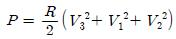
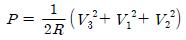
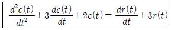
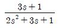
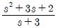
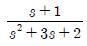
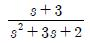

## 19. 문제

19. 건축물의 피난ㆍ방화구조 등의 기준에 관한 규칙에 따른 철
망모르타르로서 그 바름 두께가 최소 몇 ㎝ 이상인 것을 방
화구조로 규정하는가?
    ① 2
② 2.5
    ③ 3
④ 3.5

### 정답

1번

### 해설

정답은 1번입니다. 선택지의 핵심개념 을 확인하세요.

### 그림

## 20. 문제

20. 제4류 위험물의 물리ㆍ화학적 특성에 대한 설명으로 틀린 
것은?
    ① 증기비중은 공기보다 크다.
    ② 정전기에 의한 화재발생위험이 있다.
    ③ 인화성 액체이다.
    ④ 인화점이 높을수록 증기발생이 용이하다.

### 정답

1번

### 해설

정답은 1번입니다. 선택지의 핵심개념 을 확인하세요.

### 그림

