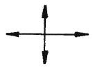

# 소방설비기사(전기분야)20210515(교사용) - 소방원론

> 원본: `소방설비기사(전기분야)20210515(교사용).pdf`
> 개인학습용 변환본.

## 1. 문제

1. 건축법령상 내력벽, 기둥, 바닥, 보, 지붕틀 및 주계단을 무엇
이라 하는가?
   ① 내진구조부
② 건축설비부
   ③ 보조구조부
④ 주요구조부
<문제 해설>
'건축 법령상 주요 구조부'
- (내)력벽
- (기)둥
- (지)붕틀
- (바)닥
- (보)
- (주)계단
→ (내)(기)에서 (지)면 (바)(보)(주)???
[해설작성자 : 관동폭주연합]

### 정답

1번

### 해설

정답은 1번입니다. 선택지의 핵심개념 을 확인하세요.

## 2. 문제

2. 이산화탄소의 물성으로 옳은 것은?
   ① 임계온도 : 31.35℃, 증기비중 : 0.529
   ② 임계온도 : 31.35℃, 증기비중 : 1.529
   ③ 임계온도 : 0.35℃, 증기비중 : 1.529
   ④ 임계온도 : 0.35℃, 증기비중 : 0.529
<문제 해설>
이산화탄소의 물성 - 임계온도 : 31.35℃, 증기비중 : 1.529

### 정답

1번

### 해설

정답은 1번입니다. 선택지의 핵심개념 을 확인하세요.

## 3. 문제

3. 소화약제로 사용하는 물의 증발잠열로 기대할 수 있는 소화
효과는?
   ① 냉각소화
② 질식소화
   ③ 제거소화
④ 촉매소화
<문제 해설>
냉각효과 : 물의 증발잠열 → 539kcal/kg
[해설작성자 : 대천사.루시퍼]

### 정답

1번

### 해설

정답은 1번입니다. 선택지의 핵심개념 을 확인하세요.

## 4. 문제

4. 블레비(BLEVE) 현상과 관계가 없는 것은?
   ① 핵분열
   ② 가연성액체
   ③ 화구(Fire ball)의 형성
   ④ 복사열의 대량 방출
<문제 해설>
블레비(BLEVE) :
고압 상태인 액화가스용기가 가열되어 물리적 폭발이 순간적으
로 화학적 폭발로 이어지는 현상이다..탱크의 증기폭발과 이것에 
계속하여 발생하는 가스폭발을 총칭.
인화점이나 비점이 낮은 인화성 액체(유류)가 가득 차 있지 않는 
저장탱크 주위에 화재가 발생하여 저장탱크 벽면이 장시간 화염
에 노출되면 윗부분의 온도가 상승하여 재질의 인장력이 저하되
고 내부의 비등현상으로 인한 압력상승으로 저장탱크 벽면이 파
열되는 현상.
저장탱크가 파열되면 탱크 내부압력은 급격히 감소되고 과열된 
액화가스가 급속히 증발하면서 탱크조각이 비산하게 된다..이러
한 현상을 블레비라 하고, 블레비 현상으로 분출된 액화가스의 
증기가 공기와 혼합하여 연소범위가 형성되어서 공 모양의 대형
화염이 상승하는 형상을 화구-화이어볼(Fire ball)이라 한다.
블레비의 발생과정은 프로페인 등 액화가스탱크의 외부에서 화
재가 나면 탱크가 가열되어 내부의 액체에 높은 증기압이 발생
하고, 그 증기압이 탱크의 내압을 초과하게 되면 결국 탱크는 
파열에 이르게 된다..이때 파열이 발생하는 지점은 탱크의 기상
부와 면하는 부분이다..그것은 액상부와 면하는 지점이 외부에서 
화염에 의한 열을 받는다 해도 그 열을 내부의 액상으로 효과적
으로 전달시키나 기상부와 면하는 지점은 액체보다 낮은 기체의 
열전도율로 인해 열을 효과적으로 전달하지 못하고 축적하여 결
국 높아진 내압을 견디지 못하면 국부적인 가열에 의한 강도 저
하에 따른 파열이 일어나기 때문이다..파열이 발생하면 탱크 내
부에 액화된 상태로 저장되어 있던 가스는 빠르게 기화하면서 
파열 점을 통해 외부로 확산된다..확산된 가스는 주변의 공기와 
혼합되어 폭발성 혼합기를 형성하고 존재하는 화염을 착화에너
지로 하여 다시 폭발하게 된다.
[해설작성자 : 관동폭주연합]

### 정답

1번

### 해설

정답은 1번입니다. 선택지의 핵심개념 을 확인하세요.

## 5. 문제

5. 할로겐화합물 소화약제에 관한 설명으로 옳지 않은 것은?
   ① 연쇄반응을 차단하여 소화한다
   ② 할로겐족 원소가 사용된다
   ③ 전기에 도체이므로 전기화재에 효과가 있다.
   ④ 소화약제의 변질분해 위험성이 낮다.
<문제 해설>
전기에 비도체이므로 전기화재에 효과가 있다.
[해설작성자 : comcbt.com 이용자]

### 정답

1번

### 해설

정답은 1번입니다. 선택지의 핵심개념 을 확인하세요.

## 6. 문제

6. 스테판-볼쯔만의 법칙에 의해 복사열과 절대온도와의 관계를 
옳게 설명한 것은?
   ① 복사열은 절대온도의 제곱에 비례한다.
   ② 복사열은 절대온도의 4제곱에 비례한다.
   ③ 복사열은 절대온도의 제곱에 반비례한다.
   ④ 복사열은 절대온도의 4제곱에 반비례한다.
<문제 해설>
스테판-볼츠만 법칙
[ Stefan-Boltzmann law ]
스테판-볼츠만 법칙은 흑체에서부터 방출되는 에너지를 온도로 
표현한 것이다..이상적인 흑체의 경우 단위면적당, 단위시간당 
모든 파장에 의해 방사되는 총 에너지(E)는 절대 온도(K)의 4제
곱에 비례한다.
[해설작성자 : comcbt.com 이용자]

### 정답

1번

### 해설

정답은 1번입니다. 선택지의 핵심개념 을 확인하세요.

## 7. 문제

7. 분자식이 CF2BrCl 인 할로겐화합물 소화약제는?
   ① Halon 1301
② Halon 1211
   ③ Halon 2402
④ Halon 2021
<문제 해설>
CF2BrCl = C 하나, F 둘, Br 하나, C1 하나 = 하나 둘 하나 하
나 = 1 2 1 1
[해설작성자 : 관동폭주연합]
1과목 : 소방원론

본 해설집은 최강 자격증 기출문제 전자문제집 CBT 해설달기 프로젝트에 의해서 만들어진 자료입니다. 해설을 제공해 주신 모든 분들께 감사 드립니다.
소방설비기사(전기분야)
◐2021년 03월 07일 필기 기출문제 및 해설집◑
전자문제집 CBT : www.comcbt.com
기출문제 해설은 최강 자격증 기출문제 전자문제집 CBT : www.comcbt.com 통해서 실시간으로 변경됩니다.
C,F,Cl,Br순 으로 됩니다.
[해설작성자 : 10일합격기원]
문제가 이상함
할론2402: C2F4Br2
할론1211: CF2ClBr
할론1301: Cf3Br
할론1011: CH2ClBr
할론1040: CCl4
문제가 정상입니다..
할론뒤에 붙는 숫자는 C,F,Cl,Br의 순서가 맞습니다만,
화확식은 위 순서대로 적지 않아도 개수만 맞으면 됩니다..
[해설작성자 : comcbt.com 이용자]

### 정답

1번

### 해설

정답은 1번입니다. 선택지의 핵심개념 을 확인하세요.

### 그림

## 8. 문제

8. 대두유가 침적된 기름 걸레를 쓰레기통에 장시간 방치한 결
과 자연발화에 의하여 화재가 발생한 경우 그 이유로 옳은 
것은?
   ① 융해열 축적
② 산화열 축적
   ③ 증발열 축적
④ 발효열 축적
<문제 해설>
자연발화
분해열:5류위험물,아세틸렌,산화에틸렌
산화열:기름걸레 석탄 원면 고무분말 황린 건성유
발효열:퇴비,거름,먼지,곡물
흡착열:목탄,활성탄
중합열:시안화수소,산화에틸렌(분해열이자 중합열)
[해설작성자 : roahchinese]

### 정답

1번

### 해설

정답은 1번입니다. 선택지의 핵심개념 을 확인하세요.

### 그림

## 9. 문제

9. 조연성 가스에 해당하는 것은?
   ① 일산화탄소
② 산소
   ③ 수소
④ 부탄
<문제 해설>
조연
산소 오존 염소 불소
[해설작성자 : roahchinese]

### 정답

1번

### 해설

정답은 1번입니다. 선택지의 핵심개념 을 확인하세요.

### 그림

## 10. 문제

10. 물에 저장하는 것이 안전한 물질은?
    ① 나트륨
② 수소화칼슘
    ③ 이황화탄소
④ 탄화칼슘
<문제 해설>
금수성 물질 → 나트륨, 리듐, 마그네슘, 탄화칼슘, 탄화알미늄
[해설작성자 : comcbt.com 이용자]
황린은 자연발화의 위험성이 크므로 물속에 저장
[해설작성자 : 팻메스니]

### 정답

1번

### 해설

정답은 1번입니다. 선택지의 핵심개념 을 확인하세요.

### 그림

## 11. 문제

11. 다음 각 물질과 물이 반응하였을 때 발생하는 가스의 연결
이 틀린 것은?
    ① 탄화칼슘 - 아세틸렌
    ② 탄화알루미늄 - 이산화황
    ③ 인화칼슘 - 포스핀
    ④ 수소화리튬 - 수소
<문제 해설>
탄화알루미늄 + 물 = 메탄 (이산화황 아님)
인화칼슘 + 물 = 포스핀
[해설작성자 : comcbt.com 이용자]

### 정답

1번

### 해설

정답은 1번입니다. 선택지의 핵심개념 을 확인하세요.

### 그림

## 12. 문제

12. 건축물의 화재 시 피난자들의 집중으로 패닉(Panic) 현상이 
일어날 수 있는 피난방향은?
    ① 
   ② 
    ③ 
   ④ 
<문제 해설>
패닉현상 : H형, CO형
[해설작성자 : comcbt.com 이용자]

### 정답

1번

### 해설

정답은 1번입니다. 선택지의 핵심개념 을 확인하세요.

### 그림

## 13. 문제

13. 위험물별 저장방법에 대한 설명 중 틀린 것은?
    ① 유황은 정전기가 축적되지 않도록 하여 저장한다
    ② 적린은 화기로부터 격리하여 저장한다
    ③ 마그네슘은 건조하면 부유하여 분진폭발의 위험이 있으
므로 물에 적시어 보관한다
    ④ 황화린은 산화제와 격리하여 저장한다
<문제 해설>
마그네슘 - 금수성 물질
[해설작성자 : comcbt.com 이용자]
[추가 해설]
2류 취급주의
철분 금속 마그네슘-물기엄금 화기주의
인화성고체-화기엄금
그외- 화기주의
[해설작성자 : roahchinese]

### 정답

1번

### 해설

정답은 1번입니다. 선택지의 핵심개념 을 확인하세요.

### 그림

## 14. 문제

14. 전기화재의 원인으로 거리가 먼 것은?
    ① 단락
② 과전류
    ③ 누전
④ 절연 과다
<문제 해설>
절연체 (絶緣體, 영어: insulator)는 전기나 열을 전달하기 어려
운 성질을 가지는 물질의 총칭이다.
따라서 절연은 전기 화재 등을 예방합니다.

### 정답

1번

### 해설

정답은 1번입니다. 선택지의 핵심개념 을 확인하세요.

### 그림

## 15. 문제

15. 인화점이 낮은 것부터 높은 순서로 옳게 나열된 것은?
    ① 에틸알코올 < 이황화탄소 < 아세톤
    ② 이황화탄소 < 에틸알코올 < 아세톤
    ③ 에틸알코올 < 아세톤 < 이황화탄소
    ④ 이황화탄소 < 아세톤 < 에틸알코올
<문제 해설>

본 해설집은 최강 자격증 기출문제 전자문제집 CBT 해설달기 프로젝트에 의해서 만들어진 자료입니다. 해설을 제공해 주신 모든 분들께 감사 드립니다.
소방설비기사(전기분야)
◐2021년 03월 07일 필기 기출문제 및 해설집◑
전자문제집 CBT : www.comcbt.com
기출문제 해설은 최강 자격증 기출문제 전자문제집 CBT : www.comcbt.com 통해서 실시간으로 변경됩니다.
이황화탄소:-30
아세톤 : -18.5
에틸알코올 : 13
[해설작성자 : comcbt.com 이용자]

### 정답

1번

### 해설

정답은 1번입니다. 선택지의 핵심개념 을 확인하세요.

### 그림

## 16. 문제

16. 가연성 가스이면서도 독성 가스인 것은?
    ① 질소
② 수소
    ③ 염소
④ 황화수소
<문제 해설>
수소 : 가연성가스
염소 : 독성가스
황화수소 : 가연성+독성가스
[해설작성자 : Chillbear]

### 정답

1번

### 해설

정답은 1번입니다. 선택지의 핵심개념 을 확인하세요.

### 그림

## 17. 문제

17. 1기압상태에서, 100℃ 물 1g이 모두 기체로 변할 때 필요한 
열량은 몇 cal 인가?
    ① 429
② 499
    ③ 539
④ 639
<문제 해설>
1g의 얼음 → 물 : 80Cal
1g의 0℃ 물 → 100℃ 물 : 100Cal
1g의 100℃ 물 → 100℃ 수증기 : 539Cal
※ 물의 기화열 539cal/g
: 100℃의 물 1g이 수증기로 변화하는데 필요한 열량
[해설작성자 : 소방]

### 정답

1번

### 해설

정답은 1번입니다. 선택지의 핵심개념 을 확인하세요.

### 그림

## 18. 문제

18. 다음 물질 중 연소범위를 통해 산출한 위험도 값이 가장 높
은 것은?
    ① 수소
② 에틸렌
    ③ 메탄
④ 이황화탄소
<문제 해설>
수소 (4~75) H=(75-4)/4=17.75
에틸렌 (3.1~32) H=(32-3.1)/3.1= 9.32
메탄 (5~15) H=(15-5)/5 = 2
이황화탄소 (1.2~44) H=(44-1.2)/1.2=35.67
이황화탄소가 제일 큽니다.
[해설작성자 : JW]
이황화탄소의 폭발범위 : 1.2~44%
H = 44-1.2/1.2 =35.67
에틸렌의 폭발범위 : 2.7~36%
H = 36-2.7/2.7 =12.33
이황화탄소 > 에틸렌
[해설작성자 : 이황화탄소짱짱]

### 정답

1번

### 해설

정답은 1번입니다. 선택지의 핵심개념 을 확인하세요.

### 그림

## 19. 문제

19. 일반적으로 공기 중 산소농도를 몇 vol% 이하로 감소시키면 
연소속도의 감소 및 질식 소화가 가능한가?
    ① 15
② 21
    ③ 25
④ 31
<문제 해설>
15 vol% 이하 = 연소속도의 감소 및 질식 소화가 가능한 통상
적인 공기 중 산소 농도
[해설작성자 : 대천사.루시퍼]

### 정답

1번

### 해설

정답은 1번입니다. 선택지의 핵심개념 을 확인하세요.

### 그림

## 20. 문제

20. 가연물질의 구비조건으로 옳지 않은 것은?
    ① 화학적 활성이 클 것
    ② 열의 축적이 용이할 것
    ③ 활성화 에너지가 작을 것
    ④ 산소와 결합할 때 발열량이 작을 것
<문제 해설>
가연물질의 구비조건

### 정답

1번

### 해설

정답은 1번입니다. 선택지의 핵심개념 을 확인하세요.

### 그림

