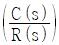
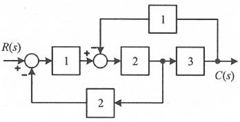
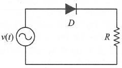
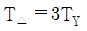
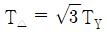
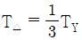
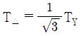

# 소방설비기사(전기분야)20220424(해설집) - 소방원론

> 원본: `소방설비기사(전기분야)20220424(해설집).pdf`
> 개인학습용 변환본.

## 1. 문제

1. 정전기로 인한 화재를 줄이고 방지하기 위한 대책 중 틀린 
것은?
   ① 공기 중 습도를 일정값 이상으로 유지한다.
   ② 기기의 전기 절연성을 높이기 위하여 부도체로 차단공사
를 한다.
   ③ 공기 이온화 장치를 설치하여 가동시킨다.
   ④ 정전기 축적을 막기 위해 접지선을 이용하여 대지로 연결
작업을 한다.
<문제 해설>
정전기 발생 방지법

### 정답

1번

### 해설

정답은 1번입니다. 선택지의 핵심개념 을 확인하세요.

## 5. 문제

5. Fourier법칙(전도)에 대한 설명으로 틀린 것은?
   ① 이동열량은 전열체의 단면적에 비례한다.
   ② 이동열량은 전열체의 두께에 비례한다.
   ③ 이동열량은 전열체의 열전도도에 비례한다.
   ④ 이동열량은 전열체 내·외부의 온도차에 비례한다.
<문제 해설>
푸리에 법칙은 열의 전달은 온도가 낮아지는 방향으로 이뤄지고 
열전도도/온도 차/열이 전달되는 단면적에 비례하고, 단면적의 
두께에는 반비례합니다.
[해설작성자 : 껄껄]
퓨리에의 열전도 법칙 Q=kA(T2-T1)/L
Q:전도열, k :열전도율 ,A :단면적 ,(T2-T1): 온도차 , L :벽체두
께
따라서 퓨리에의 열전도 법칙이용 두께에 반비례 하고 단면적, 
온도차, 열전도율에 비례한다
[해설작성자 : pkkim]

### 정답

1번

### 해설

정답은 1번입니다. 선택지의 핵심개념 을 확인하세요.

## 6. 문제

6. 할론 소화설비에서 Halon 1211 약제의 분자식은?
   ① CBr2ClF
② CF2BrCl
   ③ CCl2BrF
④ BrC2ClF
<문제 해설>
[관리자 입니다.
오류신고가 많아서 기출문제들을 모두 찾아 봤는데
모든 기출문제에서
CF2BrCl
위과 같이 표기되어 있습니다.
수험생들이 어려워 하라고 일부러 그런것 같기도 하고 그러네
요.
참고하시기 바랍니다.]
약제의 명칭이 아니라 분자식이기 때문에 의미없습니다.
[해설작성자 : 대충그까이꺼]

### 정답

1번

### 해설

정답은 1번입니다. 선택지의 핵심개념 을 확인하세요.

## 7. 문제

7. 제4류 위험물의 성질로 옳은 것은?
   ① 가연성 고체
   ② 산화성 고체
   ③ 인화성 액체
   ④ 자기반응성물질
<문제 해설>
1과목 : 소방원론

본 해설집은 최강 자격증 기출문제 전자문제집 CBT 해설달기 프로젝트에 의해서 만들어진 자료입니다. 해설을 제공해 주신 모든 분들께 감사 드립니다.
소방설비기사(전기분야)
◐2022년 04월 24일 필기 기출문제 및 해설집◑
전자문제집 CBT : www.comcbt.com
기출문제 해설은 최강 자격증 기출문제 전자문제집 CBT : www.comcbt.com 통해서 실시간으로 변경됩니다.
위험물 종류
1류(산화성 고체)-6류(산화성 액체)
2류(가연성 고체)-4류(인화성 액체)
3류(자연발화성 및 금수성 물질)
5류(자기반응성 물질)
[해설작성자 : 껄껄]

### 정답

1번

### 해설

정답은 1번입니다. 선택지의 핵심개념 을 확인하세요.

## 8. 문제

8. 목재 화재 시 다량의 물을 뿌려 소화할 경우 기대되는 주된 
소화효과는?
   ① 제거효과
② 냉각효과
   ③ 부촉매효과
④ 희석효과
<문제 해설>

### 정답

1번

### 해설

정답은 1번입니다. 선택지의 핵심개념 을 확인하세요.

## 9. 문제

9. 물이 소화 약제로써 사용되는 장점이 아닌 것은?
   ① 가격이 저렴하다.
   ② 많은 양을 구할 수 있다.
   ③ 증발잠열이 크다.
   ④ 가연물과 화학반응이 일어나지 않는다.
<문제 해설>
탄화칼륨이 물이나  습기를 접촉하면 인화성가스를 발하여 불이 
붙으므로 화학반응이 일어나지 않는다는 것은 옳치않다
[해설작성자 :  완전초보 응시지원자]
아래와 같은 오류 신고가 있었습니다.
여러분들의 많은 의견 부탁 드립니다.
추후 여러분들의 의견을 반영하여 정답을 수정하도록 하겠습니
다.
참고로 정답 변경은 오류 신고 5회 이상일 경우 수정합니다.
[오류 신고 내용]
탄화칼륨 -> 탄화칼슘
[해설작성자 : 소방전기필기준비생]

### 정답

1번

### 해설

정답은 1번입니다. 선택지의 핵심개념 을 확인하세요.

## 10. 문제

10. 분말소화약제 중 탄산수소칼륨(KHCO3)과 요소(CO(NH2)2)와
의 반응물을 주성분으로 하는 소화약제는?
    ① 제1종 분말
② 제2종 분말
    ③ 제3종 분말
④ 제4종 분말
<문제 해설>
제1종 분말 : 탄산수소나트륨 NaHCO3 백색   B급, C급234
제2종 분말 : 탄산수소칼륨   KHCO3 담회색  B급, C급
제3종 분말 : 제1인산암모늄 NH4H2PO4 담홍색 ABC급
제4종 분말 : 탄산수소칼륨 KC2N2H3O3 회색  B급, C급
[해설작성자 : 오가]
제1종 분말 : 탄산수소나트륨 NaHCO3 백색     B급, C급234
제2종 분말 : 탄산수소칼륨     KHCO3 담회색    B급, C급
제3종 분말 : 제1인산암모늄 NH4H2PO4 담홍색 ABC급
제4종 분말 : 탄산수소칼륨 + 인산 KC2N2H3O3 회색    B급, 
C급
[해설작성자 : comcbt.com 이용자]
제1종 분말 : 탄산수소나트륨 NaHCO3 백색   B급, C급
제2종 분말 : 탄산수소칼륨   KHCO3 담회색  B급, C급
제3종 분말 : 제1인산암모늄 NH4H2PO4 담홍색 ABC급
제4종 분말 : 탄산수소칼륨 + 요소 (KHCO3 + CO(HN2)2 = 
KC2N2H3O3) 회색  B급, C급
[해설작성자 : comcbt.com 이용자]

### 정답

1번

### 해설

정답은 1번입니다. 선택지의 핵심개념 을 확인하세요.

## 11. 문제

11. 다음 중 가연물의 제거를 통한 소화 방법과 무관한 것은?
    ① 산불의 확산방지를 위하여 산림의 일부를 벌채한다.
    ② 화학반응기의 화재 시 원료 공급관의 밸브를 잠근다.
    ③ 전기실 화재 시 IG-541 약제를 방출한다.
    ④ 유류탱크 화재 시 주변에 있는 유류탱크의 유류를 다른 
곳으로 이동시킨다.
<문제 해설>
IG-541은 산소의 공급을 차단하여 소화시키는 원리를 이용한다.
[해설작성자 : 허직돌]

### 정답

1번

### 해설

정답은 1번입니다. 선택지의 핵심개념 을 확인하세요.

## 12. 문제

12. 건물화재의 표준시간-온도곡선에서 화재발생 후 1시간이 경
과할 경우 내부 온도는 약 몇 ℃ 정도 되는가?
    ① 125
② 325
    ③ 640
④ 925
<문제 해설>
30분 경과 : 840 deg
1시간 경과 : 925 ~ 950 deg
2시간 경과 : 1010 deg
[해설작성자 : 어 그거 아닌데]

### 정답

1번

### 해설

정답은 1번입니다. 선택지의 핵심개념 을 확인하세요.

## 13. 문제

13. 물질의 취급 또는 위험성에 대한 설명 중 틀린 것은?
    ① 융해열은 점화원이다.
    ② 질산은 물과 반응 시 발열 반응하므로 주의를 해야 한
다.
    ③ 네온, 이산화탄소, 질소는 불연성 물질로 취급한다.
    ④ 암모니아를 충전하는 공업용 용기의 색상은 백색이다.
<문제 해설>
점화원이 될 수 없는 것
가)흡착열 나)기화열 다)융해열
화학적 점화원
가)연소열 : 가연물이 산소와 반응하여 발열반응을 할 때 생성되
는 열량
나)분해열 : 가연물이 분해반응 할 때 발생하는 열량
다)중합열 : 시안화수소나 산화에틸렌 등의 중합폭팔시 발생하는 
열량
[해설작성자 : 오가]
질산은 물과 반응하여 수소 이온(H+)과 질산 이온(NO3-)을 생

본 해설집은 최강 자격증 기출문제 전자문제집 CBT 해설달기 프로젝트에 의해서 만들어진 자료입니다. 해설을 제공해 주신 모든 분들께 감사 드립니다.
소방설비기사(전기분야)
◐2022년 04월 24일 필기 기출문제 및 해설집◑
전자문제집 CBT : www.comcbt.com
기출문제 해설은 최강 자격증 기출문제 전자문제집 CBT : www.comcbt.com 통해서 실시간으로 변경됩니다.
성합니다..
이러한 이온들은 매우 활발하게 작용하여 다른 물질과의 반응을 
촉진시킵니다..
발열 반응이 아님
[해설작성자 : 김호정]

### 정답

1번

### 해설

정답은 1번입니다. 선택지의 핵심개념 을 확인하세요.

## 14. 문제

14. 폭굉(detonation)에 관한 설명으로 틀린 것은?
    ① 연소속도가 음속보다 느릴 때 나타난다.
    ② 온도의 상승은 충격파의 압력에 기인한다.
    ③ 압력상승은 폭연의 경우보다 크다.
    ④ 폭굉의 유도거리는 배관의 지름과 관계가 있다.
<문제 해설>
폭굉은 연소속도가 음속보다 빠를 때 발생하는 현상이다..
[해설작성자 : 허직돌]

### 정답

1번

### 해설

정답은 1번입니다. 선택지의 핵심개념 을 확인하세요.

## 15. 문제

15. 자연발화가 일어나기 쉬운 조건이 아닌 것은?
    ① 열전도율이 클 것
    ② 적당량의 수분이 존재할 것
    ③ 주위의 온도가 높을 것
    ④ 표면적이 넓을 것
<문제 해설>
열전도율이 작아야 열이 다른 곳으로 전도되지 않아 자연발화가 
일어나기 쉽습니다.
[해설작성자 : px]

### 정답

1번

### 해설

정답은 1번입니다. 선택지의 핵심개념 을 확인하세요.

## 16. 문제

16. 목조건축물의 화재특성으로 틀린 것은?
    ① 습도가 낮을수록 연소 확대가 빠르다.
    ② 화재진행속도는 내화건축물보다 빠르다.
    ③ 화재최성기의 온도는 내화건축물보다 낮다.
    ④ 화재성장속도는 횡방향보다 종방향이 빠르다.
<문제 해설>
화재최성기의 온도는 내화건축물보다 높다
[해설작성자 : 허직돌]
목재건축물 은 고온단기형으로
최성기 온도는 1200~1300도 정도가 된다
내화건축물은 저온 장기형으로 최성기온도는 900~1100 정도가 
된다
[해설작성자 : pkkim]

### 정답

1번

### 해설

정답은 1번입니다. 선택지의 핵심개념 을 확인하세요.

## 17. 문제

17. 다음 물질 중 공기 중에서의 연소범위가 가장 넓은 것은?
    ① 부탄
② 프로판
    ③ 메탄
④ 수소
<문제 해설>
부탄: 1.8 ~ 8.4%
프로판: 2.1~9.5%
메탄: 5 ~ 15%
수소: 4 ~ 75%
[해설작성자 : 하우두유두]

### 정답

1번

### 해설

정답은 1번입니다. 선택지의 핵심개념 을 확인하세요.

## 18. 문제

18. 플래시 오버(flash over)에 대한 설명으로 옳은 것은?
    ① 도시가스의 폭발적 연소를 말한다.
    ② 휘발유 등 가연성 액체가 넓게 흘러서 발화한 상태를 말
한다.
    ③ 옥내화재가 서서히 진행하여 열 및 가연성 기체가 축적
되었다가 일시에 연소하여 화염이 크게 발생하는 상태를 
말한다.
    ④ 화재층의 불이 상부층으로 올라가는 현상을 말한다.
<문제 해설>
많은 가스가 축적된 상태에서 가스의 온도가 발화점을 넘는 순
간 모든 가스가 거의 동시에 발화하는것을 플래시 오버라고한
다.
[해설작성자 : 하우두유두]

### 정답

1번

### 해설

정답은 1번입니다. 선택지의 핵심개념 을 확인하세요.

## 19. 문제

19. 연기에 의한 감광계수가 0.1m-1, 가시거리가 20~30m일 때
의 상황으로 옳은 것은?
    ① 건물 내부에 익숙한 사람이 피난에 지장을 느낄 정도
    ② 연기감지기가 작동할 정도
    ③ 어두운 것을 느낄 정도
    ④ 앞이 거의 보이지 않을 정도
<문제 해설>
감광계수  /   가시거리(m)   /   상황
0.1       /    20~30        / 연기감지기가 작동할 정도의 
농도, 건물내부에 익숙지 못한 사람이 피난할 수 있는 정도의 
농도
0.3       /      5          / 건물 내부에 익숙한 사람이 피
난 할 수 있을 정도의 농도
10        /    0.2~0.5      / 화재 최성기 때의 연기농도, 유
도등이 보이지 않을 정도의 농도
30        /       -         / 출화실에서 연기가 분출될 때의 
연기농도
[해설작성자 : 오가]
감광계수 0.5일때 가시거리 3m :어두운것을 느낄정도
감광계수 1일때 가시거리 1m : 거의 앞이 보이지 않음
[해설작성자 : 뛰어라 로날도]
연기농도(감광계수) / 가시거리(m)
0.1 / 20～30m   연기 감지기가 작동할 정도
0.3 /  5m   건물 내부에 익숙한 사람이 피난에 지장을 느낄 
정도의 정도
0.5 /  3m   어두침침한 것을 느낄 정도의 정도
1.0 / 1～2m   거의 앞이 보이지 않을 정도
10  / 0.2～0.5m   화재 최성기 때의 연기농도로 유도등이 보
이지 않을 정도
30  /  -   출화실에서 연기가 분출될 때의 연기농도
[해설작성자 : 동의과학대 자동차과 13학번]

### 정답

1번

### 해설

정답은 1번입니다. 선택지의 핵심개념 을 확인하세요.

## 20. 문제

20. 프로판가스의 최소점화에너지는 일반적으로 약 몇 mJ 정도 
되는가?
    ① 0.25
② 2.5
    ③ 25
④ 250
<문제 해설>
일반 탄화수소의 최소점화에너지는 약 0.25mJ이며, 수소는 
0.02mJ로써 매우 작음

본 해설집은 최강 자격증 기출문제 전자문제집 CBT 해설달기 프로젝트에 의해서 만들어진 자료입니다. 해설을 제공해 주신 모든 분들께 감사 드립니다.
소방설비기사(전기분야)
◐2022년 04월 24일 필기 기출문제 및 해설집◑
전자문제집 CBT : www.comcbt.com
기출문제 해설은 최강 자격증 기출문제 전자문제집 CBT : www.comcbt.com 통해서 실시간으로 변경됩니다.
[해설작성자 : 하리마우]

### 정답

1번

### 해설

정답은 1번입니다. 선택지의 핵심개념 을 확인하세요.

### 그림

