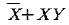
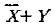
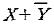
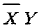
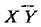
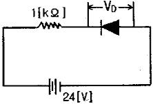
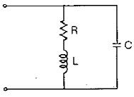
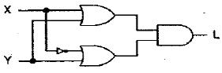

# 소방설비기사(전기분야)20150308(교사용) - 소방전기회로

> 원본: `소방설비기사(전기분야)20150308(교사용).pdf`
> 개인학습용 변환본.

## 21. 문제

21. 다음 중 등전위면의 성질로 적당치 않은 것은?
    ① 전위가 같은 점틀을 연결해 형성된 면이다.
    ② 등전위명간의 밀도가 크면 전기장의 세기는 커진다.
    ❸ 항상 전기력선과 수평을 이룬다.
    ④ 유전체의 유전률이 일정하면 등전위면은 동심원을 이룬
다.

### 정답

1번

### 해설

정답은 1번입니다. 선택지의 핵심개념 을 확인하세요.

### 그림

## 22. 문제

22. 진동이 발생되는 장치의 진동을 억제시키는데 가장 효과적
인 제어동작은?
    ① 온.오프동작
❷ 미분동작
    ③ 적분동작
④ 비례동작

### 정답

1번

### 해설

정답은 1번입니다. 선택지의 핵심개념 을 확인하세요.

### 그림

## 23. 문제

23. 3상 전원에서 6상 전압을 얻을 수 있는 변압기의 결선방법
은?
    ① 우드브릿지 결선
② 메이어 결선
    ③ 스코트 결선
❹ 환상 결선

### 정답

1번

### 해설

정답은 1번입니다. 선택지의 핵심개념 을 확인하세요.

### 그림

## 24. 문제

24. 논리식 
 를 간략화 한 것은?
    ❶ 
    ② 
    ③ 
    ④

### 정답

1번

### 해설

정답은 1번입니다. 선택지의 핵심개념 을 확인하세요.

### 그림

## 25. 문제

25. 그림과 같은 1[kΩ] 의 저항과 실리콘다이오드의 직렬회로
에서 양단간의 전압 VD 는 약 몇 V인가?
    
    ① 0
② 0.2
    ③ 12
❹ 24

### 정답

1번

### 해설

정답은 1번입니다. 선택지의 핵심개념 을 확인하세요.

### 그림

## 26. 문제

26. 그림의 회로에서 공진상태의 임피던스는 몇 Ω 인가?
    
    ① R/(CL)
❷ L/(CR)
    ③ 1/(LR)
④ 1/(RC)

### 정답

1번

### 해설

정답은 1번입니다. 선택지의 핵심개념 을 확인하세요.

### 그림

## 27. 문제

27. 계측방법이 잘못된 것은?
    ① 훅크온 메타에 의한 전류 측정
    ② 회로시험기에 의한 저항 측정
    ❸ 메거에 의한 접지저항 측정
    ④ 전류계, 전압계, 전력계에 의한 역률 측정

### 정답

1번

### 해설

정답은 1번입니다. 선택지의 핵심개념 을 확인하세요.

### 그림

## 28. 문제

28. 그림과 같은 논리회로의 출력 L을 간략화한 것은?
    
    ① L=X
❷ L=Y
    ③ L=X'
④ L=Y'

### 정답

1번

### 해설

정답은 1번입니다. 선택지의 핵심개념 을 확인하세요.

### 그림

## 29. 문제

29. 소형이면서 대전력용 정류기로 사용하는데 적당한 것은?
    ① 게르마늄 정류기
② CdS
    ③ 셀렌정류기
❹ SCR

### 정답

1번

### 해설

정답은 1번입니다. 선택지의 핵심개념 을 확인하세요.

### 그림

## 30. 문제

30. 단상교류회로에 연결되어 있는 부하의 역률을 측정하는 경
우 필요한 계측기의 구성은?
    ① 전압계, 전력계, 회전계
    ② 상순계, 전력계, 전류계
    ❸ 전압계, 전류계, 전력계
    ④ 전류계, 전압계, 주파수계

### 정답

1번

### 해설

정답은 1번입니다. 선택지의 핵심개념 을 확인하세요.

### 그림

## 31. 문제

31. 제어량이 온도, 압력, 유량 및 액면 등과 같은 일반 공업량
일 때의 제어방식은?
    ① 추종제어
❷ 공정제어
    ③ 프로그램제어
④ 시퀀스제어

### 정답

1번

### 해설

정답은 1번입니다. 선택지의 핵심개념 을 확인하세요.

### 그림

## 32. 문제

32. 다음 중 피드백제어계에서 반드시 필요한 장치는?
    ① 증폭도를 향상시키는 장치
    ② 응답속도를 개선시키는 장치
    ③ 기어장치
    ❹ 입력과 출력을 비교하는 장치

### 정답

1번

### 해설

정답은 1번입니다. 선택지의 핵심개념 을 확인하세요.

### 그림

## 33. 문제

33. 그림과 같은 회로에서 R1과 R2가 각각 2 Ω 및 3 Ω 이었다. 
합성저항이 4 Ω이면 R3는 몇 Ω 인가?
2과목 : 소방전기회로

소방설비기사(전기분야)
◐2015년 03월 08일 필기 기출문제 ◑
전자문제집 CBT : www.comcbt.com
최강 자격증 기출문제 전자문제집 CBT : www.comcbt.com
    
    ① 5
❷ 6
    ③ 7
④ 8

### 정답

1번

### 해설

정답은 1번입니다. 선택지의 핵심개념 을 확인하세요.

### 그림

## 34. 문제

34. 3상3선식 전원으로부터 80m 떨어진 장소에 50A 전류가 필
요해서 14 mm2 전선으로 배선하였을 경우 전압강하는 몇 
V 인가? (단, 리액턴스 및 역률은 무시한다.)
    ① 10.17
② 9.6
    ❸ 8.8
④ 5.08

### 정답

1번

### 해설

정답은 1번입니다. 선택지의 핵심개념 을 확인하세요.

### 그림

## 35. 문제

35. 다음 중 회로의 단락과 같이 이상 상태에서 자동적으로 회
로를 차단하여 피해를 최소화하는 기능을 가진 것은?
    ① 나이프 스위치
② 금속함 개폐기
    ③ 컷아웃 스위치
❹ 서킷 브레이커

### 정답

1번

### 해설

정답은 1번입니다. 선택지의 핵심개념 을 확인하세요.

### 그림

## 36. 문제

36. 그림과 같은 논리회로의 출력 Y를 간략화한 것은?
    
    ① 
    ❷ 
    ③ 
    ④

### 정답

1번

### 해설

정답은 1번입니다. 선택지의 핵심개념 을 확인하세요.

### 그림

## 37. 문제

37. 제3고조파 전류가 나타나는 결선방식은?
    ❶ Y - Y
② Y - △
    ③ △ - △
④ △ - Y

### 정답

1번

### 해설

정답은 1번입니다. 선택지의 핵심개념 을 확인하세요.

### 그림

## 38. 문제

38. 용량 0.02 ㎌ 콘덴서 2개와 0.01㎌의 콘덴서 1개를 병렬로 
접속하여 24V 의 전압을 가하였다. 합성용량은 몇 ㎌ 이며, 
0.01㎌의 콘덴서에 축적되는 전하량은 몇 C 인가?
    ① 0.05, 0.12 ×10-6
❷ 0.05, 0.24 × 10-6
    ③ 0.03, 0.12 × 10-6
④ 0.03, 0.24 × 10-6

### 정답

1번

### 해설

정답은 1번입니다. 선택지의 핵심개념 을 확인하세요.

### 그림

## 39. 문제

39. 축전지의 부동충전 방식에 대한 일반적인 회로계통은?
    
    ① ①
❷ ②
    ③ ③
④ ④

### 정답

1번

### 해설

정답은 1번입니다. 선택지의 핵심개념 을 확인하세요.

### 그림

## 40. 문제

40. 옥내 배선의 굵기를 결정하는 요소가 아닌 것은?
    ① 기계적 강도
② 허용 전류
    ③ 전압 강하
❹ 역률

### 정답

1번

### 해설

정답은 1번입니다. 선택지의 핵심개념 을 확인하세요.

### 그림

