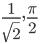
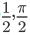
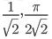
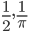
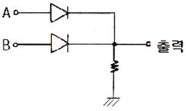

# 소방설비기사(전기분야)20150531(교사용) - 소방전기회로

> 원본: `소방설비기사(전기분야)20150531(교사용).pdf`
> 개인학습용 변환본.

## 21. 문제

21. 개루프 제어계를 동작시키는 기준으로 직접제어계에 가해지
는 신호는?
    ❶ 기준입력신호
② 피드백신호
1과목 : 소방원론
2과목 : 소방전기회로

소방설비기사(전기분야)
◐2015년 05월 31일 필기 기출문제 ◑
전자문제집 CBT : www.comcbt.com
최강 자격증 기출문제 전자문제집 CBT : www.comcbt.com
    ③ 제어편차신호
④ 동작신호

### 정답

1번

### 해설

정답은 1번입니다. 선택지의 핵심개념 을 확인하세요.

### 그림

## 22. 문제

22. 반파 정류 정현파의 최대값이 1일 때, 실효값과 평균값은?
    ① 
    
② 
    ③ 
    
❹

### 정답

1번

### 해설

정답은 1번입니다. 선택지의 핵심개념 을 확인하세요.

### 그림

## 23. 문제

23. 한 코일의 전류가 매초 150A 의 비율로 변화할 때 다른 코
일에 10V 기전력이 발생하였다면 두 코일 상호 인덕턴스(H)
는?
    ① 1/3
② 1/5
    ③ 1/10
❹ 1/15

### 정답

1번

### 해설

정답은 1번입니다. 선택지의 핵심개념 을 확인하세요.

### 그림

## 24. 문제

24. 반도체의 특징을 설명 한 것 중 틀린 것은?
    ❶ 진성 반도체의 경우 온도가 올라 갈수록 양(+)의 온도 
계수를 나타낸다.
    ② 열전현상, 광전현상, 홀효과 등이 심하다.
    ③ 반도체와 금속의 접촉면 또는 P형, N형 반도체외 접합면
에서 정류작용을 한다.
    ④ 전류와 전압의 관계는 비직선형이다.

### 정답

1번

### 해설

정답은 1번입니다. 선택지의 핵심개념 을 확인하세요.

### 그림

## 25. 문제

25. 서보 기구에 있어서의 제어량은?
    ① 유량
❷ 위치
    ③ 주파수
④ 전압

### 정답

1번

### 해설

정답은 1번입니다. 선택지의 핵심개념 을 확인하세요.

### 그림

## 26. 문제

26. 온도, 유량, 압력 등의 공업프로세스 상태량을 제어량으로 
하는 제어계로서 외란의 억제를 주된 목적으로 하는 제어방
식은?
    ① 서보기구
② 자동제어
    ③ 정치제어
❹ 프로세스제어

### 정답

1번

### 해설

정답은 1번입니다. 선택지의 핵심개념 을 확인하세요.

### 그림

## 27. 문제

27. Y-△ 기동방식인 3상 농형 유도전동기는 직입기동방식에 
비해 기동전류는 어떻게 되는가?
    ① 1/√3 로 줄어든다.
❷ 1/3 로 줄어든다.
    ③ √3 배로 증가한다.
④ 3 배로 증가한다.

### 정답

1번

### 해설

정답은 1번입니다. 선택지의 핵심개념 을 확인하세요.

### 그림

## 28. 문제

28. 주파수 60Hz, 인덕턴스 50mH인 코일의 유도리액턴스는 몇 
Ω 인가?
    ① 14.14
❷ 18.85
    ③ 22.12
④ 26.86

### 정답

1번

### 해설

정답은 1번입니다. 선택지의 핵심개념 을 확인하세요.

### 그림

## 29. 문제

29. 주로 정전압 회로용으로 사용되는 소자는?
    ① 터널다이오드
② 포토다이오드
    ❸ 제너다이오드
④ 매트릭스다이오드

### 정답

1번

### 해설

정답은 1번입니다. 선택지의 핵심개념 을 확인하세요.

### 그림

## 30. 문제

30. 논리식 (AㆍA)' 를 간략화한 것은?
    ❶ A'
② A
    ③ 0
④ ø

### 정답

1번

### 해설

정답은 1번입니다. 선택지의 핵심개념 을 확인하세요.

### 그림

## 31. 문제

31. 실리콘 정류기(SCR)의 애노드 전류가 5A 일 때 게이트 전
류를 2배로 증가시키면 애노드 전류[A]는?
    ① 2.5
❷ 5
    ③ 10
④ 20

### 정답

1번

### 해설

정답은 1번입니다. 선택지의 핵심개념 을 확인하세요.

### 그림

## 32. 문제

32. 3상 유도전동기의 회전차 철손이 작은 이유는?
    ① 효율, 역률이 나쁘다.  ② 성층 철심을 사용한다.
    ❸ 주파수가 낮다.
  ④ 2차가 권선형이다.

### 정답

1번

### 해설

정답은 1번입니다. 선택지의 핵심개념 을 확인하세요.

### 그림

## 33. 문제

33. 그림과 같은 게이트의 명칭은?
    
    ① AND
❷ OR
    ③ NOR
④ NAND

### 정답

1번

### 해설

정답은 1번입니다. 선택지의 핵심개념 을 확인하세요.

### 그림

## 34. 문제

34. 피드백제어계의 일반적인 특성으로 옳은 것은?
    ① 계의 정확성이 떨어진다.
    ❷ 계의 특성변화에 대한 입력 대 출력비의 감도가 감소된
다.
    ③ 비선형과 왜형에 대한 효과가 증대된다.
    ④ 대역폭이 감소된다.

### 정답

1번

### 해설

정답은 1번입니다. 선택지의 핵심개념 을 확인하세요.

### 그림

## 35. 문제

35. 선간전압이 일정한 경우 △ 결선된 부하를 Y결선으로 바꾸
면 소비전력은 어떻게 되는가?
    ❶ 1/3
② 1/9
    ③ 3 배로 증가한다.
④ 9 배로 증가한다.

### 정답

1번

### 해설

정답은 1번입니다. 선택지의 핵심개념 을 확인하세요.

### 그림

## 36. 문제

36. 저항이 있는 도체에 전류를 흘리면 열이 발생되는 법칙은?
    ① 옴의 법칙
② 플레밍의 법칙
    ❸ 줄의 법칙
④ 키르히호프의 법칙

### 정답

1번

### 해설

정답은 1번입니다. 선택지의 핵심개념 을 확인하세요.

### 그림

## 37. 문제

37. 반도체를 사용한 화재감지기 중 서미스터(Thermistor)는 무
엇을 측정, 제어하기 위한 반도체 소자인가?
    ❶ 온도
② 연기 농도
    ③ 가스 농도
④ 불꽃의 스펙트럼 강도

### 정답

1번

### 해설

정답은 1번입니다. 선택지의 핵심개념 을 확인하세요.

### 그림

## 38. 문제

38. A, B 두 개의 코일에 동일 주파수, 동일 전압을 가하면 두 
코일의 전류는 같고, 코일 A는 역률이 0.96, 코일 B는 역률
이 0.80인 경우 코일 A에 대한 코일 B의 저항비는 얼마인
가?
    ❶ 0.833
② 1.544
    ③ 3.211
④ 7.621

### 정답

1번

### 해설

정답은 1번입니다. 선택지의 핵심개념 을 확인하세요.

### 그림

## 39. 문제

39. 2 Ω 의 저항 5개를 직렬로 연결하면 병렬연결 때의 몇 배
가 되는가?
    ① 2
② 5
    ③ 10
❹ 25

### 정답

1번

### 해설

정답은 1번입니다. 선택지의 핵심개념 을 확인하세요.

### 그림

## 40. 문제

40. 단상전력을 간접적으로 측정하기 위해 3전압계법을 사용하
는 경우 단상교류전력 P[W]는?

소방설비기사(전기분야)
◐2015년 05월 31일 필기 기출문제 ◑
전자문제집 CBT : www.comcbt.com
최강 자격증 기출문제 전자문제집 CBT : www.comcbt.com
    
    ① 
    ② 
    ❸ 
    ④

### 정답

1번

### 해설

정답은 1번입니다. 선택지의 핵심개념 을 확인하세요.

### 그림

