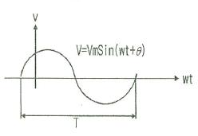
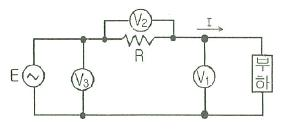
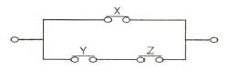

# 소방설비기사(전기분야)20150919(교사용) - 소방전기회로

> 원본: `소방설비기사(전기분야)20150919(교사용).pdf`
> 개인학습용 변환본.

## 21. 문제

21. 그림과 같은 정현파에서 v=Vmsin(wt+θ)의 주기 T로 옳은 
1과목 : 소방원론
2과목 : 소방전기회로

소방설비기사(전기분야)
◐2015년 09월 19일 필기 기출문제 ◑
전자문제집 CBT : www.comcbt.com
최강 자격증 기출문제 전자문제집 CBT : www.comcbt.com
것은?
    
    ① 4π/w
❷ 2π/w
    ③ w2/2π
④ 4πf2

### 정답

1번

### 해설

정답은 1번입니다. 선택지의 핵심개념 을 확인하세요.

### 그림

## 22. 문제

22. 60Hz의 3상 전압을 전파정류하면 맥동주파수는?
    ① 120Hz
② 240Hz
    ❸ 360Hz
④ 720Hz

### 정답

1번

### 해설

정답은 1번입니다. 선택지의 핵심개념 을 확인하세요.

### 그림

## 23. 문제

23. i=Imsinwt인 정현파에서 순시값과 실효값이 같아지는 위상은 
몇 도인가?
    ① 30°
❷ 45°
    ③ 50°
④ 60°

### 정답

1번

### 해설

정답은 1번입니다. 선택지의 핵심개념 을 확인하세요.

### 그림

## 24. 문제

24. 제어요소의 구성으로 옳은 것은?
    ① 검출부와 비교부
② 조작부와 검출부
    ③ 검출부와 조절부
❹ 조작부와 조절부

### 정답

1번

### 해설

정답은 1번입니다. 선택지의 핵심개념 을 확인하세요.

### 그림

## 25. 문제

25. 그림과 같이 전압계 V1, V2, V3와 5Ω의 저항 R을 접속하였
다. 전압계의 지시가 V1=20V, V2=40V, V3=50V 라면 부하전
력은 몇 W인가?
    
    ❶ 50
② 100
    ③ 150
④ 200

### 정답

1번

### 해설

정답은 1번입니다. 선택지의 핵심개념 을 확인하세요.

### 그림

## 26. 문제

26. 제어량에 따라 분류되어 자동제어로 옳은 것은?
    ① 정치(fixed value)제어
② 비율(ration)제어
    ❸ 프로세스(process)제어
④ 시퀸스(sequence)제어

### 정답

1번

### 해설

정답은 1번입니다. 선택지의 핵심개념 을 확인하세요.

### 그림

## 27. 문제

27. 온도보상장치에 사용되는 소자인 NCT형 서미스터의 저항값
과 온도의 관계를 옳게 설명한 것은?
    ① 저항값은 온도에 비례한다.
    ❷ 저항값은 온도에 반비례한다.
    ③ 저항값은 온도의 제곱에 비례한다.
    ④ 저항값은 온도의 제곱에 반비례한다.

### 정답

1번

### 해설

정답은 1번입니다. 선택지의 핵심개념 을 확인하세요.

### 그림

## 28. 문제

28. 반지름 1m 인 원형 코일에서 중심점에서의 자계의 세기가 
1AT/m 라면 흐르는 전류는 몇 A 인가?
    ① 1
❷ 2
    ③ 3
④ 4

### 정답

1번

### 해설

정답은 1번입니다. 선택지의 핵심개념 을 확인하세요.

### 그림

## 29. 문제

29. 조작량(manipulated varible)은 제어요소에서 무엇에 인가되
는 양인가?
    ① 조작대상
❷ 제어대상
    ③ 측정대상
④ 입력대상

### 정답

1번

### 해설

정답은 1번입니다. 선택지의 핵심개념 을 확인하세요.

### 그림

## 30. 문제

30. 전원을 넣자마자 곧바로 점등되는 형광등용의 안정기는?
    ① 글로우 스타트식
② 필라멘트 단락식
    ❸ 래피드 스타트식
④ 점등관식

### 정답

1번

### 해설

정답은 1번입니다. 선택지의 핵심개념 을 확인하세요.

### 그림

## 31. 문제

31. 다음 중 3상 유도전동기에 속하는 것은?
    ❶ 권선형 유동전동기
② 세이딩코일형 전동기
    ③ 뷴상기동형 전동기
④ 콘텐서기동형 전동기

### 정답

1번

### 해설

정답은 1번입니다. 선택지의 핵심개념 을 확인하세요.

### 그림

## 32. 문제

32. 확산형 트랜지스터에 관한 설명으로 옳지 않은 것은?
    ① 불활성 가스 속에서 확산시킨다.
    ② 단일 확산형과 2중 확산형이다.
    ❸ 이미터, 베이스의 순으로 확산시킨다.
    ④ 기체반도체가 용해하는 것보다 낮은 온도에서 불순불을 
확산시킨다.

### 정답

1번

### 해설

정답은 1번입니다. 선택지의 핵심개념 을 확인하세요.

### 그림

## 33. 문제

33. 전압변동율이 25%인 정류회로에서 무부하 전압이 24V인 경
우 부하 전압은 몇 V인가?
    ❶ 19.2
② 20.3
    ③ 21.6
④ 22.6

### 정답

1번

### 해설

정답은 1번입니다. 선택지의 핵심개념 을 확인하세요.

### 그림

## 34. 문제

34. 두 종류의 금속으로 폐회로를 만들어 전류를 흘리면 양 접
속점에서 한 쪽은 온도가 올라가고 다른 쪽은 온도가 내려
가는 현상은?
    ❶ 펠티에 효과
② 제벡 효과
    ③ 톰슨 효과
④ 홀 효과

### 정답

1번

### 해설

정답은 1번입니다. 선택지의 핵심개념 을 확인하세요.

### 그림

## 35. 문제

35. 다음중 직류전동기의 제동법이 아닌 것은?
    ① 회생제동
❷ 정상제동
    ③ 발전제동
④ 역전제동

### 정답

1번

### 해설

정답은 1번입니다. 선택지의 핵심개념 을 확인하세요.

### 그림

## 36. 문제

36. A급 싱글 전력증폭기에 관한 설명으로 옳지 않은 것은?
    ① 바이어스점은 부하선이 거의 가운데인 중앙점에 취한다.
    ❷ 회로의 구성이 매우 복잡하다.
    ③ 출력용의 트랜지스터가 1개이다.
    ④ 찌그러짐이 적다.

### 정답

1번

### 해설

정답은 1번입니다. 선택지의 핵심개념 을 확인하세요.

### 그림

## 37. 문제

37. 전류계의 오차율 ±2%, 전압게의 오차율 ±1%인 계기로 저
항을 측정하면 저항의 오차율은 몇 %인가?
    ① ±0.5%
② ±1%
    ❸ ±3%
④ ±7%

### 정답

1번

### 해설

정답은 1번입니다. 선택지의 핵심개념 을 확인하세요.

### 그림

## 38. 문제

38. 다음 그림을 논리식으로 표현한 것은?
    
    ① X(Y+Z)
② XYZ
    ③ XY+ZY
❹ (X+Y)(X+Z)

소방설비기사(전기분야)
◐2015년 09월 19일 필기 기출문제 ◑
전자문제집 CBT : www.comcbt.com
최강 자격증 기출문제 전자문제집 CBT : www.comcbt.com

### 정답

1번

### 해설

정답은 1번입니다. 선택지의 핵심개념 을 확인하세요.

### 그림

## 39. 문제

39. 전기화재의 원인이 되는 누전전류를 검출하기 위해 사용되
는 것은?
    ① 접기계전기
❷ 영상변류기
    ③ 계기용변압기
④ 과전류계전기

### 정답

1번

### 해설

정답은 1번입니다. 선택지의 핵심개념 을 확인하세요.

## 40. 문제

40. 지멘스(siemens)는 무엇의 단위인가?
    ① 비저항
② 도전률
    ❸ 컨덕턴스
④ 자속

### 정답

1번

### 해설

정답은 1번입니다. 선택지의 핵심개념 을 확인하세요.
