# 소방설비기사(전기분야)20160508(교사용) - 소방전기회로

> 원본: `소방설비기사(전기분야)20160508(교사용).pdf`
> 개인학습용 변환본.

## 21. 문제

21. 제어계가 부정확하고 신뢰성은 없으나 출력과 입력이 서로 
독립인 제어계는?
    ① 자동 제어계
❷ 개회로 제어계
    ③ 폐회로 제어계
④ 피드백 제어계

### 정답

1번

### 해설

정답은 1번입니다. 선택지의 핵심개념 을 확인하세요.

### 그림

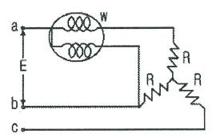
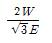
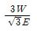
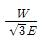
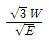
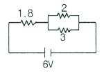

## 22. 문제

22. 제어량을 어떤 일정한 목표값으로 유지하는 것을 목적으로 
하는 제어방식은?
    ❶ 정치 제어
② 추종 제어
    ③ 프로그램 제어
④ 비율 제어

### 정답

1번

### 해설

정답은 1번입니다. 선택지의 핵심개념 을 확인하세요.

### 그림

## 23. 문제

23. 서로 다른 두 개의 금속도선 양끝을 연결하여 폐회로를 구
성한 후, 양단에 온도차를 주었을 때 두 접점사이에서 기전
력이 발생하는 효과는?
    ① 톰슨 효과
❷ 제어백 효과
    ③ 펠티에 효과
④ 펀치 효과

### 정답

1번

### 해설

정답은 1번입니다. 선택지의 핵심개념 을 확인하세요.

### 그림

## 24. 문제

24. 일정전압의 직류전원에 저항을 접속하고 전류를 흘릴 때 전
류의 값을 20% 감소시키기 위한 저항값은 처음의 몇 배인
가?
    ① 0.05
② 0.83
    ❸ 1.25
④ 1.5

### 정답

1번

### 해설

정답은 1번입니다. 선택지의 핵심개념 을 확인하세요.

### 그림

## 25. 문제

25. 제어량을 조절하기 위하여 제어 대상에 주어지는 양으로 제
어부의 출력이 되는 것은?
    ① 제어량
② 주 피드백신호
    ③ 기준입력
❹ 조작량

### 정답

1번

### 해설

정답은 1번입니다. 선택지의 핵심개념 을 확인하세요.

### 그림

## 26. 문제

26. 변압기의 내부회로 고장검출용으로 사용되는 계전기는?
    ❶ 비율차동계전기
② 과전류계전기
    ③ 온도계전기
④ 접지계전기

### 정답

1번

### 해설

정답은 1번입니다. 선택지의 핵심개념 을 확인하세요.

### 그림

## 27. 문제

27. 단상 반파정류회로에서 출력되는 전력은?
    ❶ 입력전압의 제곱에 비례한다.
    ② 입력전압에 비례한다.
    ③ 부하저항에 비례한다.
    ④ 부하임피던스에 비례한다.

### 정답

1번

### 해설

정답은 1번입니다. 선택지의 핵심개념 을 확인하세요.

### 그림

## 28. 문제

28. 100Ω인 저항 3개를 같은 전원에 △결선으로 접속할 때와 Y 
결선으로 접속할 때, 선전류의 크기의 비는?
    ❶ 3
② 1/3
    ③ √3
④ 1/√3

### 정답

1번

### 해설

정답은 1번입니다. 선택지의 핵심개념 을 확인하세요.

### 그림

## 29. 문제

29. 한 조각의 실리콘 속에 많은 트랜지스터, 다이오드, 저항 등
을 넣고 상호배선을 하여 하나의 회로에서의 기능을 갖게 
한 것은?
    ① 포토 트랜지스터
② 서미스터
    ③ 바리스터
❹ IC

### 정답

1번

### 해설

정답은 1번입니다. 선택지의 핵심개념 을 확인하세요.

### 그림

## 30. 문제

30. 변류기에 결선된 전류계가 고장이 나서 교환하는 경우 옳은 
방법은?
    ① 변류기의 2차를 개방시키고 한다.
    ❷ 변류기의 2차를 단락시키고 한다.
    ③ 변류기의 2차를 접지시키고 한다.
    ④ 변류기에 피뢰기를 달고 한다.

### 정답

1번

### 해설

정답은 1번입니다. 선택지의 핵심개념 을 확인하세요.

### 그림

## 31. 문제

31. 단상변압기 권수비 a = 8이고, 1차 교류전압은 110V 이다. 
변압기 2차 전압을 단상 반파 정류회로를 이용하여 정류했
을 때 발생하는 직류전압의 평균치는 약 몇 V 인가?
    ❶ 6.19
② 6.29
    ③ 6.39
④ 6.88

### 정답

1번

### 해설

정답은 1번입니다. 선택지의 핵심개념 을 확인하세요.

### 그림

## 32. 문제

32. 전류에 의한 자계의 세기를 구하는 법칙은?
    ① 쿨롱의 법칙
② 페러데이의 법칙
    ❸ 비오사바르의 법칙
④ 렌츠의 법칙

### 정답

1번

### 해설

정답은 1번입니다. 선택지의 핵심개념 을 확인하세요.

### 그림

## 33. 문제

33. 공기 중에 1×10-7C의 (+)전하가 있을 때, 이 전하로부터 
15cm의 거리에 있는 점의 전장의 세기는 몇 V/m 인가?
    ① 1×104
② 2×104
    ③ 3×104
❹ 4×104

### 정답

1번

### 해설

정답은 1번입니다. 선택지의 핵심개념 을 확인하세요.

### 그림

## 34. 문제

34. 선간전압 E[V]의 3상 평형전원에 대칠 3상 저항부하 R[Ω]
이 그림과 같이 접속되었을 때 a, b 두 상간에 접속된 전력
계의 지시값이 W[W]라면 C상의 전류는 몇 A 인가?
    
    ❶ 
    
② 
    ③ 
    
④

### 정답

1번

### 해설

정답은 1번입니다. 선택지의 핵심개념 을 확인하세요.

### 그림

## 35. 문제

35. 그림과 같은 회로에서 2Ω에 흐르는 전류는 몇 A인가? (단, 
저항의 단위는 모두 Ω이다.)
    
    ① 0.8
② 1.0
    ❸ 1.2
④ 2.0

### 정답

1번

### 해설

정답은 1번입니다. 선택지의 핵심개념 을 확인하세요.

### 그림

## 36. 문제

36. 논리식 Xㆍ(X+Y)를 간략화 하면?
    ❶ X
② Y
    ③ X+Y
④ XㆍY

### 정답

1번

### 해설

정답은 1번입니다. 선택지의 핵심개념 을 확인하세요.

### 그림

## 37. 문제

37. 단상 변압기 3대를 △결선하여 부하에 전력을 공급하고 있
는데, 변압기 1대의 고장으로 V결선을 한 경우 고장 전의 
몇 % 출력을 낼 수 있는가?
    ① 51.6
② 53.6
2과목 : 소방전기회로

소방설비기사(전기분야)
◐2016년 05월 08일 필기 기출문제 ◑
전자문제집 CBT : www.comcbt.com
최강 자격증 기출문제 전자문제집 CBT : www.comcbt.com
    ③ 55.7
❹ 57.7

### 정답

1번

### 해설

정답은 1번입니다. 선택지의 핵심개념 을 확인하세요.

### 그림

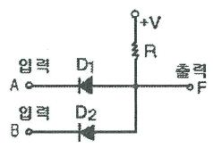
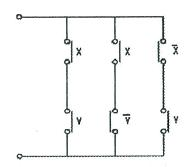
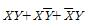
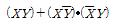
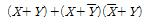
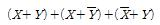
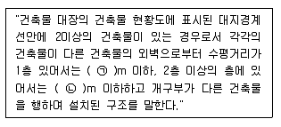

## 38. 문제

38. 그림과 같은 다이오드 논리회로의 명칭은?
    
    ① NOT 회로
❷ AND 회로
    ③ OR 회로
④ NAND 회로

### 정답

1번

### 해설

정답은 1번입니다. 선택지의 핵심개념 을 확인하세요.

### 그림

## 39. 문제

39. i=50sin⍵t인 교류전류의 평균값은 약 몇 A 인가?
    ① 25
❷ 31.8
    ③ 35.9
④ 50

### 정답

1번

### 해설

정답은 1번입니다. 선택지의 핵심개념 을 확인하세요.

### 그림

## 40. 문제

40. 그림과 같은 계전기 접점회로를 논리식으로 나타내면?
    
    ❶ 
    ② 
    ③ 
    ④

### 정답

1번

### 해설

정답은 1번입니다. 선택지의 핵심개념 을 확인하세요.

### 그림

