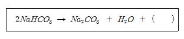
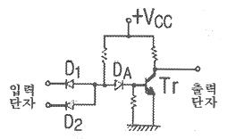
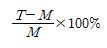
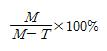
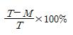
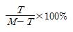
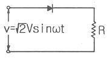
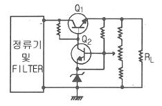

# 소방설비기사(전기분야)20161001(교사용) - 소방전기회로

> 원본: `소방설비기사(전기분야)20161001(교사용).pdf`
> 개인학습용 변환본.

## 21. 문제

21. 전원과 부하가 다같이 △결선된 3상 평형회로가 있다. 전원
전압이 200V, 부하 1상의 임피던스가 4+j3Ω인 경우 선전류
는 몇 A 인가?
    ① 40/√3
② 40/3
    ③ 40
❹ 40√3

### 정답

1번

### 해설

정답은 1번입니다. 선택지의 핵심개념 을 확인하세요.

### 그림

## 22. 문제

22. 온도 측정을 위하여 사용하는 소자로서 온도-저항 부특성을 
가지는 일반적인 소자는?
    ① 노즐플래퍼
❷ 서미스터
    ③ 앰플리다인
④ 트랜지스터

### 정답

1번

### 해설

정답은 1번입니다. 선택지의 핵심개념 을 확인하세요.

### 그림

## 23. 문제

23. 자기장 내에 있는 도체에 전류를 흘리면 힘이 작용한다. 이 
힘을 무엇이라고 하는가?
    ① 자속력
② 기전력
    ③ 전기력
❹ 전자력

### 정답

1번

### 해설

정답은 1번입니다. 선택지의 핵심개념 을 확인하세요.

### 그림

## 24. 문제

24. 히스테리시스 곡선의 종축과 횡축은?
    ① 종축 : 자속밀도, 횡축 : 투자율
    ② 종축 : 자계의 세기, 횡축 : 투자율
    ③ 종축 : 자계의 세기, 횡축 : 자속밀도
    ❹ 종축 : 자속밀도, 횡축 :자계의 세기

### 정답

1번

### 해설

정답은 1번입니다. 선택지의 핵심개념 을 확인하세요.

### 그림

## 25. 문제

25. 4단자 정수 A=5/3, B=800, C=1/450, D=5/3 일 때 영상 
임피던스 Z01과 Z02는 각각 몇 Ω인가?
    ① Z01=300, Z02=300    ❷ Z01=600, Z02=600
    ③ Z01=800, Z02=800    ④ Z01=1000, Z02=1000

### 정답

1번

### 해설

정답은 1번입니다. 선택지의 핵심개념 을 확인하세요.

### 그림

## 26. 문제

26. 200Ω의 저항을 가진 경종 10개와 50Ω의 저항을 가진 표시
등 3개가 있다. 이들을 모두 직렬로 접속할 때의 합성저항
은 몇 Ω인가?
    ① 250
② 1250
    ③ 1750
❹ 2150

### 정답

1번

### 해설

정답은 1번입니다. 선택지의 핵심개념 을 확인하세요.

### 그림

## 27. 문제

27. 그림과 같은 무접점회로는 어떤 논리회로인가?
    
    ① NOR
② OR
    ❸ NAND
④ AND

### 정답

1번

### 해설

정답은 1번입니다. 선택지의 핵심개념 을 확인하세요.

### 그림

## 28. 문제

28. 지시계기에 대한 동작원리가 틀린 것은?
    ❶ 열전형 계기 - 대전된 도체 사이에 작용하는 정전력을 
이용
    ② 가동 철편형 계기 - 전류에 의한 자기장이 연철편에 작
용하는 힘을 이용
    ③ 전류력계형 계기 - 전류 상호간에 작용하는 힘을 이용
    ④ 유도형 계기 - 회전 자기장 또는 이동 자기장과 이것에 
의한 유도정류와의 상호작용을 이용

### 정답

1번

### 해설

정답은 1번입니다. 선택지의 핵심개념 을 확인하세요.

### 그림

## 29. 문제

29. 다음 중 쌍방향성 사이리스터인 것은?
    ① 브리지 정류기
② SCR
    ③ IGBT
❹ TRIAC

### 정답

1번

### 해설

정답은 1번입니다. 선택지의 핵심개념 을 확인하세요.

### 그림

## 30. 문제

30. SCR의 양극 전류가 10A 일 때 게이트 전류를 반으로 줄이
면 양극 전류는 몇 A 인가?
    ① 20
❷ 10
    ③ 5
④ 0.1

### 정답

1번

### 해설

정답은 1번입니다. 선택지의 핵심개념 을 확인하세요.

### 그림

## 31. 문제

31. 어떤 측정계기의 지시값을 M, 참값을 T라 할 때 보정율은?
    ❶ 
② 
    ③ 
④

### 정답

1번

### 해설

정답은 1번입니다. 선택지의 핵심개념 을 확인하세요.

### 그림

## 32. 문제

32. 자기인덕턴스 L1, L2 가 각각 4mH, 9mH 인 두 코일이 이
상적인 결합이 되었다면 상호인덕턴스는 몇 mH인가? (단, 
결합계수는 1 이다.)
    ❶ 6
② 12
    ③ 24
④ 36

### 정답

1번

### 해설

정답은 1번입니다. 선택지의 핵심개념 을 확인하세요.

### 그림

## 33. 문제

33. 국제 표준 연동 고유저항은 몇 Ωㆍm인가?
    ① 1.7241×10-9
❷ 1.7241×10-8
    ③ 1.7241×10-7
④ 1.7241×10-6

### 정답

1번

### 해설

정답은 1번입니다. 선택지의 핵심개념 을 확인하세요.

### 그림

## 34. 문제

34. 도너(donor)와 억셉터(acceptor)의 설명 중 틀린 것은?
    ① 반도체 결정에서 Ge이나 Si에 넣는 5가의 불순물을 도
너라고 한다.
    ② 반도체 결정에서 Ge이나 Si에 넣는 3가의 불순물에는 
In, Ga, B 등이 있다.
    ③ 진성반도체는 불순물이 전혀 섞이지 않은 반도체이다.
    ❹ N형 반도체의 불순물이 억셉터이고, P형 반도체의 불순
물이 도너이다.
2과목 : 소방전기회로

소방설비기사(전기분야)
◐2016년 10월 01일 필기 기출문제 ◑
전자문제집 CBT : www.comcbt.com
최강 자격증 기출문제 전자문제집 CBT : www.comcbt.com

### 정답

1번

### 해설

정답은 1번입니다. 선택지의 핵심개념 을 확인하세요.

### 그림

## 35. 문제

35. 변압기의 철심구조를 여러 겹으로 성층시켜 사용하는 이유
는 무엇인가?
    ❶ 와전류로 인한 전력손실을 감소시키기 위해
    ② 전력공급 능력을 높이기 위해
    ③ 변압비를 크게 하기 위해
    ④ 변압기의 중량을 적게 하기 위해

### 정답

1번

### 해설

정답은 1번입니다. 선택지의 핵심개념 을 확인하세요.

### 그림

## 36. 문제

36. 자동제어계를 제어목적에 의해 분류한 경우를 설명한 것 중 
틀린 것은?
    ① 정치제어 : 제어량을 주어진 일정목표로 유지시키기 위
한 제어
    ② 추종제어 : 목표치가 시간에 따라 일정한 변화를 하는 
제어
    ③ 프로그램제어 : 목표치가 프로그램대로 변하는 제어
    ❹ 서보제어 : 선박의 방향제어계인 서보제어는 정치제어와 
같은 성질

### 정답

1번

### 해설

정답은 1번입니다. 선택지의 핵심개념 을 확인하세요.

### 그림

## 37. 문제

37. V=141sin377t[V]인 정현파 전압의 주파수는 몇 Hz인가?
    ① 50
② 55
    ❸ 60
④ 65

### 정답

1번

### 해설

정답은 1번입니다. 선택지의 핵심개념 을 확인하세요.

### 그림

## 38. 문제

38. 그림과 같은 정류회로에서 부하 R에 흐르는 직류전류의 크
기는 약 몇 A인가? (단, V=200V, R=20√2Ω이며, 이상적인 
다이오드이다.)
    
    ❶ 3.2
② 3.8
    ③ 4.4
④ 5.2

### 정답

1번

### 해설

정답은 1번입니다. 선택지의 핵심개념 을 확인하세요.

### 그림

## 39. 문제

39. 계단변화에 대하여 잔류편차가 없는 것이 장점이며, 간헐현
상이 있는 제어계는?
    ① 비례제어계
② 비례미분제어계
    ❸ 비례적분제어계
④ 비례적분미분제어계

### 정답

1번

### 해설

정답은 1번입니다. 선택지의 핵심개념 을 확인하세요.

### 그림

## 40. 문제

40. 그림과 같은 트랜지스터를 사용한 정전압회로에서 Q1의 역
할로서 옳은 것은?
    
    ① 증폭용
② 비교부용
    ❸ 제어용
④ 기준부용

### 정답

1번

### 해설

정답은 1번입니다. 선택지의 핵심개념 을 확인하세요.

### 그림

