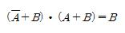
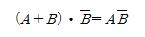
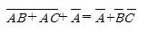
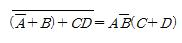
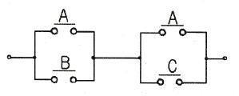
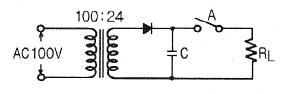
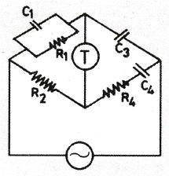

# 소방설비기사(전기분야)20170305(해설집) - 소방전기회로

> 원본: `소방설비기사(전기분야)20170305(해설집).pdf`
> 개인학습용 변환본.

## 21. 문제

21. 최대눈금이 70V 인 직류전압계에 5kΩ 의 배율기를 접속하
여 전압의 최대측정치가 350V 라면 내부 저항은 몇 kΩ 인
가?
    ① 0.8
② 1
    ③ 1.25
④ 20
<문제 해설>
최대측정치=최대눈금×(1+직류전압계/내부저항)
350[V]=70[V]×(1+5[k]/r)
r = 70×5/(350-70)
r = 1.25
배율기를 접속하여 원래 범위보다 5배를 측정하였으니 배율기의 
크기는 내부저항은 (5-1)배, 즉, 4배가 됩니다..5 나누기 4는 
1.25
[해설작성자 : comcbt.com 이용자]
Rm=(n-1)r : Rm 배율기저항, n 전압배율, r 내부저항
여기선 배울기 저항값을 알려주고 내부저항을 물어봤으므로
5=(5-1)r , r=1.25 가 맞음.
[해설작성자 : 눈시린유리창]

### 정답

1번

### 해설

정답은 1번입니다. 선택지의 핵심개념 을 확인하세요.

### 그림

## 22. 문제

22. 발전기에서 유도기전력의 방향을 나타내는 법칙은?
    ① 페러데이의 전자유도법칙
    ② 플레밍의 오른손법칙
    ③ 암페어의 오른나사법칙
    ④ 플레밍의 왼손법칙
<문제 해설>
1.패러데이 전자유도 - 유기기전력 크기
2.플레밍 오른손 - 도체 유도기전력 방향
3.암페어 오른나사 - 전류 자기장의 방향
4.플레밍 왼손 - 전자력 방향
[해설작성자 : 자격증중독자]
플레밍의 오른손은 도체운동에 의한 유기기전력의 방향 결정입
니다
[해설작성자 : 오뚜기]

### 정답

1번

### 해설

정답은 1번입니다. 선택지의 핵심개념 을 확인하세요.

### 그림

## 23. 문제

23. 다음은 논리식들 중 틀린 것은?
    ① 
    ② 
    ③ 
    ④ 
<문제 해설>

### 정답

1번

### 해설

정답은 1번입니다. 선택지의 핵심개념 을 확인하세요.

### 그림

## 24. 문제

24. 길이 1m의 철심(비투자율 μs=700) 자기회로에 2mm 의 공
극이 생겼다면 자기저항은 몇 배 증가하는가? (단, 각 부의 
단면적은 일정하다.)
    ① 1.4
② 1.7
    ③ 2.4
④ 2.7
<문제 해설>
m = 1 + lo/l * U/Uo
    = 1 + 2*10^-3/1 * 700Uo/Uo
    = 1 + 1.4
    = 2.4 배
[해설작성자 : 라밖메]

### 정답

1번

### 해설

정답은 1번입니다. 선택지의 핵심개념 을 확인하세요.

### 그림

## 25. 문제

25. 빛이 닿으면 전류가 흐르는 다이오드로 광량의 변화를 전류
값으로 대치하므로 광센서에 주로 사용하는 다이오드는?
    ① 제너다이오드
② 터널다이오드
    ③ 발광다이오드
④ 포토다이오드
<문제 해설>
빛 -> 전류 : 포토다이오드
전기 -> 빛 : 발광다이오드
정전압 회로용 : 제너다이오드
[해설작성자 : 카시오]

### 정답

1번

### 해설

정답은 1번입니다. 선택지의 핵심개념 을 확인하세요.

### 그림

## 26. 문제

26. 3상 직권 정류자 전동기에서 중간 변압기를 사용하는 이유 
중 틀린 것은?
    ① 경부하시 속도의 이상 상승 방지
    ② 실효 권수비 선정 조정
    ③ 전원전압의 크기에 관계없이, 정류에 알맞은 회전자전압 
선택
    ④ 회전자 상수의 감소
<문제 해설>

### 정답

1번

### 해설

정답은 1번입니다. 선택지의 핵심개념 을 확인하세요.

### 그림

## 27. 문제

27. 피드백제어계에서 제어요소에 대한 설명 중 옳은 것은?
    ① 조작부와 검출부로 구성되어 있다.
    ② 조절부와 변환부로 구성되어 있다.
    ③ 동작신호를 조작량으로 변화시키는 요소이다.
    ④ 목표값에 비례하는 신호를 발생하는 요소이다.
<문제 해설>
제어요소는 조작부와 조절부로 이루어져있다.
제어요소는 동작신호를 조작량으로 변화시키는 요소이다.
[해설작성자 : 승리부대]

### 정답

1번

### 해설

정답은 1번입니다. 선택지의 핵심개념 을 확인하세요.

### 그림

## 28. 문제

28. 균등 눈금을 사용하며 소비전력이 적게 소요되고 정확도가 
2과목 : 소방전기회로

본 해설집은 최강 자격증 기출문제 전자문제집 CBT 해설달기 프로젝트에 의해서 만들어진 자료입니다. 해설을 제공해 주신 모든 분들께 감사 드립니다.
소방설비기사(전기분야)
◐2017년 03월 05일 필기 기출문제 및 해설집◑
전자문제집 CBT : www.comcbt.com
기출문제 해설은 최강 자격증 기출문제 전자문제집 CBT : www.comcbt.com 통해서 실시간으로 변경됩니다.
높은 지시계기는?
    ① 가동 코일형 계기
    ② 전류력계형 계기
    ③ 정전형 계기
    ④ 열전형 계기
<문제 해설>
가동코일형 계기
1) 직류전용으로 눈금이 균등하고 감도가 높으며 정밀용으로 적
합한 계기이다.
2) 균등 눈금을 사용하며 소비전력이 적게 소요되고 정확도가 
높은 지시계기이다.
[해설작성자 : 뭐]

### 정답

1번

### 해설

정답은 1번입니다. 선택지의 핵심개념 을 확인하세요.

### 그림

## 29. 문제

29. 그림과 같은 유접점 회로의 논리식은?
    
    ① A + BC
② AB + C
    ③ B + AC
④ AB + BC
<문제 해설>
(A+B)(A+C)
=AA+BC
=A+BC
[해설작성자 : App]
(A+B)(A+C)
=A+AB+AC+BC
=A(1+B+C)+BC
=A+BC

### 정답

1번

### 해설

정답은 1번입니다. 선택지의 핵심개념 을 확인하세요.

### 그림

## 30. 문제

30. 50kW의 전력의 안테나에서 사방으로 균일하게 방사될 때, 
안테나에서 1km 거리에 있는 점에서의 전계의 실효값은 약 
몇 V/m 인가?
    ① 0.87
② 1.22
    ③ 1.73
④ 3.98
<문제 해설>
D=E^2/377=W/4파이r^2
E=루트(377W/4파이r^2)
=루트(377*50000/4*3.14*(1*10^3)^2)
=1.22
[추가 해설]
      E2          P
w=------- = -------
     377        4πｒ2
w:구의 단위면적당 전력(W/m2)
E:전계의 실효값(V/m)
P:전력(W)
r:거리(m)
          P                      p
E2 =    -------x377 = E = √ -----x377
         4πｒ2                  4πｒ2
            
            50x103
     =√ -----------x377 ≒1.22
            4π(1x103)2
[해설작성자 : asd]

### 정답

1번

### 해설

정답은 1번입니다. 선택지의 핵심개념 을 확인하세요.

### 그림

## 31. 문제

31. 그림과 같은 반파정류회로에 스위치 A를 사용하여 부하 저
항 RL을 떼어 냈을 경우, 콘덴서 C의 충전전압은 몇 V 인
가?
    
    ① 12π
② 24π
    ③ 12√2
④ 24√2
<문제 해설>
권수a=N1/N2=V1/V2 에서 100/24=100/x    x=24v=Vm/루트2
이므로 Vm=24루트2
[해설작성자 : bnt]

### 정답

1번

### 해설

정답은 1번입니다. 선택지의 핵심개념 을 확인하세요.

### 그림

## 32. 문제

32. 그림과 같은 교류브리지의 평형조건으로 옳은 것은?
    
    ① R2C4 = R1C3, R2C1 = R4C3
    ② R1C1 = R4C4, R2C3 = R1C1
    ③ R2C4 = R4C3, R1C3 = R2C1
    ④ R1C1 = R4C4, R2C3 = R1C4
<문제 해설>
(R4+1/jC4)*(1/(1/R1+jC1))=R2/jC3
(R4+1/jC4)/(1/R1+jC1)=R2/jC3
(R4+1/jC4)*jC3 = R2*(/1R1+jC1)
jC3R4+ C3/C4 = R2/R1+jC1R2
C3/C4=R2/R1    … C3R1=C4R2

본 해설집은 최강 자격증 기출문제 전자문제집 CBT 해설달기 프로젝트에 의해서 만들어진 자료입니다. 해설을 제공해 주신 모든 분들께 감사 드립니다.
소방설비기사(전기분야)
◐2017년 03월 05일 필기 기출문제 및 해설집◑
전자문제집 CBT : www.comcbt.com
기출문제 해설은 최강 자격증 기출문제 전자문제집 CBT : www.comcbt.com 통해서 실시간으로 변경됩니다.
jC3R4=jC1R2 …    C3R4=C1R2
[해설작성자 : YJP]

### 정답

1번

### 해설

정답은 1번입니다. 선택지의 핵심개념 을 확인하세요.

### 그림

## 33. 문제

33. MOSFET(금속-산화물 반도체 전계효과 트랜지스터)의 특성
으로 틀린 것은?
    ① 2차 항복이 없다.
    ② 집접도가 낮다.
    ③ 소전력으로 작동한다.
    ④ 큰 입력저항으로 게이트 전류가 거의 흐르지 않는다.
<문제 해설>
집적도 : 한 개의 반도체에 구성되어있는 소자의 갯수
MOSFET은 직접도가 높다..(즉 한 개의 반도체에 구성되어 있는 
소자의 개수가 많다.)
[해설작성자 : 참억울하거등요]

### 정답

1번

### 해설

정답은 1번입니다. 선택지의 핵심개념 을 확인하세요.

## 34. 문제

34. 인덕턴스가 0.5H 인 코일의 리액턴스가 753.6Ω일 때 주파
수는 약 몇 Hz 인가?
    ① 120
② 240
    ③ 360
④ 480
<문제 해설>
코일의리액턴스=2×3.14×주파수×인덕턴스
753.6=2×3.14×f×0.5
f=753.6/(2×3.14×0.5)
f=240
[해설작성자 : comcbt.com 이용자]
XL = ωL = 2πfL
f = XL / 2πL = 753.6 / (2π* 0.5) = 240
[해설작성자 : 승현용가리]

### 정답

1번

### 해설

정답은 1번입니다. 선택지의 핵심개념 을 확인하세요.

## 35. 문제

35. 페루프 제어의 특징에 대한 설명으로 옳은 것은?
    ① 외부의 변화에 대한 영향을 증가시킬 수 있다.
    ② 제어기 부품의 성능 차이에 따라 영향을 많이 받는다.
    ③ 대역폭이 증가한다.
    ④ 정확도와 전체 이득이 증가한다.
<문제 해설>
피드백제어 특징
정확도 증가
대역폭이 크다(증가)
구조가 복잡 설치비용 고가
폐회로로 구성
입력 출력 비교하는 장치가 있다
오차를 자동정정
발진을 일으키고 불안정한 상태로 되는 경향성이 있음
비선형과 왜형에 대한 효과가 감소
[해설작성자 : 치악산호랑이]

### 정답

1번

### 해설

정답은 1번입니다. 선택지의 핵심개념 을 확인하세요.

## 36. 문제

36. 20℃의 물 2L를 64℃가 되도록 가열하기 위해 400W의 온
수기를 20분 사용하였을 때 이 온수기의 효율은 약 몇 %인
가?
    ① 27
② 59
    ③ 77
④ 89
<문제 해설>
효율=m*c*t/(p*t*860)이므로
        =2X1X44/(0.4X20/60X860)
     =0.767
[해설작성자 : comcbt.com 이용자]
860을 외워도 되지만 그냥 단위 맞춰서 풀어도 됩니다
분자 m c t = 2 * 4.184*(64-20) 물은 1리터 1kg
분모 0.4*60*20(와트=J/s이므로 20분은 20*60초)
[해설작성자 : 깡군]

### 정답

1번

### 해설

정답은 1번입니다. 선택지의 핵심개념 을 확인하세요.

## 37. 문제

37. PD(비례 미분) 제어 동작의 특징으로 옳은 것은?
    ① 잔류편차 제거
    ② 간헐현상 제거
    ③ 불연속 제어
    ④ 응답 속응성 개선
<문제 해설>
비례동작(P동작): 잔류편차가 생김
비례적분동작(PI동작): 잔류편차제거, 속응성 느림
비례미분동작(PD동작): 속응성 향상
비례적분미분동작(PID동작): 잔류편차제거, 속응성 향상
정답은 4번 응답 속응성 개선이 맞습니다.
[해설작성자 : psyclon]

### 정답

1번

### 해설

정답은 1번입니다. 선택지의 핵심개념 을 확인하세요.

## 38. 문제

38. 정현파 전압의 평균값과 최대값의 관계식 중 옳은 것은?
    ① Vav = 0.707Vm
    ② Vav = 0.840Vm
    ③ Vav = 0.637Vm
    ④ Vav = 0.956Vm
<문제 해설>
정현파 전압의 평균값 2/파이3.14 *Vm = 0.637Vm
참고. 정현파 전압의 실효값 1/루트2 * Vm = 0.707Vm
[해설작성자 : kimjc4]

### 정답

1번

### 해설

정답은 1번입니다. 선택지의 핵심개념 을 확인하세요.

## 39. 문제

39. 열팽창식 온도계가 아닌 것은?
    ① 열전대 온도계
    ② 유리 온도계
    ③ 바이메탈 온도계
    ④ 압력식 온도계
<문제 해설>
열전대 : 서로 다른 종류의 금속이 접해 있을 때 온도차가 생기
면 기전력이 발생하여 전류가 흐르는 현상을 말함.
유리 : 내부의 수은 또는 알코올의 열팽창을 이용
바이메탈 : 떨어져 있다가 금속간의 열팽창 지수가 다름을 이용
하여 휘어져 전기 전도에 따른 온도 측정
압력식 : 유체(액체,기체) 충만식, 열에 의한 부피 팽창으로 압력
지침 변동을 측정
[해설작성자 : 열공파파]

### 정답

1번

### 해설

정답은 1번입니다. 선택지의 핵심개념 을 확인하세요.

## 40. 문제

40. 동기발전기의 병렬조건으로 틀린 것은?
    ① 기전력의 크기가 같을 것
    ② 기전력의 위상이 같을 것
    ③ 기전력의 주파수가 같을 것

본 해설집은 최강 자격증 기출문제 전자문제집 CBT 해설달기 프로젝트에 의해서 만들어진 자료입니다. 해설을 제공해 주신 모든 분들께 감사 드립니다.
소방설비기사(전기분야)
◐2017년 03월 05일 필기 기출문제 및 해설집◑
전자문제집 CBT : www.comcbt.com
기출문제 해설은 최강 자격증 기출문제 전자문제집 CBT : www.comcbt.com 통해서 실시간으로 변경됩니다.
    ④ 극수가 같을 것
<문제 해설>
동기발전기의 병렬운전 조건은
기전력의 크기, 위상, 주파수, 파형, 상회전방향 이 같을 것.
따라서 4번이 정답.
[해설작성자 : Mr.H.J.]

### 정답

1번

### 해설

정답은 1번입니다. 선택지의 핵심개념 을 확인하세요.
