# 소방설비기사(전기분야)20170507(해설집) - 소방전기회로

> 원본: `소방설비기사(전기분야)20170507(해설집).pdf`
> 개인학습용 변환본.

## 21. 문제

21. 다음과 같은 회로에서 a-b간의 합성저항은 몇 Ω 인가?
2과목 : 소방전기회로

본 해설집은 최강 자격증 기출문제 전자문제집 CBT 해설달기 프로젝트에 의해서 만들어진 자료입니다. 해설을 제공해 주신 모든 분들께 감사 드립니다.
소방설비기사(전기분야)
◐2017년 05월 07일 필기 기출문제 및 해설집◑
전자문제집 CBT : www.comcbt.com
기출문제 해설은 최강 자격증 기출문제 전자문제집 CBT : www.comcbt.com 통해서 실시간으로 변경됩니다.
    
    ① 2.5
② 5
    ③ 7.5
④ 10
<문제 해설>
((2*2)/(2+2))+((3*3)/(3+3))=2.5

### 정답

1번

### 해설

정답은 1번입니다. 선택지의 핵심개념 을 확인하세요.

### 그림

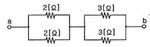
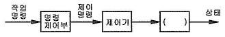

## 22. 문제

22. 그림은 개루프 제어계의 신호전달 계통도이다. 다음 ( )안에 
알맞은 제어계의 동작요소는?
    
    ① 제어량
② 제어대상
    ③ 제어장치
④ 제어요소
<문제 해설>
제어대상 : 제어의 대상으로 제어하려고 하는 기계의 전체 또는 
그 일부분을 말한다.
[해설작성자 : 미스터차차]

### 정답

1번

### 해설

정답은 1번입니다. 선택지의 핵심개념 을 확인하세요.

### 그림

## 23. 문제

23. 3상 농형유도전동기의 기동방식으로 옳은 것은?
    ① 분상기동형
② 콘덴서기동형
    ③ 기동보상기법
④ 셰이딩일형
<문제 해설>

### 정답

1번

### 해설

정답은 1번입니다. 선택지의 핵심개념 을 확인하세요.

### 그림

## 24. 문제

24. 제어기기 및 전자회로에서 반도체소자별 용도에 대한 설명 
중 틀린 것은?
    ① 서미스터 : 온도 보상용으로 사용
    ② 사이리스터 : 전기신호를 빛으로 변환
    ③ 제너다이오드 : 정전압소자 (전원전압을 일정하게 유지)
    ④ 바리스터 : 계전기 점검에서 발생하는 불꽃소거에 사용
<문제 해설>
전기 신호를 빛으로 변환 > 발광 다이오드
사이리스터 : 제어용
[해설작성자 : 곡구마]

### 정답

1번

### 해설

정답은 1번입니다. 선택지의 핵심개념 을 확인하세요.

### 그림

## 25. 문제

25. 2차계에서 무제동으로 무한 진동이 일어나는 감쇠율 
(damping ration) δ 는 어떤 경우인가?
    ① δ = 0
② δ > 1
    ③ δ = 1
④ 0 < δ <1
<문제 해설>
감쇠율d
1<d 과제동
d<1 부족제동
d=0 무한진동
[해설작성자 : 기미댓]
3번은 임계진동
[해설작성자 : 카와이시라]

### 정답

1번

### 해설

정답은 1번입니다. 선택지의 핵심개념 을 확인하세요.

### 그림

## 26. 문제

26. R-L-C 회전의 전압과 전류 파형의 위상차에 대한 설명으로 
틀린 것은?
    ① R-L 병렬 회로 : 전압과 전류는 동상이다.
    ② R-L 직렬 회로 : 전압이 전류보다 θ만큼 앞선다.
    ③ R-C 병렬 회로 : 전류가 전압보다 θ만큼 앞선다.
    ④ R-C 직렬회로 : 전류가 전압보다 θ만큼 앞선다.
<문제 해설>
- R-L 병렬 회로 : 전압이 전류보다 θ만큼 앞선다.
[해설작성자 : 소방따자]
직렬회로와 병렬회로 상관없이 L회로, C회로는 위상차가 존재한
다.
L회로는 전압이 전류보다 위상이 앞선다.
C회로는 전류가 전압보다 위상이 앞선다.
[해설작성자 : 지피지기]

### 정답

1번

### 해설

정답은 1번입니다. 선택지의 핵심개념 을 확인하세요.

### 그림

## 27. 문제

27. 지름 8mm의 경동선 1 km의 저항을 측정 하였더니 
0.63536Ω이었다. 같은 재료로 지름 2mm, 길이 500m의 경
동선의 저항은 약 몇 Ω 인가?
    ① 2.8
② 5.1
    ③ 10.2
④ 20.4
<문제 해설>
지름 8mm의 면적은 (4*10^-3)^2*3.14이고 지름 2mm 면적은 
(1*10^-3)^2*3.14이다.
지름 2mm 경동선의 저항을 이를 수식으로 표시하면
    (500/(1*10^-3)^2*3.14*0.63536)/(1000/(4*10^-3)^2*3.14
) = 5.08288=5.1
[해설작성자 : eastsea]
저항은 길이에 비례하고 면적에 반비례 합니다.
[해설작성자 : hanjjcc]
R=고유저항*(길이/면적) 식으로 고유저항 구해서 저항값을 구해
도 같은값이 나오네요
[해설작성자 : 안군이]
위에 계산식에서 
(500/(1*10^-3)^2*3.14/(1000/(4*10^-3)^2*3.14) = 8
8*0.63536=5.08288=5.1 이네요
[해설작성자 : 백해병]

### 정답

1번

### 해설

정답은 1번입니다. 선택지의 핵심개념 을 확인하세요.

### 그림

## 28. 문제

28. 정현파교류의 최대값이 100V인 경우 평균값은 몇 V인가?
    ① 45.04
② 50.64
    ③ 63.69
④ 69.34
<문제 해설>
-평균값-
Vav=2/πVm[v]
Vav:평균값[v]

본 해설집은 최강 자격증 기출문제 전자문제집 CBT 해설달기 프로젝트에 의해서 만들어진 자료입니다. 해설을 제공해 주신 모든 분들께 감사 드립니다.
소방설비기사(전기분야)
◐2017년 05월 07일 필기 기출문제 및 해설집◑
전자문제집 CBT : www.comcbt.com
기출문제 해설은 최강 자격증 기출문제 전자문제집 CBT : www.comcbt.com 통해서 실시간으로 변경됩니다.
Vm:최대값[v]
평균값 Vav=2/π Vm=2/πX100=63.69V
[해설작성자 : NSA]
위 문제는 오류 신고가 접수된 문제입니다.
전자문제집 CBT에서 최신 해설을 확인하세요.

### 정답

1번

### 해설

정답은 1번입니다. 선택지의 핵심개념 을 확인하세요.

### 그림

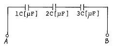
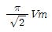
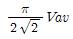
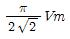
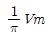
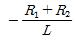
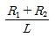
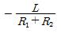
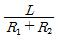

## 29. 문제

29. 자동제어 중 플랜트나 생산 공정 중의 상태량을 제어량으로 
하는 제어방법은?
    ① 정치제어
② 추종제어
    ③ 비율제어
④ 프로세스제어
<문제 해설>
프로세스제어:온도.압력.유량 액면, 자동제어,생산공정
서보기구(서보, 추종제어): 위치,방위,자세
자동조정: 전압, 전류,주파수,회전속도(발전기 조속기),장력

### 정답

1번

### 해설

정답은 1번입니다. 선택지의 핵심개념 을 확인하세요.

### 그림

## 30. 문제

30. 자동화재탐지설비의 감지기 회로의 길이가 500m이고, 종단
에 8kΩ의 저항이 연결되어 있는 회로에 24V의 전압이 가해
졌을 경우 도통 시험 시 전류는 약 몇 mA인가? ( 단, 동선
의 저항률은 1.69×10-8Ω∙m이며, 동선의 단면적은 2.5mm2
이고, 접촉저항 등은 없다고 본다.)
    ① 2.4
② 3.0
    ③ 4.8
④ 6.0
<문제 해설>
동선의 저항을 구하는게 맞겠으나 동선의 저항률이 극히 낮은 
관계로 저항만으로 계산하여도 값이 똑같이 나옵니다.
I= 24/8000 = 3[mA]
[해설작성자 : 발송배전]

### 정답

1번

### 해설

정답은 1번입니다. 선택지의 핵심개념 을 확인하세요.

### 그림

## 31. 문제

31. 그림과 같은 회로 A, B 양단에 전압을 인가하여 서서히 상
승시킬 때 제일 먼저 파괴되는 콘텐서는? (단, 우전체의 재
질 및 두께는 동일한 것으로 한다.)
    
    ① 1C
② 2C
    ③ 3C
④ 모두
<문제 해설>
콘텐서를 직렬 연결후 전압을 서서히 증가시키면 전하량이 축적
됩니다.
각 콘덴서에는 같은 양의 전하가 단계적으로 축적되다가, 전하
량이 작은 것이 제일 먼저 파괴됩니다.
[해설작성자 : 가온이아빠]
정전용량이란 콘덴서가 전하를 축적할 수 있는 능력을 말한다.
이때 정전용량이 작으면 전압을 가하였을 때 점차적으로 전하가 
축적되다가 한계점을 넘어버리면 파괴된다.
즉, 동일한 전압을 흘렀을 때 가장 먼저 파괴되는 것은 정전용
량이 가장 작은 1C이다.
[해설작성자 : comcbt.com 이용자]

### 정답

1번

### 해설

정답은 1번입니다. 선택지의 핵심개념 을 확인하세요.

### 그림

## 32. 문제

32. 정현파 교류회로에서 최대값은 Vm, 평균값은 Vav일 때 실
효값(V)은?
    ① 
② 
    ③ 
④ 
<문제 해설>
π/2√2*2vm/π= vm/√2
[해설작성자 : comcbt.com 이용자]

### 정답

1번

### 해설

정답은 1번입니다. 선택지의 핵심개념 을 확인하세요.

### 그림

## 33. 문제

33. 직류 전압계의 내부저항이 500Ω, 최대 눈금이 50V라면, 이 
전압계에 3kΩ의 배율기를 접속하여 전압을 측정할 때 최대 
측정치는 몇 V 인가?
    ① 250
② 303
    ③ 350
④ 500
<문제 해설>
Vo=V(1+Rm/Rv)    =50(1+3000/500)=350

### 정답

1번

### 해설

정답은 1번입니다. 선택지의 핵심개념 을 확인하세요.

### 그림

## 34. 문제

34. 저항 R1, R2 와 인덕턴스 L의 직렬회로가 있다. 이 회로의 
시정수는?
    ① 
② 
    ③ 
④ 
<문제 해설>
RL 시정수    τ=L/R     그러므로 τ=L/R1+R2

### 정답

1번

### 해설

정답은 1번입니다. 선택지의 핵심개념 을 확인하세요.

### 그림

## 35. 문제

35. 화재 시 온도상승으로 인해 저항값이 감소하는 반도체 소자
는?
    ① 서미스터(NTC)
② 서미스터(PTC)
    ③ 서미스터(CTR)
④ 바리스터
<문제 해설>
온도 변화에 따라 저한값이 변하는 반도체 소자는    서미스타 
이고 Negative는 음의 저항,    Pogitive는 양의 저합 값을 말하
며    ..
[추가 해설]
서미스터(Thermistor)는 보통의 저항에 비해 온도에 따른 저항의 
변화가 크게 만든 저항를 말한다..열가변저항기라고도 부른다..
온도가 높아지면 저항이 증가하는 PTC 서미스터(Positive 
Temperature Coefficient Thermistor)
온도가 높아지면 저항이 감소하는 NTC 서미스터(Negative 
Temperature Coefficient Thermistor)
특정온도에서 급변하는(67도정도 이하면 절연성 전도고 이 지점 

본 해설집은 최강 자격증 기출문제 전자문제집 CBT 해설달기 프로젝트에 의해서 만들어진 자료입니다. 해설을 제공해 주신 모든 분들께 감사 드립니다.
소방설비기사(전기분야)
◐2017년 05월 07일 필기 기출문제 및 해설집◑
전자문제집 CBT : www.comcbt.com
기출문제 해설은 최강 자격증 기출문제 전자문제집 CBT : www.comcbt.com 통해서 실시간으로 변경됩니다.
지나면 금속 전도를 보이는)CTR 서미스터(critical temperature 
resistor)
바리스터(Variable Resiostor)의 역할은 간단히 서지 전압, 정전
기 등으로 인한 피해를 흡수해주는 역할
[해설작성자 : 도리와수리]

### 정답

1번

### 해설

정답은 1번입니다. 선택지의 핵심개념 을 확인하세요.

### 그림

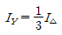
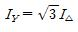
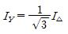
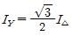
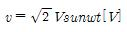
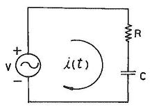
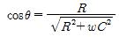
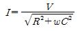
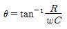
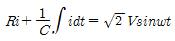
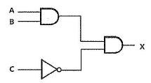
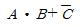
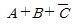
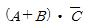
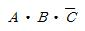

## 36. 문제

36. Y-△ 기동방식으로 운전하는 3상 농형유도전동기의 Y결선
의 기동전류(IY)와 △결선의 기동전류 (I△)의 관계로 옳은 것
은?
    ① 
② 
    ③ 
④ 
<문제 해설>
델타 = 3와이
와이는 3/델타

### 정답

1번

### 해설

정답은 1번입니다. 선택지의 핵심개념 을 확인하세요.

### 그림

## 37. 문제

37. 그림과 같은 회로에 전압 
를 인가하
였을 때 옳은 것은?
    
    ① 역률 : 
    ② i의 실효값 : 
    ③ 전압과 전류의 위상차: 
    ④ 전압평형방정식 : 
<문제 해설>
용량성은 '1/wC' 형태니까 1,2,3번은 다 틀렸음
[해설작성자 : Ian]

### 정답

1번

### 해설

정답은 1번입니다. 선택지의 핵심개념 을 확인하세요.

### 그림

## 38. 문제

38. 다음 무접점회로의 논리식(X)은?
    
    ① 
② 
    ③ 
④ 
<문제 해설>
Multiply
(A*B) * (not C)

### 정답

1번

### 해설

정답은 1번입니다. 선택지의 핵심개념 을 확인하세요.

### 그림

## 39. 문제

39. 동선의 저항이 20℃일 때 0.8Ω이라 하면 60℃ 일 때의 저
항은 약 몇 Ω인가? (단, 동선의 20℃의 온도계수는 0.0039 
이다.)
    ① 0.034
② 0.925
    ③ 0.644
④ 2.4
<문제 해설>
=0.8{1+0.0039(60-20)}
=0.9248

### 정답

1번

### 해설

정답은 1번입니다. 선택지의 핵심개념 을 확인하세요.

### 그림

## 40. 문제

40. 어떤 전지의 부하로 6Ω을 사용하니 3A의 전류가 흐르고, 
이 부하에 직렬로 4Ω을 연결했더니 2A가 흘렀다. 이전지의 
기전력은 몇 V인가?
    ① 8
② 16
    ③ 24
④ 32
<문제 해설>
전지의 기전력V, 전지 내부의 저항r, 전류I=V/R
V/(r+6)=3
V/(r+6+4)=2             V=3×(r+6)=2×(r+6+4)
3r+18=2r+20 *r=2
*V=3×(2+6)=2×(2+6+4)=24[V]
[해설작성자 : 기미댓]
이런 종류의 문제는 정확하게 계산하지 않더라도 답이 아닌 것
을 제거할 수 있습니다..
내부저항이 거의 없는 경우로 가정하면, 6Ω의 경우에는 18V이
상 이어야하고
10Ω의 경우에는 20V 이상이어야 하므로 보기1과 2는 답이 아
닙니다..
또한 외부저항을 6Ω에서 10Ω으로 60% 이상 증가하였음에도 요
구하는 인가전압은 18V 에서 20V로 10% 정도밖에 증가하지 않
았습니다..
이는 최대인가전압이 20V 보다 많이 크지는 않음을 알수 있습니
다..
따라서 찍어도 3번 정도는 보입니다..
[해설작성자 : comcbt.com 이용자]

본 해설집은 최강 자격증 기출문제 전자문제집 CBT 해설달기 프로젝트에 의해서 만들어진 자료입니다. 해설을 제공해 주신 모든 분들께 감사 드립니다.
소방설비기사(전기분야)
◐2017년 05월 07일 필기 기출문제 및 해설집◑
전자문제집 CBT : www.comcbt.com
기출문제 해설은 최강 자격증 기출문제 전자문제집 CBT : www.comcbt.com 통해서 실시간으로 변경됩니다.

### 정답

1번

### 해설

정답은 1번입니다. 선택지의 핵심개념 을 확인하세요.

### 그림

