# 소방설비기사(전기분야)20170923(교사용) - 소방전기회로

> 원본: `소방설비기사(전기분야)20170923(교사용).pdf`
> 개인학습용 변환본.

## 21. 문제

21. 그림과 같은 회로에서 a, b단자에 흐르는 전류 I가 인가전압 
E와 동위상이 되었다. 이때 L 값은?
1과목 : 소방원론
2과목 : 소방전기회로

소방설비기사(전기분야)
◐2017년 09월 23일 필기 기출문제 ◑
전자문제집 CBT : www.comcbt.com
최강 자격증 기출문제 전자문제집 CBT : www.comcbt.com
    
    ① 
    
② 
    ③ 
    
❹

### 정답

1번

### 해설

정답은 1번입니다. 선택지의 핵심개념 을 확인하세요.

### 그림

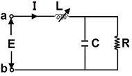
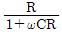
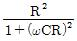
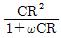
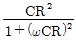
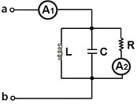
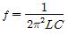
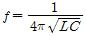
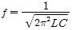
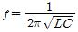
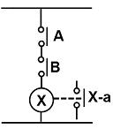
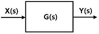
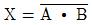
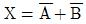
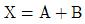
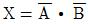
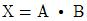

## 22. 문제

22. 그림과 같은 회로에서 단자 a, b 사이에 주파수 f(Hz)의 정
현파 전압을 가했을 때 전류계 A1, A2의 값이 같았다. 이 경
우 f, L, C 사이의 관계로 옳은 것은?
    
    ① 
    
② 
    ③ 
  
❹

### 정답

1번

### 해설

정답은 1번입니다. 선택지의 핵심개념 을 확인하세요.

### 그림

## 23. 문제

23. 추종제어에 대한 설명으로 가장 옳은 것은?
    ① 제 어량의 종류에 의 하여 분류한 자동제어의 일종
    ❷ 목표값이 시간에 따라 임의로 변하는 제어
    ③ 제어량이 공업 프로세스의 상태량일 경우의 제어
    ④ 정치제어의 일종으로 주로 유량, 위치, 주파수, 전압 등
을 제어

### 정답

1번

### 해설

정답은 1번입니다. 선택지의 핵심개념 을 확인하세요.

### 그림

## 24. 문제

24. 다음 그림과 같은 논리회로로 옳은 것은?
    
    ① OR회로
❷ AND회로
    ③ NOT 회로
④ NOR 회로

### 정답

1번

### 해설

정답은 1번입니다. 선택지의 핵심개념 을 확인하세요.

### 그림

## 25. 문제

25. 진공 중에 놓인 5μC의 점전하에서 2m되는 점의 전계는 몇 
V/m인가?
    ❶ 11.25×103
② 16.25×103
    ③ 22.25×103
④ 28.25×103

### 정답

1번

### 해설

정답은 1번입니다. 선택지의 핵심개념 을 확인하세요.

### 그림

## 26. 문제

26. 전류 측정 범위를 확대시키기 위하여 전류계와 병렬로 연결
해야만 되는 것은?
    ① 배율기
❷ 분류기
    ③ 중계기
④ CT

### 정답

1번

### 해설

정답은 1번입니다. 선택지의 핵심개념 을 확인하세요.

### 그림

## 27. 문제

27. 100V, 500W의 전열선 2개를 같은 전압에서 직렬로 접속한 
경우와 병렬로 접속한 경우의 전력은 각각 몇 W인가?
    ① 직렬 : 250, 병렬 : 500  ❷ 직렬 : 250, 병렬 : 1000
    ③ 직렬 : 500, 병렬 : 500  ④ 직렬 : 500, 병렬 : 1000

### 정답

1번

### 해설

정답은 1번입니다. 선택지의 핵심개념 을 확인하세요.

### 그림

## 28. 문제

28. 정속도 운전의 직류발전기로 작은 전력의 변화를 큰 전력의 
변화로 증폭하는 발전기는?
    ❶ 앰플리다인
② 로젠베르그발전기
    ③ 솔레노이드
④ 서보전동기

### 정답

1번

### 해설

정답은 1번입니다. 선택지의 핵심개념 을 확인하세요.

### 그림

## 29. 문제

29. 전압 및 전류측정방법에 대한 설명 중 틀린 것은?
    ① 전압계를 저항 양단에 병렬로 접속한다.
    ② 전류계는 저항에 직렬로 접속한다.
    ③ 전압계의 측정범위를 확대하기 위하여 배율기는 전압계
와 직렬로 접속한다.
    ❹ 전류계의 측정범위를 확대하기 위하여 저항분류기는 전
류계와 직렬로 접속한다.

### 정답

1번

### 해설

정답은 1번입니다. 선택지의 핵심개념 을 확인하세요.

### 그림

## 30. 문제

30. 공진작용과 관계가 없는 것은?
    ① C급 증폭회로
② 발진회로
    ③ LC 병렬회로
❹ 변조회로

### 정답

1번

### 해설

정답은 1번입니다. 선택지의 핵심개념 을 확인하세요.

### 그림

## 31. 문제

31. 다음 그림과 같은 회로에서 전달함수로 옳은 것은?
    
    ① X(s)＋Y(s)
② X(s)Y(s)
    ❸ Y(s)/X(s)
④ X(s)/Y(s)

### 정답

1번

### 해설

정답은 1번입니다. 선택지의 핵심개념 을 확인하세요.

### 그림

## 32. 문제

32. 0.5kVA의 수신기용 변압기가 있다. 변압기의 철손이 7.5W, 
전부하동손이 16W이다. 화재가 발생하여 처음 2시간은 전
부하 운전되고, 다음 2시간은 1/2의 부하가 걸렸다고 한다. 
4시간에 걸친 전손실 전력량은 약 몇 Wh인가?
    ① 65
❷ 70
    ③ 75
④ 80

### 정답

1번

### 해설

정답은 1번입니다. 선택지의 핵심개념 을 확인하세요.

### 그림

## 33. 문제

33. 지름 1.2m, 저항 7.6Ω의 동선에서 이 동선의 저항률을 
0.0172Ω·m라고 하면 동선의 길이는 약 몇 m인가?
    ① 200
② 300
    ③ 400
❹ 500

### 정답

1번

### 해설

정답은 1번입니다. 선택지의 핵심개념 을 확인하세요.

### 그림

## 34. 문제

34. 제어 목표에 의한 분류 중 미지의 임의 시간적 변화를 하는 
목표값에 제어량을 추종시키는 것을 목적으로 하는 제어법
은?
    ① 정치 제어
② 비율 제어
    ❸ 추종 제어
④ 프로그램 제어

### 정답

1번

### 해설

정답은 1번입니다. 선택지의 핵심개념 을 확인하세요.

### 그림

## 35. 문제

35. 논리식 
 와 같은 것은?
    ❶ 
     ② 
    ③ 
     ④ 

소방설비기사(전기분야)
◐2017년 09월 23일 필기 기출문제 ◑
전자문제집 CBT : www.comcbt.com
최강 자격증 기출문제 전자문제집 CBT : www.comcbt.com

### 정답

1번

### 해설

정답은 1번입니다. 선택지의 핵심개념 을 확인하세요.

### 그림

## 36. 문제

36. 다이오드를 여러 개 병렬로 접속하는 경우에 대한 설명으로 
옳은 것은?
    ❶ 과전류로부터 보호할 수 있다.
    ② 과전압으로부터 보호할 수 있다.
    ③ 부하측의 맥동률을 감소시킬 수 있다.
    ④ 정류기의 역방향 전류를 감소시킬 수 있다.

### 정답

1번

### 해설

정답은 1번입니다. 선택지의 핵심개념 을 확인하세요.

### 그림

## 37. 문제

37. 이상적인 트랜지스터의 a 값은? (단, α는 베이스접지 증폭
기의 전류증폭율이다.)
    ① ０
❷ １
    ③ 100
④ ∞

### 정답

1번

### 해설

정답은 1번입니다. 선택지의 핵심개념 을 확인하세요.

### 그림

## 38. 문제

38. 저항이 R, 유도리액턴스가 XL, 용량리액턴스가 Xc인 R-L-C 
직렬회로에서의 Z와 Z값으로 옳은 것은?
    ❶ 
 
    ② 
 
    ③ 
 
    ④

### 정답

1번

### 해설

정답은 1번입니다. 선택지의 핵심개념 을 확인하세요.

### 그림

## 39. 문제

39. 3상 유도전동기의 기동법이 아닌 것은?
    ① Y-△ 기동법
② 기동 보상기법
    ❸ 1차 저항 기동법
④ 전전압 기동법

### 정답

1번

### 해설

정답은 1번입니다. 선택지의 핵심개념 을 확인하세요.

### 그림

## 40. 문제

40. 조작기기는 직접 제어대상에 작용하는 장치이고 빠른 응답
이 요구된다. 다음 중 전기식 조작기기가 아닌 것은?
    ① 서보 전동기
② 전동 밸브
    ❸ 다이어프램 밸브
④ 전자 밸브

### 정답

1번

### 해설

정답은 1번입니다. 선택지의 핵심개념 을 확인하세요.

### 그림

