# 소방설비기사(전기분야)20180304(교사용) - 소방전기회로

> 원본: `소방설비기사(전기분야)20180304(교사용).pdf`
> 개인학습용 변환본.

## 21. 문제

21. 다음과 같은 결합회로의 합성인덕턴스로 옳은 것은?
    
    ❶ L1+L2+2M
② L1+L2-2M
    ③ L1+L2-M
④ L1+L2+M

### 정답

1번

### 해설

정답은 1번입니다. 선택지의 핵심개념 을 확인하세요.

### 그림

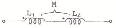
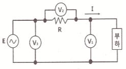
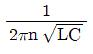
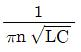
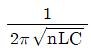
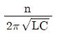
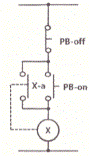

## 22. 문제

22. 그림과 같이 전압계 V1, V2, V3와 5Ω의 저항 R을 접속하였
다. 전압계의 지시가 V1=20V, V2=40V, V3=50V라면 부하전
력은 몇W인가?
    
    ❶ 50
② 100
    ③ 150
④ 200

### 정답

1번

### 해설

정답은 1번입니다. 선택지의 핵심개념 을 확인하세요.

### 그림

## 23. 문제

23. 권선수가 100회인 코일을 200회로 늘리면 코일에 유기되는 
유도기전력은 어떻게 변화 하는가?
    ① 1/2로 감소
② 1/4로 감소
    ③ 2배로 증가
❹ 4배로 증가

### 정답

1번

### 해설

정답은 1번입니다. 선택지의 핵심개념 을 확인하세요.

### 그림

## 24. 문제

24. 회로의 전압과 전류를 측정하기 위한 계측기의 연결방법으
로 옳은 것은?
    ① 전압계:부하와 직렬, 전류계:부하와 병렬
    ② 전압계:부하와 직렬, 전류계:부하와 직렬
    ③ 전압계:부하와 병렬, 전류계:부하와 병렬
    ❹ 전압계:부하와 병렬, 전류계:부하와 직렬

### 정답

1번

### 해설

정답은 1번입니다. 선택지의 핵심개념 을 확인하세요.

### 그림

## 25. 문제

25. 3상유도전동기 Y-△ 기동회로의 제어요소가 아닌 것은?
    ① MCCB
② THR
    ③ MC
❹ ZCT

### 정답

1번

### 해설

정답은 1번입니다. 선택지의 핵심개념 을 확인하세요.

### 그림

## 26. 문제

26. 제어동작에 따른 제어계의 분류에 대한 설명 중 틀린 것은?
    ① 미분동작 : D동작 또는 rate동작이라고 부르며, 동작신호
의 기울기에 비례한 조작신호를 만든다.
    ② 적분동작 : I동작 또는 리셋동작이라고 부르며, 적분값의 
크기에 비례하여 조절신호를 만든다.
    ③ 2위치제어 : on/off 동작이라고도 하며, 제어량이 목표값 
보다 작은지 큰지에 따라 조작량으로 on 또는 off의 두
가지 값의 조절 신호를 발생한다.
    ❹ 비례동작 : P동작이라고도 부르며, 제어동작신호에 반비
례하는 조절신호를 만드는 제어동작이다.

### 정답

1번

### 해설

정답은 1번입니다. 선택지의 핵심개념 을 확인하세요.

### 그림

## 27. 문제

27. 용량0.02μF 콘덴서 2개와 0.01μF 콘덴서 1개를 병렬로 접
속하여 24V의 전압을 가하였다. 합성용량은 몇 μF이며, 
0.01μF 콘덴서에 축적되는 전하량은 몇 C인가?
    ① 0.05, 0.12×10-6
❷ 0.05, 0.24×10-6
    ③ 0.03, 0.12×10-6
④ 0.03, 0.24×10-6

### 정답

1번

### 해설

정답은 1번입니다. 선택지의 핵심개념 을 확인하세요.

### 그림

## 28. 문제

28. 불대수의 기본정리에 관한 설명으로 틀린 것은?
    ① A+A=A
② A+1=1
    ❸ Aㆍ0=1
④ A+0=A

### 정답

1번

### 해설

정답은 1번입니다. 선택지의 핵심개념 을 확인하세요.

### 그림

## 29. 문제

29. RLC 직렬공진회로에서 제n고조파의 공진주파수(fn)는?
    ❶ 
 
② 
    ③ 
  
④

### 정답

1번

### 해설

정답은 1번입니다. 선택지의 핵심개념 을 확인하세요.

### 그림

## 30. 문제

30. 대칭 3상 Y부하에서 각 상의 임피던스는 20Ω이고, 부하 전
류가 8A일 때 부하의 선간접압은 약 몇 V 인가?
    ① 160
② 226
    ❸ 277
④ 480

### 정답

1번

### 해설

정답은 1번입니다. 선택지의 핵심개념 을 확인하세요.

### 그림

## 31. 문제

31. R=10Ω, wL=20Ω 인 직렬회로에 220V의 전압을 가하는 경
우 전류와 전압과 전류의 위상각은 각각 어떻게 되는가?
    ① 24.5A, 26.5°
❷ 9.8A, 63.4°
    ③ 12.2A, 13.2°
④ 73.6A, 79.6°

### 정답

1번

### 해설

정답은 1번입니다. 선택지의 핵심개념 을 확인하세요.

### 그림

## 32. 문제

32. 터널다이오드를 사용하는 목적이 아닌 것은?
    ① 스위칭작용
② 증폭작용
    ③ 발진작용
❹ 정전압 정류작용

### 정답

1번

### 해설

정답은 1번입니다. 선택지의 핵심개념 을 확인하세요.

### 그림

## 33. 문제

33. 집적회로(IC)의 특징으로 옳은 것은?
    ① 시스템이 대형화된다.
    ② 신뢰성이 높으나, 부품의 교체가 어렵다.
    ③ 열에 강하다.
    ❹ 마찰에 의한 정전기 영향에 주의해야 한다.

### 정답

1번

### 해설

정답은 1번입니다. 선택지의 핵심개념 을 확인하세요.

### 그림

## 34. 문제

34. PB-on 스위치와 병렬로 접속된 보조접점 X-a의 역할은?
    
    ① 인터록 회로
❷ 자기유지회로
    ③ 전원차단회로
④ 램프점등회로
2과목 : 소방전기회로

소방설비기사(전기분야)
◐2018년 03월 04일 필기 기출문제 ◑
전자문제집 CBT : www.comcbt.com
최강 자격증 기출문제 전자문제집 CBT : www.comcbt.com

### 정답

1번

### 해설

정답은 1번입니다. 선택지의 핵심개념 을 확인하세요.

### 그림

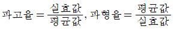
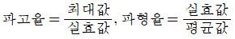
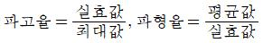
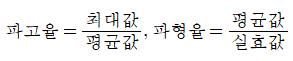
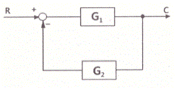
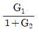
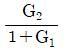
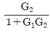
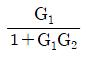
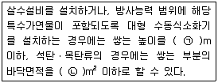
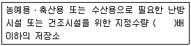
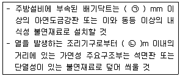

## 35. 문제

35. 1차 권선수 10회, 2차 권선수 300회인 변압기에서 2차 단
자전압 1500V가 유도되기 위한 1차 단자전압은 몇 V 인가?
    ① 30
❷ 50
    ③ 120
④ 150

### 정답

1번

### 해설

정답은 1번입니다. 선택지의 핵심개념 을 확인하세요.

### 그림

## 36. 문제

36. 교류에서 파형의 개략적인 모습을 알기 위해 사용하는 파고
율과 파형율에 대한 설명으로 옳은 것은?
    ① 
    ❷ 
    ③ 
    ④

### 정답

1번

### 해설

정답은 1번입니다. 선택지의 핵심개념 을 확인하세요.

### 그림

## 37. 문제

37. 배전선에 6000V의 전압을 가하였더니 2mA의 누설전류가 
흘렀다. 이 배전선의 절연저항은 몇MΩ 인가?
    ❶ 3
② 6
    ③ 8
④ 12

### 정답

1번

### 해설

정답은 1번입니다. 선택지의 핵심개념 을 확인하세요.

### 그림

## 38. 문제

38. 자동화재탐지설비의 수신기에서 교류 220V를 직류 24V로 
정류 시 필요한 구성요소가 아닌 것은?
    ① 변압기
❷ 트랜지스터
    ③ 정류 다이오드
④ 평활 콘덴서

### 정답

1번

### 해설

정답은 1번입니다. 선택지의 핵심개념 을 확인하세요.

### 그림

## 39. 문제

39. 다음 그림과 같은 계통의 전달함수는?
    
    ① 
    
② 
    ③ 
    
❹

### 정답

1번

### 해설

정답은 1번입니다. 선택지의 핵심개념 을 확인하세요.

### 그림

## 40. 문제

40. 단상 유도전동기의 Slip은 5.5[%], 회전자의 속도가 
1700rpm인 경우 동기속도(NS)는?
    ① 3090rpm
② 9350rpm
    ❸ 1799rpm
④ 1750rpm

### 정답

1번

### 해설

정답은 1번입니다. 선택지의 핵심개념 을 확인하세요.

### 그림

