# 소방설비기사(전기분야)20190303(교사용) - 소방전기회로

> 원본: `소방설비기사(전기분야)20190303(교사용).pdf`
> 개인학습용 변환본.

## 21. 문제

21. R=10Ω, C=33㎌, L=20mH인 RLC 직렬회로의 공진주파수는 
약 몇 ㎐인가?
    ① 169
② 176
    ❸ 196
④ 206

### 정답

1번

### 해설

정답은 1번입니다. 선택지의 핵심개념 을 확인하세요.

### 그림

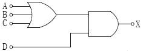
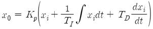
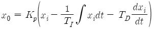
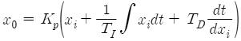
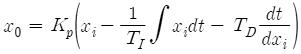
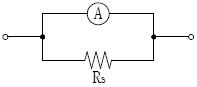
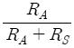
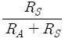
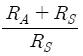
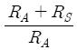

## 22. 문제

22. PNPN 4층 구조로 되어 있는 소자가 아닌것은?
    ① SCR
② TRIAC
    ❸ Diode
④ GTO

### 정답

1번

### 해설

정답은 1번입니다. 선택지의 핵심개념 을 확인하세요.

### 그림

## 23. 문제

23. 역률 80%, 유효전력 80㎾일 때, 무효전력 [kVar]은?
    ① 10
② 16
    ❸ 60
④ 64

### 정답

1번

### 해설

정답은 1번입니다. 선택지의 핵심개념 을 확인하세요.

### 그림

## 24. 문제

24. 전자회로에서 온도보상용으로 많이 사용되고 있는 소자는?
    ① 저항
② 리액터
    ③ 콘덴서
❹ 서미스터

### 정답

1번

### 해설

정답은 1번입니다. 선택지의 핵심개념 을 확인하세요.

### 그림

## 25. 문제

25. 서보전동기는 제어기기의 어디에 속하는가?
    ① 검출부
② 조절부
    ③ 증폭부
❹ 조작부

### 정답

1번

### 해설

정답은 1번입니다. 선택지의 핵심개념 을 확인하세요.

### 그림

## 26. 문제

26. 자동제어계를 제어목적에 의해 분류한 경우, 틀린 것은?
    ① 정치제어 : 제어량을 주어진 일정목표로 유지시키기 위
한 제어
    ② 추종제어 : 목표치가 시간에 따라 변화하는 제어
    ③ 프로그램제어 : 목표치가 프로그램대로 변하는 제어
    ❹ 서보제어 : 선박의 방향제어계인 서보제어는 정치제어와 
같은 성질

### 정답

1번

### 해설

정답은 1번입니다. 선택지의 핵심개념 을 확인하세요.

### 그림

## 27. 문제

27. 그림의 논리기호를 표시한 것으로 옳은 식은?
    
    ① X=(AㆍBㆍC)ㆍD
❷ X=(A+B+C)ㆍD
    ③ X=(AㆍBㆍC)+D
④ X=A+B+C+D

### 정답

1번

### 해설

정답은 1번입니다. 선택지의 핵심개념 을 확인하세요.

### 그림

## 28. 문제

28. 20Ω과 40Ω의 병렬회로에서 20Ω에 흐르는 전류가 10A라
면, 이 회로에 흐르는 총 전류는 몇 A인가?
    ① 5
② 10
    ❸ 15
④ 20

### 정답

1번

### 해설

정답은 1번입니다. 선택지의 핵심개념 을 확인하세요.

### 그림

## 29. 문제

29. 3상 유도전동기가 중부하로 운전되던 중 1선이 절단되면 어
떻게 되는가?
    ① 전류가 감소한 상태에서 회전이 계속된다.
    ② 전류가 증가한 상태에서 회전이 계속된다.
    ③ 속도가 증가하고 부하전류가 급상승한다.
    ❹ 속도가 감소하고 부하전류가 급상승한다.

### 정답

1번

### 해설

정답은 1번입니다. 선택지의 핵심개념 을 확인하세요.

### 그림

## 30. 문제

30. SCR의 양극 전류가 10A일 때 게이트 전류를 반으로 줄이면 
양극 전류는 몇 A인가?
    ① 20
❷ 10
    ③ 5
④ 0.1

### 정답

1번

### 해설

정답은 1번입니다. 선택지의 핵심개념 을 확인하세요.

### 그림

## 31. 문제

31. 비례+적분+미분동작(PID동작)식을 바르게 나타낸 것은?
    ❶ 
    ② 
    ③ 
    ④

### 정답

1번

### 해설

정답은 1번입니다. 선택지의 핵심개념 을 확인하세요.

### 그림

## 32. 문제

32. 그림과 같은 회로에서 분류기의 배율은? (단, 전류계 A의 
내부저항은 RA이며 RS는 분류기 저항이다.)
    
    ① 
  
② 
    ❸ 
 
④

### 정답

1번

### 해설

정답은 1번입니다. 선택지의 핵심개념 을 확인하세요.

### 그림

## 33. 문제

33. 어떤 옥내배선에 380V의 전압을 가하였더니 0.2㎃의 누설전
류가 흘렀다. 이 배선의 절연저항은 몇 ㏁인가?
    ① 0.2
❷ 1.9
    ③ 3.8
④ 7.6

### 정답

1번

### 해설

정답은 1번입니다. 선택지의 핵심개념 을 확인하세요.

### 그림

## 34. 문제

34. 변류기에 결선된 전류계가 고장이 나서 교체하는 경우 옳은 
방법은?
    ① 변류기의 2차를 개방시키고 전류계를 교체한다.
    ❷ 변류기의 2차를 단락시키고 전류계를 교체한다.
    ③ 변류기의 2차를 접지시키고 전류계를 교체한다.
2과목 : 소방전기회로

소방설비기사(전기분야)
◐2019년 03월 03일 필기 기출문제 ◑
전자문제집 CBT : www.comcbt.com
최강 자격증 기출문제 전자문제집 CBT : www.comcbt.com
    ④ 변류기에 피뢰기를 연결하고 전류계를 교체한다.

### 정답

1번

### 해설

정답은 1번입니다. 선택지의 핵심개념 을 확인하세요.

### 그림

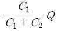
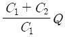
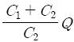
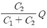
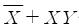
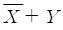
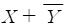
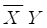
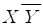
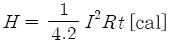

## 35. 문제

35. 두 콘덴서 C1, C2를 병렬로 접속하고 전압을 인가하였더니 
전체 전하량이 Q[C]이었다. C2에 충전된 전하량은?
    ① 
 
② 
    ③ 
  
❹

### 정답

1번

### 해설

정답은 1번입니다. 선택지의 핵심개념 을 확인하세요.

### 그림

## 36. 문제

36. 논리식 
 를 간략화 한 것은?
    ❶ 
    
② 
    ③ 
    
④

### 정답

1번

### 해설

정답은 1번입니다. 선택지의 핵심개념 을 확인하세요.

### 그림

## 37. 문제

37. 전기화재의 원인이 되는 누전전류를 검출하기 위해 사용되
는 것은?
    ① 접지계전기
❷ 영상변류기
    ③ 계기용변압기
④ 과전류계전기

### 정답

1번

### 해설

정답은 1번입니다. 선택지의 핵심개념 을 확인하세요.

### 그림

## 38. 문제

38. 공기 중에 2m의 거리에 10μC, 20μC의 두 점전하가 존재할 
때 이 두 전하 사이에 작용하는 정전력은 약 몇 N인가?
    ❶ 0.45
② 0.9
    ③ 1.8
④ 3.6

### 정답

1번

### 해설

정답은 1번입니다. 선택지의 핵심개념 을 확인하세요.

### 그림

## 39. 문제

39. 100V, 1㎾의 니크롬선을 3/4의 길이로 잘라서 사용할 때 소
비전력은 약 몇 W인가?
    ① 1,000
❷ 1,333
    ③ 1,430
④ 2,000

### 정답

1번

### 해설

정답은 1번입니다. 선택지의 핵심개념 을 확인하세요.

### 그림

## 40. 문제

40. 줄의 법칙에 관한 수식으로 틀린 것은?
    ① H=I2Rt[J]    
② H=0.24I2 Rt [cal]
    ❸ H=0.12 VIt [J]  
④

### 정답

1번

### 해설

정답은 1번입니다. 선택지의 핵심개념 을 확인하세요.

### 그림

