# 소방설비기사(전기분야)20190427(해설집) - 소방전기회로

> 원본: `소방설비기사(전기분야)20190427(해설집).pdf`
> 개인학습용 변환본.

## 21. 문제

21. 그림과 같은 회로에서 A-B 단자에 나타나는 전압은 몇 V 
2과목 : 소방전기회로

본 해설집은 최강 자격증 기출문제 전자문제집 CBT 해설달기 프로젝트에 의해서 만들어진 자료입니다. 해설을 제공해 주신 모든 분들께 감사 드립니다.
소방설비기사(전기분야)
◐2019년 04월 27일 필기 기출문제 및 해설집◑
전자문제집 CBT : www.comcbt.com
기출문제 해설은 최강 자격증 기출문제 전자문제집 CBT : www.comcbt.com 통해서 실시간으로 변경됩니다.
인가?
    
    ① 20
② 40
    ③ 60
④ 80
<문제 해설>
전압분배 법칙으로 처음 양쪽으로
각각 120 V가 입력(병렬)
이후 전압강하법칙(직렬)으로 같은저항이므로 120÷2 이므로
60 임
[해설작성자 : 타르]

### 정답

1번

### 해설

정답은 1번입니다. 선택지의 핵심개념 을 확인하세요.

### 그림

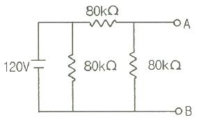
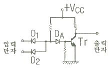
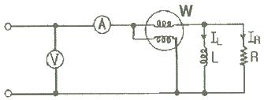

## 22. 문제

22. 부궤환 증폭기의 장점에 해당되는 것은?
    ① 전력이 절약된다.
    ② 안정도가 증진된다.
    ③ 증폭도가 증가된다.
    ④ 능률이 증대된다.
<문제 해설>
부궤환증폭기장점
1안정도증가
2주파수특성개선
3대역폭증가
4이득이안정
5내부잡음감소
[해설작성자 : 멘분지존]

### 정답

1번

### 해설

정답은 1번입니다. 선택지의 핵심개념 을 확인하세요.

### 그림

## 23. 문제

23. 전기기기에서 생기는 손실 중 권선의 저항에 의하여 생기는 
손실은?
    ① 철손
② 동손
    ③ 포유부하손
④ 히스테리시스손
<문제 해설>
권선 저항에 의해 생기는 손실을 동손이라고 합니다..동손은 전
기기기에서 발생하는 손실 중 하나로, 선로에서도 발생합니다
[해설작성자 : 까꿍]

### 정답

1번

### 해설

정답은 1번입니다. 선택지의 핵심개념 을 확인하세요.

### 그림

## 24. 문제

24. 그림과 같은 무접점회로는 어떤 논리회로인가?
    
    ① NOR
② OR
    ③ NAND
④ AND
<문제 해설>
Da를 기준으로 왼쪽과 오른쪽으로 나누어 해석
왼쪽 And
오른쪽 Not
즉 not(D1 And D2) => Nand 게이트
드모르간 불필요 => not D1 + not D2
반도체 회로의 해석
And 게이트 :
D1과 D2 모두 5V                         => Vcc와 동일 전
압이므로 전류=0        => Da=Vcc-RI=Vcc =5V
D1과 D2 중 하나라도 0V 이면 => Vcc보다 낮은 전압이므로 전
류≠0 => Da=0.7V ≒0V
Not 게이트
Da가 5V                                         => 베이스 
전압이 있으므로 Ic≠0        => 출력 =0.7V ≒0V
Da가 0V                                         => 베이스 
전압이 없으므로 Ic=0         => 출력 =Vcc-RI=Vcc =5V
[해설작성자 : comcbt.com 이용자]

### 정답

1번

### 해설

정답은 1번입니다. 선택지의 핵심개념 을 확인하세요.

### 그림

## 25. 문제

25. 열감지기의 온도감지용으로 사용하는 소자는?
    ① 서미스터
② 바리스터
    ③ 제너다이오드
④ 발광다이오드
<문제 해설>
열감지기의 온도감지용으로 사용하는 소자 : 서미스터
[해설작성자 : 대천사.루시퍼]

### 정답

1번

### 해설

정답은 1번입니다. 선택지의 핵심개념 을 확인하세요.

### 그림

## 26. 문제

26. 그림과 같은 회로에서 각 계기의 지시값이 Ⓥ는 180V, Ⓐ는 
5A, W는 720W 라면 이 회로의 무효전력(Var)은?
    
    ① 480
② 540
    ③ 960
④ 1200
<문제 해설>
피상전력= 루트(유효전력^2 + 무효전력^2)
                = VI
무효전력= 루트(피상전력^2 - 유효전력^2)
[해설작성자 : 네이버]
피상전력=VI    180X5=900
무효적력=루트 피상전력2-유효전력2 루트 9002-7202=540Var
[해설작성자 : 쌍쌍기사]
유효전력)P[W] = 720[W]
피상전력)Pa[VA] = V * I ▶ 180 * 5 = 900[VA]

본 해설집은 최강 자격증 기출문제 전자문제집 CBT 해설달기 프로젝트에 의해서 만들어진 자료입니다. 해설을 제공해 주신 모든 분들께 감사 드립니다.
소방설비기사(전기분야)
◐2019년 04월 27일 필기 기출문제 및 해설집◑
전자문제집 CBT : www.comcbt.com
기출문제 해설은 최강 자격증 기출문제 전자문제집 CBT : www.comcbt.com 통해서 실시간으로 변경됩니다.
무효전력)Pr[Var] = √( Pa^2 - P^2 ) ▶ √( 900^2 - 720^2 ) 
= 540[Var]
[해설작성자 : 따고싶다 or 어디든 빌런]

### 정답

1번

### 해설

정답은 1번입니다. 선택지의 핵심개념 을 확인하세요.

### 그림

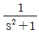
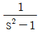
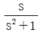
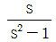
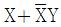
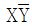
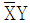
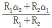
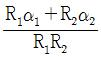
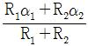
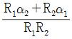

## 27. 문제

27. 정현파 신호 sin t 의 전달함수는?
    ① 
② 
    ③ 
④ 
<문제 해설>
sinwt=w/s^2+w^2
w=1이므로 1/s^2+1
w=각소도(오메가)
[해설작성자 : khlee]

### 정답

1번

### 해설

정답은 1번입니다. 선택지의 핵심개념 을 확인하세요.

### 그림

## 28. 문제

28. 제어량이 압력, 온도 및 유량 등과 같은 공업량일 경우의 
제어는?
    ① 시퀀스제어
② 프로세스제어
    ③ 추종제어
④ 프로그램제어
<문제 해설>
공업이 들어가면 프로세스

### 정답

1번

### 해설

정답은 1번입니다. 선택지의 핵심개념 을 확인하세요.

### 그림

## 29. 문제

29. SCR를 턴온시킨 후 게이트 전류를 0으로 하여도 온(ON)상
태를 유지하기 위한 최소의 애노드 전류를 무엇이라 하는
가?
    ① 래칭전류
② 스텐드온전류
    ③ 최대전류
④ 순시전류
<문제 해설>
SCR을 턴온시킨 후 게이트전류를 0으로 하여도 온 상태를 유지
하기 위한 최소의 애노드 전류를 래칭전류라고 한다.
! SCR과 관련된 전류는 래칭전류 !
[해설작성자 : 제가 뭐 경제]

### 정답

1번

### 해설

정답은 1번입니다. 선택지의 핵심개념 을 확인하세요.

### 그림

## 30. 문제

30. 인덕턴스가 1H인 코일과 정전용량이 0.2μF인 콘덴서를 직
렬로 접속할 때 이 회로의 공진주파수는 약 몇 Hz인가?
    ① 89
② 178
    ③ 267
④ 356
<문제 해설>
공진주파수 f = 1/(2π√LC)
[해설작성자 : comcbt.com 이용자]
공진주파수)fc[Hz] = 1 / 2π√( L * C ) ▶ 1 / 2π√( 1 * 0.2 * 
10^-6 ) = 355.88127[Hz]
[해설작성자 : 따고싶다 or 어디든 빌런]

### 정답

1번

### 해설

정답은 1번입니다. 선택지의 핵심개념 을 확인하세요.

### 그림

## 31. 문제

31. 단상 반파정류회로에서 교류 실효값 220V를 정류하면 직류 
평균전압은 약 몇 V인가? (단, 정류기의 전압강하는 무시한
다.)
    ① 58
② 73
    ③ 88
④ 99
<문제 해설>
단상 반파 -> 0.45E = Edc
[해설작성자 : 카시오]
단상반파정류회로의 최대값과 실효값
V(AVG) = 0.318 X V(MAX) = 0.45 X V
단상전파정류회로의 최대값과 실효값
V(AVG) = 0.45 X V(MAX) = 0.9 X V
[해설작성자 : 서비스오케이]

### 정답

1번

### 해설

정답은 1번입니다. 선택지의 핵심개념 을 확인하세요.

### 그림

## 32. 문제

32. 논리식 
를 간단히 하면?
    ① X
    ② 
    ③ 
    ④ X+Y
<문제 해설>
(X+X바)*(X+Y)
=    1 * (X+Y)
= X+Y
[해설작성자 : 천사마녀]

### 정답

1번

### 해설

정답은 1번입니다. 선택지의 핵심개념 을 확인하세요.

### 그림

## 33. 문제

33. 온도 t℃에서 저항이 R1, R2이고 저항의 온도계수가 각각 α
1, α2 인 두 개의 저항을 직렬로 접속했을 때 합성저항 온도
계수는?
    ① 
    ② 
    ③ 
     ④ 
<문제 해설>
계산식 찍을 때, 단위를 참고하면 좋습니다.
이 문제는 온도"계수"를 구하는 문제이므로 분자와 분모의 단위
가 같아 결과가 상수로 나와야 합니다.
따라서 2, 4는 정답이 될 수 없으므로 1과 3 중에 하나입니다.
[해설작성자 : 꿈돌이소금빵]
기본 온도 t 합성 저항
Rs0≡R1+R2
상승 온도 t+d 합성 저항
Rst
        =R1(1+a1*d)+R2(1+a2*d)
        =R1+R1*a1*d+R2+R2*a2*d
이는 합성 저항과 합성 온도계수와 같아야 한다.
Rst
        =Rst(1+at*d)
        =Rst+RST*at*d
        =R1+R2+(R1+R2)*at*d

본 해설집은 최강 자격증 기출문제 전자문제집 CBT 해설달기 프로젝트에 의해서 만들어진 자료입니다. 해설을 제공해 주신 모든 분들께 감사 드립니다.
소방설비기사(전기분야)
◐2019년 04월 27일 필기 기출문제 및 해설집◑
전자문제집 CBT : www.comcbt.com
기출문제 해설은 최강 자격증 기출문제 전자문제집 CBT : www.comcbt.com 통해서 실시간으로 변경됩니다.
두 식을 비교하면
Rst
        =R1+R1*a1*d+R21+R2*a2*d
        =R1+R2+(R1+R2)*at*d
양변에 R1+R2+와 *d는 소거
        R1*a1+R2*a2
        =(R1+R2)*at
이항하면
        (R1*a1+R2*a2)/(R1+R2)
        =at
[해설작성자 : comcbt.com 이용자]

### 정답

1번

### 해설

정답은 1번입니다. 선택지의 핵심개념 을 확인하세요.

### 그림

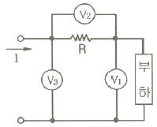
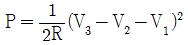
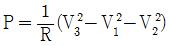
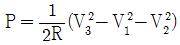
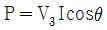
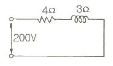
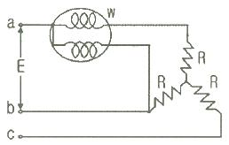
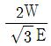
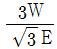
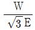
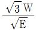

## 34. 문제

34. 단상전력을 간접적으로 측정하기 위해 3전압계법을 사용하
는 경우 단상 교류전력 P(W)는?
    
    ① 
    ② 
    ③ 
    ④ 
<문제 해설>
암기 포인트 1.
가장 왼쪽에 있는놈이 가장 먼저 나와야합니다.
V3가 가장 왼쪽에 있지 않습니까?
암기 포인트 2.
전력을 구하는 공식을 생각해봅시다
전압 : V^2 / R
전류 : I^2 * R
그래서 전압계로 나오면 저항이 분모로 갑니다..
전류계로 나오면 저항이 분자로 갑니다.
암기 포인트 3.
무조건 2가 나눠져 있습니다.
이 3가지만 기억하면 손쉽게 접근할 수 있습니다.
[해설작성자 : comcbt.com 이용자]

### 정답

1번

### 해설

정답은 1번입니다. 선택지의 핵심개념 을 확인하세요.

### 그림

## 35. 문제

35. 그림과 같은 RL직렬회로에서 소비되는 전력은 몇 W 인가?
    
    ① 6400
② 8800
    ③ 10000
④ 12000
<문제 해설>
P=VICOSΦ=I^2R
=(200/5)^2*4
=6400
회로의 총저항
- 루트(4^2 + 3^2) = 5옴
- 회로의 전류(I) = V(200)
                   -----    = 40A
                     Z (5)
- 소비전력 (P) = I^2 * R
                = 1600 * 4
                = 6400
[해설작성자 : 그냥한번적어봤오]

### 정답

1번

### 해설

정답은 1번입니다. 선택지의 핵심개념 을 확인하세요.

### 그림

## 36. 문제

36. 선간전압 E(V)의 3상 평형전원에 대칭 3상 저항부하 R(Ω)이 
그림과 같이 접속되었을 때 a, b 두 상간에 접속된 전력계
의 지시값이 W(W)라면 C상의 전류는?
    
    ① 
② 
    ③ 
④ 
<문제 해설>
제 1 전력계법
[해설작성자 : 헐크]
Ic = E/루트3*R
측정된 부분 전력 W = E^2/2R

본 해설집은 최강 자격증 기출문제 전자문제집 CBT 해설달기 프로젝트에 의해서 만들어진 자료입니다. 해설을 제공해 주신 모든 분들께 감사 드립니다.
소방설비기사(전기분야)
◐2019년 04월 27일 필기 기출문제 및 해설집◑
전자문제집 CBT : www.comcbt.com
기출문제 해설은 최강 자격증 기출문제 전자문제집 CBT : www.comcbt.com 통해서 실시간으로 변경됩니다.
위의 식에서 E/R = 2W/E
전류 Ic식에 대입하면, Ic = 2W/루트3*E
[해설작성자 : 소방7일전사]
다른 풀이법
W
= V선*I선*cosθ
3상의 전압과 전류의 위상 θ=30
W
= E*I선*cos30
= E*I선*sqrt(3)/2
I선=W*2/(E*sqrt(3)
평형전원, 대칭3상 부하
I선(a) = I선(c)
[해설작성자 : comcbt.com 이용자]

### 정답

1번

### 해설

정답은 1번입니다. 선택지의 핵심개념 을 확인하세요.

### 그림

## 37. 문제

37. 교류전력변환장치로 사용되는 인버터회로에 대한 설명으로 
옳지 않은 것은?
    ① 직류 전력을 교류 전력으로 변환하는 장치를 인버터라고 
한다.
    ② 전류형 인버터와 전압형 인버터로 구분할 수 있다.
    ③ 전류방식에 따라서 타려식과 자려식으로 구분할 수 있
다.
    ④ 인버터의 부하장치에는 직류직권전동기를 사용할 수 있
다.
<문제 해설>
4.직류직권전동기 ㅡ 교류직권전동기
[해설작성자 : 타르]

### 정답

1번

### 해설

정답은 1번입니다. 선택지의 핵심개념 을 확인하세요.

## 38. 문제

38. 다이오드를 사용한 정류회로에서 과전압방지를 위한 대책으
로 가장 알맞은 것은?
    ① 다이오드를 직렬로 추가한다.
    ② 다이오드를 병렬로 추가한다.
    ③ 다이오드의 양단에 적당한 값의 저항을 추가한다.
    ④ 다이오드의 양단에 적당한 값의 콘덴서를 추가한다.
<문제 해설>
다이오드 접속
직렬=과전압보호
병렬=과전류보호
[해설작성자 : comcbt.com 이용자]
위 문제는 실제적으로 답이 없습니다..(굳이 이론상으로 접근하
자면 1번이 답이기는 합니다)
어떤 성분의 회로이던지 병렬로 연결하면 합성저항값이 줄어들
기 때문에 (커지지는 않기 때문에)
출력 전압은 커지게 됩니다(적어도 같습니다). 따라서 전압을 줄
이는 목적이라면 다이오드를 직렬로 추가하는 것이 맞습니다..
그러나, 전압을 줄인다고 해서 실제적으로 과전압방지 대책이 
되지 않습니다..
왜냐하면 위 문제가 정류회로이기 때문에 부하의 유무(또는 크
기)에 따라서 정류회로의 출력단의 전압차이가 크게 발생하게 
됩니다..부하의 크기에 따라서 전압의 변동이 크게되면 전압강하
를 해야할 다이오드의 개수를 결정할 수 없습니다..
직렬로 연결해야할 다이오드의 개수를 정확하게 결정하기 위해
서는 입력전압 및 부하의 크기가 변동되지 않고 결정되어야 하
기
때문에 실제로 이 경우처럼 사용하는 경우는 존재하지 않을 것 
같습니다..
[해설작성자 : comcbt.com 이용자]

### 정답

1번

### 해설

정답은 1번입니다. 선택지의 핵심개념 을 확인하세요.

## 39. 문제

39. 이미터 전류를 1mA 증가시켰더니 컬렉터 전류는 0.98mA 
증가되었다. 이 트랜지스터의 증폭률 β는?
    ① 4.9
② 9.8
    ③ 49.0
④ 98.0
<문제 해설>
증폭률(베타)=IC/IB=IC/IE-IC=0.98/(1-0.98)= 49
* IB=IE-IC
[해설작성자 : 와그라노]
트랜지스터의 증폭률 = 컬렉터전류 / 이미터전류 - 컬렉터전류
[해설작성자 : 뭐]

### 정답

1번

### 해설

정답은 1번입니다. 선택지의 핵심개념 을 확인하세요.

## 40. 문제

40. 저항이 4Ω, 인덕턴스가 8mH인 코일을 직렬로 연결하고 
100V, 60Hz 인 전압을 공급할 때 유효전력은 약 몇 kW 인
가?
    ① 0.8
② 1.2
    ③ 1.6
④ 2.0
<문제 해설>
Z = root( R^2 + X^2 )
X = XC + XL
XL = 2πfL = 2*π*60*( 8*10^(-3) ) = 3.015 [ohm]
Z = root( 4^2 + 3^2 ) = 5 [ohm]
P = VIcosθ = ( V^2 / Z )*( R / Z ) = ( 100^2 / 5 )*( 4 / 5 
) = 1.6 [kW]
[해설작성자 : hl]
XL[Ω] = 2π * f * L ▶ 2π * 60 * 8 * 10^-3 = 3.015[Ω]
Z[Ω] = √( R^2 + XL^2 ) ▶ √( 4^2 + 3^2 ) = 5[Ω]
P[W] = I^2 * R ▶ ( V / Z )^2 * R ▶ ( 100 / 5 )^2 * 4 = 
1600[W]
[해설작성자 : 따고싶다 or 어디든 빌런]

### 정답

1번

### 해설

정답은 1번입니다. 선택지의 핵심개념 을 확인하세요.
