# 소방설비기사(전기분야)20200606(해설집) - 소방전기회로

> 원본: `소방설비기사(전기분야)20200606(해설집).pdf`
> 개인학습용 변환본.

## 21. 문제

21. 인덕턴스가 0.5H인 코일의 리액턴스가 753.6Ω일 때 주파수
는 약 몇 Hz인가?
    ① 120
② 240
    ③ 360
④ 480
<문제 해설>
유도성리액턴스(XL)= 2 x pi x 주파수(f) x 인덕턴스(L)
753.6[Ohm]= 2 x pi x f[Hz] x 0.5[H]
f=753.6÷(2x3.14x0.5)=240
[해설작성자 : 나야나]
리액턴스)XL[Ω] = 2π * f * L ▶ f[Hz] = XL / 2π * L ▶ 
753.6 / 2π * 0.5 = 239.8783[Hz]
[해설작성자 : 따고싶다 or 어디든 빌런]

### 정답

1번

### 해설

정답은 1번입니다. 선택지의 핵심개념 을 확인하세요.

## 22. 문제

22. 최고 눈금 50mV, 내부 저항이 100Ω인 직류 전압계에 1.2
㏁의 배율기를 접속하면 측정할 수 있는 최대 전압은 약 몇 
V인가?
    ① 3
② 60
    ③ 600
④ 1200
<문제 해설>
I : 전압계에 흐르는 전류
R0 : 전압계 내부저항 100옴
Rm : 배율기 저항 1.2M 옴
V : 측정하고자 하는 전압
V0 : 전압계에 걸리는 전압 50mV
V = I * (Rm + R0)
    = I* Rm + I * R0
V -(I* R0) = I * Rm
Rm = V - (I * R0 ) / I = V/I - R0
위 회로에서 I는
I = V / (Rm + R0) 이므로
2과목 : 소방전기회로

본 해설집은 최강 자격증 기출문제 전자문제집 CBT 해설달기 프로젝트에 의해서 만들어진 자료입니다. 해설을 제공해 주신 모든 분들께 감사 드립니다.
소방설비기사(전기분야)
◐2020년 06월 06일 필기 기출문제 및 해설집◑
전자문제집 CBT : www.comcbt.com
기출문제 해설은 최강 자격증 기출문제 전자문제집 CBT : www.comcbt.com 통해서 실시간으로 변경됩니다.
전압계에 걸리는 전압을 V0라 하면
V0 = i* R0 = [ V / (Rm +R0) ] * R0 = [ R0 / (Rm +R0)] * 
V
여기서 V를 구하면
V = [(Rm + R0) / R0]*V0 = [(1+    Rm/R0)]*V0
                    = (1 + 1.2*10^6 /100 ) * 50*10^-3
                    = 12001 * 50*10^-3 = 600.05 [V]
약 600V
[해설작성자 : 노바테스트]
50×10^-6(1+(1.2×10^6/100))
[해설작성자 : comcbt.com 이용자]
최대 전압)V[V] = [ 1 + ( Rm / R0 ) ] * V0 ▶ [ 1 + ( 1.2 
* 10^6 / 100 ) ] * 50 * 10^-3 = 600.05[V]
[해설작성자 : 따고싶다 or 어디든 빌런]

### 정답

1번

### 해설

정답은 1번입니다. 선택지의 핵심개념 을 확인하세요.

### 그림

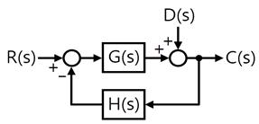
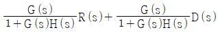
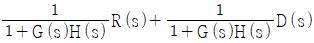
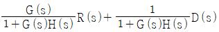
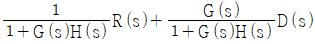
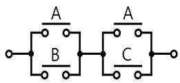

## 23. 문제

23. 그림과 같은 블록선도에서 출력 C(s)는?
    
    ① 
    ② 
    ③ 
    ④ 
<문제 해설>
C=RG+D-CHG, C(1+GH)=RG+D, C=GR/(1+GH) + D/(1+GH)
[해설작성자 : comcbt.com 이용자]

### 정답

1번

### 해설

정답은 1번입니다. 선택지의 핵심개념 을 확인하세요.

### 그림

## 24. 문제

24. 변위를 전압으로 변환시키는 장치가 아닌 것은?
    ① 포텐셔미터
② 차동변압기
    ③ 전위차계
④ 측온저항체
<문제 해설>
측온저항체는 [온도를 전압으로] 변환시키는 장치
[해설작성자 : 대천사.루시퍼]
1.변위를 전압으로:포텐셔미터,차동변압기,전위차계
2.변위를 임피던스로:가변저항기,가변저항스프링,용량형변환기
3.변위를 압력으로:유압분사관
4.압력을 변위로:다이어프램
5.전압을 변위로:전자
6.온도를 임피던스로:측온저항체,정온식감지선형감지기
7.온도를 전압으로:광전다이오드,열전대식감지기,열반도체식감지
기
[해설작성자 : Act now]

### 정답

1번

### 해설

정답은 1번입니다. 선택지의 핵심개념 을 확인하세요.

### 그림

## 25. 문제

25. 단상변압기의 권수비가 a＝8이고, 1차 교류전압의 실효치는 
110V이다. 변압기 2차 전압을 단상 반파 정류회로를 이용하
여 정류했을 때 발생하는 직류 전압의 평균치는 약 몇 V인
가?
    ① 6.19
② 6.29
    ③ 6.39
④ 6.88
<문제 해설>
전압비를 이용하면,
110 V1 / V2 = 8 이므로    V2 = 110 / 8 = 13.75
단상 반파 정류회로는
0.45 * E 이므로
0.45 * 13.75 = 6.1875    
약 6.19 [V]
[해설작성자 : 노바테스트]
추가설명입니다..
정현파의 최대값 : 실효값 : 평균값의 비율은 대략 1 : 0.707 : 
0.636 입니다..
이를 실효값기준으로 환산하면 최대값 : 실효값 : 평균값의 비율
은 1.414 : 1 : 0.9 정도입니다..
출력이 반파정류이므로 실효값 : 평균값은 1 : 0.45 입니다..
[해설작성자 : comcbt.com 이용자]

### 정답

1번

### 해설

정답은 1번입니다. 선택지의 핵심개념 을 확인하세요.

### 그림

## 26. 문제

26. 그림과 같은 유접점 회로의 논리식은?
    
    ① A＋BㆍC
② AㆍB＋C
    ③ B＋AㆍC
④ AㆍB＋BㆍC
<문제 해설>
논리곱 AND
=(A+B)(A+C)
=AA+AC+BA+BC
=A+AC+BA+BC

본 해설집은 최강 자격증 기출문제 전자문제집 CBT 해설달기 프로젝트에 의해서 만들어진 자료입니다. 해설을 제공해 주신 모든 분들께 감사 드립니다.
소방설비기사(전기분야)
◐2020년 06월 06일 필기 기출문제 및 해설집◑
전자문제집 CBT : www.comcbt.com
기출문제 해설은 최강 자격증 기출문제 전자문제집 CBT : www.comcbt.com 통해서 실시간으로 변경됩니다.
=A(1+C)+BA+BC
=A+BA+BC
=A(1+B)+BC
=A+BC
[해설작성자 : 작은악마]
병렬 : 덧셈 / 직렬 : 곱셈
따라서 위 회로는
(A+B)*(A+C)
=AA+AC+AB+BC
=A+AC+AB+BC
=A(1+B+C)+BC
=A+BC
[해설작성자 : 꿈돌이소금빵]
이런 유형의 문제는 상식선에서 경로해석을 하면 됩니다..
왼쪽에서 오른쪽으로 갈수 있는 방법은 단 2가지 경로 뿐입니
다..
A경로이거나(+) 또는 B와C를 연결해서(X) 가는 방법입니다..
따라서 결론은 A+BXC = A+BC
[해설작성자 : comcbt.com 이용자]

### 정답

1번

### 해설

정답은 1번입니다. 선택지의 핵심개념 을 확인하세요.

### 그림

## 27. 문제

27. 평형 3상 부하의 선간전압이 200V, 전류가 10A, 역률이 
70.7%일 때 무효전력은 약 몇 var인가?
    ① 2880
② 2450
    ③ 2000
④ 1410
<문제 해설>
문제에서는 3상전력이기 떄문에
P = √3 V I cosθ 이용해야한다.
유효전력은
P = √3 * 200 * 10 *    0.707 = 2449.11 [W]
피상전력은
P = √3 * V *I = √3 * 200 * 10 = 3461.10 [VA]
COS θ = 유효 / 피상 = [ 2449.11 / 3461.10 ] * 100 = 
70.7 %
무효전력은 P = √3 V I SINθ 이므로 P = √3 * V *I *√(1- cos
θ^2)
        =√3 * 200 * 10 *√(1-0.707^2) = 2449.85 [VAR]
[해설작성자 : 노바테스트]
0.707은 1/루트2 이기 때문에 세타가 45도인 직각이등변삼각형
을 떠올리면 됩니다
유효=무효
[해설작성자 : 하기시러ㅓㅓㅓ]
무효전력)Pr[var] = V * I * sinθ ▶ √3 * 200 * 10 * √( 1 - 
0.707^2 ) = 2449.85958[var]
※sinθ = √( 1 - cosθ^2 )
[해설작성자 : 따고싶다 or 어디든 빌런]

### 정답

1번

### 해설

정답은 1번입니다. 선택지의 핵심개념 을 확인하세요.

## 28. 문제

28. 제어 대상에서 제어량을 측정하고 검출하여 주궤환 신호를 
만드는 것은?
    ① 조작부
② 출력부
    ③ 검출부
④ 제어부
<문제 해설>
검출부: 제어 대상, 환경, 목표 등에서 제어에 필요한 신호를 끄
집어내는 부분, 즉 온도, 압력 등의 제어량을 검출단으로 검출해
서 검출기로 압력, 변위, 전압, 전류 등의 목표값과 비교하기 쉬
운 제어 신호로 변환하는 부분을 말한다.
[해설작성자 : 꿈돌이소금빵]

### 정답

1번

### 해설

정답은 1번입니다. 선택지의 핵심개념 을 확인하세요.

## 29. 문제

29. 복소수로 표시된 전압 10－j[V]를 어떤 회로에 가하는 경우 
5＋j[A]의 전류가 흘렀다면 이 회로의 저항은 약 몇 Ω인가?
    ① 1.88
② 3.6
    ③ 4.5
④ 5.46
<문제 해설>
Z = (V/I) 를 이용한다.
복소수 수식을 써보면 10 - j / 5 + j
분모의 복소수를 없애기 위해 켤레복소수를 분모 분자에 (5-j)를 
곱해준다.
(10-j) * (5-j) / (5+j) * (5-j)    = 50 -10j -5j - 1 / 25 + 5j 
-5j + 1
정리하면
49 - j15 / 26 = 여기서 저항에 해당되는 부분은 실수 부분이
므로 49/26 = 1.88
Z = r+jx = 49/26 -j(15/26) = 1.88 -j0.577
[해설작성자 : 노바테스트]
위 설명에 더하여 답을 빨리 찾는 방법입니다..(당연히 위의 공
식을 알고 있다는 전제로 한 설명입니다..)
복소수에서 허수 부분을 제거하기 위해서 켤레복소수를 분자 분
모에 곱하게 되면,
분모의 실수부는 커지고, 분자의 실수부분은 작아지게 됩니다..
따라서 켤레복소수를 곱하기 전인 실수부보다 반드시 작아지게 
됩니다..
즉, 10/5 = 2 보다 작은 값이 나와야 합니다..
정확한 값을 알아내기 위해서는 위의 켤레복소수를 통해서 계산
을 해야 하지만,
이번 문제에서는 2보다 작은 지문은 1번 밖에 없으므로 1번이 
답입니다..
[해설작성자 : comcbt.com 이용자]

### 정답

1번

### 해설

정답은 1번입니다. 선택지의 핵심개념 을 확인하세요.

## 30. 문제

30. 다음 중 직류전동기의 제동법이 아닌 것은?
    ① 회생제동
② 정상제동
    ③ 발전제동
④ 역전제동
<문제 해설>
* 직류전동기 제동법은 3종류
회생제동

본 해설집은 최강 자격증 기출문제 전자문제집 CBT 해설달기 프로젝트에 의해서 만들어진 자료입니다. 해설을 제공해 주신 모든 분들께 감사 드립니다.
소방설비기사(전기분야)
◐2020년 06월 06일 필기 기출문제 및 해설집◑
전자문제집 CBT : www.comcbt.com
기출문제 해설은 최강 자격증 기출문제 전자문제집 CBT : www.comcbt.com 통해서 실시간으로 변경됩니다.
발전제동
역전제동
[해설작성자 : 오키도키]

### 정답

1번

### 해설

정답은 1번입니다. 선택지의 핵심개념 을 확인하세요.

### 그림

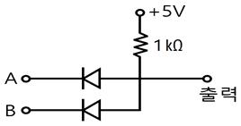

## 31. 문제

31. 자동화재탐지설비의 감지기 회로의 길이가 500m이고, 종단
에 8kΩ의 저항이 연결되어 있는 회로에 24V의 전압이 가해
졌을 경우 도통 시험 시 전류는 약 몇 ㎃인가? (단, 동선의 
저항률은 1.69×10-8Ω·m이며, 동선의 단면적은 2.5mm2이
고, 접촉저항 등은 없다고 본다.)
    ① 2.4
② 3.0
    ③ 4.8
④ 6.0
<문제 해설>
옴의 법칙 I(전류) = V(전압)/R (저항)
저항 R = ρ(고유저항율)x l(길이)/A(단면적)
선로 저항 크기부터 구하면 1.69×10 ^-8Ω·m x 500m / (2.5x 
10 ^-6 m^2) = 3.38 Ω
종단 저항 크기 8kΩ = 8000Ω
총저항 3.38 + 8000 = 8003.38 Ω
전류는 24 V / 8003.38 Ω = 2.998733035 ×10 ^-3 = 약 
3mA
[해설작성자 : comcbt.com 이용자]

### 정답

1번

### 해설

정답은 1번입니다. 선택지의 핵심개념 을 확인하세요.

### 그림

## 32. 문제

32. 다음 회로에서 출력전압은 몇 V인가? (단, A＝5V, B＝0V인 
경우이다.)
    
    ① 0
② 5
    ③ 10
④ 15
<문제 해설>
약간꿀팁??
A와 B라는 입력쪽으로 그림그려져있음 AND회로
반대로 출력쪽으로 다이오드 화살표가 그려져있으면 OR회로
여기서 입력쪽이므로 AND회로이다..그럼 입력에 5와 0이므로 
출력은 0V가 잡힌다.
[해설작성자 : 와우어둠땅하고파]
화살표가 왼쪽으로 향하면 앤드(AND)회로 오른쪽으로 향하면 
오어(OR)회로
왼앤오오 오른쪽=오어(OR) 오가같아서 오오 안헷갈림
[해설작성자 : 외워라요]

### 정답

1번

### 해설

정답은 1번입니다. 선택지의 핵심개념 을 확인하세요.

### 그림

## 33. 문제

33. 평행한 왕복 전선에 10A의 전류가 흐를 때 전선 사이에 작
용하는 전자력[N/m]은? (단, 전선의 간격은 40㎝이다.)
    ① 5×10-5N/m, 서로 반발하는 힘
    ② 5×10-5N/m, 서로 흡인하는 힘
    ③ 7×10-5N/m, 서로 반발하는 힘
    ④ 7×10-5N/m, 서로 흡인하는 힘
<문제 해설>
힘의 크기
F = u0 *I * I / ( 2 * 파이 * r )
     = 4 * 파이 * 10^ -7 * 10[A] * 10[A]    / 2 * 파이 * 
0.4[m]
     = 5 * 10^-5
힘의 방향
2개의 도체의 전류가 같은 방향 : 서로 끌어당기는 힘
2개의 도체의 전류가 다른 방향 : 서로 반발하는 힘
왕복하는 전선이므로 2개의 도체전류는 다른방향이므로 반발하
는 힘.
[해설작성자 : 노바테스트]
진공의 투자율 = 4 * pi * 10^-7
[해설작성자 : 평생공부중]
전자력)F[N/m] = 2 * I^2 * 10^-7 / r ▶ 2 * 10^2 * 10^-7 
/ 0.4 = 5 * 10^-5
※평행왕복도선에서는 서로 밀어내는 반발력이 작용합니다.
[해설작성자 : 따고싶다 or 어디든 빌런]

### 정답

1번

### 해설

정답은 1번입니다. 선택지의 핵심개념 을 확인하세요.

### 그림

## 34. 문제

34. 수정, 전기석 등의 결정에 압력을 가하여 변형을 주면 변형
에 비례하여 전압이 발생하는 현상을 무엇이라 하는가?
    ① 국부작용
② 전기분해
    ③ 압전현상
④ 성극작용
<문제 해설>
(압)력을 가하면 (전)압이 발생하는 압전현상
[해설작성자 : 레인]
국부작용: 축전지에서 외부에 전류를 공급하고 있지 않는 경우
에 전극에 사용하고 있는 아연판의 불순물과 아연이 "국부 전지"
를 만들어 단락 전류를 흘리고 자기방전을 하는 현상
전기분해: 외부에서 "전기 에너지"를 가하여 전기 화학적인 산화 
환원 반응을 통해 물질을 "분해"하는 과정
압전현상: 압전 소자에 외부 응력, 진동 등을 가하면 압전 소자
로부터 전기 신호가 발생하는 현상 >> "수정"발진기에서 사용
성극작용(=분극작용): 볼타의 전지 양극에 부하를 접속하여 전류
를 꺼내면 음극(동판)에서 발생한 수소 가스가 거품으로 되어서 
표면에 붙기 때문에 동판과 용액과의 접촉 면적이 감소하여 전
지의 내부 저항이 증가하게 된다..그리고 수소 가스가 수소 이온 
H+로 되돌아가려고 하여 역기전력을 발생하므로 전지의 기전력
은 저하한다.
[해설작성자 : 꿈돌이소금빵]

### 정답

1번

### 해설

정답은 1번입니다. 선택지의 핵심개념 을 확인하세요.

### 그림

## 35. 문제

35. 그림과 같이 전류계 A1, A2를 접속할 경우 A1은 25A, A2는 
5A를 지시하였다. 전류계 A2의 내부저항은 몇 Ω인가?

본 해설집은 최강 자격증 기출문제 전자문제집 CBT 해설달기 프로젝트에 의해서 만들어진 자료입니다. 해설을 제공해 주신 모든 분들께 감사 드립니다.
소방설비기사(전기분야)
◐2020년 06월 06일 필기 기출문제 및 해설집◑
전자문제집 CBT : www.comcbt.com
기출문제 해설은 최강 자격증 기출문제 전자문제집 CBT : www.comcbt.com 통해서 실시간으로 변경됩니다.
    
    ① 0.05
② 0.08
    ③ 0.12
④ 0.15
<문제 해설>
직렬은 전류가 일정
병렬은 전압이 일정함.
A1에 흐르는 전류는 그림에 흐르는 총전류임을 알 수 있다..(직
렬 결선)
키르히호프의 전류법칙 : 전류의 합 즉 들어온 전류의 양과 나
간 전류의 양의 합은 같다.
A1의 전류가 25A    이고, A2가 5A 이면 0.02옴에 흐르는 전
류는 20A가 된다
병렬의 경우 저항크기에 따라 전류의 크기가 분배된다.
0.02옴에 20A
A2 내부 저항에 5A 흐르면
전류비의 따라 4배 차이가 나게 되고, 0.02의 4배인 0.08옴의 
저항이 걸려 있게되어, A2에 5A가 흐르게 된다.
즉 A2의 내부 저항은 0.08 옴이 된다.
[해설작성자 : 노바테스트]
[추가 해설]
m=A1/A2=(r/R)+1
25/5=(r/0.02)+1, 5=(r/0.02)+1, 5-1=(r/0.02), 4=r/0.02
r=4*0.02=0.08 옴
[해설작성자 : 도리와수리]

### 정답

1번

### 해설

정답은 1번입니다. 선택지의 핵심개념 을 확인하세요.

### 그림

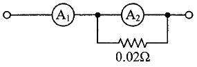
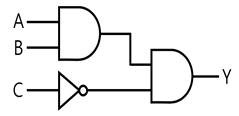
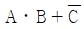
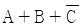
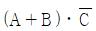
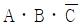

## 36. 문제

36. 반지름 20㎝, 권수 50회인 원형코일에 2A의 전류를 흘려주
었을 때 코일 중심에서 자계(자기장)의 세기[AT/m]는?
    ① 70
② 100
    ③ 125
④ 250
<문제 해설>
H=NI/2a=50x2/2x0.2=250
[해설작성자 : 그게 중요해?]

### 정답

1번

### 해설

정답은 1번입니다. 선택지의 핵심개념 을 확인하세요.

### 그림

## 37. 문제

37. 그림과 같은 무접점회로의 논리식(Y)은?
    
    ① 
② 
    ③ 
④ 
<문제 해설>
위에는 AND회로(X) 밑에는 C- 그리고 마지막은 다시 AND회로
(X)
따라서 AXBXC-
[해설작성자 : 해설을 남겨주세요]

### 정답

1번

### 해설

정답은 1번입니다. 선택지의 핵심개념 을 확인하세요.

### 그림

## 38. 문제

38. 전원 전압을 일정하게 유지하기 위하여 사용하는 다이오드
는?
    ① 쇼트키다이오드
    ② 터널다이오드
    ③ 제너다이오드
    ④ 버랙터다이오드
<문제 해설>
쇼트키다이오드 : N형반도체와 금속을 접합하여 금속부분이 반
도체와 같은 역할을 하도록 만들어진 다이오드
터널다이오드 : 음저항 특성을 마이크로파 발진에 이용
버랙터다이오드 : 커패시턴스를 이용하는 다이오드
제너다이오드 : 정전압 다이오드라고도 하며, 정전압 전원회로에 
사용되고, 전원전압을 일정하게 유지하기 위한 다이오드이다.
[해설작성자 : 안될거뭐있노]

### 정답

1번

### 해설

정답은 1번입니다. 선택지의 핵심개념 을 확인하세요.

### 그림

## 39. 문제

39. 동기발전기의 병렬운전 조건으로 틀린 것은?
    ① 기전력의 크기가 같을 것
    ② 기전력의 위상이 같을 것
    ③ 기전력의 주파수가 같을 것
    ④ 극수가 같을 것
<문제 해설>
동기발전기 병렬 운전 조건

### 정답

1번

### 해설

정답은 1번입니다. 선택지의 핵심개념 을 확인하세요.

### 그림

## 40. 문제

40. 메거(megger)는 어떤 저항을 측정하기 위한 장치인가?
    ① 절연저항
    ② 접지저항
    ③ 전지의 내부저항
    ④ 궤조저항
<문제 해설>
어스 - 접지저항
메거 - 절연저항
어스earth는 땅이니까 접지
[해설작성자 : 래인]

### 정답

1번

### 해설

정답은 1번입니다. 선택지의 핵심개념 을 확인하세요.

### 그림

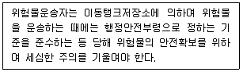
