# 소방설비기사(전기분야)20200822(해설집) - 소방전기회로

> 원본: `소방설비기사(전기분야)20200822(해설집).pdf`
> 개인학습용 변환본.

## 21. 문제

21. 최대눈금이 200mA, 내부저항이 0.8Ω인 전류계가 있다. 8m
Ω의 분류기를 사용하여 전류계의 측정범위를 넓히면 몇 A
까지 측정할 수 있는가?
    ① 19.6
② 20.2
    ③ 21.4
④ 22.8
<문제 해설>
0.8옴 = 800 밀리옴
8밀리옴을 병렬로 연결한다.
이 때 전류계에 200mA이 흐르면 8밀리옴에는 20암페어가 흐른
다.(전류 분배법칙, 저항에 반비례)
따라서 분류계를 사용했을 때 200mA 눈금을 가리키고 있다면 
총 20.2암페어가 흐름을 알 수 있다.
[해설작성자 : comcbt.com 이용자]
                8*10^-3
200*10^-3 = ㅡㅡㅡㅡㅡㅡ * X                 X = 20.2
             0.8 + 8*10^-3
내부저항 0.8옴 전류계에 분류기 8m옴을 병렬로 연결, 전류계 
내부저항에 흐르는 전류 최대눈금 200mA로 대입하여 전류분배
법칙으로 전체전류(최대측정가능전류)를 구할 수 있다.
[해설작성자 : 너무 어렵다]
배율기
2과목 : 소방전기회로

본 해설집은 최강 자격증 기출문제 전자문제집 CBT 해설달기 프로젝트에 의해서 만들어진 자료입니다. 해설을 제공해 주신 모든 분들께 감사 드립니다.
소방설비기사(전기분야)
◐2020년 08월 22일 필기 기출문제 및 해설집◑
전자문제집 CBT : www.comcbt.com
기출문제 해설은 최강 자격증 기출문제 전자문제집 CBT : www.comcbt.com 통해서 실시간으로 변경됩니다.
내부저항: Rv
직렬저항: Rs
Rs = (n-1)Rv
ㅡㅡㅡㅡㅡㅡㅡㅡㅡㅡ
분류기
내부저항: Ra
병렬저항: Rp
Rp = Ra/(n-1)
ㅡㅡㅡㅡㅡㅡㅡㅡㅡㅡㅡㅡ
풀이
위의 분류기 저항 공식에 대입하면
n = 101
따라서 넓어진 측정범위는 101 * 200(mA) = 20.2A
[해설작성자 : 소방7일전사]

### 정답

1번

### 해설

정답은 1번입니다. 선택지의 핵심개념 을 확인하세요.

### 그림

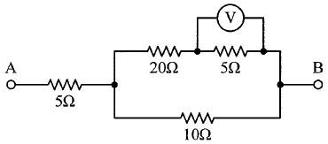
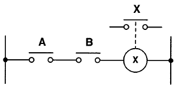

## 22. 문제

22. 5Ω의 저항과 2Ω의 유도성 리액턴스를 직렬로 접속한 회로
에 5A의 전류를 흘렀을 때 이 회로의 복소전력(VA)은?
    ① 25+j10
② 10+j25
    ③ 125+j50
④ 50+j125
<문제 해설>
Z=5+2j
I*=5
V=I*Z=25+j10
S=VI*=125+j50
[해설작성자 : comcbt.com 이용자]
V[V] = I * Z ▶ 5 * ( 5 + j2 ) = 25 + j10[V]
피상전력)Pa[VA] = V * I ▶ ( 25 + j10 ) * 5 = 125 + 
j50[VA]
[해설작성자 : 따고싶다 or 어디든 빌런]

### 정답

1번

### 해설

정답은 1번입니다. 선택지의 핵심개념 을 확인하세요.

### 그림

## 23. 문제

23. 그림과 같은 회로에서 전압계 Ⓥ가 10V일 때 단자 A-B 간
의 전압은 몇 V 인가?
    
    ① 50
② 85
    ③ 100
④ 135
<문제 해설>
+는 직렬연결, ||는 병렬연결
5옴에 걸리는 전압 : 10볼트
20+5 옴에 걸리는 전압 : 10x(20+5)/5=50볼트
25옴||10옴 = (1/25+1/10)^-1 = 50/7옴
50/7옴에 걸리는 전압 = 50볼트
5+50/7 옴에 걸리는 전압 : 50x(5+50/7)/(50/7)=85볼트
어렵게 써 놨지만 직렬과 병렬을 차근차근 등가저항으로 바꿔가
면서 풀면 쉬운 문제이다.
[해설작성자 : comcbt.com 이용자]
5오옴에 흐르는 전류 10/5= 2A
20오옴에 걸리는 전압 2X20=40V
10오옴에 걸리는 전압 40+10=50V
전체전류 = 2+5=7A
5오옴에 걸리는 전압 5*7=35V
전체전압 35+50=85V
[해설작성자 : comcbt.com 이용자]

### 정답

1번

### 해설

정답은 1번입니다. 선택지의 핵심개념 을 확인하세요.

### 그림

## 24. 문제

24. 50Hz의 3상 전압을 전파 정류하였을 때 리플(맥동) 주파수
(Hz)는?
    ① 50
② 100
    ③ 150
④ 300
<문제 해설>
단상 - X1
3상 - X3
반파 - X1
전파 - X2
3상 전파이므로 50HzX3X2=300Hz
[해설작성자 : comcbt.com 이용자]
단상반파 1f     단상전파 2f
3상반파    3f     3상전파 6f
[해설작성자 : 킁킁2]

### 정답

1번

### 해설

정답은 1번입니다. 선택지의 핵심개념 을 확인하세요.

### 그림

## 25. 문제

25. 개루프 제어와 비교하여 폐루프 제어에서 반드시 필요한 장
치는?
    ① 안정도를 좋게 하는 장치
    ② 제어대상을 조작하는 장치
    ③ 동작신호를 조절하는 장치
    ④ 기준입력신호와 주궤환신호를 비교하는 장치
<문제 해설>
피드백제어(폐루프제어)
1)출력신호를 입력신호로 되돌려서 입력과 출력을 비교함으로써 
정확한 제어가 간으하도록 한 제어
2)기준입력신호와 주궤환신호를 비교하는 장치
[해설작성자 : 낭만그자체]

### 정답

1번

### 해설

정답은 1번입니다. 선택지의 핵심개념 을 확인하세요.

### 그림

## 26. 문제

26. 그름의 시퀀스 회로와 등가인 논리 게이트는?
    

본 해설집은 최강 자격증 기출문제 전자문제집 CBT 해설달기 프로젝트에 의해서 만들어진 자료입니다. 해설을 제공해 주신 모든 분들께 감사 드립니다.
소방설비기사(전기분야)
◐2020년 08월 22일 필기 기출문제 및 해설집◑
전자문제집 CBT : www.comcbt.com
기출문제 해설은 최강 자격증 기출문제 전자문제집 CBT : www.comcbt.com 통해서 실시간으로 변경됩니다.
    ① OR게이트
② AND게이트
    ③ NOT게이트
④ NOR게이트
<문제 해설>
전형적인 AND 회로. A와 B가 모두 닫혀야 X가 닫힌다는 뜻이
므로 AND게이트임을 쉽게 알 수 있다.

### 정답

1번

### 해설

정답은 1번입니다. 선택지의 핵심개념 을 확인하세요.

### 그림

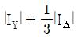
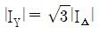
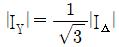
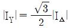

## 27. 문제

27. 전압이득이 60dB인 증폭기와 궤환율(β)이 0.01인 궤환회로
를 부궤환 증폭기로 구성하였을 때 전체 이득은 약 몇 dB인
가?
    ① 20
② 40
    ③ 60
④ 80
<문제 해설>
Af=A/(1+AB)
전체이득 = 개방루프이득/(1+개방루프이득*궤환율)
따라서 60/(1+0.6)=37.5dB
보기에서 가장 가까운 값을 찾으면 약 40dB
[해설작성자 : comcbt.com 이용자]
궤한 회로에서
출력전압/입력전압
= A/(1+AB)(A=순방향 증폭도 B= 궤환율)
= 약 1/B 입니다(거의 B에의해 증폭도가 결정됩니다)
= 1/0.01
=100
= 10^2
db로 환산하면 20log 10^2 = 40 (db)
라고 생각합니다
도움되셧기 바랍니다
[해설작성자 : 정돈기]
60 = 20logA
3 = logA -> A = 10^3
증폭기이득 Af = A/1+Af -> 1000/1+(0.01*1000) = 1000/11 = 
90.91
20log90.91 = 39.17 = 40dB
[해설작성자 : 예헤]

### 정답

1번

### 해설

정답은 1번입니다. 선택지의 핵심개념 을 확인하세요.

### 그림

## 28. 문제

28. 지하 1층, 지상 2층, 연면적이 1500m2인 기숙사에서 지상 
2층에 설치된 차동식스포트형감지기가 작동하였을 때 전 층
의 지구경종이 동작되었다. 각 층 지구경종의 정격전류가 
60mA 이고, 24V가 인가되고 있을 때 모든 지구경종에서 소
비되는 총 전력(W)는?
    ① 4.23
② 4.32
    ③ 5.67
④ 5.76
<문제 해설>
연면적은 함정.
지하 1층과 지상 2층이므로 총 3개의 층이 존재.
각 층당 60mA, 24V이므로 각 층에서 소비되는 전력 
P=VI=1.44W
3개의 층이므로 곱하기 3을 해주면 4.32W

### 정답

1번

### 해설

정답은 1번입니다. 선택지의 핵심개념 을 확인하세요.

### 그림

## 29. 문제

29. 진공 중에 놓인 5μC의 점전하에서 2m되는 점에서의 전계
는 몇 V/m 인가?
    ① 11.25 × 103
② 16.25 × 103
    ③ 22.25 × 103
④ 28.25 × 103
<문제 해설>
E=9x10^9 x (전하[C])/(거리^2[m])
그대로 숫자 대입하면 11250[V/m]
쿨롱의 법칙에서 Q2가 1로 바뀐 것 뿐이다.

### 정답

1번

### 해설

정답은 1번입니다. 선택지의 핵심개념 을 확인하세요.

### 그림

## 30. 문제

30. 열팽창식 온도계가 아닌 것은?
    ① 열전대 온도계
    ② 유리 온도계
    ③ 바이메탈 온도계
    ④ 압력식 온도계
<문제 해설>
열전 온도계 - 열전대 온도계
유리 온도계, 압력식 온도계 , 바이메탈 온도계 - 열팽창식 온
도계
[해설작성자 : 솔잎공주]

### 정답

1번

### 해설

정답은 1번입니다. 선택지의 핵심개념 을 확인하세요.

### 그림

## 31. 문제

31. 3상 유도전동기를 Y결선으로 기동할 때 전류의 크기(|IY|)와 
△결선으로 기동할 때 전류의 크기(|I△|)의 관계로 옳은 것
은?
    ① 
② 
    ③ 
④ 
<문제 해설>
Y-델타 기동의 이유
기동시 전류를 1/3으로 할 수 있다.
[해설작성자 : 빈짱이의 3기사 도전]

### 정답

1번

### 해설

정답은 1번입니다. 선택지의 핵심개념 을 확인하세요.

### 그림

## 32. 문제

32. 역률 0.8인 전동기에 200V의 교류전압을 가하였더니 10A의 
전류가 흘렀다. 피상전력은 몇 VA인가?
    ① 1000
② 1200
    ③ 1600
④ 2000
<문제 해설>
S=VI. 역률은 피상전력과는 관계없다.
[해설작성자 : comcbt.com 이용자]
P=VI 즉 200x10=2,000

본 해설집은 최강 자격증 기출문제 전자문제집 CBT 해설달기 프로젝트에 의해서 만들어진 자료입니다. 해설을 제공해 주신 모든 분들께 감사 드립니다.
소방설비기사(전기분야)
◐2020년 08월 22일 필기 기출문제 및 해설집◑
전자문제집 CBT : www.comcbt.com
기출문제 해설은 최강 자격증 기출문제 전자문제집 CBT : www.comcbt.com 통해서 실시간으로 변경됩니다.
[해설작성자 : 동훈]

### 정답

1번

### 해설

정답은 1번입니다. 선택지의 핵심개념 을 확인하세요.

### 그림

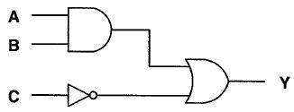
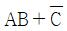
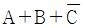
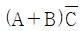
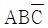
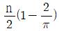
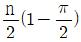

## 33. 문제

33. 다음 중 강자성체에 속하지 않는 것은?
    ① 니켈
② 알루미늄
    ③ 코발트
④ 철
<문제 해설>
강자성체 : 철, 니켈, 코발트 등
알루미늄은 상자성체로 분류된다.

### 정답

1번

### 해설

정답은 1번입니다. 선택지의 핵심개념 을 확인하세요.

### 그림

## 34. 문제

34. 프로세스제어의 제어량이 아닌 것은?
    ① 액위
② 유량
    ③ 온도
④ 자세
<문제 해설>
프로세스 제어
온도, 압력, 유량, 액면
[해설작성자 : comcbt.com 이용자]

### 정답

1번

### 해설

정답은 1번입니다. 선택지의 핵심개념 을 확인하세요.

### 그림

## 35. 문제

35. 3상 농형 유도전동기의 기동법이 아닌 것은?
    ① Y-△ 기동법
    ② 기동 보상기법
    ③ 2차 저항 기동법
    ④ 리액터 기동법
<문제 해설>
3상 농형 유도전동기의 기동법

### 정답

1번

### 해설

정답은 1번입니다. 선택지의 핵심개념 을 확인하세요.

### 그림

## 36. 문제

36. 100V, 500W의 전열선 2개를 같은 전압에서 직렬로 접속한 
경우와 병렬로 접속한 경우에 각 전열선에서 소비되는 전력
은 각각 몇 W 인가?
    ① 직렬 : 250, 병렬 : 500
    ② 직렬 : 250, 병렬 : 1000
    ③ 직렬 : 500, 병렬 : 500
    ④ 직렬 : 500, 병렬 : 1000
<문제 해설>
P=VI이므로 전열선에 흐르는 전류 5A
V=IR이므로 전열선의 저항 20옴
20옴 저항 직렬연결 = 40옴
40옴에 100V 걸어주면 걸리는 전류 2.5A
P=VI=250
20옴 저항 병렬연결 = 10옴
10옴에 100V 걸어주면 걸리는 전류 10A
P=VI=1000
[해설작성자 : comcbt.com 이용자]
[더 간단하게 해결하는법]
P=V^2/R
직렬연결하면 저항 2배 - P 절반 250
병렬연결하면 저항 절반 - P 2배 1000
[해설작성자 : comcbt.com 이용자]

### 정답

1번

### 해설

정답은 1번입니다. 선택지의 핵심개념 을 확인하세요.

### 그림

## 37. 문제

37. 그림과 같은 논리회로의 출력 Y는?
    
    ① 
② 
    ③ 
④ 
<문제 해설>
둥글고 평평한 녀석이 AND, 뾰족하고 오목한 녀석이 OR
앞에 동그란 밥풀이 묻어 있으면 NOT
(A AND B) OR (NOT C)
이 때
A AND B = AB
A OR B = A+B
NOT A = ~A(A bar)
따라서 위와 같이 식을 간단하게 나타내면 1번임을 알 수 있다.

### 정답

1번

### 해설

정답은 1번입니다. 선택지의 핵심개념 을 확인하세요.

### 그림

## 38. 문제

38. 단상변압기 3대를 △결선하여 부하에 전력을 공급하고 있는 
중 변압기 1대가 고장 나서 V결선으로 바꾼 경우에 고장 전
과 비교하여 몇 % 출력을 낼 수 있는가?
    ① 50
② 57.7
    ③ 70.7
④ 86.6
<문제 해설>
3상 결선시 P = 3VpIp
V결선시 P = sqrt(3)VpIp
따라서 출력이 1/sqrt(3)밖에 나오지 않음. 1/1.732=57.7%
[해설작성자 : comcbt.com 이용자]
출력= 57.7%
이용률 = 86.6%
[해설작성자 : 빈짱이의 3기사 도전]

### 정답

1번

### 해설

정답은 1번입니다. 선택지의 핵심개념 을 확인하세요.

### 그림

## 39. 문제

39. 대칭 n상의 환상결선에서 선전류와 상전류(환상전류) 사이
의 위상차는?
    ① 
② 

본 해설집은 최강 자격증 기출문제 전자문제집 CBT 해설달기 프로젝트에 의해서 만들어진 자료입니다. 해설을 제공해 주신 모든 분들께 감사 드립니다.
소방설비기사(전기분야)
◐2020년 08월 22일 필기 기출문제 및 해설집◑
전자문제집 CBT : www.comcbt.com
기출문제 해설은 최강 자격증 기출문제 전자문제집 CBT : www.comcbt.com 통해서 실시간으로 변경됩니다.
    ③ 
④ 
<문제 해설>
선전류는 상전류보다 pi/2(1-2/n)만큼 위상이 뒤진다.
Θ = pi/2 - pi/n = pi/2(1-2/n)
[해설작성자 : 체리콕A드]
이런 종류의 문제는 계산식을 모르고 있어도 접근이 가능합니
다..
위상의 차는 pi에 대해서 어느정도의 비율로 차이가 발생하는지
를 보는 것입니다..
따라서 자연수인 n 값의 변화에 따라서 그 값이 pi의 배수 형태
가 아닌 1번과 2번은 답에서 제외해야 합니다..
나머지 3번과 4번 중에서 환상결선에서 n이 무한대로 증가하게 
되면 하나의 값으로 수렴하는 3번이 되어야 합니다..
[해설작성자 : comcbt.com 이용자]

### 정답

1번

### 해설

정답은 1번입니다. 선택지의 핵심개념 을 확인하세요.

### 그림

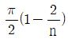
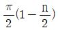

## 40. 문제

40. 공기중에서 50kW 방사 전력이 안테나에서 사방으로 균일하
게 방사될 때, 안테나에서 1km 거리에 있는 점에서의 전계
의 실효값은 약 몇 V/m 인가?
    ① 0.87
② 1.22
    ③ 1.73
④ 3.98
<문제 해설>
EH=W/S, E/H=377(공기중)
따라서 E^2=W/S*377=50,000W/(4*pi*(1000^2))*377=1.5
그러므로 E=sqrt(1.5)=1.22
[해설작성자 : comcbt.com 이용자]
전계의 실효값 공식
루트((전력/표면적)*120파이)
+구의 표면적=4*파이*(반지름^2)
[해설작성자 : 유다영]
E=루트(W/4파이알^2)×377
[해설작성자 : comcbt.com 이용자]

### 정답

1번

### 해설

정답은 1번입니다. 선택지의 핵심개념 을 확인하세요.

### 그림

