# 소방설비기사(전기분야)20200926(해설집) - 소방전기회로

> 원본: `소방설비기사(전기분야)20200926(해설집).pdf`
> 개인학습용 변환본.

## 21. 문제

21. 다음 중 쌍방향성 전력용 반도체 소자인 것은?
    ① SCR
② IGBT
    ③ TRIAC
④ DIODE
<문제 해설>
트라이악의 구조를 보시면
다이오드 두개가 서로 마주보고 있습니다.
[해설작성자 : comcbt.com 이용자]

### 정답

1번

### 해설

정답은 1번입니다. 선택지의 핵심개념 을 확인하세요.

### 그림

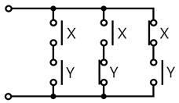
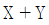
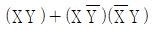
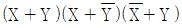
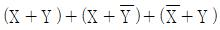

## 22. 문제

22. 그림의 시퀀스(계전기 접점) 회로를 논리식으로 표현하면?
    
    ① 
    ② 
    ③ 
    ④ 
<문제 해설>
XY+XY'+X'Y=XY+XY'+X'Y+XY=X(Y+Y')+(X'+X)Y=X+Y
[해설작성자 : 펭귄]
XY+XY'+X'Y=X(Y+Y')+X'Y=X+X'Y=X(1+Y)=X+XY+X'Y=X+Y(X+X'
)=X+Y
[해설작성자 : DD]

### 정답

1번

### 해설

정답은 1번입니다. 선택지의 핵심개념 을 확인하세요.

### 그림

## 23. 문제

23. 그림의 블록선도와 같이 표현되는 제어 시스템의 전달함수 
G(s)는?
2과목 : 소방전기회로

본 해설집은 최강 자격증 기출문제 전자문제집 CBT 해설달기 프로젝트에 의해서 만들어진 자료입니다. 해설을 제공해 주신 모든 분들께 감사 드립니다.
소방설비기사(전기분야)
◐2020년 09월 26일 필기 기출문제 및 해설집◑
전자문제집 CBT : www.comcbt.com
기출문제 해설은 최강 자격증 기출문제 전자문제집 CBT : www.comcbt.com 통해서 실시간으로 변경됩니다.
    
    ① 
    ② 
    ③ 
    ④ 
<문제 해설>
G3(s)의 화살표를 G1과 G2 사이가 아닌 R(s)와 G1(s) 사이로 
옮겨준다..그럼 G3(s) 는 G3/G1 이 된다
정방향 ->    G1G2
피드백루프1 ->    G1G2G3/G1
피드백루프2 ->    G1G2G4
전체식
(G1G2) / 1-(-G1G2G3/G1 - G1G2G4)
= G1G2 / 1 + G2G3 + G1G2G4
[해설작성자 : 비전공전알못]

### 정답

1번

### 해설

정답은 1번입니다. 선택지의 핵심개념 을 확인하세요.

### 그림

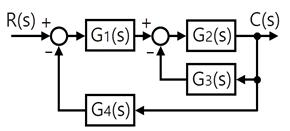
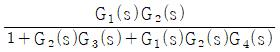
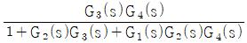
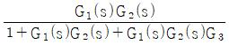
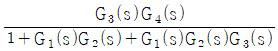
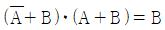

## 24. 문제

24. 조작기기는 직접 제어대상에 작용하는 장치이고 빠른 응답
이 요구된다. 다음 중 전기식 조작기기가 아닌 것은?
    ① 서보 전동기
② 전동 밸브
    ③ 다이어프램 밸브
④ 전자 밸브
<문제 해설>
다이어프램 밸브는 공기압
[해설작성자 : 다빵]
다이어프램 밸브는 기계식 조작기기에 해당한다.
서보 전동기, 전동밸브, 전자밸브는 모두 전기식 조작기기
[해설작성자 : 리재횬]

### 정답

1번

### 해설

정답은 1번입니다. 선택지의 핵심개념 을 확인하세요.

### 그림

## 25. 문제

25. 전기자 제어 직류 서보 전동기에 대한 설명으로 옳은 것은?
    ① 교류 서보 전동기에 비하여 구조가 간단하여 소형이고 
출력이 비교적 낮다.
    ② 제어 권선과 콘덴서가 부착된 여자 권선으로 구성된다.
    ③ 전기적 신호를 계자 권선의 입력 전압으로 한다.
    ④ 계자 권선의 전류가 일정하다.
<문제 해설>
서보전동기의 특징

### 정답

1번

### 해설

정답은 1번입니다. 선택지의 핵심개념 을 확인하세요.

### 그림

## 26. 문제

26. 절연저항을 측정할 때 사용하는 계기는?
    ① 전류계
    ② 전위차계
    ③ 메거
    ④ 휘트스톤브리지
<문제 해설>
절연저항을 측정하는 기구
직접 판독식의 전기저항 측정기를 말한다..영국의 에버쉿 회사가 
메거라는 명칭으로 옛부터 세계적으로 매출(賣出)했기 때문에, 
이 명칭은 유명하다..전기저항의 값이며, 메가옴이란 106Ω, 즉, 
100만Ω이지만, 메거는 그 이름이 암시하는 바와 같이 높은 저
항치를 측정한다..예를 들면, 모터를 스타트하기 전에 절연상태
가 양호한지 등을 확인하기 위한 것이며, 전기의 절연저항을 측
정하는 것이 주목적이다..이것과 혼동하기 쉬운 것으로 「접지저
항계」가 있지만, 이것은 기기를 인위적으로 접지(接地)했을 경
우, 소정의 낮은 저항치 인지를 측정하는 것을 말한다.
[네이버 지식백과] 메거 [Megger] (산업안전대사전, 2004. 5. 
10., 최상복)
[해설작성자 : 망몬]

### 정답

1번

### 해설

정답은 1번입니다. 선택지의 핵심개념 을 확인하세요.

### 그림

## 27. 문제

27. R＝10Ω, ωL＝20Ω인 직렬회로에 220∠0° V의 교류 전압을 
가하는 경우 이 회로에 흐르는 전류는 약 몇 A인가?
    ① 24.5∠-26.5°
② 9.8∠-63.4°
    ③ 12.2∠-13.2°
④ 73.6∠-79.6°
<문제 해설>
220 / ( 10 + j20 )
[해설작성자 : comcbt.com 이용자]
해설 다 안 쓰셔서 이어서 써요
첫줄은 I=V/Z 이니까 결과는 4.4-j8.8 {R=4.4 , XL=-8.8}
I=√(4.4^2+8.8^2)=9.8[A]
tan^-1 XL/R = -63.4°
[해설작성자 : Ian]
맨위 해설에서 CMPLX 상태 계산기로 결과값에 SHIFT 3 누르면 
바로나옵니다..
[해설작성자 : 라면이다]

### 정답

1번

### 해설

정답은 1번입니다. 선택지의 핵심개념 을 확인하세요.

### 그림

## 28. 문제

28. 다음의 논리식 중 틀린 것은?
    ① 

본 해설집은 최강 자격증 기출문제 전자문제집 CBT 해설달기 프로젝트에 의해서 만들어진 자료입니다. 해설을 제공해 주신 모든 분들께 감사 드립니다.
소방설비기사(전기분야)
◐2020년 09월 26일 필기 기출문제 및 해설집◑
전자문제집 CBT : www.comcbt.com
기출문제 해설은 최강 자격증 기출문제 전자문제집 CBT : www.comcbt.com 통해서 실시간으로 변경됩니다.
    ② 
    ③ 
    ④ 
<문제 해설>

### 정답

1번

### 해설

정답은 1번입니다. 선택지의 핵심개념 을 확인하세요.

### 그림

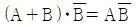
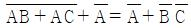
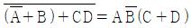
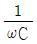

## 29. 문제

29. R ＝ 4Ω, 
 ＝ 9Ω인 RC 직렬회로에 전압 e(t)를 인가
할 때, 제3고조파 전류의 실효값 크기는 몇 A 인가? (단, 
e(t)＝50＋10√2sinωt＋120√2sin3ωt(V))
    ① 4.4
② 12.2
    ③ 24
④ 34
<문제 해설>
ㅇ저항먼저 구하고 1/3wC = 3옴
    Z= 루트(R제곱+X)
    I=V/Z= 120/루트(4의제곱+3의제곱) = 24
    (특수문자 지원안돼 식 표현이 어려워 말로썼으니 직접 구
해보세요 )
[해설작성자 : 단번에 패스하자 박길로리]
3고조파로 1/wC=3Ω이고 Z=5Ω가 된다.
3고조파의 최대값이 120√2 여서 실효값은 120V가 된다.
여기서 전류의 값을 물어봄으로 I=24이다
[해설작성자 : ㅇㅇ]

### 정답

1번

### 해설

정답은 1번입니다. 선택지의 핵심개념 을 확인하세요.

### 그림

## 30. 문제

30. 분류기를 사용하여 전류를 측정하는 경우에 전류계의 내부
저항이 0.28Ω이고 분류기의 저항이 0.07Ω이라면, 이 분류
기의 배율은?
    ① 4
② 5
    ③ 6
④ 7
<문제 해설>
Rs=1/n-1*Ra
n=Ra/Rs+1
[해설작성자 : 망몬]
분류기배율=(내부저항/분류기저항)+1=(0.28/0.07)+1=5
분류기저항=내부저항/(분류기배율-1)
[해설작성자 : 난나야]

### 정답

1번

### 해설

정답은 1번입니다. 선택지의 핵심개념 을 확인하세요.

### 그림

## 31. 문제

31. 옴의 법칙에 대한 설명으로 옳은 것은?
    ① 전압은 저항에 반비례한다.
    ② 전압은 전류에 비례한다.
    ③ 전압은 전류에 반비례한다.
    ④ 전압은 전류의 제곱에 비례한다.
<문제 해설>
V = I X R 이므로
전압에 I, R 는 모두 비례한다.
[해설작성자 : 육각형]

### 정답

1번

### 해설

정답은 1번입니다. 선택지의 핵심개념 을 확인하세요.

### 그림

## 32. 문제

32. 3상 직권 정류자 전동기에서 고정자 권선과 회전자 권선 사
이에 중간 변압기를 사용하는 주된 이유가 아닌 것은?
    ① 경부하 시 속도의 이상 상승 방지
    ② 철심을 포화시켜 회전자 상수를 감소
    ③ 중간 변압기의 권수비를 바꾸어서 전동기 특성을 조정
    ④ 전원전압의 크기에 관계없이 정류에 알맞은 회전자전압 
선택
<문제 해설>
ㅇ중간변압기를 사용하는 목적(3가지)
    - 정류자 전압조정
    - 권수비 조정하여 전동기 특성 조정
    - 정부하시 직권특성에 따른 속도상승 억제
[해설작성자 : 단번에 패스하자 박길로리]

### 정답

1번

### 해설

정답은 1번입니다. 선택지의 핵심개념 을 확인하세요.

### 그림

## 33. 문제

33. 공기 중에 10μC과 20μC인 두 개의 점전하를 1m 간격으로 
놓았을 때 발생되는 정전기력은 몇 N인가?
    ① 1.2
② 1.8
    ③ 2.4
④ 3.0
<문제 해설>
정전기력=9*10의9승*((q1*q2)/r의2승)=9*10의9승*((10*10의-6
승*20*10의-6승)/1의2승)=1.8
[해설작성자 : 난나야]

### 정답

1번

### 해설

정답은 1번입니다. 선택지의 핵심개념 을 확인하세요.

### 그림

## 34. 문제

34. 교류 회로에 연결되어 있는 부하의 역률을 측정하는 경우 
필요한 계측기의 구성은?
    ① 전압계, 전력계, 회전계
    ② 상순계, 전력계, 전류계
    ③ 전압계, 전류계, 전력계
    ④ 전류계, 전압계, 주파수계
<문제 해설>
P=VIcos쎄타
여기서 역률은 COS쎄타 이므로
cos쎄타=P/(V*I)
필요한것은
P를 알수있는 전력량계
V를 알수있는    전압계
I를 알수있는    전류계
[해설작성자 : 가이버정]

### 정답

1번

### 해설

정답은 1번입니다. 선택지의 핵심개념 을 확인하세요.

### 그림

## 35. 문제

35. 평형 3상 회로에서 측정된 선간전압과 전류의 실효값이 각
각 28.87V, 10A이고, 역률이 0.8일 때 3상 무효전력의 크기
는 약 몇 var인가?
    ① 400
② 300
    ③ 231
④ 173
<문제 해설>

본 해설집은 최강 자격증 기출문제 전자문제집 CBT 해설달기 프로젝트에 의해서 만들어진 자료입니다. 해설을 제공해 주신 모든 분들께 감사 드립니다.
소방설비기사(전기분야)
◐2020년 09월 26일 필기 기출문제 및 해설집◑
전자문제집 CBT : www.comcbt.com
기출문제 해설은 최강 자격증 기출문제 전자문제집 CBT : www.comcbt.com 통해서 실시간으로 변경됩니다.
평형 3상 회로를 해석하게되면 상전압과 상전류를 가지고 논하
게 됨.
그러므로 문제 안에 Y결선과 델타결선의 여부가 명시되어야함.
(상/선간,전압/전류의 구별을 위함)
그리고 평형3상회로 무효전력은 3VIsin세타 임.
그리하여 먼저 선간전압을 상전압으로 변환시켜주면 28.87V÷루
트3=16.67V 가 되며,
역률(cos세타)이 0.8이면 sin세타는 0.6이 되고, 전류 rms값이 
10A 를 공식에 대입.
답은 300 var.(단, 문제 내 Y결선 이라는 전제가 있어야 성립됨)
[해설작성자 : 전기 고급]

### 정답

1번

### 해설

정답은 1번입니다. 선택지의 핵심개념 을 확인하세요.

### 그림

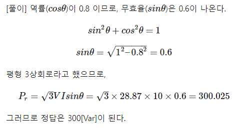
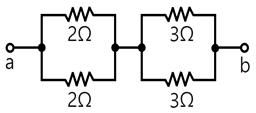
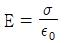
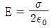
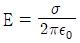
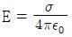

## 36. 문제

36. 회로에서 a, b 사이의 합성저항은 몇 Ω인가?
    
    ① 2.5
② 5
    ③ 7.5
④ 10
<문제 해설>
합성저항=병렬이므로 각각 구한후 더한다 즉 (2*2)/(2+2)=1 , 
(3*3)/(3+3)=1.5    그러므로1+1.5=2.5
[해설작성자 : 난나야]
이경우는 같은용량 2개 병렬이므로
2/2=1 , 3/2 =1.5        
1 과 1.5 직렬연결 이므로 1+1.5=2.5 오옴
으로 계산 가능합니다.
[해설작성자 : 가이버정]

### 정답

1번

### 해설

정답은 1번입니다. 선택지의 핵심개념 을 확인하세요.

### 그림

## 37. 문제

37. 60Hz의 3상 전압을 전파 정류하였을 때 맥동주파수(Hz)는?
    ① 120
② 180
    ③ 360
④ 720
<문제 해설>
단상 반파 f
단상 전파 2f
3상 반파 3f
3상 전파 6f
[해설작성자 : 피즈나라 다르킨공쥬]

### 정답

1번

### 해설

정답은 1번입니다. 선택지의 핵심개념 을 확인하세요.

### 그림

## 38. 문제

38. 두 개의 입력신호 중 한 개의 입력만이 1일 때 출력신호가 
1이 되는 논리게이트는?
    ① EXCLUSIVE NOR
② NAND
    ③ EXCLUSIVE OR
④ AND
<문제 해설>

### 정답

1번

### 해설

정답은 1번입니다. 선택지의 핵심개념 을 확인하세요.

### 그림

## 39. 문제

39. 진공 중 대전된 도체의 표면에 면전하밀도 σ(C/m2)가 균일
하게 분포되어 있을 때, 이 도체 표면에서의 전계의 세기 
E(V/m)는? (단, ε0는 진공의 유전율이다.)
    ① 
② 
    ③ 
④ 
<문제 해설>
해당문제는 전속밀도
즉, 면전하밀도를 구하는 문제입니다.
그러므로 구도체, 평면(평판) 도체와 관련이 없습니다.
면전하 밀도 (σ) = 전속밀도 (D)
D = εE
전속밀도(D) = 유전율(ε) x 전계의 세기(E)
해당문제는 전계의 세기 E를 구하라 하였으니
전계의 세기(E) = 전속밀도(D) / 유전율(ε)
전계의 세기(E) = 전속밀도(D) / [진공에서의 유전율(ε0) X 비
유전율(εr)]
진공중 비 유전율(εr) = 1 이 되므로
대전된 도체 표면의 전계의 세기(전장의 세기) E는
E = D / ε0    가 됩니다.
여기서 전속밀도(D)를 면전하 밀도 (σ) 로 바꾸면
전계의 세기(E) = 면전하 밀도 (σ) / 진공에서의 유전율(ε0)
1번이 답이 되겠습니다.
[해설작성자 : 오류신고 반론 이게 정답입니다.]

### 정답

1번

### 해설

정답은 1번입니다. 선택지의 핵심개념 을 확인하세요.

### 그림

## 40. 문제

40. 3상 유도 전동기의 출력이 25HP, 전압이 220V, 효율이 
85%, 역률이 85%일 때, 이 전동기로 흐르는 전류는 약 몇 
A 인가? (단, 1HP＝0.746kW)
    ① 40
② 45
    ③ 68
④ 70
<문제 해설>
전동기 출력 = 루트3*전압*전류*효율*역률    공식에서 전류를 
구한다
단 25마력이므로 *746으로 한다
[해설작성자 : 난나야]

본 해설집은 최강 자격증 기출문제 전자문제집 CBT 해설달기 프로젝트에 의해서 만들어진 자료입니다. 해설을 제공해 주신 모든 분들께 감사 드립니다.
소방설비기사(전기분야)
◐2020년 09월 26일 필기 기출문제 및 해설집◑
전자문제집 CBT : www.comcbt.com
기출문제 해설은 최강 자격증 기출문제 전자문제집 CBT : www.comcbt.com 통해서 실시간으로 변경됩니다.
마력25HP*0.746*10^+3(kW여서 풀어줌) / 3상이라 루트3*220
(전압)*0.85(효율)*0.85(역률)=67.7=68(반올림)
[해설작성자 : 배워서 남주기(끼돌이) ]
P[kW] = √3 * V * I * cosθ * η ▶ I[A] = P / √3 * V * cos
θ * η ▶ 25 * 0.746 * 10^3 / √3 * 220 * 0.85 * 0.85 = 
67.7419[A]
[해설작성자 : 따고싶다 or 어디든 빌런]

### 정답

1번

### 해설

정답은 1번입니다. 선택지의 핵심개념 을 확인하세요.

### 그림

