# 소방설비기사(전기분야)20210515(교사용) - 소방전기회로

> 원본: `소방설비기사(전기분야)20210515(교사용).pdf`
> 개인학습용 변환본.

## 21. 문제

21. 논리식 
을 간단히 하면?
    ① 1
② XY
    ③ X
④ Y
<문제 해설>
※ Y바는 편의상 Y0으로 표현
    Y*Y0 = 1*0 = 참*거짓 = 0 = 거짓
    Y+Y0 = 1+0 = 참+거짓 = 1 = 참
    1 + 1= 참+참 = 1 = 참    
---------------------------------------
(주어진 식) = XX + XY0 + XY + YY0
= X     + XY0 +XY
= X { 1 + (Y + Y0) }
= X ( 1+ 1 )
= X
[해설작성자 : 한수원]
카르노 맵을 그려서 풀면 간단합니다.
Y바를 Y'라고 하겠습니다.
(X+Y)(X+Y') =XX+XY'+XY+YY' = X+XY'+XY
해당되는 숫자를 카르노 맵에다가 적으면,
X\Y|0 |1
---------
    0|0 |0
---------
    1|1 |1
2과목 : 소방전기회로

본 해설집은 최강 자격증 기출문제 전자문제집 CBT 해설달기 프로젝트에 의해서 만들어진 자료입니다. 해설을 제공해 주신 모든 분들께 감사 드립니다.
소방설비기사(전기분야)
◐2021년 03월 07일 필기 기출문제 및 해설집◑
전자문제집 CBT : www.comcbt.com
기출문제 해설은 최강 자격증 기출문제 전자문제집 CBT : www.comcbt.com 통해서 실시간으로 변경됩니다.
여기서 출력이 나오는 부분만 크게 묶게되면
'X'만 남게됩니다.
답 : X
[해설작성자 : 도경민]

### 정답

1번

### 해설

정답은 1번입니다. 선택지의 핵심개념 을 확인하세요.

### 그림

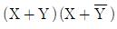
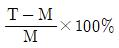
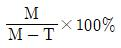
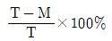
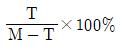
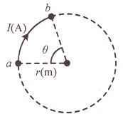
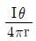
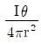
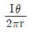
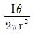
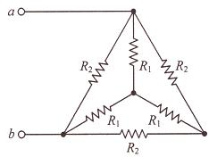

## 22. 문제

22. 어떤 측정계기의 지시값을 M, 참값을 T라 할 때 보정률(%)
은?
    ① 
    ② 
    ③ 
    ④ 
<문제 해설>
오차율
측 - 참
----------
참
보정율
참 - 지시
--------
지시
보정율은 지시값 분에 참값 빼기 지시값이다..
[해설작성자 : comcbt.com 이용자]

### 정답

1번

### 해설

정답은 1번입니다. 선택지의 핵심개념 을 확인하세요.

### 그림

## 23. 문제

23. 그림과 같이 반지름 r(m)인 원의 원주상 임의의 2점 a, b 
사이에 전류 I(A)가 흐른다. 원의 중심에서의 자계의 세기는 
몇 A/m인가??
    
    ① 
② 
    ③ 
④ 
<문제 해설>
H = NI / 2r
* N은 Turn 수이므로 N = θ/2π
H = Iθ / 4πr
[해설작성자 : Ryan]
N회 감겨있을 때 H = NI/2r
전류가 θ만큼만 흐를 때 H = I/2r * θ/2π
                                            = Iθ/4πr
[해설작성자 : 소방7일전사]

### 정답

1번

### 해설

정답은 1번입니다. 선택지의 핵심개념 을 확인하세요.

### 그림

## 24. 문제

24. 회로에서 a, b 간의 합성저항(Ω)은? (단, R1=3Ω, R2=9Ω이
다.)
    
    ① 3
② 4
    ③ 5
④ 6
<문제 해설>
R1,의 Y결선을 델타결선으로 변환하면 R1이 3배 X 3오옴이므로 
9오옴이되고 R2와 각각 병렬연결이되므로
4.5오옴 이된다 결국 4.5오옴//(4.5+4.5)오옴=3오옴
[해설작성자 : bnt]
Y결합을 델타로 변경하면 R_2=9옴 R_1=3x3=9옴이 됩니다.
R_2와 R_1이 병렬이므로 합성저항은 9/2=4.5옴이 되고
델타 결선 그려보면 저항 두개가 직렬이고 나머지 하나와 병렬
이므로 (4.5x9)/(4.5+9)=3옴 입니다.
[해설작성자 : 화이팅해요]

### 정답

1번

### 해설

정답은 1번입니다. 선택지의 핵심개념 을 확인하세요.

### 그림

## 25. 문제

25. 2차 제어시스템에서 무제동으로 무한 진동이 일어나는 감쇠
율(damping ratio) δ는?
    ① δ = 0
② δ > 1
    ③ δ = 1
④ 0 < δ < 1
<문제 해설>
δ < 1 인 경우 : 부족 제동 (감쇠 진동)
δ > 1 인 경우 : 과제동 ( 비진동)
δ = 1 인 경우 : 임계 제동 (임계 상태)
δ = 0 인 경우 : 무제동(무한 진동 또는 완전 진동)
[해설작성자 : Chillbear]

### 정답

1번

### 해설

정답은 1번입니다. 선택지의 핵심개념 을 확인하세요.

### 그림

## 26. 문제

26. 블록선도의 전달함수 (C(s)/R(s))는?

본 해설집은 최강 자격증 기출문제 전자문제집 CBT 해설달기 프로젝트에 의해서 만들어진 자료입니다. 해설을 제공해 주신 모든 분들께 감사 드립니다.
소방설비기사(전기분야)
◐2021년 03월 07일 필기 기출문제 및 해설집◑
전자문제집 CBT : www.comcbt.com
기출문제 해설은 최강 자격증 기출문제 전자문제집 CBT : www.comcbt.com 통해서 실시간으로 변경됩니다.
    
    ① 
    ② 
    ③ 
    ④ 
<문제 해설>
아래와 같은 오류 신고가 있었습니다.
여러분들의 많은 의견 부탁 드립니다.
추후 여러분들의 의견을 반영하여 정답을 수정하도록 하겠습니
다.
참고로 정답 변경은 오류 신고 5회 이상일 경우 수정합니다.
[오류 신고 내용]
전체전달함수=패스경로/1-피드백경로
패스경로=G1*G2
피드백경로=-G1*G2+(-G1*G2*G3)
[해설작성자 : 압록강다리밑 ]
[오류신고 반론]
분모는 부호가 반대가 됩니다.정답이 맞음
[해설작성자 : comcbt.com 이용자]
[오류신고 반론]
정답 맞습니다
안에 있는 피드백루프부터 풀면
T1 = G1G2/(1+G1G2)
T2 = T1/(1+G3T1) = {G1G2/(1+G2)}/{1+G3*(G1G2/1+G2)} 
= G1G2/(1+G2+G1G2G3)
[해설작성자 : 하기시러ㅓㅓㅓ]
[오류신고 반론]
부호가 반대로 되는건 맞습니다
그러나 피드백 부궤환의 부호가 -가 아닌 +인 경우는 분모 부호
의 기초는 -이므로 -가 됩니다
중학교 수학에서 나오는 -(-ㅁㅁㅁ) = +ㅁㅁㅁ 인것과 같습니다
[해설작성자 : 전기과출신 전기쌍기사]
[추가 오류 신고]
C=RG1G2-CG1G2G3-CG2 계산 편의를 위해 s는 생략합니다
C+CG1G2G3+CG3=RG1G2
C(1+G1G2G3+G2)=RG1G2
C/R=G1G2/1+G2+G1G2G3
하기시러ㅓㅓㅓ님 풀이하면 T2에서 T1 대입 잘못해서 답 안맞
습니다
[해설작성자 : 소방전기공부중]

### 정답

1번

### 해설

정답은 1번입니다. 선택지의 핵심개념 을 확인하세요.

### 그림

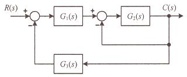
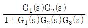
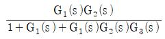
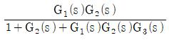
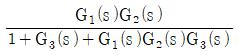

## 27. 문제

27. 3상 유도전동기의 특성에서 토크, 2차 입력, 동기속도의 관
계로 옳은 것은?
    ① 토크는 2차 입력과 동기속도에 비례한다
    ② 토크는 2차 입력에 비례하고 동기속도에 반비례한다
    ③ 토크는 2차 입력에 반비례하고 동기속도에 비례한다
    ④ 토크는 2차 입력의 제곱에 비례하고 동기속도의 제곱에 
반비례한다
<문제 해설>
T=0.975 X P2/NS:(P2:2차입력 .NS:동기속도)
[해설작성자 : BNT]

### 정답

1번

### 해설

정답은 1번입니다. 선택지의 핵심개념 을 확인하세요.

### 그림

## 28. 문제

28. 어떤 회로에 v(t)=150sinωt(V)의 전압을 가하니 i(t)=12sin(ω
t-30°)(A)의 전류가 흘렀다. 이 회로의 소비전력(유효전력)
은 약 몇 W 인가?
    ① 390
② 450
    ③ 780
④ 900
<문제 해설>
150/루트2 * 12/루트2 * cos30 = 779.42[W]
[해설작성자 : 기븐]
전력문제는 기본적인 삼각함수표를 외우고 있어야 합니다..
만약 많이 외우는 것이 어렵다면, 45도 하나는 꼭 외우고 있어
야 합니다..사인 및 코사인 45도 = 0.707
문제에서 정확한 정현파 (수식)을 표시하지 않고 전압이나 전류
의 값만 표시한다면 이는 실효값을 의미하고,
이번 문제처럼 정확한 수식을 표현하면 최대값을 의미하게 됩니
다..
그리고 전압, 전류, 전력에서 특별히 언급하지 않으면 실효값으
로 계산해야 합니다..
실효값으로 전압과 전류는 최대값에서 0.707을 곱해야 하며, 전
력은 전압과 전류의 곱이므로 0707을 두번 곱해야 합니다.
위 문제에서 전류의 위상이 전압에 비해서 30도 뒤쳐지을 알 수 
있습니다..(즉, 45도 보다 덜 뒤쳐집니다.)
따라서 유효전력은 900W에서 45도인 0.707을 곱한값 636W 다
는 크고, 뒤쳐짐이 없는 900W 보다는 작아야 합니다..
위 조건을 만족하는 답은 3번
[해설작성자 : comcbt.com 이용자]
Vrms = 150/√2
Irms = 12/√∠-30º
Pa(피상전력) = Vrms*Irms' = 150/√2 * 12/√2∠30º = 900∠
30º

본 해설집은 최강 자격증 기출문제 전자문제집 CBT 해설달기 프로젝트에 의해서 만들어진 자료입니다. 해설을 제공해 주신 모든 분들께 감사 드립니다.
소방설비기사(전기분야)
◐2021년 03월 07일 필기 기출문제 및 해설집◑
전자문제집 CBT : www.comcbt.com
기출문제 해설은 최강 자격증 기출문제 전자문제집 CBT : www.comcbt.com 통해서 실시간으로 변경됩니다.
P(유효전력) = 900cos30º = 900*√3/2 = 450*1.732/2 = 779.4
[해설작성자 : 하기시러ㅓㅓㅓ]
유효전력)P[W] = V * I * cosθ ▶ 150 /√2 * 12 /√2 * cos( 
90 - 60 )˚ = 779.4228[W]
※sin(θ) = cos(90° - θ)
[해설작성자 : 따고싶다 or 어디든 빌런]

### 정답

1번

### 해설

정답은 1번입니다. 선택지의 핵심개념 을 확인하세요.

### 그림

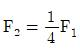
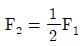
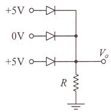
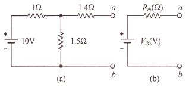

## 29. 문제

29. 평행한 두 도선 사이의 거리가 r이고, 각 도선에 흐르는 전
류에 의해 두 도선 간의 작용력이 F1일 때, 두 도선 사이의 
거리를 2r로 하면 두 도선 간의 작용력 F2 는?
    ① 
    ② 
    ③ F2=2F1
    ④ F2=4F1
<문제 해설>
평행한 도선 사이의 자기력은 거리에 반비례하고 전류, 길이에 
비례한다.
따라서 두 도선 사이의 거리가 2배 늘어났으므로 작용력 F는 
1/2가 된다.
[해설작성자 : 꿈돌이소금빵]

### 정답

1번

### 해설

정답은 1번입니다. 선택지의 핵심개념 을 확인하세요.

### 그림

## 30. 문제

30. 200V의 교류전압에서 30A의 전류가 흐르는 부하가 4.8KW
의 유효전력을 소비하고 있을 때 이 부하의 리액턴스(Ω)는?
    ① 6.6
② 5.3
    ③ 4.0
④ 3.3
<문제 해설>
V=I*Z     Z=V/I    이므로 Z=200/30=6.67
W=I^2R    R=W/I^2            R=4800/30^2=5.33
Z=루트(R^2 + j^2)
j=루트(6.67^2-5.33^2)=4.01
[해설작성자 : comcbt.com 이용자]
다른 풀이 방법
Z=V/I = 200/30 = 6.67
P = VICOS세타 ->COS세타 = P/VI = 4800/200*30 = 0.8
(코사인세타가 0.8이면 싸인세타는 0.6)SIN세타 = 루트
1-0.8^2= 0.6
SIN세타 = X/Z -> X=SIN세타*Z = 0.6*6.67 = 4.002
[해설작성자 : comcbt.com 이용자]
R[Ω] = V / I ▶ 200 / 30 = 6.67[Ω]
유효전력)P[kW] = I^2 * Z ▶ Z[Ω] = P / I^2 ▶ 4.8 * 10^3 
/ 30^2 = 5.33    
Z[Ω] = √( R^2 + X^2 ) ▶ X[Ω] = √( Z^2 - R^2 ) ▶ √( 
6.67^2 - 5.33^2 ) = 4[Ω]
[해설작성자 : 따고싶다 or 어디든 빌런]
피상전력 P=VI=6000VA 무효전력은 √(6000^2-4800^2) = 
3600Var=I^2X
X[Ω]=3600/30^2 = 4 [Ω]
[해설작성자 : 라면인데요]

### 정답

1번

### 해설

정답은 1번입니다. 선택지의 핵심개념 을 확인하세요.

### 그림

## 31. 문제

31. 정전용량이 0.02㎌인 커패시터 2개와 정전용량이 0.01㎌인 
커패시터 1개를 모두 병렬로 접속하여 24V의 전압을 가하
였다. 이 병렬회로의 합성 정전용량(㎌)과 0.01㎌의 커패시
터에 축적되는 전하량(C)은?
    ① 0.05, 0.12×10-6
② 0.05, 0.24×10-6
    ③ 0.03, 0.12×10-6
④ 0.03, 0.24×10-6
<문제 해설>
커패시터의 병렬 합성 정전용량은 0.02+0.02+0.01=0.05
(직렬일 경우 저항의 병렬합성 방식으로)
Q=C*V 이므로 0.01*24=0.24
[해설작성자 : 이런이런]

### 정답

1번

### 해설

정답은 1번입니다. 선택지의 핵심개념 을 확인하세요.

### 그림

## 32. 문제

32. 그림과 같은 다이오드 회로에서 출력전압 Vo는? (단, 다이오
드의 전압강하는 무시한다.)
    
    ① 10V
② 5V
    ③ 1V
④ 0V
<문제 해설>
OR회로 이므로 5V
다이오드가 반대이면 AND
[해설작성자 : 이런이런]

### 정답

1번

### 해설

정답은 1번입니다. 선택지의 핵심개념 을 확인하세요.

### 그림

## 33. 문제

33. 데브난의 정리를 이용하여 그림(a)의 회로를 그림 (b)와 같
은 등가회로로 만들고자 할 때 Vth(V)와 Rth(Ω)은?
    
    ① 5V, 2Ω
② 5V, 3Ω
    ③ 6V, 2Ω
④ 6V, 3Ω
<문제 해설>
Rth 전압원 단락 후 부하측에서 바라본 등가저항
Rth=1.4+(1.5||1)=2옴
Vth 부하가 개방되어있는 a-b사이의 전압은 개방되어있으니 전

본 해설집은 최강 자격증 기출문제 전자문제집 CBT 해설달기 프로젝트에 의해서 만들어진 자료입니다. 해설을 제공해 주신 모든 분들께 감사 드립니다.
소방설비기사(전기분야)
◐2021년 03월 07일 필기 기출문제 및 해설집◑
전자문제집 CBT : www.comcbt.com
기출문제 해설은 최강 자격증 기출문제 전자문제집 CBT : www.comcbt.com 통해서 실시간으로 변경됩니다.
류가 흐르지 않음.. 전압도 걸리지 않음..
테브난의 전압은 1.5옴에 걸리는 값이 됨.
Vth=1.5/(1+1.5)*10=6V
[해설작성자 : 이런이런]
혹시 테브난의 정리 공식이 생각나지 않는 경우에 풀수 있는 방
법입니다..
ab open 시 1.4옴에 걸리는 전압은 6V이고
ab short 시 1.4옴에 흐르는 전류는 3A입니다..
따라서 저항 R=V/I=2옴
결론적으로 6V, 2옴이 됩니다..
[해설작성자 : comcbt.com 이용자]
Vth[V] = V * ( R2 / R1 + R2 ) ▶ 10 * ( 1.5 / 1 + 1.5 ) = 
6[V]
Rth[Ω] = R3 + ( R1 * R2 / R1 + R2 ) ▶ 1.4 + ( 1 * 1.5 / 
1 + 1.5 ) = 2[Ω]
[해설작성자 : 따고싶다 or 어디든 빌런]

### 정답

1번

### 해설

정답은 1번입니다. 선택지의 핵심개념 을 확인하세요.

### 그림

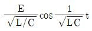
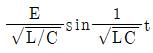
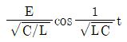
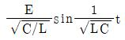
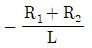
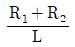
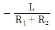
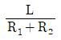

## 34. 문제

34. LC 직렬회로에 직류전압 E를 t=0(s)에 인가했을 때 흐르는 
전류 I(t)는?
    ① 
    ② 
    ③ 
    ④ 
<문제 해설>
Z0 = root(L/C)
[해설작성자 : 하기시러ㅓㅓㅓ]

### 정답

1번

### 해설

정답은 1번입니다. 선택지의 핵심개념 을 확인하세요.

### 그림

## 35. 문제

35. 다음 소자 중에서 온도 보상용으로 쓰이는 것은?
    ① 서미스터
② 바리스터
    ③ 제너다이오드
④ 터널다이오드
<문제 해설>
서미스터(Thermistor)는 보통의 저항에 비해 "온도"에 따른 저항
의 변화가 크게 만든 저항을 말한다.
[해설작성자 : 대천사.루시퍼]

### 정답

1번

### 해설

정답은 1번입니다. 선택지의 핵심개념 을 확인하세요.

### 그림

## 36. 문제

36. 변위를 압력으로 변환하는 장치로 옳은 것은?
    ① 다이어프램
② 가변 저항기
    ③ 벨로우즈
④ 노즐 플래퍼
<문제 해설>

### 정답

1번

### 해설

정답은 1번입니다. 선택지의 핵심개념 을 확인하세요.

### 그림

## 37. 문제

37. 저항 R1(Ω), 저항 R2(Ω), 인덕턴스 L(H)의 직렬회로가 있다. 
이 회로의 시정수(s)는?
    ① 
② 
    ③ 
④ 
<문제 해설>
RC 직렬회로의 시정수는
인덕턴스 (L) / 저항 (R) 인데, 이 문제에서는 저항 R1과 R2가 
제시되었다.
즉 이 회로의 시정수는 L/R1+R2 이다.
[해설작성자 : 리재횬]
아래와 같은 오류 신고가 있었습니다.
여러분들의 많은 의견 부탁 드립니다.
추후 여러분들의 의견을 반영하여 정답을 수정하도록 하겠습니
다.
참고로 정답 변경은 오류 신고 5회 이상일 경우 수정합니다.
[오류 신고 내용]
윗분 다 맞는데 RC 직렬회로가 아니라 RL 직렬회로가 되겠네요
[해설작성자 : 하기시러ㅓㅓㅓ]

### 정답

1번

### 해설

정답은 1번입니다. 선택지의 핵심개념 을 확인하세요.

### 그림

## 38. 문제

38. 자기 인덕턴스 L1, L2가 각각 4mH, 9mH인 두 코일이 이상
적인 결합이 되었다면 상호 인덕턴스는 몇 mH인가? (단, 

본 해설집은 최강 자격증 기출문제 전자문제집 CBT 해설달기 프로젝트에 의해서 만들어진 자료입니다. 해설을 제공해 주신 모든 분들께 감사 드립니다.
소방설비기사(전기분야)
◐2021년 03월 07일 필기 기출문제 및 해설집◑
전자문제집 CBT : www.comcbt.com
기출문제 해설은 최강 자격증 기출문제 전자문제집 CBT : www.comcbt.com 통해서 실시간으로 변경됩니다.
결합계수는 1이다.)
    ① 6
② 12
    ③ 24
④ 36
<문제 해설>
합성인덕턴스 M=k루트(L1 *L2)
                         M=1루트(4 *9) = 6[mH]
[해설작성자 : comcbt.com 이용자]

### 정답

1번

### 해설

정답은 1번입니다. 선택지의 핵심개념 을 확인하세요.

### 그림

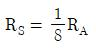
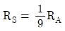
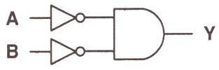

## 39. 문제

39. 분류기를 사용하여 내부저항이 RA인 전류계의 배율을 9로 
하기 위한 분류기의 저항 RS(Ω)은?
    ① 
    ② 
    ③ RS=8RA
    ④ RS=9RA
<문제 해설>
Io = I (1 + Ra / Rs) : Io 출력전류, I: 전류계최대치, Ra: 전류
계내부저항, Rs: 분류기저항
Rs 로 정리하면
Rs = Ra / (Io/I)-1    에서 Io = 9 x I 이므로 9배
     = Ra / (9I/I)-1
     = Ra / 9 - 1
     = Ra / 8
따라서
         Ra = 1/8 x Ra    가 된다
[해설작성자 : comcbt.com 이용자]

### 정답

1번

### 해설

정답은 1번입니다. 선택지의 핵심개념 을 확인하세요.

### 그림

## 40. 문제

40. 그림의 논리회로와 등가인 논리 게이트는?
    
    ① NOR
② NAND
    ③ NOT
④ OR
<문제 해설>
not A * not B = not(A+B) = NOR
[해설작성자 : 珍]
드 모르간 법칙에 의해 NOT A * NOT B = NOT(A+B) = NOR 
입니다.
NOT A * NOT B 와 NOT(A*B)는 같지 않습니다.
+ 전자회로 2입력 단자 구조로 보았을 때
    2단자 입력부분이 모두 NOT이 되어있고 AND게이트를 변환
시키면
    입력단의 NOT이 사라지고 AND게이트가 OR게이트에 NOT
이 붙어 NOR게이트로 됩니다.
    (반대로 2단자 입력 모두 NOT에 OR게이트 = 2단자입력 
NOT사라지고 OR게이트는 AND게이트의 NOT이 붙어 NAND게
이트가 됨)
[해설작성자 : 기븐]

### 정답

1번

### 해설

정답은 1번입니다. 선택지의 핵심개념 을 확인하세요.

### 그림

