# 소방설비기사(전기분야)20210912(해설집) - 소방전기회로

> 원본: `소방설비기사(전기분야)20210912(해설집).pdf`
> 개인학습용 변환본.

## 21. 문제

21. 단상 반파 정류회로를 통해 평균 26V의 직류 전압을 출력하
는 경우, 정류 다이오드에 인가되는 역방향 최대 전압은 약 
몇 V 인가? (단, 직류 측에 평활회로(필터)가 없는 정류회로
이고, 다이오드의 순방향 전압은 무시한다.)
    ① 26
② 37
    ③ 58
④ 82
<문제 해설>
반파정류 26V / 0.318 = 81.76
반파전압값은 피크전압 31.8%
정파전압값은 피크전압 63.6%
[해설작성자 : comcbt.com 이용자]
단상반파 정류회로 : 0.45 X ?V = 26V
?V = 58V 이다..근데 역방향 최대 전압을 물어봤으니까 첨두역
전압을 가해줘야 한다..(루트2)
58V X 루트2 = 약 82V이다.
[해설작성자 : 뭐]
정류회로는 마이너스 값을 가지지 않으므로
기하평균인 실효값이 아니라, 산술평균값으로 정의한다..
정현파의 산술평균값은 최대값의 63.6%이다..
이를 이용하여 반파정류값으로부터 최대값을 역산하면,
26V * 2(전파정류로 환산) / 0.636 = 81.76
[해설작성자 : comcbt.com 이용자]
추가해설
정현파 반파정류회로 평균값 Vav=(1/π)xVm 입니다..Vm(최대
값)= Vav x π = 26 x 3.14 = 81.64[V]
정답 82[V] 입니다.
[해설작성자 : harry2]

### 정답

1번

### 해설

정답은 1번입니다. 선택지의 핵심개념 을 확인하세요.

## 22. 문제

22. 시퀀스회로를 논리식으로 표현하면?
2과목 : 소방전기회로

본 해설집은 최강 자격증 기출문제 전자문제집 CBT 해설달기 프로젝트에 의해서 만들어진 자료입니다. 해설을 제공해 주신 모든 분들께 감사 드립니다.
소방설비기사(전기분야)
◐2021년 09월 12일 필기 기출문제 및 해설집◑
전자문제집 CBT : www.comcbt.com
기출문제 해설은 최강 자격증 기출문제 전자문제집 CBT : www.comcbt.com 통해서 실시간으로 변경됩니다.
    
    ① 
    ② 
    ③ 
    ④ 
<문제 해설>
B 및 C 는 직렬, 그리고 A와 병렬
[해설작성자 : 대천사.루시퍼]

### 정답

1번

### 해설

정답은 1번입니다. 선택지의 핵심개념 을 확인하세요.

### 그림

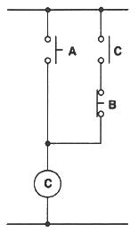
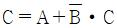
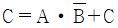
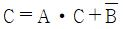
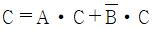
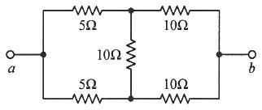

## 23. 문제

23. 제어량에 따른 제어방식의 분류 중 온도, 유량, 압력 등의 
공업 프로세스의 상태량을 제어량으로 하는 제어계로서 외
란의 억제를 주목적으로 하는 제어방식은?
    ① 서보기구
② 자동조정
    ③ 추종제어
④ 프로세스제어
<문제 해설>

### 정답

1번

### 해설

정답은 1번입니다. 선택지의 핵심개념 을 확인하세요.

### 그림

## 24. 문제

24. 반도체를 이용한 화재감지기 중 서미스터(thermistor)는 무
엇을 측정하기 위한 반도체 소자인가?
    ① 온도
    ② 연기 농도
    ③ 가스 농도
    ④ 불꽃의 스펙트럼 강도
<문제 해설>
서미스터(thermistor) : 온도 측정
[해설작성자 : 대천사.루시퍼]
Thermistor는 Thermally Sensitive Resistor의 합성어.
열(온도) 변화에 대해서 저항값이 민감하게 변하는 저항기를 말
한다.
*Thermally : 열적으로
*Sensitive : 민감한
*Resistor : 저항기
[해설작성자 : 동과대 13 자동차]

### 정답

1번

### 해설

정답은 1번입니다. 선택지의 핵심개념 을 확인하세요.

### 그림

## 25. 문제

25. 회로에서 a와 b 사이의 합성저항(Ω)은?
    
    ① 5
② 7.5
    ③ 15
④ 30
<문제 해설>
위와 아래의 회로가 같은 저항으로 구성되어 전위가 동일하다.
따라서 회로 가운데의 저항 10옴에는 전류가 흐르지 않아 개방
상태로 볼 수 있다.
합성저항을 구할 때는 위의 15옴과 아래 15옴의 병렬연결로 볼 
수 있으므로 7.5옴이다
[해설작성자 : 꿈돌이소금빵]

### 정답

1번

### 해설

정답은 1번입니다. 선택지의 핵심개념 을 확인하세요.

### 그림

## 26. 문제

26. 1개의 용량의 25W인 객석유도등 10개가 설치되어 있다. 이 
회로에 흐르는 전류는 약 몇 A 인가? (단, 전원 전압은 
220V이고, 기타 선로손실 등은 무시한다.)
    ① 0.88
② 1.14
    ③ 1.25
④ 1.36
<문제 해설>
P = IV
P(250W)=25W * 10개
V = 220V
I(1.14) =  P(250W) / V(220V)
[해설작성자 : 이산우공]
I[A] = P / V ▶ 25 * 10 / 220 = 1.1363[A]
[해설작성자 : 따고싶다 or 어디든 빌런]

### 정답

1번

### 해설

정답은 1번입니다. 선택지의 핵심개념 을 확인하세요.

### 그림

## 27. 문제

27. PD(비례 미분) 제어 동작의 특징으로 옳은 것은?
    ① 잔류편차 제거
② 간헐현상 제거
    ③ 불연속 제어
④ 속응성 개선
<문제 해설>
1.잔류편차 제거 - 적분제어(I)
2.간헐현상 제거 - 비례적분미분제어(PID)
3.불연속 제어
4.속응성 개선 - 비례미분제어(PD)
[해설작성자 : 대천사.루시퍼]

### 정답

1번

### 해설

정답은 1번입니다. 선택지의 핵심개념 을 확인하세요.

### 그림

## 28. 문제

28. 회로에서 저항 20Ω에 흐르는 전류(A)는?

본 해설집은 최강 자격증 기출문제 전자문제집 CBT 해설달기 프로젝트에 의해서 만들어진 자료입니다. 해설을 제공해 주신 모든 분들께 감사 드립니다.
소방설비기사(전기분야)
◐2021년 09월 12일 필기 기출문제 및 해설집◑
전자문제집 CBT : www.comcbt.com
기출문제 해설은 최강 자격증 기출문제 전자문제집 CBT : www.comcbt.com 통해서 실시간으로 변경됩니다.
    
    ① 0.8
② 1.0
    ③ 1.8
④ 2.8
<문제 해설>
20/25=0.8
(5/25)*5=1
0.8+1=1.8
[해설작성자 : 터널]
중첩의 원리
전압원 단락시=5/5+20=1A
전류원 개방시=20/5+20=0.8A
[해설작성자 : 정기사 ]

### 정답

1번

### 해설

정답은 1번입니다. 선택지의 핵심개념 을 확인하세요.

### 그림

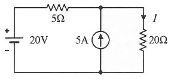
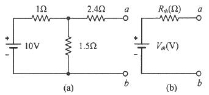

## 29. 문제

29. 1cm의 간격을 둔 평행 왕복전선에 25A의 전류가 흐른다면 
전선 사이에 작용하는 단위 길이당 힘(N/m)은?
    ① 2.5×10-2 N/m(반발력)
    ② 1.25×10-2 N/m(반발력)
    ③ 2.5×10-2 N/m(흡인력)
    ④ 1.25×10-2 N/m(흡인력)
<문제 해설>
F=μ0 x Ia x Ib / 2πr
= 4π x 10^-7 x 25^2 / 2π x 10^-2
=0.0125 = 1.25 x 10^-2 [N/m]
같은 방향 전류 = 흡인력
반대 방향 전류 = 반발력
[해설작성자 : 빈짱이의 3기사 도전]
단위길이당 작용힘)F[N/m] = 2 * ( I1 * I2 / d ) * 10^-7 ▶ 
2 * ( 25 * 25 / 1 * 10^-2 ) * 10^-7 = 1.25×10^-2[N/m]
※평행 왕복 도선에서는 서로 밀어내는 반발력이 작용 합니다.
[해설작성자 : 따고싶다 or 어디든 빌런]

### 정답

1번

### 해설

정답은 1번입니다. 선택지의 핵심개념 을 확인하세요.

### 그림

## 30. 문제

30. 0.5 kVA의 수신기용 변압기가 있다. 이 변압기의 철손은 
7.5W이고, 전부하동손은 16W 이다. 화재가 발생하여 처음 
2시간은 전부하로 운전되고, 다음 2시간은 1/2의 부하로 운
전되었다고 한다. 4시간에 걸친 이 변압기의 전손실 전력량
은 몇 Wh 인가?
    ① 62
② 70
    ③ 78
④ 94
<문제 해설>
Pl=Pi+m^2Pc
Pl=2x7.5+2x16=47w
'Pl=2x7.5+2x0.5^2x16=23w
47+23=70w
[해설작성자 : 빈짱이의 3기사 도전]
W=[철손+동손]*시간+[철손+(1/n)제곱*동손]시간
[7.5+16]*2+[7.5+1/2*16]2 = 70Wh
[해설작성자 : 휴우가네지]
전손실 전력량)W[Wh] = ( Pi + Pc ) * t + [ Pi + ( 1 / n )^2 
* Pc ] * t ▶ ( 7.5 + 16 ) * 2 + [ 7.5 + ( 1 / 2 )^2 * 16 
] * 2 = 70[Wh]
[해설작성자 : 따고싶다 or 어디든 빌런]
철손은 부하 상관없이 시간마다 증가합니다.
7.5 x 4 = 30
동손은 처음 두시간
16 x 2 = 32
동손의 1/2부하 두시간
16 x 2 x 1/2^2 = 8
30 + 32 + 8 = 70

### 정답

1번

### 해설

정답은 1번입니다. 선택지의 핵심개념 을 확인하세요.

### 그림

## 31. 문제

31. 테브난의 정리를 이용하여 그림 (a)의 회로를 그림 (b)와 같
은 등가회로로 만들고자 할 때 Vth(V)와 Rth(Ω)은?
    
    ① 5V, 2Ω
② 5V, 3Ω
    ③ 6V, 2Ω
④ 6V, 3Ω
<문제 해설>
합성저항 [(1Ωx1.5Ω)/(1Ω+1.5Ω)]+2.4Ω = 3Ω
등가전압 [1.5Ω/(1Ω+1.5Ω)]x10v = 6v
[해설작성자 : 풍광]
위 회로에서 ab 양단의 로드가 오픈에서 쇼트까지 변한다고 할 
때, 전압은 6V에서 6V보다 작은 어떤값까지 변한다..
즉, 등가회로는 6V와 적당한 어떤 저항값의 합성으로 생각할 수 
있는데, 이 합성 저항값은 2.4옴보다는 반드시 크다..
왜냐하면 기존회로에서 해당 지점의 2.4옴을 지나기 위해서는 
반드시 1옴을 거쳐가야하기 때문에 전류 흐름의 제한을 받으며,
제한을 받는 정도가 아무리 작더라도 그 영향이 있게 마련이다..
따라서 답은 6V 이면서 2.4옴 이상이 되는 값을 찾아야 한다..
[해설작성자 : comcbt.com 이용자]
Vth[V] = V * ( R2 / R1 + R2 ) ▶ 10 * ( 1.5 / 1 + 1.5 ) = 
6[V]

본 해설집은 최강 자격증 기출문제 전자문제집 CBT 해설달기 프로젝트에 의해서 만들어진 자료입니다. 해설을 제공해 주신 모든 분들께 감사 드립니다.
소방설비기사(전기분야)
◐2021년 09월 12일 필기 기출문제 및 해설집◑
전자문제집 CBT : www.comcbt.com
기출문제 해설은 최강 자격증 기출문제 전자문제집 CBT : www.comcbt.com 통해서 실시간으로 변경됩니다.
Rth[Ω] = R3 + ( R1 * R2 / R1 + R2 ) ▶ 2.4 + ( 1 * 1.5 / 
1 + 1.5 ) = 3[Ω]
[해설작성자 : 따고싶다 or 어디든 빌런]

### 정답

1번

### 해설

정답은 1번입니다. 선택지의 핵심개념 을 확인하세요.

### 그림

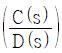
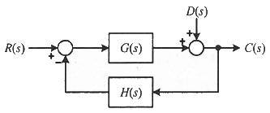
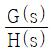
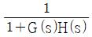
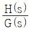
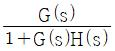
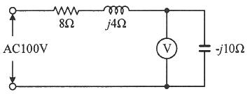

## 32. 문제

32. 블록선도에서 외란 D(s)의 입력에 대한 출력 C(s)의 전달함
수 
 는?
    
    ① 
② 
    ③ 
④ 
<문제 해설>
R(s) = 0 이라고 두고 생각해보면
일반적인 C/R = G/(1-(G*-H)) = G/(1+GH) 공식에서
C(s) > C(s)
R(s) > D(s)
G(s) > 1
H(s) > G(s) * -H(s)
C/D = 1/(1 - G*(-H)) = 1/(1+GH)
이렇게 됩니다
[해설작성자 : 하기시러ㅓㅓㅓ]
전달함수 = 직선구간/1-회선구간
전달함수1 R(s)/D(s) = G(s)/1-(G(s)*-H(s)) = 
G(s)/1+G(s)*(H(s))
전달함수2 C(s)/D(s) = 1/1-(-H(s)*G(s)) = 1/1+(H(s)*G(s))
[해설작성자 : 동과대 13 자동차]

### 정답

1번

### 해설

정답은 1번입니다. 선택지의 핵심개념 을 확인하세요.

### 그림

## 33. 문제

33. 회로에서 전압계 Ⓥ가 지시하는 전압의 크기는 몇 V 인가?
    
    ① 10
② 50
    ③ 80
④ 100
<문제 해설>

### 정답

1번

### 해설

정답은 1번입니다. 선택지의 핵심개념 을 확인하세요.

### 그림

## 34. 문제

34. 지시계기에 대한 동작원리가 아닌 것은?
    ① 열전형 계기 : 대전된 도체 사이에 작용하는 정전력을 
이용
    ② 가동 철편형 계기 : 전류에 의한 자기장에서 고정 철편
과 가동 철편 사이에 작용하는 힘을 이용
    ③ 전류력계형 계기 : 고정 코일에 흐르는 전류에 의한 자
기장과 가동 코일에 흐르는 전류 사이에 작용하는 힘을 
이용
    ④ 유도형 계기 : 회전 자기장 또는 이동 자기장과 이것에 
의한 유도 전류와의 상호작용을 이용
<문제 해설>

### 정답

1번

### 해설

정답은 1번입니다. 선택지의 핵심개념 을 확인하세요.

### 그림

## 35. 문제

35. 선간전압의 크기가 100√3 V인 대칭 3상 전원에 각 상의 임
피던스가 Z = 30 + j40(Ω)인 Y결선의 부하기 연결되었을 
때 이 부하로 흐르는 선전류(A)의 크기는?
    ① 2
② 2√3
    ③ 5
④ 5√3
<문제 해설>
3상 선전류 IL= VL/root3xZ
[해설작성자 : 빈짱이의 3기사 도전]
Y결선은 선전류 상전류가 같고 △결선은 선전압 상전압이 같습
니다.
선간전압=루트3*상전압 ,        선간전류=루트3*상전류
따라서 Y결선에서 선전류를 구한다는 얘기는 상전류를 구한다는 
얘기와 같습니다..임피던스가 각 한상의 크기로 주어졌기 때문에
상전압은 100V가 되고 임피던스는 루트30^2+40^2=50 즉 
I=100/50=2
[해설작성자 : 부자아빠 ㅊㅇㅎ]
Y결선 = √3 * Vp(상전압) = VL(선간전압), Ip(상전류) = IL(선전
류)

본 해설집은 최강 자격증 기출문제 전자문제집 CBT 해설달기 프로젝트에 의해서 만들어진 자료입니다. 해설을 제공해 주신 모든 분들께 감사 드립니다.
소방설비기사(전기분야)
◐2021년 09월 12일 필기 기출문제 및 해설집◑
전자문제집 CBT : www.comcbt.com
기출문제 해설은 최강 자격증 기출문제 전자문제집 CBT : www.comcbt.com 통해서 실시간으로 변경됩니다.
상전류)Ip[A]= Vp / R ▶ 100√3 / √3 * √( 30^2 + 40^2 ) = 
2[A]
[해설작성자 : 따고싶다 or 어디든 빌런]

### 정답

1번

### 해설

정답은 1번입니다. 선택지의 핵심개념 을 확인하세요.

### 그림

## 36. 문제

36. 자유공간에서 무한히 넓은 평면에 면전하밀도 σ(C/m2)가 균
일하게 분포되어 있는 경우 전계의 세기(E)는 몇 V/m 인가? 
(단, ε0는 진공의 유전율이다.)
    ① 
② 
    ③ 
④ 
<문제 해설>
① 구도체일 때
② 무한평면일 때
* 무한평면이란 전제조건이 없으면 구도체로
[해설작성자 : 푸른마을 안전관리자]

### 정답

1번

### 해설

정답은 1번입니다. 선택지의 핵심개념 을 확인하세요.

### 그림

## 37. 문제

37. 50Hz의 주파수에서 유도성 리액턴스가 4Ω인 인덕터와 용량
성 리액턴스가 1Ω인 커패시터와 4Ω의 저항이 모두 직렬로 
연결되어 있다. 이 회로에 100V, 50Hz의 교류전압을 인가
했을 때 무효전력(var)은?
    ① 1000
② 1200
    ③ 1400
④ 1600
<문제 해설>
I=100÷루트(4^+3^)=20
Var=visin@=100×20×0.6=1200
[해설작성자 : comcbt.com 이용자]

### 정답

1번

### 해설

정답은 1번입니다. 선택지의 핵심개념 을 확인하세요.

### 그림

## 38. 문제

38. 다음의 단상 유도전동기 중 기동 토크가 가장 큰 것은?
    ① 세이딩 코일형
② 콘덴서 기동형
    ③ 분상 기동형
④ 반발 기동형
<문제 해설>
단상 유도전동기의 기동토크 순서 (큰 것 부터)
반발 기동형 > 반발 유도형 > 콘덴서 기동형 > 분상 기동형 > 
세이딩 코일형
[해설작성자 : 관동폭주연합]

### 정답

1번

### 해설

정답은 1번입니다. 선택지의 핵심개념 을 확인하세요.

### 그림

## 39. 문제

39. 무한장 솔레노이드에서 자계의 세기에 대한 설명으로 틀린 
것은?
    ① 솔레노이드 내부에서의 자계의 세기는 전류의 세기에 비
례한다.
    ② 솔레노이드 내부에서의 자계의 세기는 코일의 권수에 비
례한다.
    ③ 솔레노이드 내부에서의 자계의 세기는 위치에 관계없이 
일정한 평등 자계이다.
    ④ 자계의 방향과 암페어 적분 경로가 서로 수직인 경우 자
계의 세기가 최대이다.
<문제 해설>
방향은 상관없음.
[해설작성자 : 아빠가 시설관리사]

### 정답

1번

### 해설

정답은 1번입니다. 선택지의 핵심개념 을 확인하세요.

### 그림

## 40. 문제

40. 다음의 논리식을 간소화하면?
    
    ① 
    ② 
    ③ 
    ④ 
<문제 해설>
논리식은 0과 1을 대입하면 쉽게 풀 수 있습니다.
A B Y
0 0 0
0 1 1
1 0 1
1 1 1
위와 같은 결과가 나오는 식은 1입니다.
[해설작성자 : 꿈돌이소금빵]
간소화하면 A*B_ + B = B + A*B_
분배법칙에 의해
= (B+B_)*(A+B)
= 1 * (A+B) = A+B
[해설작성자 : 소방7일전사]

### 정답

1번

### 해설

정답은 1번입니다. 선택지의 핵심개념 을 확인하세요.

### 그림

