# 소방설비기사(전기분야)20220305(해설집) - 소방전기회로

> 원본: `소방설비기사(전기분야)20220305(해설집).pdf`
> 개인학습용 변환본.

## 21. 문제

21. 그림과 같은 회로에서 단자 a, b 사이에 주파수 f(Hz)의 정
현파 전압을 가했을 때 전류계 A1, A2의 값이 같았다. 이 경
우 f, L, C 사이의 관계로 옳은 것은?
    
    ① 
 ② 
    ③ 
 ④ 
<문제 해설>
L과 C에 의해서 정해지는 고유주파수와 전원의 주파수가 일치하
면 공진현상을 일으켜 전류 또는 전압이 최대가 되는데 이 주파
수를 공진주파수라 한다.
f=1/(2ㅠ루트(LC))
[해설작성자 : 소방전기공부중]

### 정답

1번

### 해설

정답은 1번입니다. 선택지의 핵심개념 을 확인하세요.

### 그림

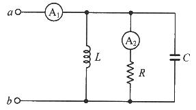
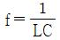
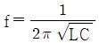
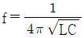
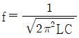
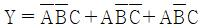
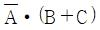
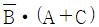
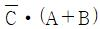
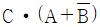
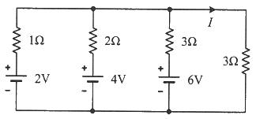

## 22. 문제

22. 논리식 
 를 간단히 표
현한 것은?
    ① 
    ② 
    ③ 
    ④ 
<문제 해설>
B_•(A_C+AC_+AC)
=B_•(A_C+AC+AC_+AC)
=B_•((A_+A)•C+(C_+C)•A)
=B_•(1•C+1•A)
=B_•(C+A)
[해설작성자 : 소방전기공부중]
굳이 풀이를 하지않아도 눈대중으로 풀 수 있습니다.
3개항 중에 공통으로 들어가는 것 B바를 하나로 묶고,
나머지 A,C중에 바 있는 것과, 바 없는 것을 서로 하나씩 지워
주면
A와 C가 남습니다.
공통으로 묶인 "B바 곱하기" 남은 "(A+C)"
[해설작성자 : 시험전날 공부]

### 정답

1번

### 해설

정답은 1번입니다. 선택지의 핵심개념 을 확인하세요.

### 그림

## 23. 문제

23. 회로에서 전류 I는 약 몇 A 인가?
    
    ① 0.92
② 1.125
    ③ 1.29
④ 1.38
<문제 해설>
<중첩의 원리>
I=2V에 의해 3옴에 흐르는 전류+4V에 의해 3옴에 흐르는 전류
+6V에 의해 3옴에 흐르는 전류
[2V일 경우:4V,6V 전압원은 단락]
2V 위의 1옴은 직렬,
나머지 2옴,3옴,3옴은 병렬
병렬합성저항 구하면 0.857
2과목 : 소방전기회로

본 해설집은 최강 자격증 기출문제 전자문제집 CBT 해설달기 프로젝트에 의해서 만들어진 자료입니다. 해설을 제공해 주신 모든 분들께 감사 드립니다.
소방설비기사(전기분야)
◐2022년 03월 05일 필기 기출문제 및 해설집◑
전자문제집 CBT : www.comcbt.com
기출문제 해설은 최강 자격증 기출문제 전자문제집 CBT : www.comcbt.com 통해서 실시간으로 변경됩니다.
3옴의 걸리는 전압은 (전압분배법칙)
(0.857/(1+0.857))×2=0.922994
3옴에 흐르는 전류=V/R=0.9929÷3=0.30766
[4V일 경우:2V,6V 전압원은 단락]
4V 위의 2옴은 직렬,
나머지 1옴,3옴,3옴은 병렬
병렬합성저항 구하면 0.6
3옴에 걸리는 전압은 (전압분배법칙)
(0.6/(2+0.6))×4=0.923
3옴에 흐르는 전류=V/R=0.923÷3=0.30769
[6V일 경우:2V,6V 전압원은 단락]
6V 위의 3옴은 직렬,
나머지 1옴,2옴,3옴은 병렬
병렬합성저항 구하면 0.5454
3옴에 걸리는 전압은 (전압분배법칙)
(0.5454/(3+0.5454))×6=0.92299
3옴에 흐르는 전류=V/R=0.92299÷3=0.30766
I=0.30766+0.30769+0.30766=0.923
[해설작성자 : 소방전기공부중]
밀만의 정리에따라
vy/y
해주면
(2+2+2+0)/(1+0.5+1/3+1/3)  = E
I= E /R
36/13) / 3
[해설작성자 : u]
이런 유형의 문제는 눈을 크게 뜨고 전체적인 유형을 살펴보면 
빨리 답을 찾을수 있습니다..
2V와 1옴으로 이루어진 전원회로가 2배, 3배로 각각 병렬로 구
성되어 있습니다..
따라서 전류를 방출하는 것은 최대전압인 6V밖에 없으며 나머지
는 모두 소모하는 소자입니다..
만약 6V만 있는 경우에 맨 오른쪽 3옴에 흐르는 전류는 1A이기 
때문에(최대조건),
왼편의 2V, 4V 전원회로가 추가되면 당연히 전류는 줄어들게 됩
니다..
따라서 답은 1번
[해설작성자 : comcbt.com 이용자]
전압원과 직렬 연결된 저항의 각 병렬가지를 전류원과 병렬의 
저항으로 등가 변환하고,
마지막 병렬가지를 제외한 회로 부분을 노턴 등가회로로 변환하
면 쉽습니다.
1) 2V 전압원과 1옴의 저항 직렬 연결
> 2A 전류원과 1옴의 저항 병렬 연결
2) 4V 전압원과 2옴의 저항 직렬 연결
> 2A 전류원과 2옴의 저항 병렬 연결
3) 6V 전압원과 3옴의 저항 직렬 연결
> 2A 전류원과 3옴의 저항 병렬 연결
4) 1),2),3) 의 각 병렬 가지를 하나의 전류원과 하나의 저항 병
렬 가지로 등가 회로를 그리면
6A 의 전류원과 (1||2||3)옴 = 0.55옴의 병렬가지로 등가 할 
수 있고,
6A의 전류를 0.55옴의 병렬가지와 3옴의 병렬가지가 전류분배 
되는 형태가 되기 때문에
구하고자 하는 전류는 (0.55/(3+0.55)) * 6A = 0.93A
[해설작성자 : 회로이론 A+]
밀만의정리)V[V] = ( V1 / R1 + V2 / R2 + V3 / R3 ) / ( 1 / 
R1 + 1 / R2 + 1 / R3 + 1 / R4 ) ▶ ( 2 / 1 + 4 / 2 + 6 / 
3 ) / ( 1 / 1 + 1 / 2 + 1 / 3 + 1 / 3 ) = 36 / 13 [V]
I[A] = V / R ▶ 36 / 13 / 3 ▶ 36 / 39 = 0.92[A]
[해설작성자 : 따고싶다 or 어디든 빌런]

### 정답

1번

### 해설

정답은 1번입니다. 선택지의 핵심개념 을 확인하세요.

### 그림

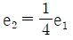
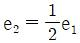
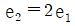
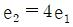
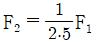
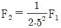
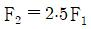
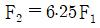

## 24. 문제

24. 절연저항 시험에서 “전로의 사용전압이 500V 이하인 경우 
1.0MΩ 이상”이란 뜻으로 가장 알맞은 것은?
    ① 누설전류가 0.5mA 이하이다.
    ② 누설전류가 5mA 이하이다.
    ③ 누설전류가 15mA 이하이다.
    ④ 누설전류가 30mA 이하이다.
<문제 해설>
I=500/1M옴=500/1000000옴
=0.0005[A]=0.5[mA]
[해설작성자 : 소방전기공부중]
1M 옴=10의 6승 옴
1M 암페어=10의 -3승 암페어

### 정답

1번

### 해설

정답은 1번입니다. 선택지의 핵심개념 을 확인하세요.

### 그림

## 25. 문제

25. 권선수가 100회인 코일에 유도되는 기전력의 크기가 e1이
다. 이 코일의 권선수를 200회로 늘렸을 때 유도되는 기전
력의 크기(e2)는?
    ① 
② 
    ③ 
④ 
<문제 해설>
유도기전력은 권선수의 제곱에 비례
(2배)^2=4배
[해설작성자 : 소방전기공부중]

### 정답

1번

### 해설

정답은 1번입니다. 선택지의 핵심개념 을 확인하세요.

### 그림

## 26. 문제

26. 동일한 전류가 흐르는 두 평행 도선 사이에 작용하는 힘이 
F1 이다. 두 도선 사이의 거리를 2.5배로 늘였을 때 두 도선 
사이 작용하는 힘 F2는?
    ① 
② 
    ③ 
④ 

본 해설집은 최강 자격증 기출문제 전자문제집 CBT 해설달기 프로젝트에 의해서 만들어진 자료입니다. 해설을 제공해 주신 모든 분들께 감사 드립니다.
소방설비기사(전기분야)
◐2022년 03월 05일 필기 기출문제 및 해설집◑
전자문제집 CBT : www.comcbt.com
기출문제 해설은 최강 자격증 기출문제 전자문제집 CBT : www.comcbt.com 통해서 실시간으로 변경됩니다.
<문제 해설>
평행도선간의 작용힘 F=(2II×10^-7)/r
따라서 F는 거리r과 반비례
[해설작성자 : comcbt.com 이용자]

### 정답

1번

### 해설

정답은 1번입니다. 선택지의 핵심개념 을 확인하세요.

### 그림

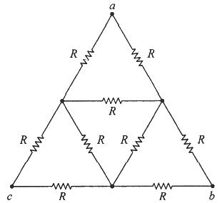
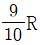
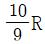
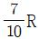
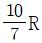
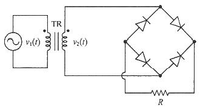
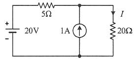
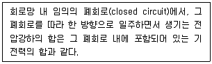

## 27. 문제

27. 그림의 회로에서 a와 c 사이의 합성 저항은?
    
    ① 
② 
    ③ 
④ 
<문제 해설>
보기처럼 분모가 다 다를경우에는 풀이가 필요없습니다.
계산식에서는 분모 3을 쓰기 때문에 거의 3x3인 9가 분모로 됩
니다.
따라서 유일한 분모 9인 2번이 답입니다.
[해설작성자 : 시험전날 공부]
먼저 오른쪽 아래 삼각형을 병렬로 생각하고 R||2R = 2R/3 이 
되고
위 삼각형과 왼쪽 아래 삼각형을 Y로 바꾸면 각각 R/3이 되어서
R/3 + (2R/3 || 4R/3) + R/3 = 2R/3 + 4R/9 = 10R/9
[해설작성자 : 하기시러ㅓㅓㅓ]

### 정답

1번

### 해설

정답은 1번입니다. 선택지의 핵심개념 을 확인하세요.

### 그림

## 28. 문제

28. 잔류편차가 있는 제어 동작은?
    ① 비례 제어
    ② 적분 제어
    ③ 비례 적분 제어
    ④ 비례 적분 미분 제어
<문제 해설>

### 정답

1번

### 해설

정답은 1번입니다. 선택지의 핵심개념 을 확인하세요.

### 그림

## 29. 문제

29. 그림과 같은 정류회로에서 R에 걸리는 전압의 최대값은 몇 
V 인가? (단, v2(t) = 20√2 sinωt 이다.)
    
    ① 20
② 20√2
    ③ 40
④ 40√2
<문제 해설>
브리지 정류회로에서 정류 후의 전압 최대값은 정류 전의 전압 
최대값과같다.
v(max) = 20루트2
[해설작성자 : 소방전기 화이팅이요]

### 정답

1번

### 해설

정답은 1번입니다. 선택지의 핵심개념 을 확인하세요.

### 그림

## 30. 문제

30. 회로에서 저항 20Ω에 흐르는 전류(A)는?
    
    ① 0.8
② 1.0
    ③ 1.8
④ 2.8
<문제 해설>

### 정답

1번

### 해설

정답은 1번입니다. 선택지의 핵심개념 을 확인하세요.

### 그림

## 31. 문제

31. 다음의 내용이 설명하는 것으로 가장 알맞은 것은?
    
    ① 노튼의 정리
    ② 중첩의 정리

본 해설집은 최강 자격증 기출문제 전자문제집 CBT 해설달기 프로젝트에 의해서 만들어진 자료입니다. 해설을 제공해 주신 모든 분들께 감사 드립니다.
소방설비기사(전기분야)
◐2022년 03월 05일 필기 기출문제 및 해설집◑
전자문제집 CBT : www.comcbt.com
기출문제 해설은 최강 자격증 기출문제 전자문제집 CBT : www.comcbt.com 통해서 실시간으로 변경됩니다.
    ③ 키르히호프의 전압법칙
    ④ 패러데이의 법칙
<문제 해설>
키르히호프의 전압 법칙(KVL, Kirchhoff's Voltage Law)
닫힌 하나의 루프안 전압(전위차)의 합은 0이다.
폐쇄된 회로의 인가된 전원의 합과 분배된 전위의 차의 합은 그 
루프 안에서 같다.
[해설작성자 : 소방전기]

### 정답

1번

### 해설

정답은 1번입니다. 선택지의 핵심개념 을 확인하세요.

### 그림

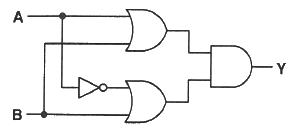
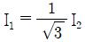
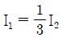
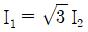
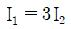

## 32. 문제

32. 그림과 같은 논리회로의 출력 Y는?
    
    ① AB
② A+B
    ③ A
④ B
<문제 해설>
(A+B)(A`+B)
=AA`+ AB + A`B + BB
=0 + AB + A`B + B
=B(A+A`+1)
=B
[해설작성자 : comcbt.com 이용자]

### 정답

1번

### 해설

정답은 1번입니다. 선택지의 핵심개념 을 확인하세요.

### 그림

## 33. 문제

33. 3상 농형 유도전동기를 Y-△ 기동방식으로 기동할 때 전류 
I1(A)과 △결선으로 직입(전전압) 기동할 때 전류 I2(A)의 관
계는?
    ① 
② 
    ③ 
④ 
<문제 해설>
와이 델타 기동법
기동전류는 루트3분의1배 기동전압은 3분의1배 이다
[해설작성자 : 이용자]
농형 유도 전동기의 Y-△기동시
기동 전압 = 정격 전압의 1/루트3
기동 전류 = 직입 기동의 1/3
기동 토크 = 직입 기동의 1/3

### 정답

1번

### 해설

정답은 1번입니다. 선택지의 핵심개념 을 확인하세요.

### 그림

## 34. 문제

34. 유도전동기의 슬립이 5.6%이고 회전자 속도가 1700rpm일 
때, 이 유도전동기의 동기속도는 약 몇 rpm 인가?
    ① 1000
② 1200
    ③ 1500
④ 1800
<문제 해설>
Ns 동기속도 =120f/p
Ns 동기속도=회전속도/(1-s)
  =1700/1-(0.056)=1800
회전속도N=동기속도*(1-S)
[해설작성자 : 야광]
슬립 s
동기속도 Ns
회전속도 N
s = (Ns - N) / Ns
Ns * s = Ns - N, Ns(1 - s) = N
Ns = N / (1-s) = 1700 / (1-0.056) = 1800.847
[해설작성자 : 시험 전날]

### 정답

1번

### 해설

정답은 1번입니다. 선택지의 핵심개념 을 확인하세요.

### 그림

## 35. 문제

35. 목표값이 다른 양과 일정한 비율 관계를 가지고 변화하는 
제어방식은?
    ① 정치제어
② 추종제어
    ③ 프로그램제어
④ 비율제어
<문제 해설>

### 정답

1번

### 해설

정답은 1번입니다. 선택지의 핵심개념 을 확인하세요.

### 그림

## 36. 문제

36. 축전지의 자기 방전을 보충함과 동시에 일반 부하로 공급하
는 전력은 충전기가 부담하고, 충전기가 부담하기 어려운 
일시적인 대전류는 축전지가 부담하는 충전방식은?
    ① 급속충전
② 부동충전
    ③ 균등충전
④ 세류충전
<문제 해설>
급속충전 : 짧은 시간에 충전전류의 2~3배 전류로 충전
균등충전 : 각 전해조에서 일어나는 전위차를 보정하기 위하여 
1~3개월마다 1회씩 충전. 정전압충전하여 전해조의 용량을 균
일화
세류충전 : 축전지의 자기방전을 보충하기위함. 부하 OFF상태에
서 미소전류로 항상 충전
[해설작성자 : hahaha]

### 정답

1번

### 해설

정답은 1번입니다. 선택지의 핵심개념 을 확인하세요.

### 그림

## 37. 문제

37. 각 상의 임피던스가 Z=6+j8(Ω)인 △결선의 평형 3상 부하
에 선간전압이 220v인 대칭 3상 전압을 가했을 때 이 부하
로 흐르는 선전류의 크기는 약 몇 A 인가?
    ① 13
② 22
    ③ 38
④ 66
<문제 해설>
Δ결선에서 선전류 공식 I(선) = √3 * V / Z = √3 * 220 / √
(6^2 + 8^2) = 38
[해설작성자 : comcbt.com 이용자]
Δ결선 = Vp(상전압) = VL(선간전압), √3 * Ip(상전류) = IL(선전

본 해설집은 최강 자격증 기출문제 전자문제집 CBT 해설달기 프로젝트에 의해서 만들어진 자료입니다. 해설을 제공해 주신 모든 분들께 감사 드립니다.
소방설비기사(전기분야)
◐2022년 03월 05일 필기 기출문제 및 해설집◑
전자문제집 CBT : www.comcbt.com
기출문제 해설은 최강 자격증 기출문제 전자문제집 CBT : www.comcbt.com 통해서 실시간으로 변경됩니다.
류)
Ip[A] = V / Z ▶ 220 / √( 6^2 + 8^2 ) = 22[A] ▶ IL = √3 
* Ip ▶ √3 * 22 = 38.105[A]
[해설작성자 : 따고싶다 or 어디든 빌런]

### 정답

1번

### 해설

정답은 1번입니다. 선택지의 핵심개념 을 확인하세요.

### 그림

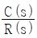
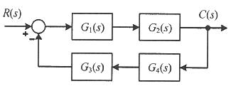
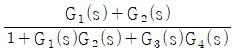
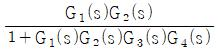
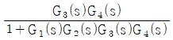
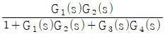

## 38. 문제

38. 전기화재의 원인 중 하나인 누설전류를 검출하기 위해 사용
되는 것은?
    ① 부족전압계전기
    ② 영상변류기
    ③ 계기용변압기
    ④ 과전류계전기
<문제 해설>
고장전류도 그렇지만 평상 시 누설전류가 발생해도 전류 불평형
을 생긴다.
영상변류기는 비대칭 전류를 취득한다.
[해설작성자 : 전류조심하자]

### 정답

1번

### 해설

정답은 1번입니다. 선택지의 핵심개념 을 확인하세요.

### 그림

## 39. 문제

39. 그림의 블록선도에서 
 을 구하면?
    
    ① 
    ② 
    ③ 
    ④ 
<문제 해설>
C/R
C = R에서 C로 가는 직선
R = 1 - 루프
루프란 직선과 돌아오는 값을 다 곱해준 뒤 앞에 마이너스(-)를 
붙인다
[해설작성자 : 합격할수있다]

### 정답

1번

### 해설

정답은 1번입니다. 선택지의 핵심개념 을 확인하세요.

### 그림

## 40. 문제

40. 한 변의 길이가 150mm인 정방형 회로에 1A의 전류가 흐를 
때 회로 중심에서의 자계의 세기는 약 몇 AT/m 인가?
    ① 5
② 6
    ③ 9
④ 21
<문제 해설>
정방형(정사각형)에서 자계의 세기 공식 H(자계세기) = 2√2 * I 
/(π*L)
* I : 전류 [A], L : 한변의 길이[m]
H(자계세기) = 2√2 * I /(π*L) = 2√2 * 1 /(π*0.15) =6
[해설작성자 : comcbt.com 이용자]

### 정답

1번

### 해설

정답은 1번입니다. 선택지의 핵심개념 을 확인하세요.

### 그림

