# 소방설비기사(전기분야)20220424(해설집) - 소방전기회로

> 원본: `소방설비기사(전기분야)20220424(해설집).pdf`
> 개인학습용 변환본.

## 21. 문제

21. 정전용량이 각각 1㎌, 2㎌, 3㎌이고, 내압이 모두 동일한 3
개의 커패시터가 있다. 이 커패시터들을 직렬로 연결하여 
양단에 전압을 인가한 후 전압을 상승시키면 가장 먼저 절
연이 파괴되는 커패시터는? (단, 커패시터의 재질이나 형태
는 동일하다.)
    ① 1㎌
② 2㎌
    ③ 3㎌
④ 3개 모두
<문제 해설>
각 커패시터에 걸리는 전압은
V1:V2:V3=1:1/2:1/3=3:2:1
V1=3/6V, V2=2/6V, V3=1/6V
내압이 동일하므로 전원전압을 서서히 상승시
전압이 많이 걸리는 순으로 파괴된다.
1uF > 2uF > 3uF
[해설작성자 : 소방전기공부중]

### 정답

1번

### 해설

정답은 1번입니다. 선택지의 핵심개념 을 확인하세요.

### 그림

## 22. 문제

22. 그림과 같은 블록선도의 전달함수 
 는?
    
    ① 6/23
② 6/7
    ③ 6/15
④ 6/11
<문제 해설>
1×2×3 / 1-(-1×2×2-1×2×3)
= 6 / 1+4+6
= 6 / 11
[해설작성자 : 소방전기공부중]

### 정답

1번

### 해설

정답은 1번입니다. 선택지의 핵심개념 을 확인하세요.

### 그림

## 23. 문제

23. 그림의 단상 반파 정류회로에서 R에 흐르는 전류의 평균값
은 약 몇 A 인가? (단, v(t) = 220√2sinωt(V), R＝16√2(Ω), 
다이오드의 전압강하는 무시한다.)
    
    ① 3.2
② 3.8
    ③ 4.4
④ 5.2
<문제 해설>
단상반파정류회로 V(평균값)=Vm/ㅠ
I=(Vm/ㅠ)/R=(220루트2/ㅠ)/16루트2=4.37676
[해설작성자 : 소방전기공부중]
반파 다이오드는 ed = 루트2 * v / 파이 = 0.45v
따라서 0.45 * 220 = 99
99 / 16*루트2 = 4.38
[해설작성자 : 검은우주]
정류회로는 마이너스 값이 없으므로 기하평균값이 아니라 산술
평균값을 가진다..
전파정류의 산술평균값은 2/파이(=0.636), 반파정류는 1/파이
(=0.318)이다..
따라서 220/16 * 0.318 = 4.37
[해설작성자 : comcbt.com 이용자]

### 정답

1번

### 해설

정답은 1번입니다. 선택지의 핵심개념 을 확인하세요.

### 그림

## 24. 문제

24. 3상 유도 전동기를 Y 결선으로 운전했을 때 토크가 TY이었
다. 이 전동기를 동일한 전원에서 △결선으로 운전했을 때 
토크(T△)는?
    ① 
    ② 
    ③ 
    ④ 
<문제 해설>
Y결선시
기동전압은 델타결선의 1/루트3 배,
기동전류와 토크는 델타결선의 1/3 배 감소된다.
[해설작성자 : 소방전기공부중]
ex)
y결선시 T(y)=1/3 T(델타)
델타결선시   T(델타)=3T(y)
[해설작성자 : 철선생님]

### 정답

1번

### 해설

정답은 1번입니다. 선택지의 핵심개념 을 확인하세요.

### 그림

## 25. 문제

25. 제어요소가 제어 대상에 가하는 제어 신호로 제어장치의 출
력인 동시에 제어 대상의 입력이 되는 것은?
    ① 조작량
② 제어량
    ③ 기준입력
④ 동작신호
<문제 해설>
<피드백 제어=폐루프 제어계>
목표값->제어요소(조절부+조작부)->(조작량)->제어대상
                 ㄴ-(피드백)---검출부<--/
[해설작성자 : 소방전기공부중]
2과목 : 소방전기회로

본 해설집은 최강 자격증 기출문제 전자문제집 CBT 해설달기 프로젝트에 의해서 만들어진 자료입니다. 해설을 제공해 주신 모든 분들께 감사 드립니다.
소방설비기사(전기분야)
◐2022년 04월 24일 필기 기출문제 및 해설집◑
전자문제집 CBT : www.comcbt.com
기출문제 해설은 최강 자격증 기출문제 전자문제집 CBT : www.comcbt.com 통해서 실시간으로 변경됩니다.

### 정답

1번

### 해설

정답은 1번입니다. 선택지의 핵심개념 을 확인하세요.

### 그림

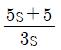
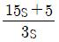
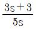
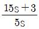

## 26. 문제

26. 어떤 코일의 임피던스를 측정하고자 한다. 이 코일에 30V의 
직류전압을 가했을 때 300W가 소비되었고, 100V의 실효치 
교류전압을 가했을 때 1200W가 소비되었다. 이 코일의 리
액턴스(Ω)는?
    ① 2
② 4
    ③ 6
④ 8
<문제 해설>
<직류>
소비전력 P=V^2/R=30^2/R=300[W]
R=3
<교류>
임피던스 Z=R+jX=3+jX
P=(V^2/Z)×cos@
=(100^2/루트(3^2+X^2))×3/5=1200[W]
(여기서 cos@=R/Z)
X=4
[해설작성자 : 소방전기공부중]
p=I^2×R = (V/Z)^2×R = (V/루트(R^2+X^2))^2×R
[해설작성자 : comcbt.com 이용자]
P=I^2R,1200=I^2×3,I^2=1200/3,I=루트1200/3,I=20A
Z=V/I,Z=100/20=5,Z=루트R^2+X^2,X=루트5^2-3^2=4
[해설작성자 : comcbt.com 이용자]
P[W] = V^2 / R ▶ R[Ω] = V^2 / P ▶ 30^2 / 300 = 3[Ω]
P'[W] = I^2 * R ▶ I[A] = √( P' / R ) ▶ √( 1200 / 3 ) = 
20[A]
Z[Ω] = V / I ▶ 100 / 20 = 5[Ω] ▶ Z[Ω] = √( R^2 + X^2 
) ▶ X[Ω] = √( Z^2 - R^2 ) ▶ √( 5^2 - 3^2 ) = 4[Ω]
[해설작성자 : 따고싶다 or 어디든 빌런]

### 정답

1번

### 해설

정답은 1번입니다. 선택지의 핵심개념 을 확인하세요.

### 그림

## 27. 문제

27. 적분 시간이 3sec이고, 비례 감도가 5인 PI(비례적분) 제어 
요소가 있다. 이 제어 요소의 전달함수는?
    ① 
② 
    ③ 
④ 
<문제 해설>
5(1+(1/3s))=5+5/3s=(15s+5)/3s
[해설작성자 : 소방전기공부중]

### 정답

1번

### 해설

정답은 1번입니다. 선택지의 핵심개념 을 확인하세요.

### 그림

## 28. 문제

28. 100V에서 500W를 소비하는 전열기가 있다. 이 전열기에 
90V 의 전압을 인가했을 때 소비되는 전력(W)은?
    ① 81
② 90
    ③ 405
④ 450
<문제 해설>
V1 = 100 V , P1 = 500 W / V2 = 90, P2 = ?
P = VI = V^2/R -> R=V^2/P
같은 전열기이므로 저항은 같아서 V2^2/P2 = V1^2/P1
따라서 P2 = (V2^2/V1^2) * P1 = 405 W
[해설작성자 : comcbt.com 이용자]
P=V^2/R  500W=100^2/R  R=20오옴
         P=90^2/20=405W
[해설작성자 : 제주도 홀쭉이]
P[W] = V^2 / R ▶ R[Ω] = V^2 / P ▶ 100^2 / 50 = 20[Ω]
P'[W] = V^2 / R ▶ 90^2 / 20 = 405[W]
[해설작성자 : 따고싶다 or 어디든 빌런]
P는 V^2에 비례하므로
100^2 : 500 = 90^2 : x
-> 100^2 * X = 90^2 * 500
-> X = (90/100)^2 * 500 = 405W
비례관계로 쉽게 풀 수 있습니다.
[해설작성자 : 어려운소방]

### 정답

1번

### 해설

정답은 1번입니다. 선택지의 핵심개념 을 확인하세요.

### 그림

## 29. 문제

29. 4극 직류 발전기의 전기자 도체 수가 500개, 각 자극의 자
속이 0.01Wb, 회전수가 1800rpm일 때 이 발전기의 유도 
기전력(V)은? (단, 전기자 권선법은 파권이다.)
    ① 100
② 200
    ③ 300
④ 400
<문제 해설>
E=p@n(z/a)=p@(N/60)(z/a)
=4×0.01×(1800/60)×(500/2)
=300[V]
[해설작성자 : 소방전기공부중]
피자파이엔/60 = PzΦN/60
P=극수, z=도체수, Φ=자속, N=회전수, 60=1분
[해설작성자 : 전기기사따면소방3일컷이라매]
중권일때 병렬회로수는 극수와 같고 (a=p) 파권일때 회로수는 2
로고정 (a=2)
[해설작성자 : .]
유도 기전력)E[V] = P * Z * Φ * N / 60 * a ▶ 500 * 4 * 
0.01 * 1800 / 60 * 2 = 300[V]
[해설작성자 : 따고싶다 or 어디든 빌런]

### 정답

1번

### 해설

정답은 1번입니다. 선택지의 핵심개념 을 확인하세요.

### 그림

## 30. 문제

30. 진공 중에서 원점에 10-8C의 전하가 있을 때 점(1, 2, 2)m
에서의 전계의 세기는 약 몇 V/m 인가?
    ① 0.1
② 1
    ③ 10
④ 100
<문제 해설>
전계의 세기 E = Q / (4 *π*ε*r^2)
r=(1,2,2) vector 크기 구하는 방법 r=√(1^2+2^2+2^2) = 3
ε=ε0 * εs = 8.855*10^(-12) * 1 =  (4 *π*ε*r^2) (εs=1 ; 진
공 중에서)

본 해설집은 최강 자격증 기출문제 전자문제집 CBT 해설달기 프로젝트에 의해서 만들어진 자료입니다. 해설을 제공해 주신 모든 분들께 감사 드립니다.
소방설비기사(전기분야)
◐2022년 04월 24일 필기 기출문제 및 해설집◑
전자문제집 CBT : www.comcbt.com
기출문제 해설은 최강 자격증 기출문제 전자문제집 CBT : www.comcbt.com 통해서 실시간으로 변경됩니다.
E = E = Q / (4 *π*ε*r^2) = 10^(-8) / (4 *π*(4 *π*ε
*r^2)*3^2) = 10
[해설작성자 : comcbt.com 이용자]
쿨롱의 법칙 (9x10^9xQ)/r^2
=(9x10^9x10^-8)/1제곱+2제곱+2제곱
[해설작성자 : 자드가자]
전계의 세기)E[V/m] = 9 * 10^9 * ( Q / r^2 ) ▶ 9 * 10^9 * 
[ 10^-8 / √( 1^2 + 2^2 + 2^2 )^2 ] = 10[V/m]
[해설작성자 : 따고싶다 or 어디든 빌런]

### 정답

1번

### 해설

정답은 1번입니다. 선택지의 핵심개념 을 확인하세요.

### 그림

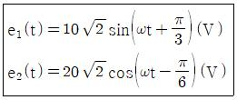
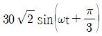
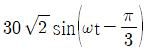
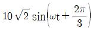
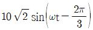
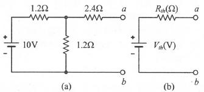

## 31. 문제

31. 정현파 교류전압 e1(t)과 e2(t)의 합(e1(t) + e2(t))은 몇 V 인
가?
    
    ① 
    ② 
    ③ 
    ④ 
<문제 해설>
변환방법
cos > sin+90도
[해설작성자 : 짜장왕]
공식이 생각나지 않을 경우, 이미 알고 있는 대표적인 정현파의 
기본값인 sin, cos 이 0 또는 90도가 되는 wt값을 넣어보면 됩
니다..
이 문제에서 wt를 60도로 넣게 되면 sin90도=1, cos0도=1이 됩
니다..
따라서 이 값과 동일한 최대값을 가지는 경우는 1번과 2번이며,
wt가 60도인 경우에 최대값을 가지는 것은 1번입니다..
[해설작성자 : comcbt.com 이용자]
아래와 같은 오류 신고가 있었습니다.
여러분들의 많은 의견 부탁 드립니다.
추후 여러분들의 의견을 반영하여 정답을 수정하도록 하겠습니
다.
참고로 정답 변경은 오류 신고 5회 이상일 경우 수정합니다.
[오류 신고 내용]
wt는 60도가 아닌 30도
[해설작성자 : Pjh]

### 정답

1번

### 해설

정답은 1번입니다. 선택지의 핵심개념 을 확인하세요.

### 그림

## 32. 문제

32. 60㎐의 3상 전압을 반파 정류하였을 때 리플(맥동) 주파수
(㎐)는?
    ① 60
② 120
    ③ 180
④ 360
<문제 해설>
   1f       2f      3f      6f
단상반파 단상전파 3상반파 3상전파
[해설작성자 : 짜장왕]

### 정답

1번

### 해설

정답은 1번입니다. 선택지의 핵심개념 을 확인하세요.

### 그림

## 33. 문제

33. 테브난의 정리를 이용하여 그림 (a)의 회로를 그림 (b)와 같
은 등가회로로 만들고자 할 때 Vth(V)와 Rth(Ω)은?
    
    ① 5V, 2Ω
② 5V, 3Ω
    ③ 6V, 2Ω
④ 6V, 3Ω
<문제 해설>
Vth는 가로1.2옴과 세로1.2옴중 세로1.2옴에
걸리는 전압(=a와 b가 걸린 전압)
(이때 2.4옴은 전류가 흐르지 않는 필요없는 부분)
10V를 가로1.2옴과 세로1.2옴에 각각 5V씩 걸리므로
Vth=5[V]
Rth는 전압원은 단락(직선으로 연결)하고,
a와 b사이의 저항들을 합성저항 구하면 됨
가로1.2옴과 세로1.2옴은 병렬, 2.4옴은 직렬
합성저항 구하면 Rth=3옴
[해설작성자 : 소방전기공부중]
Vth[V] = V * ( R2 / R1 + R2 ) ▶ 10 * ( 1.2 / 1.2 + 1.2 ) 
= 5[V]
Rth[Ω] = R3 + ( R1 + R2 / R1 * R2 ) ▶ 2.4 + ( 1.2 + 1.2 
/ 1.2 * 1.2 ) = 3[Ω]
[해설작성자 : 따고싶다 or 어디든 빌런]
Vth[V] = V * ( R2 / R1 + R2 ) ▶ 10 * ( 1.2 / 1.2 + 1.2 ) 
= 5[V]
Rth[Ω] = R3 + ( R1 + R2 / R1 * R2 ) ▶ 2.4 + ( 1.2 + 1.2 
/ 1.2 * 1.2 ) = 3[Ω]
[해설작성자 : 따고싶다 or 어디든 빌런]
병렬 전류는

본 해설집은 최강 자격증 기출문제 전자문제집 CBT 해설달기 프로젝트에 의해서 만들어진 자료입니다. 해설을 제공해 주신 모든 분들께 감사 드립니다.
소방설비기사(전기분야)
◐2022년 04월 24일 필기 기출문제 및 해설집◑
전자문제집 CBT : www.comcbt.com
기출문제 해설은 최강 자격증 기출문제 전자문제집 CBT : www.comcbt.com 통해서 실시간으로 변경됩니다.
R1 * R2 / R1 + R2 입니다
[해설작성자 : 소방설비공부하는 컴공]

### 정답

1번

### 해설

정답은 1번입니다. 선택지의 핵심개념 을 확인하세요.

### 그림

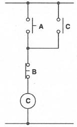
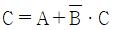
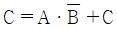
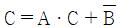
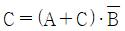
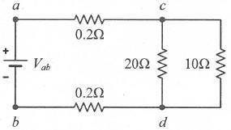

## 34. 문제

34. 어떤 전압계의 측정 범위를 12배로 하려고 할 때 배율기의 
저항은 전압계 내부저항의 몇 배로 해야 하는가?
    ① 9
② 10
    ③ 11
④ 12
<문제 해설>
전압계의 측정범위배율 = 1 + (배율기 저항)/(전압계의 내부저
항)
12 = 1+ (배율기저항)/(전압계 내부저항)
배율기저항 = 11 * 전압계 내부저항
[해설작성자 : comcbt.com 이용자]
배율기 배율)m = 1 + ( Rm / Ro ) ▶ 12 = 1 + ( Rm / Ro ) 
▶ Rm = ( 12 - 1 ) * Ro ▶ Rm = 11 * Ro
Ro : 전압계 내부 저항, Rm : 배율기 저항
[해설작성자 : 따고싶다 or 어디든 빌런]

### 정답

1번

### 해설

정답은 1번입니다. 선택지의 핵심개념 을 확인하세요.

### 그림

## 35. 문제

35. 각 상의 임피던스가 Z = 4＋j3(Ω)인 △결선의 평형 3상 부
하에 선간전압이 200V인 대칭 3상 전압을 가했을 때 이 부
하로 흐르는 선전류의 크기는 몇 A 인가?
    ① 40/3
② 40/√3
    ③ 40
④ 40√3
<문제 해설>
<델타결선>
선간전압=상전압=200V
Z=루트(4^2+3^2)=5
상전류=상전압/Z=200/5=40A
선간전류=루트3×상전류=루트3×40
[해설작성자 : 소방전기공부중]
△결선 = Vp(상전압) = VL(선간전압), √3 * Ip(상전류) = IL(선
전류)
Ip[A] = Vp / Z ▶ 200 / √( 4^2 + 3^2 ) = 40[A] ▶ IL[A] 
= √3 * 40  ▶ 40√3[A]
[해설작성자 : 따고싶다 or 어디든 빌런]

### 정답

1번

### 해설

정답은 1번입니다. 선택지의 핵심개념 을 확인하세요.

### 그림

## 36. 문제

36. 시퀀스회로를 논리식으로 표현하면?
    
    ① 
    ② 
    ③ 
    ④ 
<문제 해설>
A또는C 중 하나만 입력되어도 출력나옴=OR
B는 무조건 입력되어야 출력나옴=AND
또한 B는 B점접이므로=NOT=문자 위에 bar
(A or C) AND B_bar = C
[해설작성자 : 소방전기공부중]
A와 C는 병렬 ("A+C")
A+C와 B는 직렬 (A+C)*"B"
B는 -(B접점 '바')
따라서 (A+C)*B바
[해설작성자 : 시험전날 공부]

### 정답

1번

### 해설

정답은 1번입니다. 선택지의 핵심개념 을 확인하세요.

### 그림

## 37. 문제

37. 그림의 회로에서 a-b 간에 Vab(V)를 인가했을 때 c-d 간의 
전압이 100V이었다. 이때 a-b 간에 인가한 전압(Vab)은 몇 
V인가?
    
    ① 104
② 106
    ③ 108
④ 110
<문제 해설>
c-d 100V이므로 20옴도 100V,
10옴도 병렬이므로 동일한 100V임.
20옴에 흐르는 전류=100/20=5A
10옴에 흐르는 전류=100/10=10A
회로에 흐르는 총 전류=5+10=15A이므로
위아래 0.2옴 모두 15A가 흐른다.
0.2옴에 걸리는 전압을 구해주면
V=IR=15×0.2=3V
각 전압이 a-c(3V) c-d(100V) d-b(3V)이므로
Vab=3+100+3=106V
[해설작성자 : 소방전기공부중]
V=IR 이므로 접압과 저항은 비례관계
구간별 저항비율(=전압비율)
a-c(0.2):c-d(합성저항300/30):d-b(0.2)
= 0.2:10:0.2 = 3:100:3(합성저항구간이 100V이므로 기준으로 

본 해설집은 최강 자격증 기출문제 전자문제집 CBT 해설달기 프로젝트에 의해서 만들어진 자료입니다. 해설을 제공해 주신 모든 분들께 감사 드립니다.
소방설비기사(전기분야)
◐2022년 04월 24일 필기 기출문제 및 해설집◑
전자문제집 CBT : www.comcbt.com
기출문제 해설은 최강 자격증 기출문제 전자문제집 CBT : www.comcbt.com 통해서 실시간으로 변경됩니다.
삼음
따라서 더하면(3+100+3 = 106)
[해설작성자 : 대충그까이꺼]

### 정답

1번

### 해설

정답은 1번입니다. 선택지의 핵심개념 을 확인하세요.

### 그림

## 38. 문제

38. 균일한 자기장 내에서 운동하는 도체에 유도된 기전력의 방
향을 나타내는 법칙은?
    ① 플레밍의 왼손 법칙
    ② 플레밍의 오른손 법칙
    ③ 암페어의 오른나사 법칙
    ④ 패러데이의 전자유도 법칙
<문제 해설>

### 정답

1번

### 해설

정답은 1번입니다. 선택지의 핵심개념 을 확인하세요.

### 그림

## 39. 문제

39. 회로에서 저항 5Ω의 양단 전압 VR(V)은?
    
    ① -10
② -7
    ③ 7
④ 10
<문제 해설>
전압원 또는 전류원이 여러개라면 각각 따로 생각해야함
[☆제거시 전압원:단락, 전류원:개방]
<3V 전압원일 경우를 생각>
그외 나머지 모든 전압원,전류원 모두 제거
2A 전류원이 개방되어 끊어진 회로가 되어
회로에 전류가 흐르지 않으므로
5옴에 걸리는 전압은 없다.
<2A 전류원일 경우를 생각>
그외 나머지 모든 전압원,전류원 모두 제거
3V가 단락되어 2A전류원이 그대로 5옴에 흐르게 된다.
V=5옴×2A=10V
+VR-에 전류가 반대방향으로 흐르므로 부호는 (-)
[해설작성자 : 소방전기공부중]
전압원은 전압의 크기가 일정하다는 것이고, 전류의 크기 및 방
향은 변할수 있습니다..
전류원은 전류의 크기 및 방향이 일정하고, 여기에 걸리는 전압
이 변할수 있습니다..
즉, 전류원은 방향이 이미 결정되어 있어서 전류가 반대로 흐를
수 없지만,
전압원은 전류를 내 보낼수도, 전류를 받아들일수도 있습니다..
따라서 전압원과 전류원이 동시에 존재하는 회로에서는,
전류원으로 먼저 해석을 하고, 추가로 해석이 필요한 경우에 전
압원에 대한 해석을 진행하면 됩니다..
이 문제의 경우에는 전류원 자체만으로도 저항에 걸리는 전압이 
-10V로 바로 계산되기 때문에 전체 회로 해석을 할 필요가 없
습니다..
[해설작성자 : comcbt.com 이용자]
전류원 개방 시 끊긴 회로이며 전류가 흘리지 않음
전압원 단락시)Vr[V] = -I * R ▶ -2 * 5 = -10[V]
(전류가 현재 - 방향으로 흐르고 있기 때문)
[해설작성자 : 따고싶다 or 어디든 빌런]

### 정답

1번

### 해설

정답은 1번입니다. 선택지의 핵심개념 을 확인하세요.

### 그림

## 40. 문제

40. 다음의 논리식을 간단히 표현한 것은?
    
    ① 
② 
    ③ 
④ 
<문제 해설>
A_•(B_C+BC_+BC)
=A_•(B_C+BC+BC_+BC)
=A_•((B_+B)•C+(C_+C)•B)
=A_•(1•C+1•B)
=A_•(C+B)
[해설작성자 : 소방전기공부중]

### 정답

1번

### 해설

정답은 1번입니다. 선택지의 핵심개념 을 확인하세요.

### 그림

