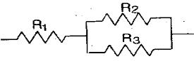
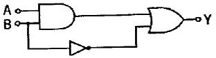
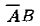
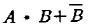
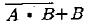
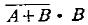
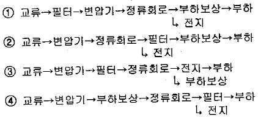

# 소방설비기사(전기분야)20150308(교사용) - 소방관계법규

> 원본: `소방설비기사(전기분야)20150308(교사용).pdf`
> 개인학습용 변환본.

## 41. 문제

41. 위험물안전관리법령에서 규정하는 제3류 위험물의 품명에 
속하는 것은?
    ❶ 나트륨
② 염소산염류
    ③ 무기과산화물
④ 유기과산화물

### 정답

1번

### 해설

정답은 1번입니다. 선택지의 핵심개념 을 확인하세요.

### 그림

## 42. 문제

42. 소방특별조사 결과 화재예방을 위하여 필요한 때 관계인에
게 소방대상물의 개수·이전·제거, 사용의 금지 또는 제한 등
의 필요한 조치를 명할 수 있는 사람이 아닌 것은?(관련 규
정 개정전 문제로 여기서는 기존 정답인 4번을 누르면 정답 
처리됩니다. 자세한 내용은 해설을 참고하세요.)
    ① 소방서장
② 소방본부장
    ③ 국민안전처장관
❹ 시·도지사

### 정답

1번

### 해설

정답은 1번입니다. 선택지의 핵심개념 을 확인하세요.

### 그림

## 43. 문제

43. 소방시설관리사 시험을 시행하고자 하는 때에는 응시자격등 
필요한 사항을 시험 시행일 며칠 전까지 일간신문에 공고하
여야 하는가?
    ① 15
② 30
    ③ 60
❹ 90

### 정답

1번

### 해설

정답은 1번입니다. 선택지의 핵심개념 을 확인하세요.

### 그림

## 44. 문제

44. 소방대장은 화재, 재난·재해, 그 밖의 위급한 상황이 발생한 
현장에 소방활동구역을 정하여 지정한 사람 외에는 그 구역
에 출입하는 것을 제한 할 수 있다. 소방활동구역을 출입할 
수 없는 사람은?
    ① 의사·간호사 그 밖의 구조·구급업무에 종사하는 사람
    ② 수사업무에 종사하는 사람
    ❸ 소방활동구역 밖의 소방대상물을 소유한 사람
    ④ 전기·가스 등의 업무에 종사하는 사람으로서 원활한 소
방활동을 위하여 필요한 사람

### 정답

1번

### 해설

정답은 1번입니다. 선택지의 핵심개념 을 확인하세요.

### 그림

## 45. 문제

45. 소방공사업자가 소방시설공사를 마친 때에는 완공검사를 받
아야하는데 완공검사를 위한 현장 확인을 할 수 있는 특정 
소방대상물의 범위에 속하지 않는 것은? (단, 가스계소화설
비를 설치하지 않는 경우이다.)
    ① 문화 및 집회시설
② 노유자시설
    ③ 지하상가
❹ 의료시설

### 정답

1번

### 해설

정답은 1번입니다. 선택지의 핵심개념 을 확인하세요.

### 그림

## 46. 문제

46. 제조소 등의 위치·구조 또는 설비의 변경 없이 당해 제조소
등에서 저장하거나 취급하는 위험물의 품명·수량 또는 지정
수량의 배수를 변경하고자 할 때는 누구에게 신고해야 하는
가?
    ① 국무총리
❷ 시·도지사
    ③ 국민안전처장관
④ 관할소방서장

### 정답

1번

### 해설

정답은 1번입니다. 선택지의 핵심개념 을 확인하세요.

### 그림

## 47. 문제

47. 하자를 보수하여야 하는 소방시설에 따른 하자보수 보증기
간의 연결이 옳은 것은?
    ① 무선통신보조설비 : 3년
    ❷ 상수도소화용수설비 : 3년
    ③ 피난기구 : 3년
    ④ 자동화재탐지설비 : 2년
3과목 : 소방관계법규

소방설비기사(전기분야)
◐2015년 03월 08일 필기 기출문제 ◑
전자문제집 CBT : www.comcbt.com
최강 자격증 기출문제 전자문제집 CBT : www.comcbt.com

### 정답

1번

### 해설

정답은 1번입니다. 선택지의 핵심개념 을 확인하세요.

### 그림

## 48. 문제

48. 1급 소방안전관리 대상물에 해당하는 건축물은?
    ① 연면적 15000 m2 이상인 동물원
    ❷ 층수가 15층인 업무시설
    ③ 층수가 20층인 아파트
    ④ 지하구

### 정답

1번

### 해설

정답은 1번입니다. 선택지의 핵심개념 을 확인하세요.

## 49. 문제

49. 피난시설, 방화구획 및 방화시설을 폐쇄·훼손·변경등의 행위
를 3차 이상 위반한 자에 대한 과태료는?(관련 규정 개정전 
문제로 여기서는 2번을 누르면 정답 처리 됩니다. 자세한 
내용은 해설을 참고하세요.)
    ① 2백만원
❷ 3백만원
    ③ 5백만원
④ 1천만원

### 정답

1번

### 해설

정답은 1번입니다. 선택지의 핵심개념 을 확인하세요.

## 50. 문제

50. 관계인이 예방규정을 정하여야 하는 옥외저장소는 지정 수
량의 몇 배 이상의 위험물을 저장하는 것을 말하는가?
    ① 10
❷ 100
    ③ 150
④ 200

### 정답

1번

### 해설

정답은 1번입니다. 선택지의 핵심개념 을 확인하세요.

## 51. 문제

51. 다음의 위험물 중에서 위험물안전관리법령에서 정하고 있는 
지정수량이 가장 적은 것은?
    ① 브롬산염류
② 유황
    ❸ 알칼리토금속
④ 과염소산

### 정답

1번

### 해설

정답은 1번입니다. 선택지의 핵심개념 을 확인하세요.

## 52. 문제

52. 소방기본법에서 규정하는 소방용수시설에 대한 설명으로 틀
린 것은?
    ① 시·도지사는 소방활동에 필요한 소화전·급수탑·저수조를 
설치하고 유지·관리하여야 한다.
    ② 소방본부장 또는 소방서장은 원활한 소방활동을 위하여 
소방용수시설에 대한 조사를 월 1회 이상 실시하여야 한
다.
    ③ 소방용수시설 조사의 결과는 2년간 보관하여야 한다.
    ❹ 수도법의 규정에 따라 설치된 소화전도 시·도지사가 유
지·관리해야 한다.

### 정답

1번

### 해설

정답은 1번입니다. 선택지의 핵심개념 을 확인하세요.

## 53. 문제

53. 무창층 여부 판단 시 개구부 요건기준으로 옳은 것은?
    ① 해당 층의 바닥면으로부터 개구부 밑부분까지의 높이가 
1.5m 이내일 것
    ❷ 개구부의 크기가 지름 50cm 이상의 원이 내접할 수 있
을 것
    ③ 개구부는 도로 또는 차량이 진입할 수 없는 빈터를 향할 
것
    ④ 내부 또는 외부에서 쉽게 파괴 또는 개방할 수 없을 것

### 정답

1번

### 해설

정답은 1번입니다. 선택지의 핵심개념 을 확인하세요.

## 54. 문제

54. 아파트로서 층수가 20층인 특정소방대상물에는 몇 층이상의 
층에 스프링클러설비를 설치해야 하는가?(관련 규정이 개정
되었습니다. 여기서는 4번을 누르면 정답 처리 됩니다. 자세
한 내용은 해설을 참고하세요.)
    ① 6층
② 11층
    ③ 16층
❹ 전층

### 정답

1번

### 해설

정답은 1번입니다. 선택지의 핵심개념 을 확인하세요.

## 55. 문제

55. 소방시설업을 등록할 수 있는 사람은?
    ① 한정치산자
    ② 소방기본법에 따른 금고 이상의 실형을 선고 받고 그 집
행이 종료된 후 1년이 경과한 사람
    ③ 위험물안전관리법에 따른 금고 이상의 형의 집행유예를 
선고받고 그 유예기간 중에 있는 사람
    ❹ 등록하려는 소방시설업 등록이 취소된 날부터 2년이 경
과한 사람

### 정답

1번

### 해설

정답은 1번입니다. 선택지의 핵심개념 을 확인하세요.

## 56. 문제

56. 소방시설 설치·유지 및 안전관리에 관한 법률에서 규정하는 
소방용품 중 경보설비를 구성하는 제품 또는 기기에 해당하
지 않는 것은?
    ❶ 비상조명등
② 누전경보기
    ③ 발신기
④ 감지기

### 정답

1번

### 해설

정답은 1번입니다. 선택지의 핵심개념 을 확인하세요.

## 57. 문제

57. 제4류 위험물을 저장하는 위험물제조소의 주의사항을 표시
한 게시판의 내용으로 적합한 것은?
    ❶ 화기엄금
② 물기엄금
    ③ 화기주의
④ 물기주의

### 정답

1번

### 해설

정답은 1번입니다. 선택지의 핵심개념 을 확인하세요.

## 58. 문제

58. 위험물안전관리법령에 의하여 자체소방대에 배치해야 하는 
화학소방자동차의 구분에 속하지 않는 것은?
    ① 포수용액 방사차
❷ 고가 사다리차
    ③ 제독차
④ 할로겐화합물 방사차

### 정답

1번

### 해설

정답은 1번입니다. 선택지의 핵심개념 을 확인하세요.

## 59. 문제

59. 소방력의 기준에 따라 관할구역 안의 소방력을 확충하기 위
한 필요 계획을 수립하여 시행하는 사람은?
    ① 소방서장
② 소방본부장
    ❸ 시·도지사
④ 자치소방대장

### 정답

1번

### 해설

정답은 1번입니다. 선택지의 핵심개념 을 확인하세요.

## 60. 문제

60. 다음 소방시설 중 소화활동설비가 아닌 것은?
    ① 제연설비
② 연결송수관설비
    ③ 무선통신보조설비
❹ 자동화재탐지설비

### 정답

1번

### 해설

정답은 1번입니다. 선택지의 핵심개념 을 확인하세요.
