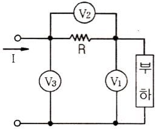
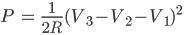
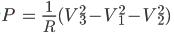
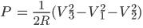
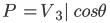
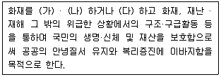

# 소방설비기사(전기분야)20150531(교사용) - 소방관계법규

> 원본: `소방설비기사(전기분야)20150531(교사용).pdf`
> 개인학습용 변환본.

## 41. 문제

41. 소방자동차의 출동을 방해한 자는 5년 이하의 징역 또는 얼
마 이하의 벌금에 처하는가?(2018년 03월 27일 개정된 규
정 적용됨)
    ① 1천5백만원
② 2천만원
    ③ 3천만원
❹ 5천만원

### 정답

1번

### 해설

정답은 1번입니다. 선택지의 핵심개념 을 확인하세요.

### 그림

## 42. 문제

42. 제4류 위험물로서 제1석유류인 수용성 액체의 지정수량은 
몇 리터인가?
    ① 100
② 200
    ③ 300
❹ 400

### 정답

1번

### 해설

정답은 1번입니다. 선택지의 핵심개념 을 확인하세요.

### 그림

## 43. 문제

43. 고형알코올 그 밖에 1기압 상태에서 인화점이 40 ℃ 미만인 
고체에 해당하는 것은?
    ① 가연성고체
② 산화성고체
    ❸ 인화성고체
④ 자연발화성물질

### 정답

1번

### 해설

정답은 1번입니다. 선택지의 핵심개념 을 확인하세요.

### 그림

## 44. 문제

44. 소방대상물이 아닌 것은?
    ① 산림
❷ 항해중인 선박
    ③ 건축물
④ 차량

### 정답

1번

### 해설

정답은 1번입니다. 선택지의 핵심개념 을 확인하세요.

### 그림

## 45. 문제

45. 비상경보설비를 설치하여야 할 특정소방대상물이 아닌 것
은?
    ① 지하가 중 터널로서 길이가 1000m 이상인 것
    ② 사람이 거주하고 있는 연면적 400m2 이상인 건축물
    ③ 지하층의 바닥면적이 100m2 이상으로 공연장인 건축물
    ❹ 35명의 근로자가 작업하는 옥내작업장

### 정답

1번

### 해설

정답은 1번입니다. 선택지의 핵심개념 을 확인하세요.

### 그림

## 46. 문제

46. 시·도지사가 소방시설업의 등록취소처분이나 영업정지처분
을 하고자 할 경우 실시하여야 하는 것은?
    ❶ 청문을 실시하여야 한다.
    ② 징계위원회의 개최를 요구하여야 한다.
    ③ 직권으로 취소 처분을 결정하여야 한다.
    ④ 소방기술심의위원회의 개최를 요구하여야 한다.

### 정답

1번

### 해설

정답은 1번입니다. 선택지의 핵심개념 을 확인하세요.

### 그림

## 47. 문제

47. 다음은 소방기본법의 목적을 기술한 것이다. (가), (나), (다)
에 들어갈 내용으로 알맞은 것은?
    
    ① (가) 예방, (나) 경계, (다) 복구
    ② (가) 경보, (나) 소화, (다) 복구
    ❸ (가) 예방, (나) 경계, (다) 진압
    ④ (가) 경계, (나) 통제, (다) 진압

### 정답

1번

### 해설

정답은 1번입니다. 선택지의 핵심개념 을 확인하세요.

### 그림

## 48. 문제

48. 위험물 제조소 등에 자동화재탐지설비를 설치하여야 할 대
상은?
    ① 옥내에서 지정수량 50배의 위험물을 저장·취급하고 있는 
일반취급소
    ② 하루에 지정수량 50배의 위험물을 제조하고 있는 제조소
    ❸ 지정수량의 100배의 위험물을 저장·취급하고 있는 옥내
저장소
    ④ 연면적 100m2 이상의 제조소

### 정답

1번

### 해설

정답은 1번입니다. 선택지의 핵심개념 을 확인하세요.

### 그림

## 49. 문제

49. 소방시설 중 화재를 진압하거나 인명구조활동을 위하여 사
용하는 설비로 나열된 것은?
    ① 상수도소화용설비, 연결송수관설비
    ❷ 연결살수설비, 제연설비
    ③ 연소방지설비, 피난설비
    ④ 무선통신보조설비, 통합감시시설

### 정답

1번

### 해설

정답은 1번입니다. 선택지의 핵심개념 을 확인하세요.

### 그림

## 50. 문제

50. 다음 중 스프링클러설비를 의무적으로 설치하여야 하는 기
준으로 틀린 것은?
    ① 숙박시설로 11층 이상인 것
    ② 지하가로 연면적이 1000 m2 이상인 것
    ❸ 판매시설로 수용인원이 300인 이상인 것
    ④ 복합건축물로 연면적 5000 m2 이상인 것

### 정답

1번

### 해설

정답은 1번입니다. 선택지의 핵심개념 을 확인하세요.

### 그림

## 51. 문제

51. "무창층"이라 함은 지상층 중 개구부 면적의 합계가 해당 층
의 바닥면적의 얼마 이하가 되는 층을 말하는가?
    ① 1/3
② 1/10
    ❸ 1/30
④ 1/300

### 정답

1번

### 해설

정답은 1번입니다. 선택지의 핵심개념 을 확인하세요.

### 그림

## 52. 문제

52. 다음 중 특수가연물에 해당되지 않는 것은?
    ① 나무껍질 500kg     ❷ 가연성고체류 2000kg
    ③ 목재가공품 15 m3   ④ 가연성액체류 3 m3

### 정답

1번

### 해설

정답은 1번입니다. 선택지의 핵심개념 을 확인하세요.

### 그림

## 53. 문제

53. 소화활동을 위한 소방용수시설 및 지리조사의 실시 횟수는?
    ① 주 1회 이상
② 주 2회 이상
    ❸ 월 1회 이상
④ 분기별 1회 이상

### 정답

1번

### 해설

정답은 1번입니다. 선택지의 핵심개념 을 확인하세요.

### 그림

## 54. 문제

54. 인접하고 있는 시 · 도간 소방업무의 상호응원협정 사항이 
아닌 것은?
    ① 화재조사 활동
3과목 : 소방관계법규

소방설비기사(전기분야)
◐2015년 05월 31일 필기 기출문제 ◑
전자문제집 CBT : www.comcbt.com
최강 자격증 기출문제 전자문제집 CBT : www.comcbt.com
    ② 응원출동의 요청방법
    ❸ 소방교육 및 응원출동훈련
    ④ 응원출동대상지역 및 규모

### 정답

1번

### 해설

정답은 1번입니다. 선택지의 핵심개념 을 확인하세요.

### 그림

## 55. 문제

55. 제1류 위험물 산화성고체에 해당하는 것은?
    ❶ 질산염류
② 특수인화물
    ③ 과염소산
④ 유기과산화물

### 정답

1번

### 해설

정답은 1번입니다. 선택지의 핵심개념 을 확인하세요.

## 56. 문제

56. 소방대상물에 대한 개수 명령권자는?
    ❶ 소방본부장 또는 소방서장
② 한국소방안전협회장
    ③ 시 · 도지사              
④ 국무총리

### 정답

1번

### 해설

정답은 1번입니다. 선택지의 핵심개념 을 확인하세요.

## 57. 문제

57. 다음 중 소방용품에 해당되지 않는 것은?
    ① 방염도료
② 소방호스
    ③ 공기호흡기
❹ 휴대용비상조명등

### 정답

1번

### 해설

정답은 1번입니다. 선택지의 핵심개념 을 확인하세요.

## 58. 문제

58. 다음 소방시설 중 하자보수보증기간이 다른 것은?
    ① 옥내소화전설비
❷ 비상방송설비
    ③ 자동화재탐지설비
④ 상수도소화용수설비

### 정답

1번

### 해설

정답은 1번입니다. 선택지의 핵심개념 을 확인하세요.

## 59. 문제

59. 소방시설업자가 특정소방대상물의 관계인에 대한 통보 의무
사항이 아닌 것은?
    ① 지위를 승계한 때
    ② 등록취소 또는 영업정지 처분을 받은 때
    ③ 휴업 또는 폐업한 때
    ❹ 주소지가 변경된 때

### 정답

1번

### 해설

정답은 1번입니다. 선택지의 핵심개념 을 확인하세요.

## 60. 문제

60. 특정소방대상물 중 노유자시설에 해당되지 않는 것은?
    ❶ 요양병원
② 아동복지시설
    ③ 장애인직업재활시설
④ 노인의료복지시설

### 정답

1번

### 해설

정답은 1번입니다. 선택지의 핵심개념 을 확인하세요.
