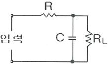
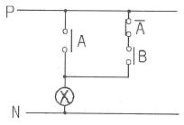
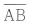
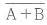
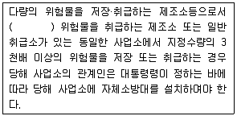

# 소방설비기사(전기분야)20160306(교사용) - 소방관계법규

> 원본: `소방설비기사(전기분야)20160306(교사용).pdf`
> 개인학습용 변환본.

## 41. 문제

41. 특정소방대상물의 관계인이 소방안전관리자를 해임한 경우 
재선임 신고를 해야 하는 기준은? (단, 해임한 날부터를 기
준일로 한다.)
    ① 10일 이내
② 20일 이내
    ❸ 30일 이내
④ 40일 이내

### 정답

1번

### 해설

정답은 1번입니다. 선택지의 핵심개념 을 확인하세요.

### 그림

## 42. 문제

42. 시·도지사가 설치하고 유지·관리하여야 하는 소방용수시설이 
아니 것은?
    ① 저수조
❷ 상수도
    ③ 소화전
④ 급수탑

### 정답

1번

### 해설

정답은 1번입니다. 선택지의 핵심개념 을 확인하세요.

### 그림

## 43. 문제

43. ( )안의 내용으로 알맞은 것은?
    
    ① 제1류
② 제2류
    ③ 제3류
❹ 제4류

### 정답

1번

### 해설

정답은 1번입니다. 선택지의 핵심개념 을 확인하세요.

### 그림

## 44. 문제

44. 소방시설공사업자의 시공능력평가 방법에 대한 설명 중 틀
린 것은?
    ① 시공능력평가액은 실적평가액 + 자본금평가액 + 기술력
평가액 ± 신인도평가액으로 산출한다.
    ② 신인도평가액 산정 시 최근 1년간 국가기관으로 부터 우
수시공업자로 선정된 경우에는 3% 가산 한다.
    ③ 신인도평가액 산정 시 최근 1년간 부도가 발생된 사실이 
있는 경우에는 2%를 감산한다.
    ❹ 실적평가액은 최근 5년간의 연평균공사실적액을 의미한
다.

### 정답

1번

### 해설

정답은 1번입니다. 선택지의 핵심개념 을 확인하세요.

### 그림

## 45. 문제

45. 소방시설의 자체점검에 관한 설명으로 옳지 않은 것은?
    ① 작동기능점검은 소방시설 등을 인위적으로 조작하여 정
상적으로 작동하는 것을 점검하는 것이다.
    ② 종합정밀점검은 설비별 주요 구성부품의 구조기준이 화
재안전기준 및 관련 법령에 적합한지 여부를 점검하는 
것이다.
    ❸ 종합정밀점검에는 작동기능점검의 사항이 해당되지 않는
다.
    ④ 종합정밀점검은 소방시설관리사가 참여한 경우 소방시설
관리업자 또는 소방안전 관리자로 선임된 소방시설관리
사·소방기술사 1명 이상을 점검자로 한다.

### 정답

1번

### 해설

정답은 1번입니다. 선택지의 핵심개념 을 확인하세요.

### 그림

## 46. 문제

46. 소방시설공사의 착공신고 시 첨부서류가 아닌 것은?
    ① 공사업자의 소방시설공사업 등록증 사본
    ② 공사업자의 소방시설공사업 등록수첩 사본
    ③ 해당 소방시설공사의 책임시공 및 기술관리를 하는 기술
인력의 기술등급을 증명하는 서류 사본
    ❹ 해당 소방시설을 설계한 기술인력자의 기술자격증 사본

### 정답

1번

### 해설

정답은 1번입니다. 선택지의 핵심개념 을 확인하세요.

### 그림

## 47. 문제

47. 시·도의 조례가 정하는 바에 따라 지정수량 이상의 위험물
을 임시로 저장·취급할 수 있는 기간 (㉠)과 임시저장 승인
권자 (㉡)는?
    ① ㉠ 30일 이내, ㉡ 시·도지사
    ② ㉠ 60일 이내, ㉡ 소방본부장
    ❸ ㉠ 90일 이내, ㉡ 관할소방서장
    ④ ㉠ 120일 이내, ㉡ 국민안전처장관

### 정답

1번

### 해설

정답은 1번입니다. 선택지의 핵심개념 을 확인하세요.

### 그림

## 48. 문제

48. 연면적이 500m2 이상인 위험물 제조소 및 일반취급소에 설
치하여야 하는 경보설비는?
    ❶ 자동화재탐지설비
② 확성장치
    ③ 비상경보설비
④ 비상방송설비

### 정답

1번

### 해설

정답은 1번입니다. 선택지의 핵심개념 을 확인하세요.

### 그림

## 49. 문제

49. 소방서의 종합상황실 실장이 서면 모사전송 또는 컴퓨터통
신 등으로 소방본부의 종합상황실에 보고하여야 하는 화재
가 아닌 것은?
    ① 사상자가 10인 발생한 화재
    ② 이재민이 100인 발생한 화재
    ③ 관공서·학교·정부미도정공장의 화재
    ❹ 재산피해액이 10억원 발생한 일반화재

### 정답

1번

### 해설

정답은 1번입니다. 선택지의 핵심개념 을 확인하세요.

### 그림

## 50. 문제

50. 소방시설업의 등록권자로 옳은 것은?
    ① 국무총리
❷ 시·도지사
    ③ 소방서장
④ 한국소방안전협회장
3과목 : 소방관계법규

소방설비기사(전기분야)
◐2016년 03월 06일 필기 기출문제 ◑
전자문제집 CBT : www.comcbt.com
최강 자격증 기출문제 전자문제집 CBT : www.comcbt.com

### 정답

1번

### 해설

정답은 1번입니다. 선택지의 핵심개념 을 확인하세요.

### 그림

## 51. 문제

51. 제3류 위험물 중 금수성 물품에 적응성이 있는 소화약제는?
    ① 물
② 강화액
    ❸ 팽창질석
④ 인산염류분말

### 정답

1번

### 해설

정답은 1번입니다. 선택지의 핵심개념 을 확인하세요.

## 52. 문제

52. 소방시설관리업의 등록을 반드시 취소해야 하는 사유에 해
당하지 않는 것은?
    ① 거짓으로 등록을 한 경우
    ❷ 등록기준 미달하게 된 경우
    ③ 다른 사람에게 등록증을 빌려준 경우
    ④ 등록의 결격사유에 해당하게 된 경우

### 정답

1번

### 해설

정답은 1번입니다. 선택지의 핵심개념 을 확인하세요.

## 53. 문제

53. 가연성가스를 저장·취급하는 시설로서 1급 소방안전관리대
상물의 가연성가스 저장·취급 기준으로 옳은 것은?
    ① 100톤 미만
    ② 100톤 이상 ~ 1000톤 미만
    ③ 500톤 이상 ~ 1000톤 미만
    ❹ 1000톤 이상

### 정답

1번

### 해설

정답은 1번입니다. 선택지의 핵심개념 을 확인하세요.

## 54. 문제

54. 소방기본법상 소방용수시설·소화기구 및 설비등의 설치명령
을 위반한 자의 과태료는?
    ① 100만원 이하
❷ 200만원 이하
    ③ 300만원 이하
④ 500만원 이하

### 정답

1번

### 해설

정답은 1번입니다. 선택지의 핵심개념 을 확인하세요.

## 55. 문제

55. 방염처리업의 종류가 아닌 것은?
    ① 섬유류 방염업
② 합성수지류 방염업
    ③ 합판·목재류 방염업
❹ 실내장식물류 방염업

### 정답

1번

### 해설

정답은 1번입니다. 선택지의 핵심개념 을 확인하세요.

## 56. 문제

56. 자동화재탐지설비를 설치하여야 하는 특정소방 대상물의 기
준으로 틀린 것은?
    ① 지하구
    ❷ 지하가 중 터널로서 길이 700m 이상인 것
    ③ 교정시설로서 연면적 2000m2 이상인 것
    ④ 복합건축물로서 연면적 600m2 이상인 것

### 정답

1번

### 해설

정답은 1번입니다. 선택지의 핵심개념 을 확인하세요.

## 57. 문제

57. 소방용수시설 저수조의 설치기준으로 틀린 것은?
    ① 지면으로부터의 낙차가 4.5m 이하일 것
    ❷ 흡수부분의 수심이 0.3m 이상일 것
    ③ 흡수관의 투입구가 사각형의 경우에는 한 변의 길이가 
60cm 이상일 것
    ④ 흡수관의 투입구가 원형의 경우에는 지름이 60 cm 이상
일 것

### 정답

1번

### 해설

정답은 1번입니다. 선택지의 핵심개념 을 확인하세요.

## 58. 문제

58. 화재현장에서 피난 등을 체험할 수 있는 소방체험관의 설립 
· 운영권자는?
    ❶ 시 · 도지사    
② 국민안전처장관
    ③ 소방본부장 또는 소방서장     ④ 한국소방안전협회장

### 정답

1번

### 해설

정답은 1번입니다. 선택지의 핵심개념 을 확인하세요.

## 59. 문제

59. 공동 소방안전관리자를 선임하여야 할 특정 소방대상물의 
기준으로 틀린 것은?(2021년 11월 30일 개정된 규정 적용
됨)
    ① 지하가
    ❷ 지하층을 포함한 층수가 16층 이상인 건축물
    ③ 지하층을 제외한 층수가 11층 이상인 건축물
    ④ 복합건축물로써 연면적 3만제곱미터 이상인 건축물

### 정답

1번

### 해설

정답은 1번입니다. 선택지의 핵심개념 을 확인하세요.

## 60. 문제

60. 종합정밀점검의 경우 점검인력 1단위가 하루 동안 점검할 
수 있는 특정소방대상물의 연면적 기준으로 옳은 것은?
    ① 12000 m2
❷ 10000 m2
    ③ 8000 m2
④ 6000 m2

### 정답

1번

### 해설

정답은 1번입니다. 선택지의 핵심개념 을 확인하세요.
