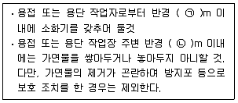
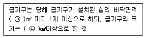
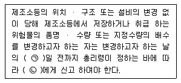
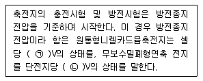

# 소방설비기사(전기분야)20170507(해설집) - 소방관계법규

> 원본: `소방설비기사(전기분야)20170507(해설집).pdf`
> 개인학습용 변환본.

## 41. 문제

41. 화재예방, 소방시설 설치∙유지 및 안전관리에 관한 법상 특
정소방대상물의 관계인이 소방시설에 폐쇄(잠금을 포함)∙차
단 등의 행위를 하여서 사람을 상해에 이르게 한 때에 대한 
벌칙기준으로 옳은 것은?
    ① 10년 이하의 징역 또는 1억원 이하의 벌금
    ② 7년 이하의 징역 또는 7000만원 이하의 벌금
    ③ 5년 이하의 징역 또는 5000만원 이하의 벌금
    ④ 3년 이하의 징역 또는 3000만원 이하의 벌금
<문제 해설>
걍 잠구면 5에5
잠구고 다치면 7에7
잠구고 사망시 10에10
[해설작성자 : comcbt.com 이용자]

### 정답

1번

### 해설

정답은 1번입니다. 선택지의 핵심개념 을 확인하세요.

### 그림

## 42. 문제

42. 소방기본법령상 불꽃을 사용하는 용접∙용단 기구의 용접 또
는 용단 작업장에서 지켜야 하는 사항 중 다음 ( )안에 알맞
은 것은?
    
    ① ㉠ 3, ㉡ 5
② ㉠ 5, ㉡ 3
    ③ ㉠ 5, ㉡ 10
④ ㉠ 10, ㉡ 5
<문제 해설>
위 문제는 오류 신고가 접수된 문제입니다.
전자문제집 CBT에서 최신 해설을 확인하세요.

### 정답

1번

### 해설

정답은 1번입니다. 선택지의 핵심개념 을 확인하세요.

### 그림

## 43. 문제

43. 화재위험도가 낮은 특정소방대상물 중 소방대가 조직되어 
24시간 근무하고 있는 청사 및 차고에 설치하지 아니할 수 
있는 소방시설이 아닌 것은?
    ① 자동화재탐지설비
    ② 연결송수관설비
    ③ 피난기구
    ④ 비상방송설비
<문제 해설>
화재위험도가 낮은 특정 소방대상물 中
<소방대가 조직되어 24시간 근무하고 있는 청사 및 차고에 설치
하지 아니할 수 있는 소방시설>
: 옥내소화전설비, 스프링클러설비, 물분무등소화설비, 비상방송
설비, 피난기구, 소화용수설비, 연결송수관설비, 연결살수설비
[해설작성자 : 김김이]

### 정답

1번

### 해설

정답은 1번입니다. 선택지의 핵심개념 을 확인하세요.

### 그림

## 44. 문제

44. 화재예방, 소방시설 설치∙유지 및 안전관리에 관한 법령상 
시∙도지사가 실시하는 방염성능 검사 대상으로 옳은 것은?
    ① 설치 현장에서 방염처리를 하는 합판∙목재
    ② 제조 또는 가공 공정에서 방염처리를 한 카펫
    ③ 제조 또는 가공 공정에서 방염처리를 한 창문에 설치하
는 블라인드
    ④ 설치 현장에서 방염처리를 하는 암막∙무대막
<문제 해설>
- 소방시설 설치ㆍ유지 및 안전관리에 관한 법률 시행령
제20조의2(시·도지사가 실시하는 방염성능검사) 법 제13조제1항
에서 “대통령령으로 정하는 방염대상물품”이란 제20조제1항에 
따른 방염대상물품 중 설치 현장에서 방염처리를 하는 합판ㆍ목
재를 말한다.
시.도지사가 실시하는것으로 1번이 맞습니다.
[해설작성자 : 소방따자]
제31조제1항제1호라목의 전시용 합판ㆍ목재 또는 무대용 합판
ㆍ목재 중 설치 현장에서 방염처리를 하는 합판ㆍ목재류
라. 전시용 합판ㆍ목재 또는 섬유판, 무대용 합판ㆍ목재 또는 섬
유판(합판ㆍ목재류의 경우 불가피하게 설치 현장에서 방염처리
한 것을 포함한다)
1번이 정답입니다.
[해설작성자 : comcbt.com 이용자]
소방청장이 실시 -> 제조 또는 가공 과정에서 방염처리되는 물
품
시•도지사가 실시 -> 방염대상물품 중 설치 현장에서 방염처리
하는 합판•목재
따라서 2, 3번은 사방청장이 실시하고, 4번은 제조 또는 가공 
과정에서 방염처리되는 물품이라 오답
[해설작성자 : 합격이쿠죠]

### 정답

1번

### 해설

정답은 1번입니다. 선택지의 핵심개념 을 확인하세요.

### 그림

## 45. 문제

45. 제조소등의 위치∙구조 및 설비의 기준 중 위험물을 취급하는 
건축물의 환기설비 설치 기준으로 다음 ( )안에 알맞은 것
은?
    
    ① ㉠ 100, ㉡ 800
② ㉠ 150, ㉡ 800
    ③ ㉠ 100, ㉡ 1000
④ ㉠ 150, ㉡1000
<문제 해설>
제조소 위치 구조 설비 기준- 환기설비 중 급기구 관련 내용
1.급기구는 당해 급기구 설치된 실의 바닥면적 150m^2 마다 1
개 이상, 급기구 크기는 800cm^2 이상.
2.바닥면적이 150m^2 미만 시
1) 60m2 미만 -> 150cm2 이상
2) 60m2 이상 90m2 미만 -> 300cm2 이상
3) 90m2 이상 120m2 미만 -> 450cm2 이상
4) 120m2 이상 150m2 미만 -> 600cm2 이상
[해설작성자 : 시험 1일전]

### 정답

1번

### 해설

정답은 1번입니다. 선택지의 핵심개념 을 확인하세요.

### 그림

## 46. 문제

46. 위험물안전관리법상 위험물시설의 변경 기준 중 다음 ( ) 안
에 알맞은 것은?(관련 규정 개정전 문제로 기존 정답은 2번
입니다. 여기서는 2번을 누르면 정답 처리 됩니다. 자세한 
내용은 해설을 참고하세요)
3과목 : 소방관계법규

본 해설집은 최강 자격증 기출문제 전자문제집 CBT 해설달기 프로젝트에 의해서 만들어진 자료입니다. 해설을 제공해 주신 모든 분들께 감사 드립니다.
소방설비기사(전기분야)
◐2017년 05월 07일 필기 기출문제 및 해설집◑
전자문제집 CBT : www.comcbt.com
기출문제 해설은 최강 자격증 기출문제 전자문제집 CBT : www.comcbt.com 통해서 실시간으로 변경됩니다.
    
    ① ㉠ 1, ㉡ 소방본부장 또는 소방서장
    ② ㉠ 1, ㉡ 시 ・ 도지사
    ③ ㉠ 7, ㉡ 소방본부장 또는 소방서장
    ④ ㉠ 7, ㉡ 시 ・ 도지사
<문제 해설>
2017년 7월 26일 개정안으로 인해
7일 -> 1일
총리령 -> 안전행정부령 으로 변경 되었다네요...
[해설작성자 : 물철]

### 정답

1번

### 해설

정답은 1번입니다. 선택지의 핵심개념 을 확인하세요.

### 그림

## 47. 문제

47. 소방기본법상 관계인의 소방활동을 위반하여 정당한 사유 
없이 소방대가 현장에 도착할 때까지 사람을 구출하는 조치 
또는 불을 끄거나 불이 번지지 아니하도록 하는 조치를 하
지 아니한 자에 대한 벌칙 기준으로 옳은 것은?
    ① 100만원 이하의 벌금
    ② 200만원 이하의 벌금
    ③ 300만원 이하의 벌금
    ④ 400만원 이하의 벌금
<문제 해설>
소방활동을 하지 않은 관계인-100만원 이하의 벌금(기본법 54
조)
[해설작성자 : 치악산호랑이]

### 정답

1번

### 해설

정답은 1번입니다. 선택지의 핵심개념 을 확인하세요.

### 그림

## 48. 문제

48. 소방기본법상 소방대장의 권한이 아닌 것은?
    ① 화재가 발생하였을 때에는 화재의 원인 및 피해 등에 대
한 조사
    ② 화재, 재난 ・ 재해 그 밖의 위급한 상황이 발생한 현장
에 소방활동구역을 정하여 소방활동에 필요한 사람으로
서 대통령령으로 정하는 사람 외에는 그 구역에 출입하
는 것을 제한
    ③ 사람을 구출하거나 불이 번지는 것을 막기 위하여 필요
할 때에는 화재가 발생하거나 불이 번질 우려가 있는 소
방대상물 및 토지를 일시적으로 사용하거나 그 사용의 
제한 또는 소방활동에 필요한 처분
    ④ 화재 진압 등 소방활동을 위하여 필요할때에는 소방용수 
외에 댐 ・ 저수지 또는 수영장 등의 물을 사용하거나 
수도의 개폐장치 등을 조작
<문제 해설>
제1절 조사책임
제4조(조사책임) ① 소방(방재·안전·재난)본부장 또는 소방서장
(이하 "본부장" 또는 "서장"이라 한다)은 관할구역내의 화재에 대
하여 조사를 하여야 한다.
② 운행중인 차량, 선박 및 항공기에서 발생한 화재는 소화활동
을 행한 장소를 관할하는 본부장 또는 서장이 조사하여야 한다.
[해설작성자 : 도리와수리]

### 정답

1번

### 해설

정답은 1번입니다. 선택지의 핵심개념 을 확인하세요.

### 그림

## 49. 문제

49. 시장지역에서 화재로 오인할 만한 우려가 이는 불을 피우거
나 연막소독을 하려는 자가 신고를 하지 아니하여 소방자동
차를 출동하게 한 자에 대한 과태료 부과 ・ 징수권자는?
    ① 국무총리
    ② 국민안전처장관
    ③ 시 ・ 도지사
    ④ 소방서장
<문제 해설>
기본법 57조

### 정답

1번

### 해설

정답은 1번입니다. 선택지의 핵심개념 을 확인하세요.

### 그림

## 50. 문제

50. 위험물안전관리법령상 제조소등의 완공검사 신청시기 기준
으로 틀린 것은?
    ① 지하탱크가 있는 제조소등의 경우에는 당해 지하탱크를 
매설하기 전
    ② 이동탱크저장소의 경우에는 이동저장탱크를 완공하고 상
치장소를 확보한 후
    ③ 이송취급소의 경우에는 이송배관 공사의 전체 또는 일부 
완료한 후
    ④ 배관을 지하에 설치하는 경우에는 소방서장이 지정하는 
부분을 매몰하고 난 직후
<문제 해설>
4.배관을 지하에 설치하는 경우에는 소방서장이 지정하는 부분
을 매몰하기 직전.
[해설작성자 : 자격증중독자]
완공검사를 하기 위해서는 검사를 해야 하는데, 매몰이나 매설
을 하게되면 검사 자체로 할수 없음.
[해설작성자 : comcbt.com 이용자]

### 정답

1번

### 해설

정답은 1번입니다. 선택지의 핵심개념 을 확인하세요.

### 그림

## 51. 문제

51. 소방시설공사업법령상 하자를 보수하여야 하는 소방시설과 
소방시설별 하자보수 보증기간으로 옳은 것은?
    ① 유도등 : 1년
    ② 자동소화장치 : 3년
    ③ 자동화재탐지설비 : 2년
    ④ 상수도소화용수설비 : 2년
<문제 해설>
2년: 유도등,유도표지,피난기구,비상조명등, 비상경보설비, 비상
방송설비, 무선통신보조설비등
3년 : 자동화재탐지설비, 상수도소화용수설비,주거용 주방자동소
화장치등
[해설작성자 : hanjjcc]
2년 - 피난기구, 유도등,유도표지, 비상조명등,비상경보설비,비
상방송설비, 무선통신보조설비(피,유2,비3,무)
3년 - 그 외
[해설작성자 : comcbt.com 이용자]

본 해설집은 최강 자격증 기출문제 전자문제집 CBT 해설달기 프로젝트에 의해서 만들어진 자료입니다. 해설을 제공해 주신 모든 분들께 감사 드립니다.
소방설비기사(전기분야)
◐2017년 05월 07일 필기 기출문제 및 해설집◑
전자문제집 CBT : www.comcbt.com
기출문제 해설은 최강 자격증 기출문제 전자문제집 CBT : www.comcbt.com 통해서 실시간으로 변경됩니다.

### 정답

1번

### 해설

정답은 1번입니다. 선택지의 핵심개념 을 확인하세요.

### 그림

## 52. 문제

52. 위험물안전관리법령상 제조소 또는 일반 취급소에서 취급하
는 제 4류 위험물의 최대 수량의 합이 지정수량의 24만배 
이상 48만배 미만인 사업소의 관계인이 두어야 하는 화학소
방자동차와 자체소방대원의 수의 기준으로 옳은 것은? (단, 
화재 그 밖의 재난발생시 다른 사업소 등과 상호응원에 관
한 협정을 체결하고 있는 사럽소는 제외한다.)
    ① 화학소방자동차-2대, 자체소방대원의 수 -10인
    ② 화학소방자동차-3대, 자제소방대원의 수 -10인
    ③ 화학소방자동차-3대, 자제소방대원의 수 -15인
    ④ 화학소방자동차 -4대, 자제소방대원의 수 -20인

### 정답

1번

### 해설

정답은 1번입니다. 선택지의 핵심개념 을 확인하세요.

## 53. 문제

53. 소방기본법령상 소방서 종합상황실의 실장이 서면 ・ 모사
전송 또는 컴퓨터통신 등으로 소방본부의 종합상황실에 지
체 없이 보고하여야 하는 기준으로 틀린 것은?
    ① 사망자가 5인 이상 발생하거나 사상자가 10인이상 발생
한 화재
    ② 층수가 11층 이상인 건축물에서 발생한 화재
    ③ 이재민이 50인 이상 발생한 화재
    ④ 재산피해액이 50억원 이상 발생한 화재
<문제 해설>
이재민 100인 이상화재
[해설작성자 : hanjjcc]

### 정답

1번

### 해설

정답은 1번입니다. 선택지의 핵심개념 을 확인하세요.

## 54. 문제

54. 지하층을 포함한 층수가 16층 이상 40층 미만인 특정소방대
상물의 소방시설 공사현장에 배치하여야 할 소방공사 책임
감리원의 배치기준으로 옳은 것은?(관련 규정 개정전 문제
로 여기서는 기존 정답인 2번을 누르면 정답 처리됩니다. 
자세한 내용은 해설을 참고하세요.)
    ① 총리령으로 정하는 특급감리원 중 소방기술사
    ② 총리령으로 정하는 특급감리원 이상의 소방공사 감리원
(기계분야 및 전기분야)
    ③ 총리령으로 정하는 고급감리원 이상의 소방공사 감리원
(기계분야 및 전기분야)
    ④ 총리령으로 정허는 중급감리원 이상의 소방공사 감리원
(기계분야 및 전기분야)
<문제 해설>
총리령 => 행정안전부령
[해설작성자 : 소방차붕붕]

### 정답

1번

### 해설

정답은 1번입니다. 선택지의 핵심개념 을 확인하세요.

## 55. 문제

55. 특정소방대상물에서 사용하는 방염대상물품의 방염성능검사 
방법과 검사 결과에 따른 합격 표시 등에 필요한 사항은 무
엇으로 정하는가?(관련 규정 개정전 문제로 기존 정답은 2
번입니다. 여기서는 2번을 누르면 정답 처리됩니다. 자세한 
내용은 해설을 참고하세요.)
    ① 대통령령
    ② 총리령
    ③ 국민안전처장관령
    ④ 시 ・ 도의 조례
<문제 해설>
행정안전부령
[해설작성자 : 파란하늘이]

### 정답

1번

### 해설

정답은 1번입니다. 선택지의 핵심개념 을 확인하세요.

## 56. 문제

56. 화재예방, 소방시설 설치 ・ 유지 및 안전관리에 관한 법령
상 자동화재탐지설비를 설치하여야 하는 특정소방대상물의 
기준으로 틀린 것은?
    ① 문화 및 집회시설로서 연면적이 1000m2이상인 것
    ② 지하가 (터널은 제외)로서 연면적이 1000m2이상인 것
    ③ 의료시설(정신의료기관 또는 요양병원은 제외)로서 연면
적 1000m2 이상인것
    ④ 지하가 중 터널로서 길이가 1000m 이상인 것
<문제 해설>
◆화재시 빠르게 대피가 힘든 환자들이 많은 의료기관이나 노유
자 시설 및 수련 시설의 설치기준
-600m2 (약180평) 이상 전층
[해설작성자 : 뭉게구름]
노유자 400m2
의료시설(정신의료기관 요양병원 제외) 600m2
[해설작성자 : 미스터차차]

### 정답

1번

### 해설

정답은 1번입니다. 선택지의 핵심개념 을 확인하세요.

## 57. 문제

57. 화재예방, 소방시설 설치 ・ 유지 및 안전관리에 관한 법상 
시 ・ 도지사는 관리업자에게 영업정지를 명하는 경우로서 
그 영업정지가 국민에세 심한 불편을 주거나 그 밖에 공익
을 해칠 우려가 있을 때에는 영업정지처분을 갈음하여 얼마
이하의 과징금을 부과할 수 있는가?
    ① 1000만원
② 2000만원
    ③ 3000만원
④ 5000만원
<문제 해설>
소방시설관리업자 : 3천만원이하, 소방시설업자 : 2억원이하
[해설작성자 : 파란하늘]

### 정답

1번

### 해설

정답은 1번입니다. 선택지의 핵심개념 을 확인하세요.

## 58. 문제

58. 소방기본법령상 소방용수시설에 대한 설명으로 틀린 것은?
    ① 시 ・ 도지사는 소방활동에 필요한 소방용수 시설을 설
치하고 유지 ・ 관리하여야 한다.
    ② 수도법의 규정에 따라 설치된 소화전은 시・도지사가 유
지・관리하여야 한다.
    ③ 소방본부장 또는 소방서장은 원활한 소방활동을 위하여 
소방용수시설에 대한 조사를 월 1회 이상 실시하여야 한
다.
    ④ 소방용수시설 조사의 결과는 2년간 보관하여야 한다.
<문제 해설>
수도법 제45조(소화전) 일반수도사업자는 해당 수도에 공공의 
소방을 위하여 필요한 소화전을 설치·관리하여야 한다
[해설작성자 : 스핵좀비]

### 정답

1번

### 해설

정답은 1번입니다. 선택지의 핵심개념 을 확인하세요.

## 59. 문제

59. 소방시설공사업법령상 특정소방대상물에 설치된 소방시설등
을 구성하는 것의 전부 또는 일부를 개선, 이전 또는 정비
하는 공사의 경우 소방시설공사의 착공신고 대상이 아닌 것
은? (단, 고장 또는 파손 등으로 인하여 작동시킬수 없는 소
방시설을 긴급히 교체하거나 보수하여야 하는 경우는 제외
한다.)
    ① 수신반
    ② 소화펌프
    ③ 동력(감시)제어반

본 해설집은 최강 자격증 기출문제 전자문제집 CBT 해설달기 프로젝트에 의해서 만들어진 자료입니다. 해설을 제공해 주신 모든 분들께 감사 드립니다.
소방설비기사(전기분야)
◐2017년 05월 07일 필기 기출문제 및 해설집◑
전자문제집 CBT : www.comcbt.com
기출문제 해설은 최강 자격증 기출문제 전자문제집 CBT : www.comcbt.com 통해서 실시간으로 변경됩니다.
    ④ 압력챔버
<문제 해설>
동수펌착
으로 외우세요.
[해설작성자 : 주정이네]

### 정답

1번

### 해설

정답은 1번입니다. 선택지의 핵심개념 을 확인하세요.

### 그림

## 60. 문제

60. 화재예방, 소방시설 설치 ・ 유지 및 안전관리에 관한 법령
상 건축허가 등의 동의를 요구하는 때 동의요구서에 첨부하
여야 하는 설계도서가 아닌 것은? (단, 소방시설공사 착공신
고대상에 해당하는 경우이다.)
    ① 창호도
    ② 실내 전개도
    ③ 건축물의 단면도
    ④ 건축물의 주단면 상세도(내장재료를 명시한 것)
<문제 해설>
건축허가 등의 동의 요청시 첨부서류
소방시설 층별 평면도,계통도(시설별 계산서 포함)
창호도
건축물 단면도 및 주단면 상세도(내장재료 명시)
[해설작성자 : 치악산호랑이]

### 정답

1번

### 해설

정답은 1번입니다. 선택지의 핵심개념 을 확인하세요.

### 그림

