# 소방설비기사(전기분야)20170923(교사용) - 소방관계법규

> 원본: `소방설비기사(전기분야)20170923(교사용).pdf`
> 개인학습용 변환본.

## 41. 문제

41. 위험물안전관리자로 선임할 수 있는 위험물 취급자격자가 
취급할 수 있는 위험물 기준으로 틀린 것은?
    ① 위험물기능장 자격 취득자 : 모든 위험물
    ② 안전관리자 교육이수자 : 위험물 중 제4류 위험물
    ③ 소방공무원으로 근무한 경력이 3년 이상인 자 : 위험물 
중 제4류 위험물
    ❹ 위험물산업기사 자격 취득자 : 위험물 중 제4류 위험물

### 정답

1번

### 해설

정답은 1번입니다. 선택지의 핵심개념 을 확인하세요.

### 그림

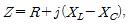
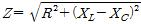
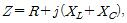
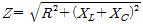
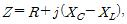
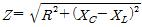
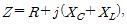
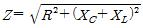
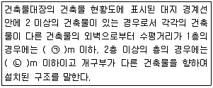
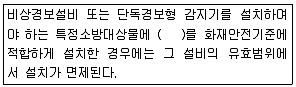

## 42. 문제

42. 소방용수시설의 설치기준 중 주거지역·상업지역 및 공업지
역에 설치하는 경우 소방대상물과의 수평거리는 최대 몇 m 
이하 인가?
    ① 50
❷ 100
    ③ 150
④ 200

### 정답

1번

### 해설

정답은 1번입니다. 선택지의 핵심개념 을 확인하세요.

### 그림

## 43. 문제

43. 정기점검의 대상이 되는 제조소등이 아닌 것은?
    ❶ 옥내탱크저장소
② 지하탱크저장소
    ③ 이동탱크저장소
④ 이송취급소

### 정답

1번

### 해설

정답은 1번입니다. 선택지의 핵심개념 을 확인하세요.

### 그림

## 44. 문제

44. 1급 소방안전관리대상물에 대한 기준이 아닌 것은? (단, 동·
식물원, 철강 등 불연성 물품을 저장·취급하는 창고, 위험물 
저장 및 처리 시설 중 위험물 제조소등, 지하구를 제외한 
것이다.)
    ① 연면적 15000m2 이상인 특정소방대상물 (아파트는 제
외)
    ❷ 150세대 이상으로서 승강기가 설치된 공동주택
    ③ 가연성가스를 1000톤 이상 저장·취급하는 시설
    ④ 30층 이상(지하층은 제외)이거나 지상으로부터 높이가 
120m 이상인 아파트

### 정답

1번

### 해설

정답은 1번입니다. 선택지의 핵심개념 을 확인하세요.

### 그림

## 45. 문제

45. 대통령령으로 정하는 특정소방대상물의 소방시설 중 내진설
계 대상이 아닌 것은?
    ① 옥내소화전설비
② 스프링클러설비
    ③ 물분무소화설비
❹ 연결살수설비

### 정답

1번

### 해설

정답은 1번입니다. 선택지의 핵심개념 을 확인하세요.

### 그림

## 46. 문제

46. 건축물의 공사 현장에 설치하여야 하는 임시소방시설과 기
능 및 성능이 유사하여 임시소방시설을 설치한 것으로 보는 
소방시설로 연결이 틀린 것은? (단, 임시소방시설- 임시소
방시설을 설치한 것으로 보는 소방시설 순이다.)
    ① 간이소화장치 - 옥내소화전
    ❷ 간이피난유도선 - 유도표지
    ③ 비상경보장치 - 비상방송설비
    ④ 비상경보장치 - 자동화재탐지설비

### 정답

1번

### 해설

정답은 1번입니다. 선택지의 핵심개념 을 확인하세요.

### 그림

## 47. 문제

47. 행정안전부령으로 정하는 연소 우려가 있는 구조에 대한 기
준 중 다음 ( ) 안에 알맞은 것은?
    
    ① ㉠ 3, ㉡ 5
② ㉠ 5, ㉡ 8
    ③ ㉠ 6, ㉡ 8
❹ ㉠ 6, ㉡ 10

### 정답

1번

### 해설

정답은 1번입니다. 선택지의 핵심개념 을 확인하세요.

### 그림

## 48. 문제

48. 특정소방대상물의 소방시설 설치의 면제기준 중 다음 ( ) 안
에 알맞은 것은?
    
    ❶ 자동화재탐지설비
② 스프링클러설비
    ③ 비상조명등
④ 무선통신보조설비

### 정답

1번

### 해설

정답은 1번입니다. 선택지의 핵심개념 을 확인하세요.

### 그림

## 49. 문제

49. 위험물로서 제1석유류에 속하는 것은?
    ① 중유
❷ 휘발유
    ③ 실린더유
④ 등유

### 정답

1번

### 해설

정답은 1번입니다. 선택지의 핵심개념 을 확인하세요.

### 그림

## 50. 문제

50. 건축허가 등을 함에 있어서 미리 소방본부장 또는 소방서장
의 동의를 받아야 하는 건축물 등의 범위기준이 아닌 것은?
    ❶ 노유자시설 및 수련시설로서 연면적 100m2 이상인 건축
물
    ② 지하층 또는 무창층이 있는 건축물로서 바닥면적이 
150m2 이상인 층이 있는 것
    ③ 차고·주차장으로 사용되는 바닥면적이 200m2 이상인 층
이 있는 건축물이나 주차시설
    ④ 장애인 의료재활시설로서 연면적 300m2 이상인 건축물
3과목 : 소방관계법규

소방설비기사(전기분야)
◐2017년 09월 23일 필기 기출문제 ◑
전자문제집 CBT : www.comcbt.com
최강 자격증 기출문제 전자문제집 CBT : www.comcbt.com

### 정답

1번

### 해설

정답은 1번입니다. 선택지의 핵심개념 을 확인하세요.

### 그림

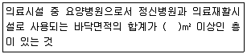
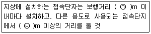
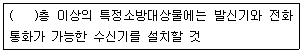

## 51. 문제

51. 스프링클러설비가 설치된 소방시설 등의 자체점검에서 종합
정밀점검을 받아야 하는 아파트의 기준으로 옳은 것
은?(2020년 8월 14일 변경된 규정 적용됨)
    ① 연면적이 3000m2 이상이고 층수가 11층 이상인 것만 해
당
    ② 연면적이 3000m2 이상이고 층수가 16층 이상인 것만 해
당
    ③ 연면적이 5000m2 이상이고 층수가 11층 이상인 것만 해
당
    ❹ 연면적, 층수와 관계없이 모두 해당

### 정답

1번

### 해설

정답은 1번입니다. 선택지의 핵심개념 을 확인하세요.

### 그림

## 52. 문제

52. 방염성능기준 이상의 실내장식물 등을 설치해야 하는 특정
소방대상물이 아닌 것은?
    ① 건축물 옥내에 있는 종교시설
    ② 방송통신시설 중 방송국 및 촬영소
    ❸ 층수가 11층 이상인 아파트
    ④ 숙박이 가능한 수련시설

### 정답

1번

### 해설

정답은 1번입니다. 선택지의 핵심개념 을 확인하세요.

### 그림

## 53. 문제

53. 화재의 예방조치 등과 관련하여 불장난, 모닥불, 흡연, 화기 
취급, 그 밖에 화재예방상 위험하다고 인정되는 행위의 금
지 또는 제한의 명령을 할 수 있는 자는?
    ① 시·도지사
② 국무총리
    ③ 소방청장
❹ 소방본부장

### 정답

1번

### 해설

정답은 1번입니다. 선택지의 핵심개념 을 확인하세요.

### 그림

## 54. 문제

54. 2급 소방안전관리대상물의 소방안전관리자 선임 기준으로 
틀린 것은?(2023년 01월 03일 개정된 규정 적용됨)
    ① 위험물기능장 자격을 가진 자
    ② 소방공무원으로 3년 이상 근무한 경력이 있는지
    ❸ 의용소방대원으로 2년 이상 근무한 경력이 있는 자
    ④ 위험물산업기사 자격을 가진 자

### 정답

1번

### 해설

정답은 1번입니다. 선택지의 핵심개념 을 확인하세요.

### 그림

## 55. 문제

55. 경보설비 중 단독경보형 감지기를 설치해야 하는 특정소방
대상물의 기준으로 틀린 것은?
    ① 연면적 600m2 미만의 숙박시설
    ② 연면 적 1000m2 미만의 아파트 등
    ③ 연면적 1000m2 미만의 기숙사
    ❹ 교육연구시설 내에 있는 연면적 3000m2 미만의 합숙소

### 정답

1번

### 해설

정답은 1번입니다. 선택지의 핵심개념 을 확인하세요.

### 그림

## 56. 문제

56. 다음 중 과태료 대상이 아닌 것은?
    ❶ 소방안전관리대상물의 소방안전관리자를 선임하지 아니
한 자
    ② 소방안전관리 업무를 수행하지 아니한 자
    ③ 특정소방대상물의 근무자 및 거주자에 대한 소방훈련 및 
교육을 하지 아니한 자
    ④ 특정소방대상물 소방시설 등의 점검결과를 보고하지 아
니한 자

### 정답

1번

### 해설

정답은 1번입니다. 선택지의 핵심개념 을 확인하세요.

### 그림

## 57. 문제

57. 시·도지사가 소방시설업의 영업정지처분에 갈음하여 부과할 
수 있는 최대 과징금의 범위로 옳은 것은?(관련 규정 개정
전 문제로 여기서는 기존 정답인 3번을 누르면 정답 처리됩
니다. 자세한 내용은 해설을 참고하세요.)
    ① 1000만 원 이하
② 2000만 원 이하
    ❸ 3000만 원 이하
④ 5000만 원 이하

### 정답

1번

### 해설

정답은 1번입니다. 선택지의 핵심개념 을 확인하세요.

### 그림

## 58. 문제

58. 화재경계지구의 지정대상이 아닌 것은?
    ① 공장·창고가 밀집한 지역
    ② 목조건물이 밀집한 지역
    ❸ 농촌지역
    ④ 시장지역

### 정답

1번

### 해설

정답은 1번입니다. 선택지의 핵심개념 을 확인하세요.

### 그림

## 59. 문제

59. 소방시설업의 반드시 등록 취소에 해당하는 경우는?
    ❶ 거짓이나 그 밖의 부정한 방법으로 등록한 경우
    ② 다른 자에게 등록증 또는 등록수첩을 빌려준 경우
    ③ 소속 소방기술자를 공사현장에 배치하지 아니하거나 거
짓으로 한 경우
    ④ 등록을 한 후 정당한 사유 없이 1년이 지날 때까지 영업
을 시작하지 아니하거나 계속하여 1년 이상 휴업한 경우

### 정답

1번

### 해설

정답은 1번입니다. 선택지의 핵심개념 을 확인하세요.

### 그림

## 60. 문제

60. 자동화재탐지설비의 일반 공사감리기간으로 포함시켜 산정
할 수 있는 항목은?
    ① 고정금속구를 설치하는 기간
    ❷ 전선관의 매립을 하는 공사기간
    ③ 공기유입구의 설치기간
    ④ 소화약제 저장용기 설치기간

### 정답

1번

### 해설

정답은 1번입니다. 선택지의 핵심개념 을 확인하세요.

### 그림

