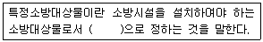
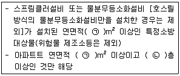
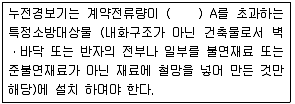
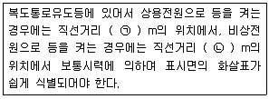

# 소방설비기사(전기분야)20180304(교사용) - 소방관계법규

> 원본: `소방설비기사(전기분야)20180304(교사용).pdf`
> 개인학습용 변환본.

## 41. 문제

41. 소방시설공사업법령상 소방시설공사 완공 검사를 위한 현장 
확인 대상 특정소방대상물의 범위가 아닌 것은?
    ❶ 위락시설
② 판매시설
    ③ 운동시설
④ 창고시설

### 정답

1번

### 해설

정답은 1번입니다. 선택지의 핵심개념 을 확인하세요.

### 그림

## 42. 문제

42. 소방기본법령상 특수가연물의 저장 및 취급의 기준 중 다음 
( )안에 알맞은 것은? (단, 석탄ㆍ목탄류를 발전용으로 저장
하는 경우는 제외한다.)
    
    ① ㉠ 10, ㉡ 50
② ㉠ 10, ㉡ 200
    ③ ㉠ 15, ㉡ 200
❹ ㉠ 15, ㉡ 300

### 정답

1번

### 해설

정답은 1번입니다. 선택지의 핵심개념 을 확인하세요.

### 그림

## 43. 문제

43. 위험물안전관리법상 시ㆍ도지사의 허가를 받지 아니하고 당
해 제조소등을 설치할 수 있는 기준 중 다음 ( ) 안에 알맞
은 것은?
    
    ❶ 20
② 30
    ③ 40
④ 50

### 정답

1번

### 해설

정답은 1번입니다. 선택지의 핵심개념 을 확인하세요.

### 그림

## 44. 문제

44. 화재예방, 소방시설 설치ㆍ유지 및 안전관리에 관한 법령상 
단독경보형감지기를 설치하여야 하는 특정소방대상물의 기
준 중 옳은 것은?
    ① 연면적 600m2 미만의 아파트등
    ❷ 연면적 1000m2 미만의 기숙사
    ③ 연면적 1000m2 미만의 숙박시설
    ④ 교육연구시설 또는 수련시설 내에 있는 합숙소 또는 기
숙사로서 연면적 1000m2 미만인 것

### 정답

1번

### 해설

정답은 1번입니다. 선택지의 핵심개념 을 확인하세요.

### 그림

## 45. 문제

45. 소방기본법령상 일반음식점에서 조리를 위하여 불을 사용하
는 설비를 설치하는 경우 지켜야 하는 사항 중 다음 ( ) 안
에 알맞은 것은?
    
    ❶ ㉠ 0.5, ㉡ 0.15
② ㉠ 0.5, ㉡ 0.6
    ③ ㉠ 0.6, ㉡ 0.15
④ ㉠ 0.6, ㉡ 0.5

### 정답

1번

### 해설

정답은 1번입니다. 선택지의 핵심개념 을 확인하세요.

### 그림

## 46. 문제

46. 소방기본법령상 특수가연물의 품명별 수량 기준으로 틀린 
것은?
    ① 합성수지류(발포시킨 것) : 20m3이상
    ② 가연성 액체류 : 2m3이상
3과목 : 소방관계법규

소방설비기사(전기분야)
◐2018년 03월 04일 필기 기출문제 ◑
전자문제집 CBT : www.comcbt.com
최강 자격증 기출문제 전자문제집 CBT : www.comcbt.com
    ❸ 넝마 및 종이부스러기 : 400kg이상
    ④ 볏짚류 : 1000kg이상

### 정답

1번

### 해설

정답은 1번입니다. 선택지의 핵심개념 을 확인하세요.

### 그림

## 47. 문제

47. 화재예방, 소방시설 설치ㆍ유지 및 안전관리에 관한 법령상 
용어의 정의 중 다음 ( ) 안에 알맞은 것은?
    
    ① 행정안전부령
② 국토교통부령
    ③ 고용노동부령
❹ 대통령령

### 정답

1번

### 해설

정답은 1번입니다. 선택지의 핵심개념 을 확인하세요.

### 그림

## 48. 문제

48. 소방시설공사업법상 특정소방대상물의 관계인 또는 발주자
가 해당 도급계약의 수급인을 도급계약 해지할 수 있는 경
우의 기준 중 틀린 것은?
    ① 하도급계약의 적정성 심사 결과 하수급인 또는 하도급계
약 내용의 변경 요구에 정당한 사유 없이 따르지 아니하
는 경우
    ❷ 정당한 사유 없이 15일 이상 소방시설공사를 계속하지 
아니하는 경우
    ③ 소방시설업이 등록취소되거나 영업정지된 경우
    ④ 소방시설업을 휴업하거나 폐업한 경우

### 정답

1번

### 해설

정답은 1번입니다. 선택지의 핵심개념 을 확인하세요.

### 그림

## 49. 문제

49. 위험물안전관리법령상 인화성액체위험물(이황화탄소를 제외)
의 옥외탱크저장소의 탱크 주위에 설치하여야 하는 방유제
의 설치 기준 중 틀린 것은?
    ❶ 방유제내의 면적은 60000m2 이하로 하여야 한다.
    ② 방유제는 높이 0.5m 이상 3m 이하, 두께 0.2 이상, 지
하매설깊이 1m 이상으로 할 것. 다만, 방유제와 옥외저
장탱크 사이의 지반면 아래에 불침윤성 구조물을 설치하
는 경우에는 지하매설깊이를 해당 불침윤성 구조물까지
로 할 수 있다.
    ③ 방유제의 용량은 방유제안에 설치된 탱크가 하나인 때에
는 그 탱크 용량의 110% 이상, 2기 이상인 때에는 그 
탱크 중 용량이 최대인 것의 용량의 110% 이상으로 하
여야 한다.
    ④ 방유제는 철근콘크리트로 하고, 방유제와 옥외저장탱크 
사이의 지표면은 불연성과 불침윤성이 있는 구조(철근콘
크리트 등)로 할 것. 다만, 누출된 위험물을 수용할 수 
있는 전용유조 및 펌프 등의 설비를 갖춘 경우에는 방유
제와 옥외저장탱크 사이의 지표면을 흙으로 할 수 있다.

### 정답

1번

### 해설

정답은 1번입니다. 선택지의 핵심개념 을 확인하세요.

### 그림

## 50. 문제

50. 소방기본법상 시ㆍ도지사가 화재예방강화지구로 지정할 필
요가 있는 지역을 화재예방강화지구로 지정하지 아니하는 
경우 해당 시ㆍ도지사에게 해당 지역의 화재예방강화지구 
지정을 요청할 수 잇는 자는?
    ① 행정안전부장관
❷ 소방청장
    ③ 소방본부장
④ 소방서장

### 정답

1번

### 해설

정답은 1번입니다. 선택지의 핵심개념 을 확인하세요.

### 그림

## 51. 문제

51. 화재예방, 소방시설 설치ㆍ유지 및 안전관리에 관한 법상 
소방안전 특별관리시설물의 대상 기준 중 틀린 것은?
    ❶ 수련시설
    ② 항만시설
    ③ 전력용 및 통신용 지하구
    ④ 지정문화재인 시설(시설이 아닌 지정문화재를 보호하거
나 소장하고 있는 시설을 포함)

### 정답

1번

### 해설

정답은 1번입니다. 선택지의 핵심개념 을 확인하세요.

### 그림

## 52. 문제

52. 소방기본법령상 소방용수시설별 설치기준 중 옳은 것은?
    ① 저수조는 지면으로부터의 낙차가 4.5m 이상일 것
    ② 소화전은 상수도와 연결하여 지하식 또는 지상식의 구조
로 하고, 소방용호스와 연결하는 소화전의 연결금속구의 
구경은 50mm로 할 것
    ❸ 저수조 흡수관의 투입구가 사각형의 경우에는 한 변의 
길이가 60cm 이상일 것
    ④ 급수탑 급수배관의 구경은 65mm 이상으로 하고, 개폐밸
브는 지상에서 0.8m 이상, 1.5m 이하의 위치에 설치하
도록 할 것

### 정답

1번

### 해설

정답은 1번입니다. 선택지의 핵심개념 을 확인하세요.

### 그림

## 53. 문제

53. 위험물안전관리법상 업무상 과실로 제조소등에서 위험물을 
유출ㆍ방출 또는 확산시켜 사람의 생명ㆍ신체 또는 재산에 
대하여 위험을 발생시킨 자에 대한 벌칙 기준으로 옳은 것
은?
    ① 10년 이하의 징역 또는 금고나 1억원 이하의 벌금
    ❷ 7년 이하의 금고 또는 7천만원 이하의 벌금
    ③ 5년 이하의 징역 또는 1억원 이하의 벌금
    ④ 3년 이하의 징역 또는 3천만원 이하의 벌금

### 정답

1번

### 해설

정답은 1번입니다. 선택지의 핵심개념 을 확인하세요.

### 그림

## 54. 문제

54. 화재예방, 소방시설 설치ㆍ유지 및 안전관리에 관한 법상 
중앙소방기술심의위원회의 심의사항이 아닌 것은?
    ① 화재안전기준에 관한 사항
    ② 소방시설의 설계 및 공사감리의 방법에 관한 사항
    ❸ 소방시설에 하자가 있는지의 판단에 관한 사항
    ④ 소방시설공사의 하자를 판단하는 기준에 관한 사항

### 정답

1번

### 해설

정답은 1번입니다. 선택지의 핵심개념 을 확인하세요.

### 그림

## 55. 문제

55. 위험물안전관리법령상 제조소의 위치ㆍ구조 및 설비의 기준 
중 위험물을 취급하는 건축물 그 밖의 시설의 주위에는 그 
취급하는 위험물을 최대수량이 지정수량의 10배 이하인 경
우 보유하여야 할 공지의 너비는 몇 m 이상 이어야 하는
가?
    ❶ 3
② 5
    ③ 8
④ 10

### 정답

1번

### 해설

정답은 1번입니다. 선택지의 핵심개념 을 확인하세요.

### 그림

## 56. 문제

56. 화재예방, 소방시설 설치ㆍ유지 및 안전관리에 관한 법령상 
종합정밀점검 실시 대상이 되는 특정소방대상물의 기준 중 
다음 ( )안에 알맞은 것은?(관련 규정 개정전 문제로 여기서
는 기존 정답인 4번을 누르면 정답 처리됩니다. 자세한 내
용은 해설을 참고하세요.)
    
    ① ㉠ 2000, ㉡ 7
② ㉠ 2000, ㉡ 11
    ③ ㉠ 5000, ㉡ 7
❹ ㉠ 5000, ㉡ 11

### 정답

1번

### 해설

정답은 1번입니다. 선택지의 핵심개념 을 확인하세요.

### 그림

## 57. 문제

57. 화재예방, 소방시설 설치ㆍ유지 및 안전관리에 관한 법령상 
화재안전기준을 달리 적용하여야 하는 특수한 용도 또는 구
조를 가진 특정 소방 대상물인 원자력 발전소에 설치하지 
아니할 수 있는 소방시설은?
    ① 물분무등소화설비
② 스프링쿨러설비
    ③ 상수도소화용수설비
❹ 연결살수설비

### 정답

1번

### 해설

정답은 1번입니다. 선택지의 핵심개념 을 확인하세요.

### 그림

## 58. 문제

58. 소방기본법상 소방업무의 응원에 대한 설명 중 틀린 것은?
(관련 규정 개정전 문제로 여기서는 기존 정답인 4번을 누
르면 정답 처리됩니다. 자세한 내용은 해설을 참고하세요.)
    ① 소방본부장이나 소방서장은 소방활동을 할 때에 긴급한 

소방설비기사(전기분야)
◐2018년 03월 04일 필기 기출문제 ◑
전자문제집 CBT : www.comcbt.com
최강 자격증 기출문제 전자문제집 CBT : www.comcbt.com
경우에는 이웃한 소방본부장 또는 소방서장에게 소방업
무의 응원을 요청할 수 있다.
    ② 소방업무의 응원 요청을 받은 소방본부장 또는 소방서장
은 정당한 사유 없이 그 요청을거절하여서는 아니 된다.
    ③ 소방업무의 응원을 위하여 파견된 소방대원은 응원을 요
청한 소방본부장 또는 소방서장의 지휘에 따라야 한다.
    ❹ 시ㆍ도지사는 소방업무의 응원을 요청하는 경우를 대비
하여 출동 대상지역 및 규모와 필요한 경비의 부담 등에 
관하여 필요한 사항을 대통령령으로 정하는 바에 따라 
이웃하는 시ㆍ도지사와 협의하여 미리 규약으로 정하여
야 한다.

### 정답

1번

### 해설

정답은 1번입니다. 선택지의 핵심개념 을 확인하세요.

### 그림

## 59. 문제

59. 화재예방, 소방시설 설치ㆍ유지 및 안전관리에 관한 법령상 
소방안전관리대상물의 소방안전관리자가 소방훈련 및 교육
을 하지 않은 경우 1차 위반 시 과태료 금액 기준으로 옳은 
것은?(2023년 01월 03일 변경된 규정 적용됨)
    ① 30만원
② 50만원
    ❸ 100만원
④ 200만원

### 정답

1번

### 해설

정답은 1번입니다. 선택지의 핵심개념 을 확인하세요.

### 그림

## 60. 문제

60. 화재예방, 소방시설 설치ㆍ유지 및 안전관리에 관한 법상 
공동 소방안전관리자 선임대상 특정소방대상물의 기준 중 
틀린 것은?
    ❶ 판매시설 중 상점
    ② 고층 건축물(지하층을 제외한 층수가 11층 이상인 건축
물만 해당)
    ③ 지하가(지하의 인공구조물 안에 설치된 상점 및 사무실, 
그 밖에 이와 비슷한 시설이 연속하여 지하도에 접하여 
설치된 것과 그 지하도를 합한 것)
    ④ 복합건축물로서 연면적이 5000m2이상인 것 또는 층수가 
5층 이상인것

### 정답

1번

### 해설

정답은 1번입니다. 선택지의 핵심개념 을 확인하세요.

### 그림

