# 소방설비기사(전기분야)20180428(학생용) - 소방관계법규

> 원본: `소방설비기사(전기분야)20180428(학생용).pdf`
> 개인학습용 변환본.

## 41. 문제

41. 소방기본법령상 소방본부 종합상황실 실장이 소방청의 종합
상황실에 서면∙모사전송 또는 컴퓨터통신 등으로 보고하여야 
하는 화재의 기준 중 틀린 것은?
    ① 항구에 매어둔 총 톤수가 1000톤 이상인 선박에서 발생
한 화재
    ② 층수가 5층 이상이거나 병상이 30개 이상인 종합병원∙한
방병원∙요양소에서 발생한 화재
    ③ 지정수량의 1000배 이상의 위험물의 제조소∙저장소∙취급
소에서 발생한 화재
    ④ 연면적 15000m2이상인 공장 또는 화재경계지구에서 발
생한 화재

### 정답

1번

### 해설

정답은 1번입니다. 선택지의 핵심개념 을 확인하세요.

### 그림

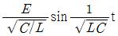
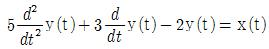
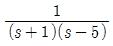
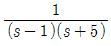
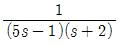
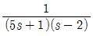
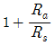
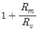
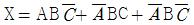
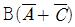
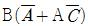
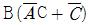
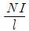
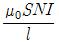
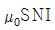
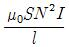

## 42. 문제

42. 소방기본법령상 소방용수시설별 설치기준 중 틀린 것은?
    ① 급수탑 계폐밸브는 지상에서 1.5m 이상 1.7m 이하의 위
치에 설치하도록 할 것
    ② 소화전은 상수도와 연결하여 지하식 또는 지상식의 구조
로 하고, 소방용호스와 연결하는 소화전의 연결금속구의 
구경은 100mm 로 할 것
    ③ 저수조 흡수관의 투입구가 사각형의 경우에는 한 변의 
길이가 60㎝ 이상, 원형의 경우에는 지름이 60㎝ 이상일 
것
    ④ 저수조는 지면으로부터의 낙차가 4.5m 이하일 것

### 정답

1번

### 해설

정답은 1번입니다. 선택지의 핵심개념 을 확인하세요.

### 그림

## 43. 문제

43. 소방기본법상 소방본부장, 소방서장 또는 소방대장의 권한
이 아닌 것은?
    ① 화재, 재난∙재해, 그 밖의 위급한 상황이 발생한 현장에
서 소방활동을 위하여 필요할 때에는 그 관할구역에 사
는 사람 또는 그 현장에 있는 사람으로 하여금 사람을 
구출하는 일 또는 불을 끄거나 불이 번지지 아니하도록 
하는 일을 하게 할 수 있다.
    ② 소방활동을 할 때에 긴급한 경우에는 이웃한 소방본부장 
또는 소방서장에게 소방업무와 응원을 요청할 수 있다.
    ③ 사람을 구출하거나 불이 번지는 것을 막기 위하여 필요
할 때에는 화재가 발생하거나 불이 번질 우려가 있는 소
방대상물 및 토지를 일시적으로 사용하거나 그 사용의 
제한 또는 소방활동에 필요한 처분을 할 수 있다.
    ④ 소방활동을 위하여 긴급하게 출동할 때에는 소방자동차
의 통행과 소방활동에 방해가 되는 주차 또는 정차된 차
량 및 물건 등을 제거하거나 이동시킬 수 있다.

### 정답

1번

### 해설

정답은 1번입니다. 선택지의 핵심개념 을 확인하세요.

### 그림

## 44. 문제

44. ㅁ위험물안전관리법령상 위험물의 안전관리와 관련된 업무
를 수행하는 자로서 소방청장이 실시하는 안전교육대상자가 
아닌 것은?
    ① 안전관리자로 선임된 자
    ② 탱크시험자의 기술인력으로 종사하는 자
    ③ 위험물운송자로 종사하는 자
    ④ 제조소등의 관계인

### 정답

1번

### 해설

정답은 1번입니다. 선택지의 핵심개념 을 확인하세요.

### 그림

## 45. 문제

45. 화재예방, 소방시설 설치∙유지 및 안전관리에 관한 법상 소
3과목 : 소방관계법규

소방설비기사(전기분야)
◐2018년 04월 28일 필기 기출문제 ◑
전자문제집 CBT : www.comcbt.com
최강 자격증 기출문제 전자문제집 CBT : www.comcbt.com
방안전관리대상물의 소방안전 관리자 업무가 아닌 것은?(문
제오류로 가답안 발표시 1번으로 발표되었지만 확정답안 발
표시 모두 정답처리 되었습니다. 여기서는 1번을 누르면 정
답 처리 됩니다.)
    ① 소방훈련 및 교육
    ② 자위소방대 및 초기 대응체계의 구성∙운영∙교육
    ③ 피난시설, 방화구획 및 방화시설의 유지 및 관리
    ④ 피난계획에 관한 사항과 대통령령으로 정하는 사항이 포
함된 소방계획서의 작성 및 시행

### 정답

1번

### 해설

정답은 1번입니다. 선택지의 핵심개념 을 확인하세요.

### 그림

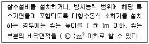
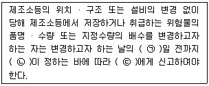

## 46. 문제

46. 화재예방, 소방시설 설치∙유지 및 안전관리에 관한 법령상 
소방용품이 아닌 것은?
    ① 소화약제 외의 것을 이용한 간이소화용구
    ② 자동소화장치
    ③ 가스누설 경보기
    ④ 소화용으로 사용하는 방염제

### 정답

1번

### 해설

정답은 1번입니다. 선택지의 핵심개념 을 확인하세요.

### 그림

## 47. 문제

47. 화재예방, 소방시설 설치∙유지 및 안전관리에 관한 법령상 
스프링클러설비를 설치하여야 하는 특정소방대상물의 기준 
중 틀린 것은? (단, 위험물 저장 및 처리 시설 중 가스시설 
또는 지하구는 제외한다.)
    ① 숙박이 가능한 수련시설 용도로 사용되는 시설의 바닥면
적의 합계가 600m2이상인 것은 모든 층
    ② 창고시설(물류터미널은 제외)로서 바닥면적 합계가 
5000m2이상인 경우에는 모든 층
    ③ 판매시설, 운수시설 및 창고시설(물류터미널에 한정)로서 
바닥면적의 합계가 5000m 이상 이거나 수용인원이 500
명 이상인 경우에는 모든 층
    ④ 복합건축물로서 연면적이 3000m2이상인 경우에는 모든 
층

### 정답

1번

### 해설

정답은 1번입니다. 선택지의 핵심개념 을 확인하세요.

### 그림

## 48. 문제

48. 소방기본법령상 특수가연물의 저장 및 취급기준, 중 다음 ( 
) 안에 알맞은 것은?
    
    ① ㉠ 10, ㉡ 30
② ㉠ 10, ㉡ 50
    ③ ㉠ 15, ㉡ 100
④ ㉠ 15, ㉡ 200

### 정답

1번

### 해설

정답은 1번입니다. 선택지의 핵심개념 을 확인하세요.

### 그림

## 49. 문제

49. 위험물안전관리법상 위험시설의 설치 및 변경 등에 관한 기
준 중 다음 ( ) 안에 알맞은 것은?
    
    ① ㉠ 1, ㉡ 행정안전부령, ㉢ 시∙도지사
    ② ㉠ 1, ㉡ 대통령령, ㉢ 소방본부장∙소방서장
    ③ ㉠ 14, ㉡ 행정안전부령, ㉢ 시∙도지사
    ④ ㉠ 14, ㉡ 대통령령, ㉢ 소방본부장∙소방서장

### 정답

1번

### 해설

정답은 1번입니다. 선택지의 핵심개념 을 확인하세요.

### 그림

## 50. 문제

50. 화재예방, 소방시설 설치∙유지 및 안전관리에 관한 법령상 
소방안전관리대상물의 소방계획서에 포함되어야 하는 사항
이 아닌 것은?
    ① 예방규정을 정하는 제조소등의 위험물 저장∙취급에 관한 
사항
    ② 소방시설∙피난시설 및 방화시설의 점검∙정비계획
    ③ 특정소방대상물의 근무자 및 거주자의 자위소방대 조직
과 대원의 임무에 관한 사항
    ④ 방화구획, 제연구획, 건축물의 내부 마감재료(불연재료∙
준불연재료 또는 난연재료로 사용된 것) 및 방염물품의 
사용현황과 그 밖의 방화구조 및 설비의 유지∙관리계획

### 정답

1번

### 해설

정답은 1번입니다. 선택지의 핵심개념 을 확인하세요.

### 그림

## 51. 문제

51. 소방공사업법령상 공사감리자 지정대상 특정 소방대상물의 
범위가 아닌 것은?
    ① 캐비닛형 간이스프링클러설비를 신설∙개설하거나 방호∙방
수 구역을 증설할 때
    ② 물분무등소화설비(호스릴 방식의 소화설비는 제외)를 신
설∙개설하거나 방호∙방수 구역을 증설할 때
    ③ 제연설비를 신설∙개설하거나 방호∙방수 구역을 증설할 때
    ④ 연소방지설비를 신설∙개설하거나 살수구역을 증설할 때

### 정답

1번

### 해설

정답은 1번입니다. 선택지의 핵심개념 을 확인하세요.

### 그림

## 52. 문제

52. 화재예방, 소방시설 설치∙유지 및 안전관리에 관한 법상 특
정소방대상물에 소방시설이 화재안전기준에 따라 설치 유지∙
관리되어 있지 아니할 때 해당 특정소방대상물의 관계인에
게 필요한 조치를 명할 수 있는 자는?
    ① 소방본부장
② 소방청장
    ③ 시∙도지사
④ 행정안전부장관

### 정답

1번

### 해설

정답은 1번입니다. 선택지의 핵심개념 을 확인하세요.

### 그림

## 53. 문제

53. 위험물안전관리법상 업무상 과실로 제조소등에서 위험물을 
유출∙방출 또는 확산시켜 사람의 생명∙신체 또는 재산에 대
하여 위험을 발생시킨 자에 대한 벌칙 기준으로 옳은 것은?
    ① 5년 이하의 금고 또는 2000만원 이하의 벌금
    ② 5년 이하의 금고 또는 7000만원 이하의 벌금
    ③ 7년 이하의 금고 또는 2000만원 이하의 벌금
    ④ 7년 이하의 금고 또는 7000만원 이하의 벌금

### 정답

1번

### 해설

정답은 1번입니다. 선택지의 핵심개념 을 확인하세요.

### 그림

## 54. 문제

54. 화재예방, 소방시설 설치∙유지 및 안전관리에 관란 법상 소
방시설등에 대한 자체점검을 하지 아니하거나 관리업자 등
으로 하여금 정기적으로 점검하게 아니한 자에 대한 벌칙 
기준으로 옳은 것은?
    ① 6개월 이하의 징역 또는 1000만원 이하의 벌금
    ② 1년 이하의 징역 또는 1000만원 이하의 벌금
    ③ 3년 이하의 징역 또는 1500만원 이하의 벌금
    ④ 3년 이하의 징역 또는 3000만원 이하의 벌금

### 정답

1번

### 해설

정답은 1번입니다. 선택지의 핵심개념 을 확인하세요.

### 그림

## 55. 문제

55. 소방기본법상 소방활동구역의 설정권자로 옳은 것은?
    ① 소방본부장
② 소방서장
    ③ 소방대장
④ 시∙도지사

### 정답

1번

### 해설

정답은 1번입니다. 선택지의 핵심개념 을 확인하세요.

### 그림

## 56. 문제

56. 소방기본법령상 위험물 또는 물건의 보관기간은 소방본부 
또는 소방서의 게시판에 공고하는 기간의 종료일 다음 날부
터 며칠로 하는가?
    ① 3
② 4
    ③ 5
④ 7

### 정답

1번

### 해설

정답은 1번입니다. 선택지의 핵심개념 을 확인하세요.

### 그림

## 57. 문제

57. 화재예방, 소방시설 설치∙유지 및 안전관리에 관한 법령상 
비상경보설비를 설치하여야 할 특정소방대상물의 기준 중 
옳은 것은? (단, 지하구 모래∙석재 등 불연재료 창고 및 위
험물 저장∙처리 시설 중 가스시설은 제외한다.)

소방설비기사(전기분야)
◐2018년 04월 28일 필기 기출문제 ◑
전자문제집 CBT : www.comcbt.com
최강 자격증 기출문제 전자문제집 CBT : www.comcbt.com
    ① 지하층 또는 무창층의 바닥면적이 50m2이상인 것
    ② 연면적이 400m2이상인 것
    ③ 지하가 중 터널로서 길이가 300m 이상인 것
    ④ 30명 이상의 근로자가 작업하는 옥내 작업장

### 정답

1번

### 해설

정답은 1번입니다. 선택지의 핵심개념 을 확인하세요.

### 그림

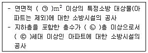
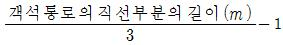
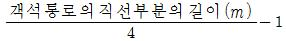
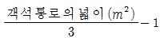
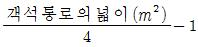
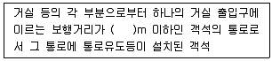
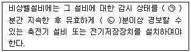

## 58. 문제

58. 화재예방, 소방시설 설치∙유지 및 안전관리에 관한 법상 특
정소방대상물의 피난시설, 방화 구획 또는 방화시설에 폐쇄∙
훼손∙변경 등의 행위를 한 자에 대한 과태료 기준으로 옳은 
것은?
    ① 200만원 이하의 과태료   ② 300만원 이하의 과태료
    ③ 500만원 이하의 과태료   ④ 600만원 이하의 과태료

### 정답

1번

### 해설

정답은 1번입니다. 선택지의 핵심개념 을 확인하세요.

### 그림

## 59. 문제

59. 소방시설공사업법령상 상주 공사감리 대상 기준 중 다음 ( ) 
안에 알맞은 것은?
    
    ① ㉠ 10000, ㉡ 11, ㉢ 600
    ② ㉠ 10000, ㉡ 16, ㉢ 500
    ③ ㉠ 30000, ㉡ 11, ㉢ 600
    ④ ㉠ 30000, ㉡ 16, ㉢ 500

### 정답

1번

### 해설

정답은 1번입니다. 선택지의 핵심개념 을 확인하세요.

### 그림

## 60. 문제

60. 위험물안전관리법상 지정수량 미만인 위험물의 저장 또는 
취급에 관한 기술상의 기준은 무엇으로 정하는가?
    ① 대통령령
② 총리령
    ③ 시∙도의 조례
④ 행정안전부령

### 정답

1번

### 해설

정답은 1번입니다. 선택지의 핵심개념 을 확인하세요.

### 그림

