# 소방설비기사(전기분야)20180915(학생용) - 소방관계법규

> 원본: `소방설비기사(전기분야)20180915(학생용).pdf`
> 개인학습용 변환본.

## 41. 문제

41. 소방시설공사업법령에 따른 성능위주설계를 할 수 있는 자
의 설계범위 기준 중 틀린 것은?
    ① 연면적 30,000m2 이상인 특정소방대상물로서 공항시설
    ② 연면적 100,000m2 이하인 특정소방대상물 (단, 아파트등
은 제외)
    ③ 지하층을 포함한 층수가 30층 이상인 특정소방대상물 
(단, 아파트등은 제외)
    ④ 하나의 건축물에 영화상영관이 10개 이상인 특정소방대
상물

### 정답

1번

### 해설

정답은 1번입니다. 선택지의 핵심개념 을 확인하세요.

### 그림

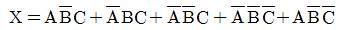
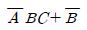
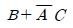
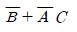
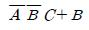
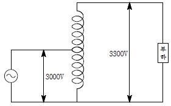
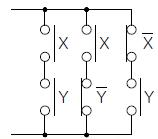
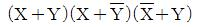
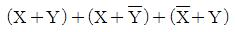
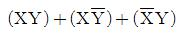
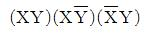

## 42. 문제

42. 위험물안전관리법령에 따른 인화성액체위험물(이황화탄소를 
제외)의 옥외탱크저장소의 탱크 주위에 설치하는 방유제의 
설치기준 중 옳은 것은?
    ① 방유제의 높이는 0.5m 이상 2.0m 이하로 할 것
    ② 방유제내의 면적은 100,000m2 이하로 할것
    ③ 방유제의 용량은 방유제안에 설치된 탱크가 2기 이상인 
때에는 그 탱크 중 용량이 최대인 것의 용량의 120% 이
상으로 할 것
    ④ 높이가 1m를 넘는 방유제 및 간막이 둑의 안팎에는 방
유제내에 출입하기 위한 계단 또는 경사로를 약 50m마
다 설치할 것

### 정답

1번

### 해설

정답은 1번입니다. 선택지의 핵심개념 을 확인하세요.

### 그림

## 43. 문제

43. 소방기본법에 따른 소방력의 기준에 따라 관할구역의 소방
력을 확충하기 위하여 필요한 계획을 수립하여 시행하여야 
하는 자는?
    ① 소방서장
② 소방본부장
    ③ 시ㆍ도지사
④ 행정안전부장관

### 정답

1번

### 해설

정답은 1번입니다. 선택지의 핵심개념 을 확인하세요.

### 그림

## 44. 문제

44. 소방기본법령에 따른 용접 또는 용단 작업장에서 불꽃을 사
용하는 용접ㆍ용단기구 사용에 있어서 작업자로부터 반경 
몇 m 이내에 소화기를 갖추어야 하는가? (단, 산업안전보건
법에 따른 안전조치의 적용을 받는 사업장의 경우는 제외한
다.)
    ① 1
② 3
    ③ 5
④ 7

### 정답

1번

### 해설

정답은 1번입니다. 선택지의 핵심개념 을 확인하세요.

### 그림

## 45. 문제

45. 소방기본법에 따른 벌칙의 기준이 다른 것은?
    ① 정당한 사유 없이 불장난, 모닥불, 흡연, 화기 취급, 풍
등 등 소형 열기구 날리기, 그 밖에 화재예방상 위험하
다고 인정되는 행위의 금지 또는 제한에 따른 명령에 따
르지 아니하거나 이를 방해한 사람
    ② 소방 활동 종사 명령에 따른 사람을 구출하는 일 또는 
불을 끄거나 번지지 아니하록 하는 일을 방해한 사람
    ③ 정당한 사유 없이 소방용수시설 또는 비상소화장치를 사
용하거나 소방용수시설 또는 비상소화장치의 효용을 해
치거나 그 정당한 사용을 방해한 사람
    ④ 출동한 소방대의 소방장비를 파손하거나 그 효용을 해하
여 화재진압ㆍ인명구조 또는 구급활동을 방해하는 행위
를 한 사람
3과목 : 소방관계법규

소방설비기사(전기분야)
◐2018년 09월 15일 필기 기출문제 ◑
전자문제집 CBT : www.comcbt.com
최강 자격증 기출문제 전자문제집 CBT : www.comcbt.com

### 정답

1번

### 해설

정답은 1번입니다. 선택지의 핵심개념 을 확인하세요.

### 그림

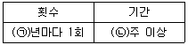
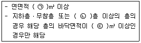
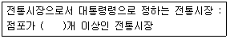

## 46. 문제

46. 소방기본법령에 따른 소방대원에게 실시할 교육ㆍ훈련 횟수 
및 기간의 기준 중 다음 ( )안에 알맞은 것은?
    
    ① ㉠ 2, ㉡ 2
② ㉠ 2, ㉡ 4
    ③ ㉠ 1, ㉡ 2
④ ㉠ 1, ㉡ 4

### 정답

1번

### 해설

정답은 1번입니다. 선택지의 핵심개념 을 확인하세요.

### 그림

## 47. 문제

47. 화재예방, 소방시설 설치ㆍ유지 및 안전관리에 관한 법령에 
따른 화재안전기준을 달리 적용하여야 하는 특수한 용도 또
는 구조를 가진 특정소방대상물 중 핵폐기물처리시설에 설
치하지 아니할 수 있는 소방시설은?
    ① 소화용수설비      ② 옥외소화전설비
    ③ 물분무등소화설비  ④ 연결송수관설비 및 연결살수설비

### 정답

1번

### 해설

정답은 1번입니다. 선택지의 핵심개념 을 확인하세요.

### 그림

## 48. 문제

48. 화재예방, 소방시설 설치ㆍ유지 및 안전관리에 관한 법령에 
따른 특정소방대상물 중 의료에 해당하지 않는 것은?
    ① 요양병원
② 마약진료소
    ③ 한방병원
④ 노인의료복지시설

### 정답

1번

### 해설

정답은 1번입니다. 선택지의 핵심개념 을 확인하세요.

### 그림

## 49. 문제

49. 화재예방, 소방시설 설치ㆍ유지 및 안전관리에 관한 법령에 
따른 특정소방대상물의 수용인원의 산정방법 기준 중 틀린 
것은?
    ① 침대가 있는 숙박시설의 경우는 해당 특정소방대상물의 
종사자 수에 침대수 (2인용 침대는2인으로 산정)를 합한
수
    ② 침대가 없는 숙박시설의 경우는 해당 특정소방대상물의 
종사자 수에 숙박시설 바닥면적의 합계를 3m2로 나누어 
얻은 수를 합한 수
    ③ 강의실 용도로 쓰이는 특정소방대상물의 경우는 해당 용
도로 사용하는 바닥면적의 합계를 1.9m2로 나누어 얻은 
수
    ④ 문화 및 집회시설의 경우는 해당 용도로 사용하는 바닥
면적의 합계를 2.6m2로 나누어 얻은 수

### 정답

1번

### 해설

정답은 1번입니다. 선택지의 핵심개념 을 확인하세요.

### 그림

## 50. 문제

50. 화재예방, 소방시설 설치ㆍ유지 및 안전관리에 관한 법령에 
따른 소방안전관리대상물의 관계인 및 소방안전관리자를 선
임하여야 하는 공공기관의 장은 작동기능점검을 실시한 경
우 며칠 이내에 소방시설등 작동기능 점검 실시 결과 보고
서를 소방본부장 또는 소방서장에게 제출하여야 하는
가?(2021년 03월 25일 개정된 규정 적용됨)
    ① 7일
② 15일
    ③ 30일
④ 60일

### 정답

1번

### 해설

정답은 1번입니다. 선택지의 핵심개념 을 확인하세요.

### 그림

## 51. 문제

51. 화재예방, 소방시설 설치ㆍ유지 및 안전관리에 관한 법령에 
따른 임시소방시설 중 간이소화장치를 설치하여야 하는 공
사의 작업 현장의 규모의 기준 중 다음 ( ) 안에 알맞은 것
은?
    
    ① ㉠ 1000, ㉡ 6, ㉢ 150   ② ㉠ 1000, ㉡ 6, ㉢ 600
    ③ ㉠ 3000, ㉡ 4, ㉢ 150   ④ ㉠ 3000, ㉡ 4, ㉢ 600

### 정답

1번

### 해설

정답은 1번입니다. 선택지의 핵심개념 을 확인하세요.

### 그림

## 52. 문제

52. 화재예방, 소방시설 설치ㆍ유지 및 안전관리에 관한 법령에 
따른 방염성능기준 이상의 실내장식물 등을 설치하여야 하
는 특정 소방대상물의 기준 중 틀린 것은?
    ① 건축물의 옥내에 있는 시설로서 종교시설
    ② 층수가 11층 이상인 아파트
    ③ 의료시설 중 종합병원
    ④ 노유자시설

### 정답

1번

### 해설

정답은 1번입니다. 선택지의 핵심개념 을 확인하세요.

### 그림

## 53. 문제

53. 소방시설공사업법령에 따른 소방시설공사 중 특정소방대상
물에 설치된 소방시설등을 구성하는 것의 전부 또는 일부를 
개설, 이전 또는 정비하는 공사의 착공신고 대상이 아닌 것
은?
    ① 수신반
② 소화펌프
    ③ 동력(감시)제어반
④ 제연설비의 제연구역

### 정답

1번

### 해설

정답은 1번입니다. 선택지의 핵심개념 을 확인하세요.

### 그림

## 54. 문제

54. 위험물안전관리법령에 따른 소화난이도등급I의 옥내탱크저장
소에서 유황만을 저장ㆍ취급할 경우 설치하여야 하는 소화
설비로 옳은 것은?
    ① 물분무소화설비
② 스프링클러설비
    ③ 포소화설비
④ 옥내소화전설비

### 정답

1번

### 해설

정답은 1번입니다. 선택지의 핵심개념 을 확인하세요.

### 그림

## 55. 문제

55. 피난시설, 방화구획 또는 방화시설을 폐쇄ㆍ훼손ㆍ변경 등
의 행위를 3차 이상 위반한 경우에 대한 과태료 부과기준으
로 옳은 것은?
    ① 200만 원
② 300만 원
    ③ 500만 원
④ 1000만 원

### 정답

1번

### 해설

정답은 1번입니다. 선택지의 핵심개념 을 확인하세요.

### 그림

## 56. 문제

56. 화재예방, 소방시설 설치ㆍ유지 및 안전관리에 관한 법령에 
따른 공동 소방안전관리자를 선임하여야 하는 특정소방대상
물 중 고층 건축물은 지하층을 제외한 층수가 몇층 이상인 
건축물만 해당되는가?
    ① 6층
② 11층
    ③ 20층
④ 30층

### 정답

1번

### 해설

정답은 1번입니다. 선택지의 핵심개념 을 확인하세요.

### 그림

## 57. 문제

57. 위험물안전관리법령에 따른 위험물제조소의 옥외에 있는 위
험물취급탱크 용량이 100m3및 180m3인 2개의 취급탱크 주
위에 하나의 방유제를 설치하는 경우 방유제의 최소 용량은 
몇 m3이어야 하는가?
    ① 100
② 140
    ③ 180
④ 280

### 정답

1번

### 해설

정답은 1번입니다. 선택지의 핵심개념 을 확인하세요.

### 그림

## 58. 문제

58. 화재예방, 소방시설 설치ㆍ유지 및 안전관리에 관한 법령에 
따른 소방안전 특별관리 시설물의 안전관리에 대상 전통시
장의 기준 중 다음 ( ) 안에 알맞은 것은?
    
    ① 100
② 300
    ③ 500
④ 600

### 정답

1번

### 해설

정답은 1번입니다. 선택지의 핵심개념 을 확인하세요.

### 그림

## 59. 문제

59. 위험물안전관리법령에 따른 정기점검의 대상인 제조소등의 
기준 중 틀린 것은?
    ① 암반탱크저장소
    ② 지하탱크저장소
    ③ 이동탱크저장소
    ④ 지정수량의 150배 이상의 위험물을 저장하는 옥외탱크저
장소

### 정답

1번

### 해설

정답은 1번입니다. 선택지의 핵심개념 을 확인하세요.

### 그림

## 60. 문제

60. 화재예방강화지구의 관리 기준 중 다음 ( ) 안에 알맞은 것
은?

소방설비기사(전기분야)
◐2018년 09월 15일 필기 기출문제 ◑
전자문제집 CBT : www.comcbt.com
최강 자격증 기출문제 전자문제집 CBT : www.comcbt.com
    
    ① ㉠ 월 1, ㉡ 7
② ㉠ 월 1, ㉡ 10
    ③ ㉠ 연 1, ㉡ 7
④ ㉠ 연 1, ㉡ 10

### 정답

1번

### 해설

정답은 1번입니다. 선택지의 핵심개념 을 확인하세요.

### 그림

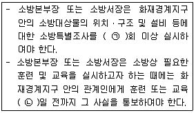
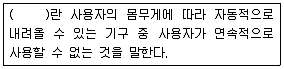
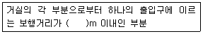
