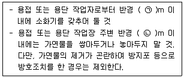

# 소방설비기사(전기분야)20200606(해설집) - 소방관계법규

> 원본: `소방설비기사(전기분야)20200606(해설집).pdf`
> 개인학습용 변환본.

## 41. 문제

41. 소방시설공사업법령에 따른 소방시설업 등록이 가능한 사람
은?
    ① 피성년후견인
    ② 위험물안전관리법에 따른 금고 이상의 형의 집행유예를 
선고받고 그 유예기간 중에 있는 사람
    ③ 등록하려는 소방시설업 등록이 취소된 날부터 3년이 지
난 사람
    ④ 소방기본법에 따른 금고 이상의 실형을 선고받고 그 집
행이 면제된 날부터 1년이 지난 사람
<문제 해설>
소방시설공사업법
제5조(등록의 결격사유) 다음 각 호의 어느 하나에 해당하는 자
는 소방시설업을 등록할 수 없다.    <개정 2013. 5. 22., 
2015. 7. 20., 2018. 2. 9.>

### 정답

1번

### 해설

정답은 1번입니다. 선택지의 핵심개념 을 확인하세요.

### 그림

## 42. 문제

42. 화재예방, 소방시설 설치·유지 및 안전관리에 관한 법률상 
방염성능기준 이상의 실내 장식물 등을 설치해야 하는 특정
소방대상물이 아닌 것은?
    ① 숙박이 가능한 수련시설
    ② 층수가 11층 이상인 아파트
    ③ 건축물 옥내에 있는 종교시설
    ④ 방송통신시설 중 방송국 및 촬영소
<문제 해설>
11층 이상인 것(아파트는 제외한다)
[해설작성자 : 나다]

### 정답

1번

### 해설

정답은 1번입니다. 선택지의 핵심개념 을 확인하세요.

### 그림

## 43. 문제

43. 소방시설공사업법령상 소방공사감리를 실시함에 있어 용도
와 구조에서 특별히 안전성과 보안성이 요구되는 소방대상
물로서 소방 시설물에 대한 감리를 감리업자가 아닌 자가 
감리할 수 있는 장소는?
    ① 정보기관의 청사
    ② 교도소 등 교정관련시설
    ③ 국방 관계시설 설치장소
    ④ 원자력안전법상 관계시설이 설치되는 장소
<문제 해설>
소방시설공사업법 시행령
제8조(감리업자가 아닌 자가 감리할 수 있는 보안성 등이 요구
되는 소방대상물의 시공 장소) 법 제16조제2항에서 "대통령령으
로 정하는 장소"란 「원자력안전법」 제2조제10호에 따른 관계
시설이 설치되는 장소를 말한다.    <개정 2011. 10. 25.>
[전문개정 2010. 10. 18.]
[해설작성자 : 시나브로]

### 정답

1번

### 해설

정답은 1번입니다. 선택지의 핵심개념 을 확인하세요.

### 그림

## 44. 문제

44. 위험물안전관리법령상 다음의 규정을 위반하여 위험물의 운
송에 관한 기준을 따르지 아니한 자에 대한 과태료 기준
은?(2021년 개정된 규정 적용됨)
    
    ① 100만 원 이하
② 300만 원 이하
    ③ 500만 원 이하
④ 1000만 원 이하
<문제 해설>
200만원 이하
위허물의 임시저장(90일)
제조소등의 점검결과 미보존
위험물 운송기준 미준수 <-------이번문제
3과목 : 소방관계법규

본 해설집은 최강 자격증 기출문제 전자문제집 CBT 해설달기 프로젝트에 의해서 만들어진 자료입니다. 해설을 제공해 주신 모든 분들께 감사 드립니다.
소방설비기사(전기분야)
◐2020년 06월 06일 필기 기출문제 및 해설집◑
전자문제집 CBT : www.comcbt.com
기출문제 해설은 최강 자격증 기출문제 전자문제집 CBT : www.comcbt.com 통해서 실시간으로 변경됩니다.
[해설작성자 : 와우어둠땅하고파]
(이)동탱크저장소 관리소홀 -> (이)백만원
[해설작성자 : 레인]
2021년 10월 21일에 위험물법 개정되는데 그전까지는 과태료는 
200만원이하 뿐이니 참고
[해설작성자 : 롤체하고싶다]
타. 법 제21조제3항을 위반하여 위험물의 운송에 관한 기준을 
따르지 않은 경우
법 제39조제1항제9호
    1) 1차 위반 시 - 250만원
    2) 2차 위반 시 - 400만원
    3) 3차 이상 위반 시 - 500만원
[해설작성자 : comcbt.com 이용자]
법이 2021년 이후로 개정되었습니다.
"위험물 운송자는 이동탱크저장소에 의하여 위험물을 운송하는 
때에는 행정안전부령을 정하는 기준을 준수하는 등 당해 위험물
의 안전 확보를 위하여 세심한 주의를 기울여야 한다."
1차 위반시 250만원 , 2차 위반시 400만원 , 3차 위반시 500만
원의 과태료가 부과된다.
즉 이러한 기준을 따르지 않을시의 과태료는 500만원 이하이다.
[해설작성자 : 승리부대]

### 정답

1번

### 해설

정답은 1번입니다. 선택지의 핵심개념 을 확인하세요.

### 그림

## 45. 문제

45. 다음 소방시설 중 경보설비가 아닌 것은?
    ① 통합감시시설
    ② 가스누설경보기
    ③ 비상콘센트설비
    ④ 자동화재속보설비
<문제 해설>
비상콘센트설비- 소화활동설비
[해설작성자 : 이게 맞음]

### 정답

1번

### 해설

정답은 1번입니다. 선택지의 핵심개념 을 확인하세요.

### 그림

## 46. 문제

46. 소방기본법령에 따라 주거지역·상업지역 및 공업지역에 소
방용수시설을 설치하는 경우 소방대상물과의 수평거리를 몇 
m 이하가 되도록 해야 하는가?
    ① 50
② 100
    ③ 150
④ 200
<문제 해설>
소방용수시설의 설치기준
1)주거지역, 상업지역, 공업지역 : 수평거리 100m 이하
2)그 외 지역 : 수평거리 140m 이하
[해설작성자 : 오트밀]

### 정답

1번

### 해설

정답은 1번입니다. 선택지의 핵심개념 을 확인하세요.

### 그림

## 47. 문제

47. 화재의 예방 및 안전관리에 관한 법률상 정당한 사유 없이 
화재의 예방조치에 관한 명령에 따르지 아니한 경우에 대한 
벌칙은?
    ① 200만 원 이하의 벌금
    ② 300만 원 이하의 벌금
    ③ 400만 원 이하의 벌금
    ④ 500만 원 이하의 벌금
<문제 해설>
[관리자 입니다.
기존 기출문제의 경우 소방기본법상 벌칙을 물어 보는 것이었으
나.
최근 문제 경향은 소방기본법이 아닌
화재의 예방 및 안전관리에 관한 법률에 대하여 물어 보는 쪽으
로 바뀌어
문제 내용을 변경하고 정답 또한 200에서 300만원으로 변경하
였습니다.
참고하시기 바랍니다.]
화재의 예방 및 안전관리에 관한 법률 ( 약칭: 화재예방법 )
[시행 2022. 12. 1.] [법률 제18523호, 2021. 11. 30., 제정]
제50조(벌칙)
③ 다음 각 호의 어느 하나에 해당하는 자는 300만원 이하의 벌
금에 처한다.

### 정답

1번

### 해설

정답은 1번입니다. 선택지의 핵심개념 을 확인하세요.

### 그림

## 48. 문제

48. 소방기본법령상 불꽃을 사용하는 용접·용단 기구의 용접 또
는 용단 작업장에서 지켜야 하는 사항 중 다음 ( ) 안에 알
맞은 것은?
    
    ① ㉠ 3, ㉡ 5
② ㉠ 5, ㉡ 3
    ③ ㉠ 5, ㉡ 10
④ ㉠ 10, ㉡ 5
<문제 해설>
불꽃을 사용하는 용접,용단 기구

### 정답

1번

### 해설

정답은 1번입니다. 선택지의 핵심개념 을 확인하세요.

### 그림

## 49. 문제

49. 소방기본법령상 소방업무 상호응원협정 체결 시 포함되어야 
하는 사항이 아닌 것은?
    ① 응원출동의 요청방법
    ② 응원출동훈련 및 평가
    ③ 응원출동대상지역 및 규모
    ④ 응원출동 시 현장지휘에 관한 사항
<문제 해설>
현장지휘는 요청한 쪽에서 함. 이미 정해진 것으로 상호응원협
정 체결시 포함되는 것이 아님.

본 해설집은 최강 자격증 기출문제 전자문제집 CBT 해설달기 프로젝트에 의해서 만들어진 자료입니다. 해설을 제공해 주신 모든 분들께 감사 드립니다.
소방설비기사(전기분야)
◐2020년 06월 06일 필기 기출문제 및 해설집◑
전자문제집 CBT : www.comcbt.com
기출문제 해설은 최강 자격증 기출문제 전자문제집 CBT : www.comcbt.com 통해서 실시간으로 변경됩니다.

### 정답

1번

### 해설

정답은 1번입니다. 선택지의 핵심개념 을 확인하세요.

### 그림

## 50. 문제

50. 위험물안전관리법령상 제조소등의 경보설비 설치기준에 대
한 설명으로 틀린 것은?
    ① 제조소 및 일반취급소의 연면적이 500m2 이상인 것에는 
자동화재탐지설비를 설치한다.
    ② 자동신호장치를 갖춘 스프링클러설비 또는 물분무등소화
설비를 설치한 제조소등에 있어서는 자동화재탐지설비를 
설치한 것으로 본다.
    ③ 경보설비는 자동화재탐지설비·비상경보설비(비상벨장치 
또는 경종 포함)·확성장치 (휴대용확성기 포함) 및 비상
방송설비로 구분한다.
    ④ 지정수량의 10배 이상의 위험물을 저장 또는 취급하는 
제조소등(이동탱크저장소를 포함한다)에는 화재발생시 이
를 알릴 수 있는 경보설비를 설치하여야 한다.
<문제 해설>
지정수량의 10배 이상의 위험물을 저장 또는 취급하는 제조소등
(이동탱크저장소를 제외)에는 화재발생시 이를 알릴 수 있는 경
보설비를 설치하여야 한다
[해설작성자 : 장반장]

### 정답

1번

### 해설

정답은 1번입니다. 선택지의 핵심개념 을 확인하세요.

## 51. 문제

51. 위험물안전관리법령에 따라 위험물안전관리자를 해임하거나 
퇴직한 때에는 해임하거나 퇴직한 날부터 며칠 이내에 다시 
안전관리 자를 선임하여야 하는가?
    ① 30일
② 35일
    ③ 40일
④ 55일
<문제 해설>
재선임30일
재선임신고14일
[해설작성자 : 이게 맞음]

### 정답

1번

### 해설

정답은 1번입니다. 선택지의 핵심개념 을 확인하세요.

## 52. 문제

52. 소방시설공사업법령에 따른 소방시설업의 등록권자는?
    ① 국무총리
    ② 소방서장
    ③ 시·도지사
    ④ 한국소방안전협회장
<문제 해설>
*참고
소방시설공사업법 제35조 : 소방시설업 등록을 하지 아니하고 
영업을 한 자는 3년이하의 징역 또는 3천만원 이하의 벌금에 처
한다.<개정 2018. 9. 18.>
[해설작성자 : 푸른마을 안전관리자]

### 정답

1번

### 해설

정답은 1번입니다. 선택지의 핵심개념 을 확인하세요.

## 53. 문제

53. 소방기본법령에 따른 소방용수시설 급수탑 개폐밸브의 설치
기준으로 맞는 것은?
    ① 지상에서 1.0m 이상 1.5m 이하
    ② 지상에서 1.2m 이상 1.8m 이하
    ③ 지상에서 1.5m 이상 1.7m 이하
    ④ 지상에서 1.5m 이상 2.0m 이하
<문제 해설>
꼬마아이들이 함부로 급수탑의 개폐밸브를 못열게 살짝 높은위
치인 1.5~1.7사이 2m이면 어른들도 열기 애매함
[해설작성자 : 와우어둠땅하고파]

### 정답

1번

### 해설

정답은 1번입니다. 선택지의 핵심개념 을 확인하세요.

## 54. 문제

54. 위험물안전관리법령상 정기검사를 받아야 하는 특정·준특정
옥외탱크저장소의 관계인은 특정·준특정옥외탱크저장소의 
설치허가에 따른 완공검사필증을 발급받은 날부터 몇 년 이
내에 정기검사를 받아야 하는가?
    ① 9
② 10
    ③ 11
④ 12
<문제 해설>
특정준특정옥외탱크저장소 는 12글자니까 정답 12년
[해설작성자 : 레인]

### 정답

1번

### 해설

정답은 1번입니다. 선택지의 핵심개념 을 확인하세요.

## 55. 문제

55. 화재예방, 소방시설 설치·유지 및 안전관리에 관한 법률상 
소방시설 등에 대한 자체점검 중 종합정밀점검 대상인 것
은?
    ① 제연설비가 설치되지 않은 터널
    ② 스프링클러설비가 설치된 연면적이 5000m2이고, 12층인 
아파트
    ③ 물분무등소화설비가 설치된 연면적이 5000m2인 위험물 
제조소
    ④ 호스릴 방식의 물분무등소화설비만을 설치한 연면적 
3000m2인 특정소방대상물
<문제 해설>
기존 : 스프링쿨러설비 또는 물분무등소화설비가 설치된 연면적 
5,000m2 이상인 특정소방대상물(단, 아파트는 연면적 5,000m2 
이상이고 11층 이상)
변경 : 스프링쿨러설비가 설치된 특정소방대상물, 물분부등소화
설비가 설치된 연면적 5,000m2 이상인 특정소방대상물
(2020.08.14 시행)
[해설작성자 : 소방초보]
(제외대상)

### 정답

1번

### 해설

정답은 1번입니다. 선택지의 핵심개념 을 확인하세요.

## 56. 문제

56. 화재예방, 소방시설 설치·유지 및 안전관리에 관한 법률상 
소방용품의 형식승인을 받지 아니하고 소방용품을 제조하거
나 수입한 자에 대한 벌칙 기준은?
    ① 100만 원 이하의 벌금
    ② 300만 원 이하의 벌금
    ③ 1년 이하의 징역 또는 1천만 원 이하의 벌금
    ④ 3년 이하의 징역 또는 3천만 원 이하의 벌금
<문제 해설>
제형부피소 3년으로 암기(제형부는 피소당해서 3년선고받음)
제품검사x
소방시설업 무등록자
형식승인x
부정한방법으로지정받음
피난조치위반

본 해설집은 최강 자격증 기출문제 전자문제집 CBT 해설달기 프로젝트에 의해서 만들어진 자료입니다. 해설을 제공해 주신 모든 분들께 감사 드립니다.
소방설비기사(전기분야)
◐2020년 06월 06일 필기 기출문제 및 해설집◑
전자문제집 CBT : www.comcbt.com
기출문제 해설은 최강 자격증 기출문제 전자문제집 CBT : www.comcbt.com 통해서 실시간으로 변경됩니다.
[해설작성자 : 레인]

### 정답

1번

### 해설

정답은 1번입니다. 선택지의 핵심개념 을 확인하세요.

## 57. 문제

57. 화재예방, 소방시설 설치·유지 및 안전관리에 관한 법률상 
소방안전관리대상물의 소방 안전관리자의 업무가 아닌 것
은?
    ① 소방시설 공사
    ② 소방훈련 및 교육
    ③ 소방계획서의 작성 및 시행
    ④ 자위소방대의 구성·운영·교육
<문제 해설>
소방안전관리자=교육,사항
[해설작성자 : 민갱씨]
안전관리자가 왜 공사를..?
[해설작성자 : 민갱씨]

### 정답

1번

### 해설

정답은 1번입니다. 선택지의 핵심개념 을 확인하세요.

## 58. 문제

58. 소방기본법에 따라 화재 등 그 밖의 위급한 상황이 발생한 
현장에서 소방활동을 위하여 필요한 때에는 그 관할구역에 
사는 사람 또는 그 현장에 있는 사람으로 하여금 사람을 구
출하는 일 또는 불을 끄는 등의 일을 하도록 명령할 수 있
는 권한이 없는 사람은?
    ① 소방서장
② 소방대장
    ③ 시·도지사
④ 소방본부장
<문제 해설>
시 도지사가 왜...???
[해설작성자 : 시도지사바빠]

### 정답

1번

### 해설

정답은 1번입니다. 선택지의 핵심개념 을 확인하세요.

## 59. 문제

59. 화재예방, 소방시설 설치·유지 및 안전관리에 관한 법률상 
화재위험도가 낮은 특정소방대상물 중 소방대가 조직되어 
24시간 근무하고 있는 청사 및 차고에 설치하지 아니할 수 
있는 소방시설이 아닌 것은?
    ① 피난기구
    ② 비상방송설비
    ③ 연결송수관설비
    ④ 자동화재탐지설비
<문제 해설>
<특정소방대상물>
「소방기본법」 제2조 제5호에 따른 소방대(消防隊)가 조직되어 
24시간 근무하고 있는 청사 및 차고
<면제되는 소방시설> : 설치하지 않아도 되는 소방시설 (여기에 
해당하면 본 문제의 답이 아님)
옥내소화전설비, 스프링클러설비, 물분무등소화설비, 비상방송설
비, 피난기구, 소화용수설비, 연결송수관설비, 연결살수설비
[해설작성자 : 대천사.루시퍼]
개념을 이해하면 됩니다..
화재위험도가 낮아서 소방관련 모든 시설을 설치하기에는 가성
비가 맞지 않으나,
최소한 화재발생을 탐지할수는 있어야 인명대피 및 소화요청 등
을 할수 있다..
[해설작성자 : comcbt.com 이용자]

### 정답

1번

### 해설

정답은 1번입니다. 선택지의 핵심개념 을 확인하세요.

## 60. 문제

60. 화재예방, 소방시설 설치·유지 및 안전관리에 관한 법률상 
건축허가 등의 동의대상물이 아닌 것은?
    ① 항공기 격납고
    ② 연면적이 300m2인 공연장
    ③ 바닥면적이 300m2인 차고
    ④ 연면적이 300m2인 노유자 시설
<문제 해설>
1.연면적 400m^2이상 건축물
- 학교시설:100
- 노유자시설 및 수련시설:200
- 정신의료기관:300
- 장애인 의료재활시설:300
2.차고•주차장 또는 주차용도로 사용되는 시설
- 차고•주차장:200
- 기계장치에 의한 주차시설:자동차 20대
3.항공기 격납고,관망탑,항공관제탑,방송용 송수신탑
4.지하층 또는 무창층이 있는 건축물:150
- 공연장의 경우:100
[해설작성자 : comcbt.com 이용자]

### 정답

1번

### 해설

정답은 1번입니다. 선택지의 핵심개념 을 확인하세요.
