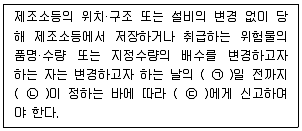

# 소방설비기사(전기분야)20200822(해설집) - 소방관계법규

> 원본: `소방설비기사(전기분야)20200822(해설집).pdf`
> 개인학습용 변환본.

## 41. 문제

41. 소방기본법령상 화재피해조사 중 재산피해조사의 조사범위
에 해당하지 않는 것은?
    ① 소화활동 중 사용된 물로 인한 피해
    ② 열에 의한 탄화, 용융, 파손 등의 피해
    ③ 소방활동 중 발생한 사망자 및 부상자
    ④ 연기, 물품반출, 화재로 인한 폭발 등에 의한 피해
<문제 해설>
재산피해

### 정답

1번

### 해설

정답은 1번입니다. 선택지의 핵심개념 을 확인하세요.

### 그림

## 42. 문제

42. 위험물안전관리법령상 제조소의 기준에 따라 건축물의 외벽 
또는 이에 상당하는 공작물의 외측으로부터 제조소의 외벽 
또는 이에 상당하는 공작물의 외측까지의 안전거리 기준으
로 틀린 것은? (단, 제6류 위험물을 취급하는 제조소를 제
외하고, 건축물에 불연재료로 된 방화상 유효한 담 또는 벽
을 설치하지 않은 경우이다.)
    ① 의료법에 의한 종합병원에 있어서는 30m 이상
    ② 도시가스사업법에 의한 가스공급시설에 있어서는 20m 
이상
    ③ 사용전압 35000V를 초과하는 특고압가공전선에 있어서
는 5m 이상
    ④ 문화재보호법에 의한 유형문화재와 기념물 중 지정문화
재에 있어서는 30m 이상
<문제 해설>
3m 이상 : 7kV 이상 35kV 이하의 특고압가공전선
5m 이상 : 35kV 초과 특고압가공전선
10m 이상 : 주거용
20m 이상 : 가스 혹은 액화가스 관련시설
50m 이상 : 문화재
위의 것을 제외하면 대체로 30m 이상입니다.

### 정답

1번

### 해설

정답은 1번입니다. 선택지의 핵심개념 을 확인하세요.

### 그림

## 43. 문제

43. 위험물안전관리법령상 허가를 받지 아니하고 당해 제조소등
을 설치하거나 그 위치·구조 또는 설비를 변경할 수 있으며, 
신고를 하지 아니하고 위험물의 품명·수량 또는 지정수량의 
배수를 변경할 수 있는 기준으로 옳은 것은?
    ① 축산용으로 필요한 건조시설을 위한 지정수량 40배 이하
의 저장소
    ② 수산용으로 필요한 건조시설을 위한 지정수량 30배 이하
의 저장소
    ③ 농예용으로 필요한 난방시설을 위한 지정수량 40배 이하
의 저장소
    ④ 주택의 난방시설(공동주택의 중앙난방시설 제외)을 위한 
저장소
<문제 해설>
주택의 난방시설을 위한 저장소 또는 취급소.
20배 이하의 농/축/수 용의 난방/건조 저장소.

### 정답

1번

### 해설

정답은 1번입니다. 선택지의 핵심개념 을 확인하세요.

### 그림

## 44. 문제

44. 소방시설공사업법령상 공사감리자 지정대상 특정소방대상물
의 범위가 아닌 것은?
    ① 제연설비를 신설·개설하거나 제연구역을 증설할 때
3과목 : 소방관계법규

본 해설집은 최강 자격증 기출문제 전자문제집 CBT 해설달기 프로젝트에 의해서 만들어진 자료입니다. 해설을 제공해 주신 모든 분들께 감사 드립니다.
소방설비기사(전기분야)
◐2020년 08월 22일 필기 기출문제 및 해설집◑
전자문제집 CBT : www.comcbt.com
기출문제 해설은 최강 자격증 기출문제 전자문제집 CBT : www.comcbt.com 통해서 실시간으로 변경됩니다.
    ② 연소방지설비를 신설·개설하거나 살수구역을 증설할 때
    ③ 캐비닛형 간이스프링클러설비를 신설·개설하거나 방호·방
수 구역을 증설할 때
    ④ 물분무등소화설비(호스릴 방식의 소화설비 제외)를 신설·
개설하거나 방호·방수 구역을 증설할 때
<문제 해설>

### 정답

1번

### 해설

정답은 1번입니다. 선택지의 핵심개념 을 확인하세요.

### 그림

## 45. 문제

45. 다음 중 소방기본법령상 특수가연물에 해당하는 품명별 기
준수량으로 틀린 것은?
    ① 사류 1000 kg 이상
    ② 면화류 200 kg 이상
    ③ 나무껍질 및 대팻밥 400 kg 이상
    ④ 넝마 및 종이부스러기 500 kg 이상
<문제 해설>
면화 200kg
나무 400kg
넝마 1000kg
사류 1000kg
볏짚 1000kg
가연성고체 3000kg
석탄목탄 10000kg
가연성액체 2m^3
목재 10m^3
합성수지 발포 20m^3
합성수지 그외 3000kg

### 정답

1번

### 해설

정답은 1번입니다. 선택지의 핵심개념 을 확인하세요.

## 46. 문제

46. 소방기본법령상 소방대장의 권한이 아닌 것은?
    ① 화재 현장에 대통령령으로 정하는 사람외에는 그 구역에 
출입하는 것을 제한할 수 있다.
    ② 화재 진압 등 소방활동을 위하여 필요할 때에는 소방용
수 외에 댐·저수지 등의 물을 사용할 수 있다.
    ③ 국민의 안전의식을 높이기 위하여 소방박물관 및 소방체
험관을 설립하여 운영할 수 있다.
    ④ 불이 번지는 것을 막기 위하여 필요할 때에는 불이 번질 
우려가 있는 소방대상물 및 토지를 일시적으로 사용할 
수 있다.
<문제 해설>
소방대장님은 불 끄느라 바쁘십니다.
소방박물관은 소방청장
소방체험관은 시,도지자
[해설작성자 : comcbt.com 이용자]
암기법
박물(관)청
체험시도
[해설작성자 : kim]

### 정답

1번

### 해설

정답은 1번입니다. 선택지의 핵심개념 을 확인하세요.

## 47. 문제

47. 화재예방, 소방시설 설치·유지 및 안전관리에 관한 법령상 
단독경보형 감지기를 설치하여야 하는 특정소방대상물의 기
준으로 틀린 것은?(문제 오류로 가답안 발표시 1번으로 발
표되었지만 확정답안 발표시 1, 3번이 정답처리 되었습니
다. 여기서는 가답안인 1번을 누르시면 정답 처리 됩니다.)
    ① 연면적 600m2 미만의 기숙사
    ② 연면적 600m2 미만의 숙박시설
    ③ 연면적 1000m2 미만의 아파트
    ④ 교육연구시설 또는 수련시설 내에 있는 합숙소 또는 기
숙사로서 연면적 2000m2 미만인 것
<문제 해설>
단독경보형 감지기를 설치하여야 하는 특정소방대상물은 다음의 
어느 하나와 같다.
1) 연면적 1000m^2 미만의 아파트등
2) 연면적 1000m^2 미만의 기숙사
3) 교육연구시설 또는 수련시설 내에 있는 합숙소 또는 기숙사
로서 연면적 2000m^2 미만인 것
4) 연면적 600m^2 미만의 숙박시설
[해설작성자 : 왜 3번이 정답처리되었는지 알려주실 분?]
기준이기때문에 3번은 아파트등이맞습니다
[해설작성자 : comcbt.com 이용자]

### 정답

1번

### 해설

정답은 1번입니다. 선택지의 핵심개념 을 확인하세요.

## 48. 문제

48. 소방기본법령상 시장지역에서 화재로 오인할 만한 우려가 
있는 불을 피우거나 연막소독을 하려는 자가 신고를 하지 
아니하여 소방자동차를 출동하게 한 자에 대한 과태료 부
과·징수권자는?
    ① 국무총리
② 시·도지사
    ③ 행정안전부 장관
④ 소방본부장 또는 소방서장
<문제 해설>
과태료 부과/징수권자는 시, 도지사, 소방본부장, 또는 소방서장
입니다.
그런데 여기서 단 하나의 예외가 있는데, 소방기본법 19조 2항
의 위반자입니다.
소방기본법 19조 2항: 화재로 오인할만한 우려가 있는 불을 피
우거나 연막소독을 하려는데 신고를 하지 않은 경우
이 때는 관할 소방본부장 또는 소방서장이 부과/징수합니다..시, 
도지사가 빠졌죠.
따라서 과태료! 하면 일단 소방본부장 또는 소방서장을 고르시
면 됩니다..이 선택지가 없다면 시, 도지사를 골라주시면 되구
요.

### 정답

1번

### 해설

정답은 1번입니다. 선택지의 핵심개념 을 확인하세요.

## 49. 문제

49. 화재예방, 소방시설 설치·유지 및 안전관리에 관한 법령상 1
급 소방안전관리 대상물에 해당하는 건축물은?(관련 규정 
개정전 문제로 여기서는 기존 정답인 2번을 누르면 정답 처
리됩니다. 자세한 내용은 해설을 참고하세요.)
    ① 지하구
    ② 층수가 15층인 공공업무시설
    ③ 연면적 15000m2 이상인 동물원
    ④ 층수가 20층이고, 지상으로부터 높이가 100미터인 아파
트
<문제 해설>
1) 30층 이상(지하층 제외)이거나 지상으로부터 높이가 120미터 
이상인 아파트
2) 연면적 1만5천제곱미터 이상인 특정소방대상물
(아파트 및 연립주택은 제외)
3) 2)에 해당하지 않는 특정소방대상물로서 지상층의 층수가 11
층 이상인 특정소방대상물(아파트는 제외)
4) 가연성 가스를 1천톤 이상 저장·취급하는 시설
[해설작성자 : 푸른마을 안전관리자]
특급 소방안전관리대상물 기준 중 연면적이 10만제곱미터 이상
인 특정소방대상물(아파트는 제외한다)로 변경
법적근거 : 화재의 예방 및 안전관리에 관한 법률 시행령 별표4
의 제1항의 가목에 3)호
[해설작성자 : kant654]

### 정답

1번

### 해설

정답은 1번입니다. 선택지의 핵심개념 을 확인하세요.

## 50. 문제

50. 화재예방, 소방시설 설치·유지 및 안전관리에 관한 법령상 
수용인원 산정 방법 중 침대가 없는 숙박시설로서 해당 특
정소방대상물의 종사자의 수는 5명, 복도, 계단 및 화장실의 
바닥면적을 제외한 바닥 면적이 158m2인 경우의 수용인원
은 약 몇 명인가?
    ① 37
② 45
    ③ 58
④ 84
<문제 해설>
숙박시설
침대가 있으면 침대수만큼.
침대가 없으면 1인당 3제곱미터.
강의실 1인당 1.9제곱미터.
강당, 집회시설 등
고정식 의자가 있으면 의자 수만큼.
긴 의자가 있으면 1인당 0.45미터씩
의자가 없으면 4.6제곱미터
숙박시설-침대없음. 따라서 계산하면
종사자5명+52.66명
따라서 총 수용인원 약 58명.
[해설작성자 : comcbt.com 이용자]
숙박시설
침대가 있는 경우 : 종사자 수 + 침대수
침대가 없는 경우 : 종사자 수 + 바닥면적합계/3m^2
[해설작성자 : 자격증 조지기]

### 정답

1번

### 해설

정답은 1번입니다. 선택지의 핵심개념 을 확인하세요.

## 51. 문제

51. 화재예방, 소방시설 설치·유지 및 안전관리에 관한 법령상 
소방특별조사 결과 소방대상물의 위치 상황이 화재 예방을 
위하여 보완될 필요가 있을 것으로 예상되는 때에 소방대상
물의 개수·이전·제거, 그 밖의 필요한 조치를 관계인에게 명
령할 수 있는 사람은?
    ① 소방서장
② 경찰청장
    ③ 시·도지사
④ 해당구청장
<문제 해설>

본 해설집은 최강 자격증 기출문제 전자문제집 CBT 해설달기 프로젝트에 의해서 만들어진 자료입니다. 해설을 제공해 주신 모든 분들께 감사 드립니다.
소방설비기사(전기분야)
◐2020년 08월 22일 필기 기출문제 및 해설집◑
전자문제집 CBT : www.comcbt.com
기출문제 해설은 최강 자격증 기출문제 전자문제집 CBT : www.comcbt.com 통해서 실시간으로 변경됩니다.
소방특별조사의 실시 및 조치명령 : 소방청장, 소방본부장, 소방
서장

### 정답

1번

### 해설

정답은 1번입니다. 선택지의 핵심개념 을 확인하세요.

## 52. 문제

52. 화재예방, 소방시설 설치·유지 및 안전관리에 관한 법령상 
지하가 중 터널로서 길이가 1천미터일 때 설치하지 않아도 
되는 소방시설은?
    ① 인명구조기구
    ② 옥내소화전설비
    ③ 연결송수관설비
    ④ 무선통신보조설비
<문제 해설>
소화설비 및 소화활동설비에 인명구조기구는 없습니다.
소화설비
소화기구:전체
옥내소화전설비:2등급
물분무설비:1등급
소화활동설비
제연설비:2등급(단, 피난대피시설 미흡시 3급)
무선통신보조설비:3등급(4급은 권장)
연결송수관설비:2등급
비상콘센트설비:2등급
1천미터 터널은 2등급에 해당하므로 물분무시설을 제외한 전체
설비에 해당.
1등급 : 3천미터 이상/X>29
2등급 : 1천미터 이상, 3천미터 미만/19<X<=29
3등급 : 5백미터 이상, 1천미터 미만/14<X<=19
4등급 : 그 아래
[추가 해설]
소방시설법 시행령 - 인명구조기구의 설치장소
1) 지하층을 포함한 7층이상의 관광호텔
2) 지하층을 포함한 5층이상의 병원
3) 공기호흡기를 설치하여야 하는 특정소방대상물
    - 수용인원 100명 이상인 영화상영관
    - 대규모 점포 / 지하역사 / 지하상가
    - 이산화탄소 소화설비(호스릴 제외)를 설치하여야 하는 특
정소방대상물
[해설작성자 : comcbt.com 이용자]
■ 소방시설 설치 및 관리에 관한 법률 시행령 [별표 4] [시행
일: 2023. 12. 1.] 제1호나목2), 제2호마목
특정소방대상물의 관계인이 특정소방대상물에 설치ㆍ관리해야 
하는 소방시설의 종류(제11조 관련)

### 정답

1번

### 해설

정답은 1번입니다. 선택지의 핵심개념 을 확인하세요.

## 53. 문제

53. 소방시설공사업법령상 소방시설공사의 하자보수 보증기간이 
3년이 아닌 것은?
    ① 자동소화장치
② 무선통신보조설비
    ③ 자동화재탐지설비
④ 간이스프링클러설비
<문제 해설>
방송.통신.유도등 관련은 2년
[해설작성자 : 레인]
하자보수 기간은 자탐,무통빼고 일일이 암기할필요 없음
소화기쪽-3년 소3공인
나머지-2년
자탐-3년 자3 -자살
무통-2년 므2
[해설작성자 : roachinese]

### 정답

1번

### 해설

정답은 1번입니다. 선택지의 핵심개념 을 확인하세요.

## 54. 문제

54. 화재예방, 소방시설 설치·유지 및 안전관리에 관한 법령상 
스프링클러설비를 설치하여야 하는 특정소방대상물의 기준
으로 틀린 것은? (단, 위험물 저장 및 처리 시설 중 가스시
설 또는 지하구는 제외한다.)
    ① 복합건축물로서 연면적 3500m2 이상인 경우에는 모든 
층
    ② 창고시설(물류터미널은 제외)로서 바닥면적 합계가 
5000m2 이상인 경우에는 모든 층
    ③ 숙박이 가능한 수련시설 용도로 사용되는 시설의 바닥면
적의 합계가 600m2 이상인 것은 모든 층
    ④ 판매시설, 운수시설 및 창고시설(물류터미널에 한정)로서 
바닥면적의 합계가 5000m2 이상이거나 수용인원이 500
명 이상인 경우에는 모든 층
<문제 해설>
복합건축물 : 5년
[해설작성자 : 레인]
일단 기준에 3500m^2라는 애매한 넓이는 없다는 것을 기억해주
시고...

### 정답

1번

### 해설

정답은 1번입니다. 선택지의 핵심개념 을 확인하세요.

## 55. 문제

55. 국민의 안전의식과 화재에 대한 경각심을 높이고 안전문화
를 정착시키기 위한 소방의 날은 몇 월 며칠인가?
    ① 1월 19일
② 10월 9일
    ③ 11월 9일
④ 12월 19일
<문제 해설>
소방신고는 119. 따라서 11월 9일입니다.
1월 19일이랑 헷갈리지 않게 조심하세요.
11-9입니다.
[해설작성자 : comcbt.com 이용자]

### 정답

1번

### 해설

정답은 1번입니다. 선택지의 핵심개념 을 확인하세요.

### 그림

## 56. 문제

56. 위험물안전관리법령상 위험물시설의 설치 및 변경 등에 관
한 기준 중 다음 ( ) 안에 들어갈 내용으로 옳은 것은?
    
    ① ㉠ : 1, ㉡ : 대통령령, ㉢ : 소방본부장
    ② ㉠ : 1, ㉡ : 행정안전부령, ㉢ : 시·도지사
    ③ ㉠ : 14, ㉡ : 대통령령, ㉢ : 소방서장
    ④ ㉠ : 14, ㉡ : 행정안전부령, ㉢ : 시·도지사
<문제 해설>
위험물 : 시/도 조례, 90일 이내
제조소 설치 : 시/도지사, 1일 "전"
제조소 승계 : 사/도지사, 30일 이내
제조소 폐지 : 시/도지사, 14일 이내
cf)위험물 안전관리자
선임신고 : 소방본부장/소방서장, 14일 이내

본 해설집은 최강 자격증 기출문제 전자문제집 CBT 해설달기 프로젝트에 의해서 만들어진 자료입니다. 해설을 제공해 주신 모든 분들께 감사 드립니다.
소방설비기사(전기분야)
◐2020년 08월 22일 필기 기출문제 및 해설집◑
전자문제집 CBT : www.comcbt.com
기출문제 해설은 최강 자격증 기출문제 전자문제집 CBT : www.comcbt.com 통해서 실시간으로 변경됩니다.
재선임/직무대행 : 소방본부장/소방서장, 30일 이내
[해설작성자 : comcbt.com 이용자]
위험물안전관리법 제6조 2항
제조소등의 위치ㆍ구조 또는 설비의 변경없이 당해 제조소등에
서 저장하거나 취급하는 위험물의 품명ㆍ수량 또는 지정수량의 
배수를 변경하고자 하는 자는 변경하고자 하는 날의 1일 전까지 
행정안전부령이 정하는 바에 따라 시ㆍ도지사에게 신고하여야 
한다.
[해설작성자 : 1일/행안부령/시도지사]

### 정답

1번

### 해설

정답은 1번입니다. 선택지의 핵심개념 을 확인하세요.

### 그림

## 57. 문제

57. 위험물안전관리법령상 위험물취급소의 구분에 해당하지 않
는 것은?
    ① 이송취급소
② 관리취급소
    ③ 판매취급소
④ 일반취급소
<문제 해설>
주유, 판매, 이송, 일반

### 정답

1번

### 해설

정답은 1번입니다. 선택지의 핵심개념 을 확인하세요.

## 58. 문제

58. 소방기본법령상 화재가 발생하였을 때 화재의 원인 및 피해 
등에 대한 조사를 하여야 하는 자는?
    ① 시·도지사 또는 소방본부장
    ② 소방청장·소방본부장 또는 소방서장
    ③ 시·도지사·소방서장 또는 소방파출소장
    ④ 행정안전부장관·소방본부장 또는 소방파출소장
<문제 해설>
화재원인조사 :청본서장
화재경계지구내 소방특별조사 :본서장
소방특별조사 :청본서장
[해설작성자 : roachinese]

### 정답

1번

### 해설

정답은 1번입니다. 선택지의 핵심개념 을 확인하세요.

## 59. 문제

59. 화재예방, 소방시설 설치·유지 및 안전관리에 관한 법령상 1
년 이하의 징역 또는 1천만원 이하의 벌금 기준에 해당하는 
경우는?
    ① 소방용품의 형식승인을 받지 아니하고 소방용품을 제조
하거나 수입한 자
    ② 형식승인을 받은 소방용품에 대하여 제품검사를 받지 아
니한 자
    ③ 거짓이나 그 밖의 부정한 방법으로 제품검사 전문기관으
로 지정을 받은 자
    ④ 소방용품에 대하여 형상 등의 일부를 변경한 후 형식승
인의 변경승인을 받지 아니한 자
<문제 해설>

### 정답

1번

### 해설

정답은 1번입니다. 선택지의 핵심개념 을 확인하세요.

## 60. 문제

60. 다음 중 화재예방, 소방시설 설치·유지 및 안전관리에 관한 
법령상 소방시설관리업을 등록할 수 있는 자는?
    ① 피성년후견인
    ② 소방시설관리업의 등록이 취소된 날부터 2년이 경과된 
자
    ③ 금고 이상의 형의 집행유예를 선고받고 그 유예기간 중
에 있는 자
    ④ 금고 이상의 실형을 선고받고 그 집행이 면제된 날부터 
2년이 지나지 아니한 자
<문제 해설>
등록의 결격사유

### 정답

1번

### 해설

정답은 1번입니다. 선택지의 핵심개념 을 확인하세요.
