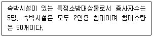

# 소방설비기사(전기분야)20200926(해설집) - 소방관계법규

> 원본: `소방설비기사(전기분야)20200926(해설집).pdf`
> 개인학습용 변환본.

## 41. 문제

41. 위험물안전관리법령상 위험물 중 제1석유류에 속하는 것은?
    ① 경유
② 등유
    ③ 중유
④ 아세톤
<문제 해설>
위험물중 제1석유류
아세톤, 휘발유, 벤젠
[해설작성자 : comcbt.com 이용자]

### 정답

1번

### 해설

정답은 1번입니다. 선택지의 핵심개념 을 확인하세요.

## 42. 문제

42. 화재예방, 소방시설 설치·유지 및 안전관리에 관한 법령상 
소방시설 등의 자체점검 중 종합정밀점검을 받아야 하는 특
정소방대상물 대상 기준으로 틀린 것은?
    ① 제연설비가 설치된 터널
    ② 스프링클러설비가 설치된 특정소방대상물
    ③ 공공기관 중 연면적이 1000m2 이상인 것으로서 옥내소
화전설비 또는 자동화재탐지설비가 설치된 것 (단, 소방
대가 근무하는 공공기관은 제외한다.)
    ④ 호스릴 방식의 물분무등소화설비만이 설치된 연면적 
5000m2 이상인 특정소방대상물 (단, 위험물 제조소등은 
제외한다.)
<문제 해설>
문분무등소화설비는 종합정밀점검 대상이다, 단 호스릴방식은 
제외한다.
[해설작성자 : 젊은보스]

### 정답

1번

### 해설

정답은 1번입니다. 선택지의 핵심개념 을 확인하세요.

## 43. 문제

43. 화재예방, 소방시설 설치·유지 및 안전관리에 관한 법령상 
소방시설이 아닌 것은?
    ① 소화설비
② 경보설비
    ③ 방화설비
④ 소화활동설비
<문제 해설>
소방시설

### 정답

1번

### 해설

정답은 1번입니다. 선택지의 핵심개념 을 확인하세요.

## 44. 문제

44. 소방기본법상 소방대장의 권한이 아닌 것은?
    ① 소방활동을 할 때에 긴급한 경우에는 이웃한 소방본부장 
또는 소방서장에게 소방업무의 응원을 요청할 수 있다.
    ② 화재, 재난·재해, 그 밖의 위급한 상황이 발생한 현장에
서 소방활동을 위하여 필요할 때에는 그 관할구역에 사
는 사람 또는 그 현장에 있는 사람으로 하여금 사람을 
구출하는 일 또는 불을 끄거나 불이 번지지 아니하도록 
하는 일을 하게 할 수 있다.
    ③ 사람을 구출하거나 불이 번지는 것을 막기 위하여 필요
할 때에는 화재가 발생하거나 불이 번질 우려가 있는 소
방대상물 및 토지를 일시적으로 사용하거나 그 사용의 
제한 또는 소방활동에 필요한 처분을 할 수 있다.
    ④ 소방활동을 위하여 긴급하게 출동할 때에는 소방자동차
의 통행과 소방활동에 방해가 되는 주차 또는 정차된 차
량 및 물건 등을 제거하거나 이동시킬 수 있다.
<문제 해설>
소방기본법 제11조 소방업무의 응원 (소방본부장이나 소방서장
은 소방활동을 할 때에 긴급한 경우에는 이웃한 소방본부장 또
는 소방서장에게 소방업무의 응원(應援)을 요청할 수 있다)
소방대장 권한이 아님
[해설작성자 : 옥정동신똘]
소방대장은 현장업무만해도 바쁩니다.
응원요청은 본.서가 합니다.
[해설작성자 : 시험전날 공부]

### 정답

1번

### 해설

정답은 1번입니다. 선택지의 핵심개념 을 확인하세요.

## 45. 문제

45. 위험물안전관리법령상 제조소등이 아닌 장소에서 지정수량 
이상의 위험물을 취급할 수 있는 경우에 대한 기준으로 맞
는 것은? (단, 시·도의 조례가 정하는 바에 따른다.)
    ① 관할 소방서장의 승인을 받아 지정수량 이상의 위험물을 
60일 이내의 기간 동안 임시로 저장 또는 취급하는 경우
    ② 관할 소방대장의 승인을 받아 지정수량 이상의 위험물을 
60일 이내의 기간 동안 임시로 저장 또는 취급하는 경우
    ③ 관할 소방서장의 승인을 받아 지정수량 이상의 위험물을 
90일 이내의 기간 동안 임시로 저장 또는 취급하는 경우
    ④ 관할 소방대장의 승인을 받아 지정수량 이상의 위험물을 
90일 이내의 기간 동안 임시로 저장 또는 취급하는 경우
<문제 해설>
위험물안전관리법 제 5조 위험물의 저장 및 취급의 제한

### 정답

1번

### 해설

정답은 1번입니다. 선택지의 핵심개념 을 확인하세요.

## 46. 문제

46. 위험물안전관리법령상 제4류 위험물별 지정수량 기준의 연
결이 틀린 것은?
    ① 특수인화물 - 50리터
    ② 알코올류 - 400리터
    ③ 동식물유류 - 1000리터
    ④ 제4석유류 - 6000리터
<문제 해설>
동식물류 지정수량 10000리터 이상
[해설작성자 : comcbt.com 이용자]
알코올류 - 600L
동식물류 10000L
3과목 : 소방관계법규

본 해설집은 최강 자격증 기출문제 전자문제집 CBT 해설달기 프로젝트에 의해서 만들어진 자료입니다. 해설을 제공해 주신 모든 분들께 감사 드립니다.
소방설비기사(전기분야)
◐2020년 09월 26일 필기 기출문제 및 해설집◑
전자문제집 CBT : www.comcbt.com
기출문제 해설은 최강 자격증 기출문제 전자문제집 CBT : www.comcbt.com 통해서 실시간으로 변경됩니다.
[해설작성자 : comcbt.com 이용자]

### 정답

1번

### 해설

정답은 1번입니다. 선택지의 핵심개념 을 확인하세요.

## 47. 문제

47. 화재의 예방 및 안전관리에 관한 법률상 화재예방강화지구
의 지정권자는?
    ① 소방서장
② 시·도지사
    ③ 소방본부장
④ 행정자치부장관
<문제 해설>
화재의 예방 및 안전관리에 관한 법률
[시행 2022. 12. 1.] [법률 제18523호, 2021. 11. 30., 제정]
제정ㆍ개정이유 안의 내용입니다.
"화재경계지구"를 화재예방의 중요성을 명확하게 나타내기 위하
여 "화재예방강화지구"로 명칭을 변경하고, 시ㆍ도지사로 하여금 
조례로 정하는 바에 따라 화재예방강화지구 안의 소방설비 등의 
설치에 필요한 비용을 지원할 수 있도록 함
"소방특별조사"를 조사의 목적이 분명히 드러날 수 있도록 "화재
안전조사"로 명칭을 변경하고, 화재안전조사의 투명성 확보를 위
하여 사전에 조사대상, 조사기간 및 조사사유 등을 관계인에게 
통지하도록 하며, 화재안전조사를 실시한 경우 그 결과를 인터
넷 홈페이지나 전산시스템 등에 공개할 수 있도록 함

### 정답

1번

### 해설

정답은 1번입니다. 선택지의 핵심개념 을 확인하세요.

## 48. 문제

48. 위험물안전관리법령상 관계인이 예방규정을 정하여야 하는 
위험물을 취급하는 제조소의 지정수량 기준으로 옳은 것은?
    ① 지정수량의 10배 이상
    ② 지정수량의 100배 이상
    ③ 지정수량의 150배 이상
    ④ 지정수량의 200배 이상
<문제 해설>
암기방법
십제 (제조소 10배이상)
백외 (옥외저장소 100배이상)
십오내 (옥내저장소 150배이상)
이십탱 (탱크저장소 200배이상)
[해설작성자 : 놀면뭐해? 자격증 따자]

### 정답

1번

### 해설

정답은 1번입니다. 선택지의 핵심개념 을 확인하세요.

## 49. 문제

49. 화재예방, 소방시설 설치·유지 및 안전관리에 관한 법령상 
주택의 소유자가 소방시설을; 설치하여야 하는 대상이 아닌 
것은?
    ① 아파트
② 연립주택
    ③ 다세대주택
④ 다가구주택
<문제 해설>
소방시설 설치ㆍ유지 및 안전관리에 관한 법률
제8조(주택에 설치하는 소방시설)
1.「건축법」 제2조제2항제1호의 단독주택
2.「건축법」 제2조제2항제2호의 공동주택(아파트 및 기숙사는 
제외한다)
따라서 아파트는 설치대상 제외
[해설작성자 : 옥정동신똘]

### 정답

1번

### 해설

정답은 1번입니다. 선택지의 핵심개념 을 확인하세요.

## 50. 문제

50. 소방시설공사업법령상 정의된 업종 중 소방시설업의 종류에 
해당되지 않는 것은?
    ① 소방시설설계업
    ② 소방시설공사업
    ③ 소방시설정비업
    ④ 소방공사감리업
<문제 해설>
소방시설업의 종류

### 정답

1번

### 해설

정답은 1번입니다. 선택지의 핵심개념 을 확인하세요.

## 51. 문제

51. 화재예방, 소방시설 설치·유지 및 안전관리에 관한 법령상 
특정소방대상물로서 숙박시설에 해당되지 않는 것은?
    ① 오피스텔
    ② 일반형 숙박시설
    ③ 생활형 숙박시설
    ④ 근린생활시설에 해당하지 않는 고시원
<문제 해설>
오피스텔: 일반업무시설
[해설작성자 : 잉]

### 정답

1번

### 해설

정답은 1번입니다. 선택지의 핵심개념 을 확인하세요.

## 52. 문제

52. 화재의 예방 및 안전관리에 관한 법률상 특수가연물의 저장 
및 취급 기준을 위반한 경우 과태료 부과기준은?(2023년 개
정된 규정 적용됨)
    ① 200만원
② 300만원
    ③ 400만원
④ 500만원
<문제 해설>
[기존 해설]
소방기본법 시행령 과태료 부과기준(제19조 관련)
다..법 15조 제 2항에 의하면 위반 1회    20만원 2회 50만원 
3회 이상 100만원 과태료 부과
[해설작성자 : 쌍기사를 위해]
소방기본법 시행령 별표3 과태료의 부과기준(제19조 관련)을 확
인하면
시험 당시 2020년 9월(시행 2020. 4. 1.)에도 현재(시행 2022.

### 정답

1번

### 해설

정답은 1번입니다. 선택지의 핵심개념 을 확인하세요.

## 53. 문제

53. 화재예방, 소방시설 설치·유지 및 안전관리에 관한 법령상 
수용인원 산정 방법 중 다음과 같은 시설의 수용인원은 몇 
명인가?
    
    ① 55
② 75
    ③ 85
④ 105
<문제 해설>
화재예방 소방시설 설치,유지 및 안전관리에 관한 법률 시행령 
별표 5
수용인원 산정 방법

### 정답

1번

### 해설

정답은 1번입니다. 선택지의 핵심개념 을 확인하세요.

### 그림

## 54. 문제

54. 화재 예방, 소방시설 설치·유지 및 안전관리에 관한 법상 소
방시설 등에 대한 자체점검을 하지 아니하거나 관리 업자 
등으로 하여금 정기적으로 점검하게 하지 아니한 자에 대한 
벌칙 기준으로 옳은 것은?
    ① 6개월 이하의 징역 또는 1000만원 이하의 벌금
    ② 1년 이하의 징역 또는 1000만원 이하의 벌금
    ③ 3년 이하의 징역 또는 1500만원 이하의 벌금
    ④ 3년 이하의 징역 또는 3000만원 이하의 벌금
<문제 해설>
소방시설 설치 및 관리에 관한 법률[시행 2024. 12. 1.]
제58조(벌칙) 다음 각 호의 어느 하나에 해당하는 자는 1년 이
하의 징역 또는 1천만원 이하의 벌금에 처한다.
- 1. 제22조제1항을 위반하여 소방시설등에 대하여 스스로 점검
을 하지 아니하거나 관리업자등으로 하여금 정기적으로 점검하
게 하지 아니한 자
[해설작성자 : 까꿍]

### 정답

1번

### 해설

정답은 1번입니다. 선택지의 핵심개념 을 확인하세요.

### 그림

## 55. 문제

55. 화재예방강화지구의 지정대상이 아닌 것은? (단, 소방청장·
소방본부장 또는 소방서장이 화재경계지구로 지정할 필요가 
있다고 인정하는 지역은 제외한다.)
    ① 시장지역
    ② 농촌지역
    ③ 목조건물이 밀집한 지역
    ④ 공장·창고가 밀집한 지역
<문제 해설>
화재 경계지구의 지정 : 시도지사는 도시의 건물밀집지역등 화
재가 발생할 우려가 높거나 화재가 발생하는 경우 그로 인하여 
피해가 클 것으로 예상되는 일정한 구역으로서 지정
① 시장지역
② 공장․창고가 밀집한 지역
③ 목조건물이 밀집한 지역
④ 위험물의 저장 및 처리시설이 밀집한 지역
⑤ 석유화학제품을 생산하는 공장지역
⑥ 소방시설․소방용수시설 또는 소방출동로가 없는 지역
⑦ 소방본부장 또는 소방서장이 화재가 발생할 우려가 높거나 
화재가 발생할 경우
그로 인하여 피해가 클 것으로 인정하는 지역
[해설작성자 : 시나브로]
화재경계지구 명칭은 법령 개정으로 화재예방강화지구로 변경되
었습니다..
소방특별조사 또한 화재안전조사로 명칭이 변경되었습니다.
화재의 예방 및 안전관리에 관한 법률
[시행 2022. 12. 1.] [법률 제18523호, 2021. 11. 30., 제정]
제정ㆍ개정이유 안의 내용입니다.
"화재경계지구"를 화재예방의 중요성을 명확하게 나타내기 위하
여 "화재예방강화지구"로 명칭을 변경하고, 시ㆍ도지사로 하여금 
조례로 정하는 바에 따라 화재예방강화지구 안의 소방설비 등의 
설치에 필요한 비용을 지원할 수 있도록 함
"소방특별조사"를 조사의 목적이 분명히 드러날 수 있도록 "화재
안전조사"로 명칭을 변경하고, 화재안전조사의 투명성 확보를 위
하여 사전에 조사대상, 조사기간 및 조사사유 등을 관계인에게 
통지하도록 하며, 화재안전조사를 실시한 경우 그 결과를 인터
넷 홈페이지나 전산시스템 등에 공개할 수 있도록 함

### 정답

1번

### 해설

정답은 1번입니다. 선택지의 핵심개념 을 확인하세요.

### 그림

## 56. 문제

56. 소방기본법령상 특수가연물의 품명과 지정수량 기준의 연결
이 틀린 것은?
    ① 사류 - 1000㎏ 이상
    ② 볏짚류 - 3000㎏ 이상
    ③ 석탄·목탄류 - 10000㎏ 이상
    ④ 합성수지류 중 발포시킨 것 - 20m3 이상

본 해설집은 최강 자격증 기출문제 전자문제집 CBT 해설달기 프로젝트에 의해서 만들어진 자료입니다. 해설을 제공해 주신 모든 분들께 감사 드립니다.
소방설비기사(전기분야)
◐2020년 09월 26일 필기 기출문제 및 해설집◑
전자문제집 CBT : www.comcbt.com
기출문제 해설은 최강 자격증 기출문제 전자문제집 CBT : www.comcbt.com 통해서 실시간으로 변경됩니다.
<문제 해설>
볏짚류, 사류, 넝마 및 종이부스러기 1000KG 이상
[해설작성자 : comcbt.com 이용자]

### 정답

1번

### 해설

정답은 1번입니다. 선택지의 핵심개념 을 확인하세요.

### 그림

## 57. 문제

57. 소방기본법령상 소방안전교육사의 배 치 대상별 배치기준으
로 틀린 것은?
    ① 소방청 : 2명 이상 배치
    ② 소방서 : 1명 이상 배치
    ③ 소방본부 : 2명 이상 배치
    ④ 한국소방안전협회(본회) : 1명 이상 배치
<문제 해설>
소방청 : 2인 이상 배치
소방본부 : 2인 이상 배치
소방서 : 1인 이상 배치
한국소방안전협회 본회 : 2인 이상 배치, 시도지부 : 1인상 배치
[해설작성자 : comcbt.com 이용자]
소방기본법 시행령 별표 2-3
소방안전교육사 의 배치대상 별 대치기준
[해설작성자 : 옥정동신똘]

### 정답

1번

### 해설

정답은 1번입니다. 선택지의 핵심개념 을 확인하세요.

## 58. 문제

58. 화재예방, 소방시설 설치·유지 및 안전관리에 관한 법령상 
공동 소방안전관리자를 선임해야 하는 특정소방대상물이 아
닌 것은?
    ① 판매시설 중 도매시장 및 소매시장
    ② 복합건축물로서 층수가 5층 이상인 것
    ③ 지하층을 제외한 층수가 7층 이상인 고층 건축물
    ④ 복합건축물로서 연면적이 5000m2 이상인 것
<문제 해설>
공동소방안전관리자를 선임하여야 할 특정소방대상물
1)고층 건축물(지하층을 제외한 11층 이상)
2)지하가
3)복합건축물로서 연면적 5000m2 이상
4)복합건축물로서 5층 이상
5)도매시장, 소매시장
6)소방본부장·소방서장이 지정하는 것
[해설작성자 : 시나브로]
35조 관리의 권원이 분리된 특정소방대상물의 소방안전관리. 
(2023. 10.12 개정)

### 정답

1번

### 해설

정답은 1번입니다. 선택지의 핵심개념 을 확인하세요.

## 59. 문제

59. 소방시설공사업법상 도급을 받은 자가 제3자에게 소방시설
공사의 시공을 하도급한 경우에 대한 벌칙 기준으로 옳은 
것은? (단, 대통령령으로 정하는 경우는 제외한다.)
    ① 100만원 이하의 벌금
    ② 300만원 이하의 벌금
    ③ 1년 이하의 징역 또는 1000만원 이하의 벌금
    ④ 3년 이하의 징역 또는 1500만원 이하의 벌금
<문제 해설>
공사업법 36조
소방시설 설계, 시공 , 감리 하도급자 (1년 이하의 징역 또는 
1000만원 이하의 벌금)
[해설작성자 : 용용이]

### 정답

1번

### 해설

정답은 1번입니다. 선택지의 핵심개념 을 확인하세요.

## 60. 문제

60. 화재예방, 소방시설 설치·유지 및 안전관리에 관한 법령상 
정당한 사유 없이 피난시설, 방화구획 및 방화시설의 유지·
관리에 필요한 조치 명령을 위반한 경우 이에 대한 벌칙 기
준으로 옳은 것은?
    ① 200만원 이하의 벌금
    ② 300만원 이하의 벌금
    ③ 1년 이하의 징역 또는 1000만원 이하의 벌금
    ④ 3년 이하의 징역 또는 3000만원 이하의 벌금
<문제 해설>
소방시설 설치 및 관리에 관한 법률 ( 약칭: 소방시설법 )
[시행 2022. 12. 1.] [법률 제18661호, 2021. 12. 28., 타법개
정]
제57조

### 정답

1번

### 해설

정답은 1번입니다. 선택지의 핵심개념 을 확인하세요.
