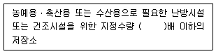
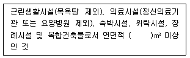
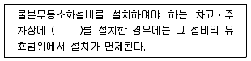
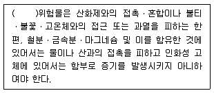

# 소방설비기사(전기분야)20210515(교사용) - 소방관계법규

> 원본: `소방설비기사(전기분야)20210515(교사용).pdf`
> 개인학습용 변환본.

## 41. 문제

41. 소방기본법령상 저수조의 설치기준으로 틀린 것은?
    ① 지면으로부터의 낙차가 4.5m 이상일 것
    ② 흡수부분의 수심이 0.5m 이상일 것
    ③ 흡수에 지장이 없도록 토사 및 쓰레기 등을 제거할 수 
있는 설비를 갖출 것
    ④ 흡수관의 투입구가 사각형의 경우에는 한변의 길이가 
60cm 이상, 원형의 경우에는 지름이 60cm 이상일 것
<문제 해설>
지면으로부터 낙차가 4.5m 이하일 것
[해설작성자 : 미스터차차]
"지면으로부터의 낙차가 4.5m 이상일 것" → 이건 옛날 기준
현재는 "소방펌프차의 흡수에 지장이 없도록 설치할 것"이 핵심
이고, 낙차 4.5m 이상은 삭제됐습니다.
[해설작성자 : cbt 이용자]

### 정답

1번

### 해설

정답은 1번입니다. 선택지의 핵심개념 을 확인하세요.

### 그림

## 42. 문제

42. 소방시설공사업법령상 소방시설업 등록을 하지 아니하고 영
업을 한 자에 대한 벌칙은?
    ① 500만원 이하의 벌금
    ② 1년 이하의 징역 또는 1000만원 이하의 벌금
    ③ 3년 이하의 징역 또는 3000만원 이하의 벌금
    ④ 5년 이하의 징역
<문제 해설>
[소]방시설업 [등]록을 하지 아니하고 영업을 한 자에 대한 벌
칙 : [3년 이하]의 징역 또는 [3000만원] 이하의 벌금
소.등.3.3000
[해설작성자 : 관동폭주연합]

### 정답

1번

### 해설

정답은 1번입니다. 선택지의 핵심개념 을 확인하세요.

### 그림

## 43. 문제

43. 화재예방, 소방시설 설치/유지 및 안전관리에 관한 법령상 
대통령령 또는 화재안전기준이 변경되어 그 기준이 강화되
는 경우 기존 특정소방대상물의 소방시설 중 강화된 기준을 
적용하여야 하는 소방시설은?
    ① 비상경보설비
    ② 비상방송설비
    ③ 비상콘센트설비
    ④ 옥내소화전설비
<문제 해설>
1.소화기구
2.비상경보설비
3.자동화재속보설비
4.피난구조기구
5.노유자시설에 설치되는 간이스프링클러설비, 자동화재탐지설
비, 단독경보형감지기
6.의료시설에 설치되는 간이스프링클러설비, 스프링클러설비, 자
동화재탐지설비, 자동화재속보설비
3과목 : 소방관계법규

본 해설집은 최강 자격증 기출문제 전자문제집 CBT 해설달기 프로젝트에 의해서 만들어진 자료입니다. 해설을 제공해 주신 모든 분들께 감사 드립니다.
소방설비기사(전기분야)
◐2021년 03월 07일 필기 기출문제 및 해설집◑
전자문제집 CBT : www.comcbt.com
기출문제 해설은 최강 자격증 기출문제 전자문제집 CBT : www.comcbt.com 통해서 실시간으로 변경됩니다.
[해설작성자 : HANHAE]
강비경 자속피노
강화기준 적용
비상경보설비
자동화재속보설비
피난구조설비
노유자시설
[해설작성자 : 김반장]

### 정답

1번

### 해설

정답은 1번입니다. 선택지의 핵심개념 을 확인하세요.

### 그림

## 44. 문제

44. 소방기본법령상 화재조사의 종류 중 화재원인조사에 해당하
지 않는 것은?
    ① 발화원인 조사
    ② 인명피해 조사
    ③ 연소상황 조사
    ④ 소방시설 등 조사
<문제 해설>
인명은 재산에 속하지 않으므로 인명피해는 x
[해설작성자 : 합격하고올께~ ]
화재원인조사: 발화원인조사, 발견•통보 및 소화상황조사, 연소
상황조사, 피난상황조사, 소방시설등 조사
화재피해조사: 인명피해조사, 재산피해조사
[해설작성자 : 미친사랑꾼 켄트리]

### 정답

1번

### 해설

정답은 1번입니다. 선택지의 핵심개념 을 확인하세요.

### 그림

## 45. 문제

45. 소방기본법령상 소방신호의 방법으로 틀린 것은?
    ① 타종에 의한 훈련신호는 연 3타 반복
    ② 싸이렌에 의한 발화신호는 5초 간격을 두고, 10초씩 3회
    ③ 타종에 의한 해제신호는 상당한 간격을 두고 1타씩 반복
    ④ 싸이렌에 의한 경계신호는 5초 간격을 두고, 30초씩 3회
<문제 해설>
발화신호 : 난타
[해설작성자 : 미스터차차]
타종에 의한 발화신호가 난타
싸이렌에 의한 발화신호는 5초 간격을 두고 5초씩 3회
[해설작성자 : HANHAE]
소방기본법 시행규칙(시행 2021. 7. 13.)
별표4 소방신호의 방법
- 경계신호 타종: 1타와 연2타를 반복 / 싸이렌: 5초 간격을 두
고 30초씩 3회
- 발화신호 타종: 난타 / 싸리엔: 5초 간격을 두고 5초씩 3회
- 해제신호 타종: 상당한 간격을 두고 1타씩 반복 / 싸이렌 1분
간 1회
- 훈련신호 타종: 연3타 반복 / 싸이엔: 10초 간격을 두고 1분
씩 3회
[해설작성자 : 꿈돌이소금빵]

### 정답

1번

### 해설

정답은 1번입니다. 선택지의 핵심개념 을 확인하세요.

### 그림

## 46. 문제

46. 화재예방, 소방시설 설치/유지 및 안전관리에 관한 법령상 
특정소방대상물의 관계인이 수행하여야 하는 소방안전관리 
업무가 아닌 것은?
    ① 소방훈련의 지도/감독
    ② 화기(火氣) 취급의 감독
    ③ 피난시설, 방화구획 및 방화시설의 유지/관리
    ④ 소방시설이나 그 밖의 소방 관련시설의 유지/관리
<문제 해설>
관계인만 하는것
1.피난시설 방화구획 및 방화시설 유지 관리
2.화기취급의 감독
3.소방시설이나 그밖의 소방관련시설의 유지관리
4.그밖에 소방안전관리에 필요한 업무
[해설작성자 : roahchinese]

### 정답

1번

### 해설

정답은 1번입니다. 선택지의 핵심개념 을 확인하세요.

### 그림

## 47. 문제

47. 소방기본법에서 정의하는 소방대의 조직구성원이 아닌 것
은?
    ① 의무소방원
② 소방공무원
    ③ 의용소방대원
④ 공항소방대원
<문제 해설>
소방대의 구성 : 소방[공]무원, 의[무]소방원, 의[용]소방대원
공.무.용
[해설작성자 : 관동폭주연합]

### 정답

1번

### 해설

정답은 1번입니다. 선택지의 핵심개념 을 확인하세요.

### 그림

## 48. 문제

48. 위험물안전관리법령상 인화성액체위험물(이황화탄소를 제외)
의 옥외탱크저장소의 탱크주위에 설치하여야 하는 방유제의 
기준 중 틀린 것은?
    ① 방유제의 용량은 방유제안에 설치된 탱크가 하나인 때에
는 그 탱크 용량의 110% 이상으로 할 것
    ② 방유제의 용량은 방유제안에 설치된 탱크가 2기 이상인 
때에는 그 탱크중 용량이 최대인 것의 용량의 110% 이
상으로 할 것
    ③ 방유제는 높이 1m 이상 2m 이하, 두께0.2m 이상, 지하
매설 깊이 0.5m 이상으로 할것
    ④ 방유제내의 면적은 80000m2 이하로 할 것
<문제 해설>
방유제 설치기준
높이: 0.5m ~ 3m 이하, 두께: 0.2m 이상, 깊이 : 1m 이상, 면
적: 80000m2 이하,
용량: 탱크 1기-용량의 110% 이상     , 탱크 2기 - 최대의 
110% 이상 - 인화성액체(이황화탄소 제외)
[해설작성자 : comcbt.com 이용자]

### 정답

1번

### 해설

정답은 1번입니다. 선택지의 핵심개념 을 확인하세요.

### 그림

## 49. 문제

49. 위험물안전관리법상 시ㆍ도지사의 허가를 받지 아니하고 당
해 제조소등을 설치 할 수 있는 기준 중 다음 ( )안에 알맞
은 것은?
    
    ① 20
② 30
    ③ 40
④ 50
<문제 해설>
위험물안전관리법 ( 약칭: 위험물관리법 )
제6조(위험물시설의 설치 및 변경 등)

본 해설집은 최강 자격증 기출문제 전자문제집 CBT 해설달기 프로젝트에 의해서 만들어진 자료입니다. 해설을 제공해 주신 모든 분들께 감사 드립니다.
소방설비기사(전기분야)
◐2021년 03월 07일 필기 기출문제 및 해설집◑
전자문제집 CBT : www.comcbt.com
기출문제 해설은 최강 자격증 기출문제 전자문제집 CBT : www.comcbt.com 통해서 실시간으로 변경됩니다.
③ 제1항 및 제2항의 규정에 불구하고 다음 각 호의 어느 하나
에 해당하는 제조소등의 경우에는 허가를 받지 아니하고 당해 
제조소등을 설치하거나 그 위치ㆍ구조 또는 설비를 변경할 수 
있으며, 신고를 하지 아니하고 위험물의 품명ㆍ수량 또는 지정
수량의 배수를 변경할 수 있다.    <개정 2016. 1. 27.>

### 정답

1번

### 해설

정답은 1번입니다. 선택지의 핵심개념 을 확인하세요.

### 그림

## 50. 문제

50. 화재예방, 소방시설 설치ㆍ유지 및 안전관리에 관한 법령상 
건축허가등의 동의대상물의 범위기준 중 틀린 것은?
    ① 건축등을 하려는 학교시설 : 연면적 200m2이상
    ② 노유자시설 : 연면적 200m2이상
    ③ 정신의료기관(입원실이 없는 정신건강의학과 의원은 제
외) : 연면적 300m2이상
    ④ 장애인 의료재활시설 : 연면적 300m2이상
<문제 해설>
학교시설 100
[해설작성자 : comcbt.com 이용자]

### 정답

1번

### 해설

정답은 1번입니다. 선택지의 핵심개념 을 확인하세요.

## 51. 문제

51. 화재예방, 소방시설 설치/유지 및 안전관리에 관한 법령상 
지하가는 연면적이 최소 몇m2이상이어야 스프링클러설비를 
설치하여야 하는 특정소방대상물에 해당하는가? (단, 터널은 
제외한다.)
    ① 100
② 200
    ③ 1000
④ 2000
<문제 해설>
소방법시행령
제28조(소화설비)
③ 스프링클러설비를 설치하여야 할 소방대상물은 다음과 같다..
다만, 가스시설 또는지하구의 경우에는 그러하지 아니하다.

### 정답

1번

### 해설

정답은 1번입니다. 선택지의 핵심개념 을 확인하세요.

## 52. 문제

52. 화재예방, 소방시설 설치ㆍ유지 및 안전관리에 관한 법령상 
소방안전관리대상물의 소방계획서에 포함되어야 하는 사항
이 아닌 것은?
    ① 소방시설ㆍ피난시설 및 방화시설의 점검ㆍ정비계획
    ② 위험물안전관리법에 따라 예방규정을 정하는 제조소등의 
위험물 저장ㆍ취급에 관한사항
    ③ 특정소방대상물의 근무자 및 거주자의 자위소방대 조직
과 대원의 임무에 관한 사항
    ④ 방화구획, 제연구획, 건축물의 내부마감재료(불연재료ㆍ
준불연재료 또는 난연재료로 사용된 것) 및 방염물품의 
사용현황과 그밖의 방화구조 및 설비의 유지ㆍ관리계획
<문제 해설>
정말 어렵게 나온 문제입니다.
2번의 예방규정을 정하는이 틀렸습니다..(예방규정 정하는 제조
소등은 제외입니다.)
[해설작성자 : comcbt.com 이용자]
시행령 제24조(소방안전관리대상물의 소방계획서 작성 등)
① 법 제20조제6항제1호에 따른 소방계획서에는 다음 각 호의 
사항이 포함되어야 한다.    <개정 2017. 1. 26., 2018. 6. 
26.>

### 정답

1번

### 해설

정답은 1번입니다. 선택지의 핵심개념 을 확인하세요.

## 53. 문제

53. 위험물안전관리법상 업무상 과실로 제조소등에서 위험물을 
유출ㆍ방출 또는 확산시켜 사람의 생명ㆍ신체 또는 재산에 
대하여 위험을 발생시킨 자에 대한 벌칙기준은?
    ① 5년 이하의 금고 또는 2000만원 이하의 벌금
    ② 5년 이하의 금고 또는 7000만원 이하의 벌금
    ③ 7년 이하의 금고 또는 2000만원 이하의 벌금
    ④ 7년 이하의 금고 또는 7000만원 이하의 벌금
<문제 해설>
위험물안전관리법 ( 약칭: 위험물관리법 )
제34조(벌칙) ① 업무상 과실로 제조소등에서 위험물을 유출ㆍ
방출 또는 확산시켜 사람의 생명ㆍ신체 또는 재산에 대하여 위
험을 발생시킨 자는 7년 이하의 금고 또는 7천만원 이하의 벌금
에 처한다..
[해설작성자 : 대천사.루시퍼]

### 정답

1번

### 해설

정답은 1번입니다. 선택지의 핵심개념 을 확인하세요.

## 54. 문제

54. 소방기본법령상 소방용수시설의 설치기준 중 급수탑의 급수
배관의 구경은 최소 몇mm 이상이어야 하는가?
    ① 100
② 150
    ③ 200
④ 250
<문제 해설>
최소100, 최대150

본 해설집은 최강 자격증 기출문제 전자문제집 CBT 해설달기 프로젝트에 의해서 만들어진 자료입니다. 해설을 제공해 주신 모든 분들께 감사 드립니다.
소방설비기사(전기분야)
◐2021년 03월 07일 필기 기출문제 및 해설집◑
전자문제집 CBT : www.comcbt.com
기출문제 해설은 최강 자격증 기출문제 전자문제집 CBT : www.comcbt.com 통해서 실시간으로 변경됩니다.
[해설작성자 : comcbt.com 이용자]

### 정답

1번

### 해설

정답은 1번입니다. 선택지의 핵심개념 을 확인하세요.

### 그림

## 55. 문제

55. 소방시설공사업법령상 공사감리자 지정대상 특정소방대상물
의 범위가 아닌 것은?
    ① 물분무등소화설비(호스릴 방식의 소화설비는 제외)를 신
설ㆍ개설하거나 방호ㆍ방수 구역을 증설할 때
    ② 제연설비를 신설ㆍ개설하거나 제연구역을 증설할 때
    ③ 연소방지설비를 신설ㆍ개설하거나 살수구역을 증설할 때
    ④ 캐비닛형 간이스프링클러설비를 신설ㆍ개설하거나 방호
ㆍ방수구역을 증설할 때
<문제 해설>
공사감리자 지정대상 특정소방대상물중 신설 개설만 있는것
자동화재탐지
비상방송
통합감시
비상조명등
소화용수설비
무선통신보조설비
연결송수관
[해설작성자 : comcbt.com 이용자]

### 정답

1번

### 해설

정답은 1번입니다. 선택지의 핵심개념 을 확인하세요.

### 그림

## 56. 문제

56. 화재예방, 소방시설 설치ㆍ유지 및 안전관리에 관한 법령상 
자동화재탐지설비를 설치하여야 하는 특정소방대상물에 대
한 기준 중 ( )에 알맞은 것은?
    
    ① 400
② 600
    ③ 1000
④ 3500
<문제 해설>
화재예방, 소방시설 설치ㆍ유지 및 안전관리에 관한 법률 시행
령 ( 약칭: 소방시설법 시행령 )
[별표 5] 특정소방대상물의 관계인이 특정소방대상물의 규모·용
도 및 수용인원 등을 고려하여 갖추어야 하는 소방시설의 종류
(제15조 관련)

### 정답

1번

### 해설

정답은 1번입니다. 선택지의 핵심개념 을 확인하세요.

### 그림

## 57. 문제

57. 화재예방, 소방시설 설치/유지 및 안전관리에 관한 법령상 
형식승인을 받지 아니한 방용품을 판매하거나 판매목적으로 
진열하거나 소방시설공사에 사용한 자에 대한 벌칙 기준은?
    ① 3년 이하의 징역 또는 3000만원 이하의 벌금
    ② 2년 이하의 징역 또는 1500만원 이하의 벌금
    ③ 1년 이하의 징역 또는 1000만원 이하의 벌금
    ④ 1년 이하의 징역 또는 500만원 이하의 벌금
<문제 해설>
제,형,부,피,소 : 3년이하, 3천만원이하
제품승인x, 형식승인x,부정한 방법, 피난조치위반, 소방시설업 
미등록 제형부피소로 외우세요~!!
[해설작성자 : 정메깜]

### 정답

1번

### 해설

정답은 1번입니다. 선택지의 핵심개념 을 확인하세요.

### 그림

## 58. 문제

58. 소방기본법에서 정의하는 소방대상물에 해당하지 않는 것
은?
    ① 산림
② 차량
    ③ 건축물
④ 항해 중인 선박
<문제 해설>
"항구에 정박"해 있는 선박일 경우, 소방대상물에 해당함
[해설작성자 : 대천사.루시퍼]

### 정답

1번

### 해설

정답은 1번입니다. 선택지의 핵심개념 을 확인하세요.

### 그림

## 59. 문제

59. 화재예방, 소방시설 설치/유지 및 안전관리에 관한 법령상 
특정소방대상물의 소방시설 설치의 면제기준 중 다음 ( )안
에 알맞은 것은?
    
    ① 옥내소화전설비
    ② 스프링클러설비
    ③ 간이스프링클러설비
    ④ 청정소화약제소화설비
<문제 해설>
화재예방, 소방시설 설치ㆍ유지 및 안전관리에 관한 법률 시행
령 ( 약칭: 소방시설법 시행령 )
[별표 6] <개정 2021. 8. 24.>
특정소방대상물의 소방시설 설치의 면제기준(제16조 관련)

### 정답

1번

### 해설

정답은 1번입니다. 선택지의 핵심개념 을 확인하세요.

### 그림

## 60. 문제

60. 위험물안전관리법령상 위험물의 유별 저장/취급의 공통기준 
중 다음 ( )안에 알맞은 것은?
    
    ① 제1류
② 제2류
    ③ 제3류
④ 제4류
<문제 해설>
위험물안전관리법 시행규칙
[별표 18] 제조소등에서의 위험물의 저장 및 취급에 관한 기준
Ⅱ 위험물의 유별 저장 • 취급의 공통기준(중요기준)

### 정답

1번

### 해설

정답은 1번입니다. 선택지의 핵심개념 을 확인하세요.

### 그림

