# 소방설비기사(전기분야)20210912(해설집) - 소방관계법규

> 원본: `소방설비기사(전기분야)20210912(해설집).pdf`
> 개인학습용 변환본.

## 41. 문제

41. 다음 위험물안전관리법령의 자체소방대 기준에 대한 설명으
로 틀린 것은?
    
    ① “대통령령이 정하는 제조소등”은 제4류 위험물을 취급하
는 제조소를 포함한다.
    ② “대통령령이 정하는 제조소등”은 제4류 위험물을 취급하
는 일반취급소를 포함한다.
3과목 : 소방관계법규

본 해설집은 최강 자격증 기출문제 전자문제집 CBT 해설달기 프로젝트에 의해서 만들어진 자료입니다. 해설을 제공해 주신 모든 분들께 감사 드립니다.
소방설비기사(전기분야)
◐2021년 09월 12일 필기 기출문제 및 해설집◑
전자문제집 CBT : www.comcbt.com
기출문제 해설은 최강 자격증 기출문제 전자문제집 CBT : www.comcbt.com 통해서 실시간으로 변경됩니다.
    ③ “대통령령이 정하는 수량 이상의 위험물”은 제4류 위험
물의 최대수량의 합이 지정수량의 3천배 이상인 것을 포
함한다.
    ④ “대통령령이 정하는 제조소등”은 보일러로 위험물을 소
비하는 일반취급소를 포함한다.
<문제 해설>
위험물안전관리법 시행령 :
제18조(자체소방대를 설치하여야 하는 사업소) ① 법 제19조에
서 “대통령령이 정하는 제조소등”이란 다음 각 호의 어느 하나
에 해당하는 제조소등을 말한다.  <개정 2020. 7. 14.>

### 정답

1번

### 해설

정답은 1번입니다. 선택지의 핵심개념 을 확인하세요.

### 그림

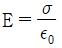
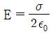
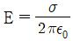
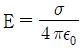
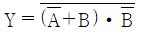
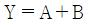
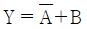
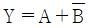
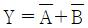
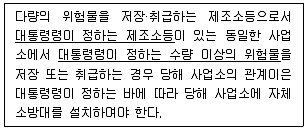
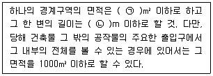
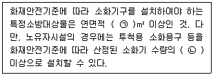

## 42. 문제

42. 위험물안전관리법령상 제조소등에 설치하여야 할 자동화재
탐지설비의 설치기준 중 ( ) 안에 알맞은 내용은? (단, 광전
식분리형 감지기 설치는 제외한다.)
    
    ① ㉠ 300, ㉡ 20
② ㉠ 400, ㉡ 30
    ③ ㉠ 500, ㉡ 40
④ ㉠ 600, ㉡ 50
<문제 해설>
자동화재탐지설비 및 시각경보장치의 화재안전기준(NFSC 203)
제4조(경계구역)  
① 자동화재탐지설비의 경계구역은 다음 각호의 기준에 따라 설
정하여야 한다..다만, 감지기의 형식승인 시 감지거리, 감지면적 
등에 대한 성능을 별도로 인정받은 경우에는 그 성능인정범위를 
경계구역으로 할 수 있다.

### 정답

1번

### 해설

정답은 1번입니다. 선택지의 핵심개념 을 확인하세요.

### 그림

## 43. 문제

43. 소방시설공사업법령상 전문 소방시설공사업의 등록기준 및 
영업범위의 기준에 대한 설명으로 틀린 것은?
    ① 법인인 경우 자본금은 최소 1억원 이상이다.
    ② 개인인 경우 자산평가액은 최소 1억원 이상이다.
    ③ 주된 기술인력 최소 1명 이상, 보조기술인력 최소 3명 
이상을 둔다.
    ④ 영업범위는 특정소방대상물에 설치되는 기계분야 및 전
기분야 소방시설의 공사·개설·이전 및 정비이다.
<문제 해설>

### 정답

1번

### 해설

정답은 1번입니다. 선택지의 핵심개념 을 확인하세요.

### 그림

## 44. 문제

44. 화재예방, 소방시설 설치·유지 및 안전관리에 관한 법령상 
특정소방대상물의 관계인이 특정소방대상물의 규모·용도 및 
수용인원 등을 고려하여 갖추어야 하는 소방시설의 종류에 
대한 기준 중 다음 ( ) 안에 알맞은 것은?
    
    ① ㉠ 33, ㉡ 1/2
② ㉠ 33, ㉡ 1/5
    ③ ㉠ 50, ㉡ 1/2
④ ㉠ 50, ㉡ 1/5
<문제 해설>
화재예방, 소방시설 설치ㆍ유지 및 안전관리에 관한 법률 시행
령 ( 약칭: 소방시설법 시행령 )
[별표 5] 특정소방대상물의 관계인이 특정소방대상물의 규모·용
도 및 수용인원 등을 고려하여 갖추어야 하는 소방시설의 종류
(제15조 관련)

### 정답

1번

### 해설

정답은 1번입니다. 선택지의 핵심개념 을 확인하세요.

### 그림

## 45. 문제

45. 화재예방, 소방시설 설치·유지 및 안전관리에 관한 법령상 
천재지변 및 그 밖에 대통령령으로 정하는 사유로 소방특별
조사를 받기 곤란하여 소방특별조사의 연기를 신청하려는 
자는 소방특별조사 시작 최대 며칠 전까지 연기신청서 및 
증명서류를 제출해야 하는가?
    ① 3
② 5
    ③ 7
④ 10
<문제 해설>
[소방특별조사]
실시권자 : 본부장.서장
횟수 : 연1회이상
통보 : 7일전
연기신청 : 3일전
[해설작성자 : 자격증따고싶다]

### 정답

1번

### 해설

정답은 1번입니다. 선택지의 핵심개념 을 확인하세요.

### 그림

## 46. 문제

46. 위험물안전관리법령상 정기점검의 대상인 제조소등의 기준
으로 틀린 것은?
    ① 지하탱크저장소
    ② 이동탱크저장소
    ③ 지정수량의 10배 이상의 위험물을 취급하는 제조소
    ④ 지정수량의 20배 이상의 위험물을 저장하는 옥외탱크저
장소
<문제 해설>
정기점검 대상 제조소

본 해설집은 최강 자격증 기출문제 전자문제집 CBT 해설달기 프로젝트에 의해서 만들어진 자료입니다. 해설을 제공해 주신 모든 분들께 감사 드립니다.
소방설비기사(전기분야)
◐2021년 09월 12일 필기 기출문제 및 해설집◑
전자문제집 CBT : www.comcbt.com
기출문제 해설은 최강 자격증 기출문제 전자문제집 CBT : www.comcbt.com 통해서 실시간으로 변경됩니다.
- 지정수량 10배 이상의 제조소, 일반취급소
- 지정수량 100배 이상의 옥외저장소
- 지정수량 150배 이상의 옥내저장소
- 지정수량 200배 이상의 옥외탱크저장소
- 암반탱크저장소
- 이송취급소
- 이동탱크저장소
- 지하탱크저장소
- 지하에 매설된 탱크가 있는 제조소, 주유취급소, 일반취급소
[해설작성자 : 대천사.루시퍼]

### 정답

1번

### 해설

정답은 1번입니다. 선택지의 핵심개념 을 확인하세요.

### 그림

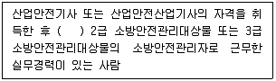
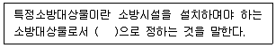

## 47. 문제

47. 위험물안전관리법령상 제4류 위험물 중 경유의 지정수량은 
몇 리터인가?
    ① 500
② 1000
    ③ 1500
④ 2000
<문제 해설>
제4류 위험물 중 경유 : 제2석유류(등유, 경유, 1기압에서 인화
점이 섭씨 21도 이상 70도 미만. 다만, 도료류 그 밖의 물품 중 
일부 제외)
제2석유류 중 비수용성 액체 : 1,000L
제2석유류 중 수용석 액체 : 2,000L
[해설작성자 : 대천사.루시퍼]

### 정답

1번

### 해설

정답은 1번입니다. 선택지의 핵심개념 을 확인하세요.

### 그림

## 48. 문제

48. 화재예방, 소방시설 설치·유지 및 안전관리에 관한 법령상 1
급 소방안전관리대상물의 소방안전관리자 선임대상 기준 중 
( ) 안에 알맞은 내용은?(관련 규정 개정전 문제로 여기서는 
기존 정답인 2번을 누르면 정답 처리됩니다. 자세한 내용은 
해설을 참고하세요.)
    
    ① 1년 이상
② 2년 이상
    ③ 3년 이상
④ 5년 이상
<문제 해설>
화재예방, 소방시설 설치ㆍ유지 및 안전관리에 관한 법률 시행
령 ( 약칭: 소방시설법 시행령 )
제23조(소방안전관리자 및 소방안전관리보조자의 선임대상자)
② 1급 소방안전관리대상물의 관계인은 다음 각 호의 어느 하나
에 해당하는 사람 중에서 소방안전관리자를 선임하여야 한다.

### 정답

1번

### 해설

정답은 1번입니다. 선택지의 핵심개념 을 확인하세요.

### 그림

## 49. 문제

49. 화재예방, 소방시설 설치·유지 및 안전관리에 관한 법령상 
용어의 정의 중 ( ) 안에 알맞은 것은?
    
    ① 대통령령
② 국토교통부령
    ③ 행정안전부령
④ 고용노동부령
<문제 해설>
화재예방, 소방시설 설치ㆍ유지 및 안전관리에 관한 법률
제2조(정의) ① 이 법에서 사용하는 용어의 뜻은 다음과 같다..

### 정답

1번

### 해설

정답은 1번입니다. 선택지의 핵심개념 을 확인하세요.

### 그림

## 50. 문제

50. 소방기본법 제1장 총칙에서 정하는 목적의 내용으로 거리가 
먼 것은?
    ① 구조, 구급 활동 등을 통하여 공공의 안녕 및 질서 유지
    ② 풍수해의 예방, 경계, 진압에 관한 계획, 예산 지원 활동
    ③ 구조, 구급 활동 등을 통하여 국민의 생명, 신체, 재산 
보호

본 해설집은 최강 자격증 기출문제 전자문제집 CBT 해설달기 프로젝트에 의해서 만들어진 자료입니다. 해설을 제공해 주신 모든 분들께 감사 드립니다.
소방설비기사(전기분야)
◐2021년 09월 12일 필기 기출문제 및 해설집◑
전자문제집 CBT : www.comcbt.com
기출문제 해설은 최강 자격증 기출문제 전자문제집 CBT : www.comcbt.com 통해서 실시간으로 변경됩니다.
    ④ 화재, 재난, 재해 그 밖의 위급한 상황에서의 구조, 구급 
활동
<문제 해설>

### 정답

1번

### 해설

정답은 1번입니다. 선택지의 핵심개념 을 확인하세요.

### 그림

## 51. 문제

51. 소방기본법령상 소방본부 종합상황실의 실장이 서면·팩스 
또는 컴퓨터통신 등으로 소방청 종합상황실에 보고하여야 
하는 화재의 기준이 아닌 것은?
    ① 이재민이 100인 이상 발생한 화재
    ② 재산피해액이 50억원 이상 발생한 화재
    ③ 사망자가 3인 이상 발생하거나 사상자가 5인 이상 발생
한 화재
    ④ 층수가 5층 이상이거나 병상이 30개 이상인 종합병원에
서 발생한 화재
<문제 해설>
가. 사망자가 5인 이상 발생하거나 사상자가 10인 이상 발생한 
화재
나. 이재민이 100인 이상 발생한 화재
다..재산피해액이 50억원 이상 발생한 화재
라. 관공서ㆍ학교ㆍ정부미도정공장ㆍ문화재ㆍ지하철 또는 지하
구의 화재
마. 관광호텔, 층수(「건축법 시행령」 제119조제1항제9호의 규
정에 의하여 산정한 층수를 말한다..이하 이 목에서 같다)가 11
층 이상인 건축물, 지하상가, 시장, 백화점, 「위험물안전관리
법」 제2조제2항의 규정에 의한 지정수량의 3천배 이상의 위험
물의 제조소ㆍ저장소ㆍ취급소, 층수가 5층 이상이거나 객실이 
30실 이상인 숙박시설, 층수가 5층 이상이거나 병상이 30개 이
상인 종합병원ㆍ정신병원ㆍ한방병원ㆍ요양소, 연면적 1만5천제
곱미터 이상인 공장 또는 「화재의 예방 및 안전관리에 관한 법
률」 제18조제1항 각 목에 따른 화재경계지구에서 발생한 화재
바. 철도차량, 항구에 매어둔 총 톤수가 1천톤 이상인 선박, 항
공기, 발전소 또는 변전소에서 발생한 화재
사. 가스 및 화약류의 폭발에 의한 화재
아. 「다중이용업소의 안전관리에 관한 특별법」 제2조에 따른 
다중이용업소의 화재

### 정답

1번

### 해설

정답은 1번입니다. 선택지의 핵심개념 을 확인하세요.

## 52. 문제

52. 화재예방, 소방시설 설치·유지 및 안전관리에 관한 법령상 
관리업자가 소방시설등의 점검을 마친 후 점검기록표에 기
록하고 이를 해당 특정소방대상물에 부착하여야 하나 이를 
위반하고 점검기록표를 거짓으로 작성하거나 해당 특정소방
대상물에 부착하지 아니하였을 경우 벌칙 기준은?
    ① 100만원 이하의 과태료
    ② 200만원 이하의 과태료
    ③ 300만원 이하의 과태료
    ④ 500만원 이하의 과태료
<문제 해설>
소방시설 설치 및 관리에 관한 법률 ( 약칭: 소방시설법 )
[시행 2022. 12. 1.] [법률 제18661호, 2021. 12. 28., 타법개
정]
제61조(과태료) ① 다음 각 호의 어느 하나에 해당하는 자에게
는 300만원 이하의 과태료를 부과한다.

### 정답

1번

### 해설

정답은 1번입니다. 선택지의 핵심개념 을 확인하세요.

## 53. 문제

53. 화재예방, 소방시설 설치·유지 및 안전관리에 관한 법령상 
분말형태의 소화약제를 사용하는 소화기의 내용연수로 옳은 
것은? (단, 소방용품의 성능을 확인받아 그 사용기한을 연장
하는 경우는 제외한다.)
    ① 3년
② 5년
    ③ 7년
④ 10년
<문제 해설>
소방시설 설치 및 관리에 관한 법률 ( 약칭: 소방시설법 )
[시행 2023. 7. 4.] [법률 제19160호, 2023. 1. 3., 일부개정]
제17조(소방용품의 내용연수 등) ① 특정소방대상물의 관계인은 
내용연수가 경과한 소방용품을 교체하여야 한다..이 경우 내용연
수를 설정하여야 하는 소방용품의 종류 및 그 내용연수 연한에 
필요한 사항은 대통령령으로 정한다.
② 제1항에도 불구하고 행정안전부령으로 정하는 절차 및 방법 
등에 따라 소방용품의 성능을 확인받은 경우에는 그 사용기한을 

본 해설집은 최강 자격증 기출문제 전자문제집 CBT 해설달기 프로젝트에 의해서 만들어진 자료입니다. 해설을 제공해 주신 모든 분들께 감사 드립니다.
소방설비기사(전기분야)
◐2021년 09월 12일 필기 기출문제 및 해설집◑
전자문제집 CBT : www.comcbt.com
기출문제 해설은 최강 자격증 기출문제 전자문제집 CBT : www.comcbt.com 통해서 실시간으로 변경됩니다.
연장할 수 있다.
소방시설 설치 및 관리에 관한 법률 시행령 ( 약칭: 소방시설법 
시행령 )
[시행 2023. 3. 7.] [대통령령 제33321호, 2023. 3. 7., 타법개
정]
제19조(내용연수 설정대상 소방용품) ① 법 제17조제1항 후단에 
따라 내용연수를 설정해야 하는 소방용품은 분말형태의 소화약
제를 사용하는 소화기로 한다.
② 제1항에 따른 소방용품의 내용연수는 10년으로 한다.
[해설작성자 : 동과대 13 자동차]

### 정답

1번

### 해설

정답은 1번입니다. 선택지의 핵심개념 을 확인하세요.

## 54. 문제

54. 소방시설공사업법령상 소방시설공사업자가 소속 소방기술자
를 소방시설공사 현장에 배치하지 않았을 경우의 과태료 기
준은?
    ① 100만원 이하
② 200만원 이하
    ③ 300만원 이하
④ 400만원 이하
<문제 해설>
제40조(과태료)
① 다음 각 호의 어느 하나에 해당하는 자에게는 200만원 이하
의 과태료를 부과한다..<개정 2011. 8. 4., 2014. 12. 30., 
2015. 7. 20., 2016. 1. 27., 2018. 2. 9., 2020. 6. 9., 2021.

### 정답

1번

### 해설

정답은 1번입니다. 선택지의 핵심개념 을 확인하세요.

## 55. 문제

55. 소방기본법령상 위험물 또는 물건의 보관기간은 소방본부 
또는 소방서의 게시판에 공고하는 기간의 종료일 다음 날부
터 며칠로 하는가?
    ① 3
② 4
    ③ 5
④ 7
<문제 해설>
소방기본법 시행령
제3조 (위험물 또는 물건의 보관기간 및 보관기간 경과후 처리 
등)
① 법 제12조제5항의 규정에 의한 위험물 또는 물건의 보관기간
은 법 제12조제4항의 규정에 의하여 소방본부 또는 소방서의 게
시판에 공고하는 기간의 종료일 다음 날부터 7일로 한다.
[해설작성자 : 관동폭주연합]

### 정답

1번

### 해설

정답은 1번입니다. 선택지의 핵심개념 을 확인하세요.

## 56. 문제

56. 소방기본법령상 소방활동장비와 설비의 구입 및 설치 시 국
조보조의 대상이 아닌 것은?
    ① 소방자동차
    ② 사무용 집기
    ③ 소방헬리콥터 및 소방정
    ④ 소방전용통신설비 및 전산설비
<문제 해설>
제2조(국고보조 대상사업의 범위와 기준보조율) ① 법 제9조제2
항에 따른 국고보조 대상사업의 범위는 다음 각 호와 같다..<개
정 2005. 10. 20., 2011. 11. 30., 2016. 10. 25.>

### 정답

1번

### 해설

정답은 1번입니다. 선택지의 핵심개념 을 확인하세요.

## 57. 문제

57. 화재예방, 소방시설 설치·유지 및 안전관리에 관한 법령상 
특정소방대상물의 관계인은 소방안전관리자를 기준일로부터 
30일 이내에 선임하여야 한다. 다음 중 기준일로 틀린 것
은?
    ① 소방안전관리자를 해임한 경우 : 소방안전관리자를 해임
한 날
    ② 특정소방대상물을 양수하여 관계인의 권리를 취득한 경
우 : 해당 권리를 취득한 날
    ③ 신축으로 해당 특정소방대상물의 소방안전관리자를 신규
로 선임하여야 하는 경우 : 해당 특정소방대상물의 완공
일
    ④ 증축으로 인하여 특정소방대상물이 소방안전관리대상물
로 된 경우 : 증축공사의 개시일
<문제 해설>

### 정답

1번

### 해설

정답은 1번입니다. 선택지의 핵심개념 을 확인하세요.

## 58. 문제

58. 위험물안전관리법령상 위험물을 취급함에 있어서 정전기가 
발생할 우려가 있는 설비에 설치할 수 있는 정전기 제거설
비 방법이 아닌 것은?
    ① 접지에 의한 방법
    ② 공기를 이온화하는 방법
    ③ 자동적으로 압력의 상승을 정지시키는 방법
    ④ 공기 중의 상대습도를 70% 이상으로 하는 방법
<문제 해설>
위험물안전관리법 시행규칙
[별표 4] 제조소의 위치·구조 및 설비의 기준(제28조관련)
Ⅷ. 기타설비

### 정답

1번

### 해설

정답은 1번입니다. 선택지의 핵심개념 을 확인하세요.

## 59. 문제

59. 소방기본법령상 특수가연물의 수량 기준으로 옳은 것은?
    ① 면화류 : 200kg 이상
    ② 가연성고체류 : 500kg 이상
    ③ 나무껍질 및 대팻밥 : 300kg 이상
    ④ 넝마 및 종이부스러기 : 400kg 이상
<문제 해설>
화재의 예방 및 안전관리에 관한 법률 시행령
[시행 2023. 1. 3.][대통령령 제33199호, 2023. 1. 3., 일부개
정]
제19조(화재의 확대가 빠른 특수가연물) ① 법 제17조제5항에서 
“고무류ㆍ플라스틱류ㆍ석탄 및 목탄 등 대통령령으로 정하는 특
수가연물(特殊可燃物)”이란 별표 2에서 정하는 품명별 수량 이
상의 가연물을 말한다.
[별표 2]특수가연물(제19조제1항 관련)
품명 수량
면화류 200킬로그램 이상
나무껍질 및 대팻밥 400킬로그램 이상
넝마 및 종이부스러기 1,000킬로그램 이상
사류(絲類) 1,000킬로그램 이상
볏짚류 1,000킬로그램 이상
가연성 고체류 3,000킬로그램 이상
석탄ㆍ목탄류 10,000킬로그램 이상
가연성 액체류 2세제곱미터 이상
목재가공품 및 나무부스러기 10세제곱미터 이상
고무류ㆍ플라스틱류발포시킨 것 20세제곱미터 이상
그 밖의 것 3,000킬로그램 이상
[해설작성자 : 동과대 13 자동차]

### 정답

1번

### 해설

정답은 1번입니다. 선택지의 핵심개념 을 확인하세요.

## 60. 문제

60. 화재예방, 소방시설 설치·유지 및 안전관리에 관한 법령상 
소방청장, 소방본부장 또는 소방서장이 소방특별조사를 하
려면 관계인에게 조사대상, 조사기간 및 조사사유 등을 최
대 며칠 전에 서면으로 알려야 하는가? (단, 긴급하게 조사
할 필요가 있는 경우와 사전에 통지하면 조사목적을 달성할 
수 없다고 인정되는 경우는 제외한다.)
    ① 7
② 10
    ③ 12
④ 14
<문제 해설>
화재예방, 소방시설 설치ㆍ유지 및 안전관리에 관한 법률 ( 약
칭: 소방시설법 )
제4조의3(소방특별조사의 방법ㆍ절차 등) ① 소방청장, 소방본부
장 또는 소방서장은 소방특별조사를 하려면 [7일 전]에 관계인
에게 조사대상, 조사기간 및 조사사유 등을 서면으로 알려야 한
다..다만, 다음 각 호의 어느 하나에 해당하는 경우에는 그러하
지 아니하다..
[해설작성자 : 관동폭주연합]

### 정답

1번

### 해설

정답은 1번입니다. 선택지의 핵심개념 을 확인하세요.
