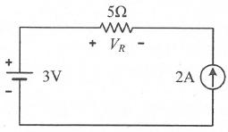
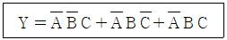
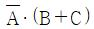
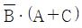
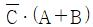
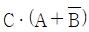
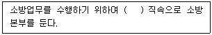
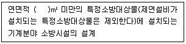
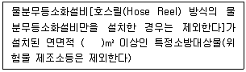
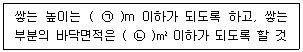

# 소방설비기사(전기분야)20220424(해설집) - 소방관계법규

> 원본: `소방설비기사(전기분야)20220424(해설집).pdf`
> 개인학습용 변환본.

## 41. 문제

41. 다음 중 소방기본법령에 따라 화재예방상 필요하다고 인정
되거나 화재위험경보시 발령하는 소방신호의 종류로 옳은 
것은?
    ① 경계신호
② 발화신호
    ③ 경보신호
④ 훈련신호
<문제 해설>
<소방신호의 종류>
경계신호:화재예방상 필요하다고 인정되거나
-화재위험 경보시 발령
(1타와 연2타 반복/5초 간격을 두고 30초씩 3회)
-발화신호:화재가 발생한 때 발령
(난타/5초 간격을 두고 5초씩 3회)
-해제신호:소화활동이 필요없다고 인정되는 때 발령
(상당한 간격을 두고 1타씩 반복/1분간 1회)
-훈련신호:훈련상 필요하다고 인정되는 때
또는 비상소집시 발령
(연3타 반복/10초 간격을 두고 1분씩 3회)
3과목 : 소방관계법규

본 해설집은 최강 자격증 기출문제 전자문제집 CBT 해설달기 프로젝트에 의해서 만들어진 자료입니다. 해설을 제공해 주신 모든 분들께 감사 드립니다.
소방설비기사(전기분야)
◐2022년 04월 24일 필기 기출문제 및 해설집◑
전자문제집 CBT : www.comcbt.com
기출문제 해설은 최강 자격증 기출문제 전자문제집 CBT : www.comcbt.com 통해서 실시간으로 변경됩니다.
[해설작성자 : 소방전기공부중]

### 정답

1번

### 해설

정답은 1번입니다. 선택지의 핵심개념 을 확인하세요.

### 그림

## 42. 문제

42. 소방기본법령상 보일러 등의 위치·구조 및 관리와 화재예방
을 위하여 불의 사용에 있어서 지켜야 하는 사항 중 보일러
에 경유·등유 등 액체연료를 사용하는 경우에 연료탱크는 
보일러 본체로부터 수평거리 최소 몇 m 이상의 간격을 두
어 설치해야 하는가?
    ① 0.5
② 0.6
    ③ 1
④ 2
<문제 해설>
<보일러에서 액체연료를 사용하는 경우 지켜야 할 사항>
-연료탱크는 보일러 본체로부터 수평거리 1m 이상의 간격을 두
어 설치할 것
-연료탱크에는 화재 등 긴급상황이 발생하는 경우 연료를 차단
할 수 있는 개폐밸브를 연료탱크로부터 0.5m 이내에 설치할 것
-연료탱크 또는 연료를 공급하는 배관에는 여과장치를 설치할 
것
-사용이 허용된 연료 외의 것을 사용하지 아니할 것
-연료탱크에는 불연재료로 된 받침대를 설치하여 연료탱크가 넘
어지지 아니하도록 할 것
[해설작성자 : 소방전기공부중]

### 정답

1번

### 해설

정답은 1번입니다. 선택지의 핵심개념 을 확인하세요.

### 그림

## 43. 문제

43. 다음은 소방기본법령상 소방본부에 대한 설명이다. ( )에 알
맞은 내용은?
    
    ① 경찰서장
② 시·도지사
    ③ 행정안전부장관
④ 소방청장
<문제 해설>
2) 소방기본법
(1) 소방기관의 설치 등(제3조)

### 정답

1번

### 해설

정답은 1번입니다. 선택지의 핵심개념 을 확인하세요.

### 그림

## 44. 문제

44. 다음 소방기본법령상 용어 정의에 대한 설명으로 옳은 것
은?
    ① 소방대상물이란 건축물, 차량, 선박(항구에 매어둔 선박
은 제외) 등을 말한다.
    ② 관계인이란 소방대상물의 점유예정자를 포함한다.
    ③ 소방대란 소방공무원, 의무소방원, 의용소방대원으로 구
성된 조직체이다.
    ④ 소방대장이란 화재, 재난·재해, 그 밖의 위급한 상황이 
발생한 현장에서 소방대를 지휘하는 사람(소방서장은 제
외)이다.
<문제 해설>
항구에 메어둔선박만 해당
관계인 : 소유자 관리자 점유자
소방서장 역시포함
[해설작성자 : .]
소방대상물 : 건축물, 차량, 선박(매어둔 것), 선박건조구조물, 
인공구조물, 물건, 산림
관계인 : 1)소유자 2)관리자 3)점유자
기본법 2조 6호 소방대장 : 소방본부장 또는 소방서장 등 화재, 
재난 *  재해 그 밖의 위급한 상황이 발생한 현장에서 소방대를 
지휘하는자

### 정답

1번

### 해설

정답은 1번입니다. 선택지의 핵심개념 을 확인하세요.

### 그림

## 45. 문제

45. 소방기본법령상 상업지역에 소방용수시설 설치 시 소방대상
물과의 수평거리 기준은 몇 m 이하인가?
    ① 100
② 120
    ③ 140
④ 160
<문제 해설>
<소방용수시설 설치기준>
주거,상업,공업지역 : 100m 이하
주거,상업,공업지역 외(기타지역) : 140m 이하
[해설작성자 : 소방전기공부중]

### 정답

1번

### 해설

정답은 1번입니다. 선택지의 핵심개념 을 확인하세요.

### 그림

## 46. 문제

46. 소방시설공사업법령상 일반 소방시설설계업(기계분야)의 영
업범위에 대한 기준 중 ( )에 알맞은 내용은? (단, 공장의 
경우는 제외한다.)
    
    ① 10000
② 20000
    ③ 30000
④ 50000
<문제 해설>
소방시설설계업:전문소방시설설계업,일반소방시설설계업
일반소방시설설계업:기계분야,전기분야
기계분야:
-아파트의 기계분야 소방설비
-연면적 3만 제곱미터 미만의 특정소방대상물 중에서 기계분야
-위험물 제조소 등이 설치된 기계분야 소방시설
[해설작성자 : 소방전기공부중]

### 정답

1번

### 해설

정답은 1번입니다. 선택지의 핵심개념 을 확인하세요.

### 그림

## 47. 문제

47. 소방시설공사업법령상 소방시설업의 등록을 하지 아니하고 
영업을 한 자에 대한 벌칙기준으로 옳은 것은?
    ① 1년 이하의 징역 또는 1천만원 이하의 벌금
    ② 2년 이하의 징역 또는 2천만원 이하의 벌금
    ③ 3년 이하의 징역 또는 3천만원 이하의 벌금
    ④ 5년 이하의 징역 또는 5천만원 이하의 벌금
<문제 해설>
나만의꿀팁.
년수와 벌금은 항상 똑같음(이건 다 알거라 생각함)
1년=점검미실시 3년=등록안하고 영업 5년=신체,재산등 사람한
테 직접적인 피해를 끼칠때
[해설작성자 : 짜장왕]

### 정답

1번

### 해설

정답은 1번입니다. 선택지의 핵심개념 을 확인하세요.

### 그림

## 48. 문제

48. 위험물안전관리법령에서 정하는 제3류 위험물에 해당하는 
것은?
    ① 나트륨
② 염소산염류
    ③ 무기과산화물
④ 유기과산화물
<문제 해설>

본 해설집은 최강 자격증 기출문제 전자문제집 CBT 해설달기 프로젝트에 의해서 만들어진 자료입니다. 해설을 제공해 주신 모든 분들께 감사 드립니다.
소방설비기사(전기분야)
◐2022년 04월 24일 필기 기출문제 및 해설집◑
전자문제집 CBT : www.comcbt.com
기출문제 해설은 최강 자격증 기출문제 전자문제집 CBT : www.comcbt.com 통해서 실시간으로 변경됩니다.

### 정답

1번

### 해설

정답은 1번입니다. 선택지의 핵심개념 을 확인하세요.

### 그림

## 49. 문제

49. 화재예방, 소방시설 설치·유지 및 안전관리에 관한 법령상 
자동화재탐지설비를 설치하여야 하는 특정소방대상물의 기
준으로 틀린 것은?
    ① 공장 및 창고시설로서 「소방기본법 시행령」에서 정하
는 수량의 500배 이상의 특수가연물을 저장·취급하는 것
    ② 지하가(터널은 제외한다)로서 연면적 600m2 이상인 것
    ③ 숙박시설이 있는 수련시설로서 수용인원 100명 이상인 
것
    ④ 장례시설 및 복합건축물로서 연면적 600m2 이상인 것
<문제 해설>
*지하가: 1천m2 이상
[해설작성자 : 함께 열공]

### 정답

1번

### 해설

정답은 1번입니다. 선택지의 핵심개념 을 확인하세요.

### 그림

## 50. 문제

50. 화재예방, 소방시설 설치·유지 및 안전관리에 관한 법령상 
종합정밀점검 실시 대상이 되는 특정소방대상물의 기준 중 
다음 ( ) 안에 알맞은 것은?
    
    ① 2000
② 3000
    ③ 4000
④ 5000
<문제 해설>
<종합정밀점검 특정소방대상물>
-스프링클러설비가 설치된 특정소방대상물
-물분무등소화설비가 설치된 연면적 5000m^2 이상인
특정소방대상물
-다중이용업의 영업장이 설치된 특정소방대상물로서
연면적 2000m^2 이상인 것
-제연설비가 설치된 터널
-공공기관 중 연면적 1000m^2 이상인 것으로서
옥내소화전설비 또는 자동화재탐지설비가 설치된 것
[해설작성자 : 소방전기공부중]
특정소방대상물의 소방시설 등이 신설된 경우에도 종합점검 대
상이 됩니다.
[해설작성자 : 안알라줌]

### 정답

1번

### 해설

정답은 1번입니다. 선택지의 핵심개념 을 확인하세요.

### 그림

## 51. 문제

51. 소방기본법령상 특수가연물의 저장 및 취급의 기준 중 ( )에 
들어갈 내용으로 옳은 것은? (단, 석탄·목탄류의 경우는 제
외 한다.)
    
    ① ㉠ 15, ㉡ 200
② ㉠ 15, ㉡ 300
    ③ ㉠ 10, ㉡ 30
④ ㉠ 10, ㉡ 50
<문제 해설>
특수가연물의 저장 및 취급의 기준
다음의 기준에 따라 쌓아 저장할 것. 다만, 석탄.목탄류를 발전
용으로 저장하는 경우에는 그러하지 아니하다
    가. 품명별로 구분하여 쌓을 것
    나. 쌓는 높이는 10[m] 이하가 되도록 하고 쌓는 부분의 
바닥면적은 50[m2](석탄·목탄의 경우에는 200[m2]) 이하가 되
도록 할 것.
    다만, 살수설비를 설치하거나, 방사능력 범위에 해당 특수가
연물이 포함되도록 대형수동식소화기를 설치하는 경우에는 쌓는 
높이를 15[m] 이하, 쌓는 부분의 바닥면적을 200[m2](석탄.목
탄의 경우에는 300[m2]) 이하로 할 수 있다
    다..쌓는 부분의 바닥면적 사이는 1[m] 이상이 되도록 할 
것
[해설작성자 : comcbt.com 이용자]
화재의 예방 및 안전관리에 관한 법률 시행령 별표 3 특수가연
물의 저장 및 취급 기준[시행 2023.1.3.]
쌓는 부분의 바닥면적 사이는 실내의 경우 1.2미터 또는 쌓는 
높이의 1/2 중 큰 값 이상으로 간격을 두어야 하며, 실외의 경
우 3미터 또는 쌓는 높이 중 큰 값 이상으로 간격을 둘 것.
[해설작성자 : 부악추앙]

### 정답

1번

### 해설

정답은 1번입니다. 선택지의 핵심개념 을 확인하세요.

### 그림

## 52. 문제

52. 위험물안전관리법령상 제4류 위험물을 저장·취급하는 제조
소에 “화기엄금”이란 주의사항을 표시하는 게시판을 설치할 
경우 게시판의 색상은?
    ① 청색바탕에 백색문자
    ② 적색바탕에 백색문자
    ③ 백색바탕에 적색문자
    ④ 백색바탕에 흑색문자
<문제 해설>
위험물 저장•취급 제조소
-저장소나 목록:백색바탕 흑색문자
-화기엄금:적색바탕 백색문자
[해설작성자 : 소방전기공부중]

### 정답

1번

### 해설

정답은 1번입니다. 선택지의 핵심개념 을 확인하세요.

### 그림

## 53. 문제

53. 위험물안전관리법령상 유별을 달리하는 위험물을 혼재하여 
저장할 수 있는 것으로 짝지어진 것은?
    ① 제1류-제2류
② 제2류-제3류
    ③ 제3류-제4류
④ 제5류-제6류
<문제 해설>
432 (4-3, 4-2)
542 (5-4,  5-2)
61  (6-1)
[해설작성자 : comcbt.com 이용자]
1-6
2-4 2-5
3-4
4-5
[해설작성자 : ㅎ]

본 해설집은 최강 자격증 기출문제 전자문제집 CBT 해설달기 프로젝트에 의해서 만들어진 자료입니다. 해설을 제공해 주신 모든 분들께 감사 드립니다.
소방설비기사(전기분야)
◐2022년 04월 24일 필기 기출문제 및 해설집◑
전자문제집 CBT : www.comcbt.com
기출문제 해설은 최강 자격증 기출문제 전자문제집 CBT : www.comcbt.com 통해서 실시간으로 변경됩니다.

### 정답

1번

### 해설

정답은 1번입니다. 선택지의 핵심개념 을 확인하세요.

### 그림

## 54. 문제

54. 화재예방, 소방시설 설치·유지 및 안전관리에 관한 법령상 
방염성능기준 이상의 실내장식물 등을 설치하여야 하는 특
정소방대상물이 아닌 것은?
    ① 방송국
    ② 종합병원
    ③ 11층 이상의 아파트
    ④ 숙박이 가능한 수련시설
<문제 해설>
아파트는 제외대상입니다
[해설작성자 : .]

### 정답

1번

### 해설

정답은 1번입니다. 선택지의 핵심개념 을 확인하세요.

## 55. 문제

55. 화재예방, 소방시설 설치·유지 및 안전관리에 관한 법령상 
건축허가 등을 할 때 미리 소방본부장 또는 소방서장의 동
의를 받아야 하는 건축물 등의 범위기준이 아닌 것은?
    ① 노유자시설 및 수련시설로서 연면적 100m2 이상인 건축
물
    ② 지하층 또는 무창층이 있는 건축물로서 바닥면적이 
150m2 이상인 층이 있는 것
    ③ 차고·주차장으로 사용되는 바닥면적이 200m2 이상인 층
이 있는 건축물이나 주차시설
    ④ 장애인 의료재활시설로서 연면적 300m2 이상인 건축물
<문제 해설>
1.연면적 400m^2이상 건축물
- 학교시설:100
- 노유자시설 및 수련시설:200
- 정신의료기관:300
- 장애인 의료재활시설:300
2.차고•주차장 또는 주차용도로 사용되는 시설
- 차고•주차장:200
- 기계장치에 의한 주차시설:자동차 20대
3.항공기 격납고,관망탑,항공관제탑,방송용 송수신탑
4.지하층 또는 무창층이 있는 건축물:150
- 공연장의 경우:100
[해설작성자 : 소방전기공부중]

### 정답

1번

### 해설

정답은 1번입니다. 선택지의 핵심개념 을 확인하세요.

## 56. 문제

56. 위험물안전관리법령상 관계인이 예방규정을 정하여야 하는 
위험물 제조소등에 해당하지 않는 것은?
    ① 지정수량 10배의 특수인화물을 취급하는 일반취급소
    ② 지정수량 20배의 휘발유를 고정된 탱크에 주입하는 일반 
취급소
    ③ 지정수량 40배의 제3석유류를 용기에 옮겨 담는 일반취
급소
    ④ 지정수량 15배의 알코올을 버너에 소비하는 장치로 이루
어진 일반취급소
<문제 해설>
예방규정제출대상 중
<위험물안전관리법 시행령[20.02.14 개정] 제15조(관계인이 예
방규정을 정하여야 하는 제조소) 중
지정수량의 10배이상의 위험물을 취급하는 일반취급소.
다만, 제4류 위험물(특수인화물을 제외한다)만을 지정수량의 50
배 이하로 취급하는 일반취급소(제1석유류, 알코올류의 취급량
이 지정수량의 10배이하인 경우에 한한다.)로서 다음 각 목의 
어느하나에 해당하는 것은 제외한다.
가. 보일러, 버너 또는 이와 비슷한 것으로서 위험물을 소비하는 
장치로 이루어진 일반취급소
나. 위험물을 용기에 옮겨 담거나 차량에 고정된 탱크에 주입하
는 일반취급소
(1번) 지정수량 10배의 특수인화물을 취급하는 일반취급소 : 일
반취급소 중 특수인화물을 다루면 제출대상임
(2번) 지정수량 20배의 휘발유(제4류 제1석유류)를 고정된 탱크
에 주입하는 일반취급소 : 제1석유류는 10배이하인&탱크주입 일
반취급소는 제외이므로 20배이므로 제출대상임
(3번) 지정수량 40배의 제3석유류를 용기에 담는 경유 : 50배이
하&용기에 담는 일반취급소 이므로 "제외"
(4번) 지정수량 15배의 알코올(제4류 알코올류)을 버너에 소비
하는 장치로 이루어진 일반취급소 : 알코올 10배이하인경우 제
외되므로 제출대상임
[해설작성자 : comcbt.com 이용자]

### 정답

1번

### 해설

정답은 1번입니다. 선택지의 핵심개념 을 확인하세요.

## 57. 문제

57. 화재예방, 소방시설 설치·유지 및 안전관리에 관한 법령상 
제조 또는 가공 공정에서 방염처리를 한 물품 중 방염대상
물품이 아닌 것은?
    ① 카펫
    ② 전시용 합판
    ③ 창문에 설치하는 커튼류
    ④ 두께가 2mm 미만인 종이벽지
<문제 해설>
종이벽지는 제외
[해설작성자 : 빵빵이]

### 정답

1번

### 해설

정답은 1번입니다. 선택지의 핵심개념 을 확인하세요.

## 58. 문제

58. 화재예방, 소방시설 설치·유지 및 안전관리에 관한 법령상 
무창층으로 판정하기 위한 개구부가 갖추어야 할 요건으로 
틀린 것은?
    ① 크기는 반지름 30㎝ 이상의 원이 내접할 수 있을 것
    ② 해당 층의 바닥면으로부터 개구부 밑부분까지 높이가 
1.2m 이내일 것
    ③ 도로 또는 차량이 진입할 수 있는 빈터를 향할 것
    ④ 화재 시 건축물로부터 쉽게 피난할 수 있도록 창살이나 
그 밖의 장애물이 설치되지 아니할 것
<문제 해설>
반지름 "25cm" 지름 "50cm" 입니다.
[해설작성자 : ㅋ]
아래와 같은 오류 신고가 있었습니다.
여러분들의 많은 의견 부탁 드립니다.
추후 여러분들의 의견을 반영하여 정답을 수정하도록 하겠습니
다.
참고로 정답 변경은 오류 신고 5회 이상일 경우 수정합니다.
[오류 신고 내용]
지름 60cm로 변경된듯합니다.

본 해설집은 최강 자격증 기출문제 전자문제집 CBT 해설달기 프로젝트에 의해서 만들어진 자료입니다. 해설을 제공해 주신 모든 분들께 감사 드립니다.
소방설비기사(전기분야)
◐2022년 04월 24일 필기 기출문제 및 해설집◑
전자문제집 CBT : www.comcbt.com
기출문제 해설은 최강 자격증 기출문제 전자문제집 CBT : www.comcbt.com 통해서 실시간으로 변경됩니다.
[해설작성자 : comcbt.com 이용자]
[오류신고 반론]
60cm로 변경 안되었습니다..지름 50cm, 반지름 25cm가 맞습니
다.
[해설작성자 : 사랑해]

### 정답

1번

### 해설

정답은 1번입니다. 선택지의 핵심개념 을 확인하세요.

### 그림

## 59. 문제

59. 화재의 예방 및 안전관리에 관한 법령상 관리의 권원이 분
리된 특정소방대상물에 소방안전관리자를 선임하여야 하는 
특정소방대상물 중 복합건축물은 지하층을 제외한 층수가 
최소 몇 층 이상인 건축물만 해당되는가?(2022년 12월 01
일 개정된 규정 적용됨)
    ① 6층
② 11층
    ③ 20층
④ 30층
<문제 해설>
[2022년 12월 01일 개정된 규정]
관리의 권원이 분리된 특정소방대상물의 소방안전관리자 선임
다음의 어느 하나에 해당하는 특정소방대상물로서 그 관리의 권
원(權原)이 분리되어 있는 특정소방대상물의 경우 그 관리의 권
원별 관계인은 소방안전관리자를 선임해야 합니다(규제「화재의 
예방 및 안전관리에 관한 법률」 제35조제1항 본문 및 「화재의 
예방 및 안전관리에 관한 법률 시행령」 제35조).
복합건축물(지하층을 제외한 층수가 11층 이상 또는 연면적 3만
제곱미터 이상인 건축물)
지하가(지하의 인공구조물 안에 설치된 상점 및 사무실, 그 밖에 
이와 비슷한 시설이 연속하여 지하도에 접하여 설치된 것과 그 
지하도를 합한 것을 말함)
「소방시설 설치 및 관리에 관한 법률 시행령」 별표 2에 따른 
판매시설 중 도매시장, 소매시장 및 전통시장
※ 다만, 소방본부장 또는 소방서장은 관리의 권원이 많아 효율
적인 소방안전관리가 이루어지지 않는다고 판단되는 경우 관리
의 권원을 조정하여 소방안전관리자를 선임하도록 할 수 있습니
다(규제「화재의 예방 및 안전관리에 관한 법률」 제35조제1항 
단서).
[해설작성자 : 어렵다 어려워 기사...]

### 정답

1번

### 해설

정답은 1번입니다. 선택지의 핵심개념 을 확인하세요.

### 그림

## 60. 문제

60. 화재예방, 소방시설 설치·유지 및 안전관리에 관한 법령상 
“대통령령으로 정하는 특정소방대상물”의 관계인은 그 장소
에 상시 근무하거나 거주하는 사람에게 소방훈련과 소방안
전관리에 필요한 교육을 하여야 한다. 다음 “대통령령으로 
정하는 특정소방대상물”에 대한 설명 중 ( )에 알맞은 내용
은?
    
    ① 3
② 5
    ③ 7
④ 10
<문제 해설>
[화재예방,소방시설 설치•유지 및 안전관리에 관한
법률 시행령]
제26조(근무자 및 거주자에게 소방훈련•교육을
실시하여야 하는 특정소방대상물)
-법 제22조 제1항 전단에서 대통령령으로 정하는
특정소방대상물이란 제22조 제1항에 따른
특정소방대상물 중 상시 근무하거나 거주하는 인원
(숙박시설의 경우에는 상시 근무하는 인원을 말한다)이
10명 이하인 특정소방대상물을 제외한 것을 말한다.
[해설작성자 : 소방전기공부중]

### 정답

1번

### 해설

정답은 1번입니다. 선택지의 핵심개념 을 확인하세요.

### 그림

