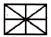
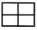
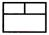
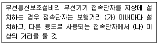
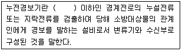

# 소방설비기사(전기분야)20150531(교사용) - 소방전기시설의 구조 및원리

> 원본: `소방설비기사(전기분야)20150531(교사용).pdf`
> 개인학습용 변환본.

## 61. 문제

61. "고압이라 함은 직류는 (가) V를, 교류는 (나) V를 초과하고 
(다) kV 이하인 것을 말한다. "의 문장에서 괄호안에 들어갈 
내용으로 옳은 것은?(관련 규정 개정전 문제로 여기서는 기
존 정답인 1번을 누르면 정답 처리됩니다. 자세한 내용은 
해설을 참고하세요.)
    ❶ (가) 750 (나) 600 (다) 7
    ② (가) 600 (나) 750 (다) 7
    ③ (가) 600 (나) 700 (다) 10
    ④ (가) 700 (나) 600 (다) 10

### 정답

1번

### 해설

정답은 1번입니다. 선택지의 핵심개념 을 확인하세요.

## 62. 문제

62. 유도표지의 설치기준 중 틀린 것은?
    ① 계단에 설치하는 것을 제외하고는 각 층마다 복도 및 통
로의 각 부분으로부터 하나의 유도표지까지의 보행거리
가 15m 이하가 되는 곳에 설치한다.
    ② 피난구유도표지는 출입구 상단에 설치한다.
    ❸ 통로유도표지는 바닥으로부터 높이 1.5m 이하의 위치에 
설치한다.
    ④ 주위에는 이와 유사한 등화 · 광고물 · 게시물 등을 설치
하지 않는다.

### 정답

1번

### 해설

정답은 1번입니다. 선택지의 핵심개념 을 확인하세요.

## 63. 문제

63. 정온식 스포트형 감지기의 구조 및 작동원리에 대한 형식이 
아닌 것은?
    ① 가용절연물을 이용한 방식
    ❷ 줄열을 이용한 방식
    ③ 바이메탈의 반전을 이용한 방식
    ④ 금속의 팽창계수차를 이용한 방식

### 정답

1번

### 해설

정답은 1번입니다. 선택지의 핵심개념 을 확인하세요.

## 64. 문제

64. 일반전기사업자로부터 특별고압 또는 고압으로 수전하는 비
상전원수전설비의 형식 중 틀린 것은?
    ① 큐비클(Cubicle)형
❷ 옥내개방형
    ③ 옥외개방형
④ 방화구획형

### 정답

1번

### 해설

정답은 1번입니다. 선택지의 핵심개념 을 확인하세요.

## 65. 문제

65. 피난통로가 되는 계단이나 경사로에 설치하는 통로유도등으
로 바닥면 및 디딤 바닥면을 비추어 주는 유도등은?
    ❶ 계단통로유도등
② 피난통로유도등
    ③ 복도통로유도등
④ 바닥통로유도등

### 정답

1번

### 해설

정답은 1번입니다. 선택지의 핵심개념 을 확인하세요.

## 66. 문제

66. 비상방송설비의 음향장치 설치기준으로 옳은 것은?
    ① 음량조정기의 배선은 2선식으로 할 것
    ② 5층 건물 중 2층에서 화재발생시 1층, 2층, 3층에서 경
보를 발할 수 있을 것
    ❸ 기동장치에 의한 화재신고 수신 후 피난에 유효한 방송
이 자동으로 개시될 때까지의 소요시간은 10초 이하로 
할 것
    ④ 음향장치는 자동화재탐지설비의 작동과 별도로 작동하는 
방식의 성능으로 할 것

### 정답

1번

### 해설

정답은 1번입니다. 선택지의 핵심개념 을 확인하세요.

## 67. 문제

67. 휴대용 비상조명등의 적합한 기준이 아닌 것은?
    ① 설치높이는 바닥으로부터 0.8 m 이상 1.5m 이하의 높이
에 설치할 것
    ② 사용 시 자동으로 점등되는 구조일 것
    ③ 외함은 난연성능이 있을 것
    ❹ 충전식 밧데리의 용량은 10분 이상 유효하게 사용할 수 
있는 것으로 할 것

### 정답

1번

### 해설

정답은 1번입니다. 선택지의 핵심개념 을 확인하세요.

## 68. 문제

68. 비상콘센트설비에 자가발전설비를 비상전원으로 설치할 때
의 기준으로 틀린 것은?
    ① 상용전원으로부터 전력의 공급이 중단된 때에는 자동으
로 비상전원으로부터 전력을 공급받도록 할 것
    ❷ 비상콘센트설비를 유효하게 10분 이상 작동실킬 수 있는 
용량으로 할 것
    ③ 점검이 편리하고 화재 및 침수 등의 재해로인한 피해를 
받을 우려가 없는 곳에 설치할 것
    ④ 비상전원을 실내에 설치하는 때에는 그 실내에 비상조명
등을 설치할 것

### 정답

1번

### 해설

정답은 1번입니다. 선택지의 핵심개념 을 확인하세요.

## 69. 문제

69. 축광유도표지의 표지면의 휘도는 주위조도 01x에서 몇 분간 
발광 후 몇 mcd/m2 이상이어야 하는가?
    ① 30분, 20mcd/m2
② 30분, 7mcd/m2
    ③ 60분, 20mcd/m2
❹ 60분, 7mcd/m2

### 정답

1번

### 해설

정답은 1번입니다. 선택지의 핵심개념 을 확인하세요.

## 70. 문제

70. 연기감지기를 설치하지 않아도 되는 장소는?
    ① 계단 및 경사로
  ② 엘리베이터 승강로
    ③ 파이프 피트 및 덕트  ❹ 20m 인 복도

### 정답

1번

### 해설

정답은 1번입니다. 선택지의 핵심개념 을 확인하세요.

## 71. 문제

71. 감지기 설치기준 중 틀린 것은?
    ① 감지기는 천장 또는 반자의 옥내에 면하는 부분에 설치
할 것
    ② 차동식분포형의 것을 제외하고 감지기는 실내로의 공기
유입구로부터 1.5m 이상 떨어진 위치에 설치할 것
4과목 : 소방전기시설의 구조 및 원리

소방설비기사(전기분야)
◐2015년 05월 31일 필기 기출문제 ◑
전자문제집 CBT : www.comcbt.com
최강 자격증 기출문제 전자문제집 CBT : www.comcbt.com
    ❸ 정온식감지기는 주방 · 보일러실 등으로서 다량의 화기
를 취급하는 장소에 설치하되, 공칭작동온도가 주위온도
보다 10℃ 이상 높은 것으로 설치할 것
    ④ 스포트형감지기는 45˚ 이상 경사되지 아니하도록 부착할 
것

### 정답

1번

### 해설

정답은 1번입니다. 선택지의 핵심개념 을 확인하세요.

### 그림

## 72. 문제

72. 비상방송설비에 사용되는 확성기는 각층마다 설치하되 그 
층의 각 부분으로부터 하나의 확성기까지의 수평거리는 최
대 몇 m 이하인가?
    ① 15
② 20
    ❸ 25
④ 30

### 정답

1번

### 해설

정답은 1번입니다. 선택지의 핵심개념 을 확인하세요.

### 그림

## 73. 문제

73. 비상콘센트보호함의 설치기준으로 틀린 것은?
    ① 보호함 상부에 적색의 표시등을 설치하여야 한다.
    ② 보호함에는 쉽게 개폐할 수 있는 문을 설치하여야 한다.
    ③ 보호함 표면에 "비상콘센트" 라고 표시한 표지를 하여야 
한다.
    ❹ 비상콘센트의 보호함을 옥내소화전함 등과 접속하여 설
치하는 경우에는 옥내소화전함의 표시등과 분리하여야 
한다.

### 정답

1번

### 해설

정답은 1번입니다. 선택지의 핵심개념 을 확인하세요.

### 그림

## 74. 문제

74. 자동화재속보설비 설치기준으로 틀린 것은?
    ① 화재 시 자동으로 소방관서에 연락되는 설비여야 한다.
    ② 자동화재탐지설비와 연동되어야 한다.
    ③ 스위치는 바닥으로터 0.8m 이상 1.5m 이하의 높이에 설
치한다.
    ❹ 관계인이 24시간 상주하고 있는 경우에는 설치하지 않을 
수 있다.

### 정답

1번

### 해설

정답은 1번입니다. 선택지의 핵심개념 을 확인하세요.

### 그림

## 75. 문제

75. 수신기를 나타내는 소방시설 도시기호로 옳은 것은?
    ❶ 
    
② 
    ③ 
    
④

### 정답

1번

### 해설

정답은 1번입니다. 선택지의 핵심개념 을 확인하세요.

### 그림

## 76. 문제

76. 다음 ( ) 에 들어갈 내용으로 옳은 것은?
    
    ① (가) 400 m (나) 5 m
❷ (가) 300 m (나) 5 m
    ③ (가) 400 m (나) 3 m
④ (가) 300 m (나) 3 m

### 정답

1번

### 해설

정답은 1번입니다. 선택지의 핵심개념 을 확인하세요.

### 그림

## 77. 문제

77. 누전경보기의 화재안전기준에서 변류기의 설치위치 기준으
로 옳은 것은?
    ① 제1종 접지선측의 점검이 쉬운 위치에 설치
    ❷ 옥외 인입선의 제1지점의 부하측에 설치
    ③ 인입구에 근접한 옥외에 설치
    ④ 제3종 접지선측의 점검이 쉬운 위치에 설치

### 정답

1번

### 해설

정답은 1번입니다. 선택지의 핵심개념 을 확인하세요.

### 그림

## 78. 문제

78. 감도조정장치를 갖는 누전경보기에 있어서 감도조정장치의 
조정범위는 최대치가 몇 A 이어야 하는가?
    ① 0.2
❷ 1.0
    ③ 1.5
④ 2.0

### 정답

1번

### 해설

정답은 1번입니다. 선택지의 핵심개념 을 확인하세요.

### 그림

## 79. 문제

79. 다음 ( )에 들어갈 내용으로 옳은 것은?
    
    ① 사용전압 220V
② 사용전압 380V
    ❸ 사용전압 600V
④ 사용전압 750V

### 정답

1번

### 해설

정답은 1번입니다. 선택지의 핵심개념 을 확인하세요.

### 그림

## 80. 문제

80. 부착높이 20m 이상에 설치되는 광전식 중 아날로그방식의 
감지기 공칭감지농도 하한값의 기준은?
    ❶ 감광율 5%/m 미만
② 감광율 10%/m 미만
    ③ 감광율 15%/m 미만④ 감광율 20%/m 미만
전자문제집 CBT 홈페이지 : www.comcbt.com
기출문제 및 해설집 다운로드  : www.comcbt.com/xe
전자문제집 CBT 앱(구글플레이) : [다운로드]
전자문제집 CBT란?
종이 문제집이 아닌 인터넷으로 문제를 풀고 자동으로 채점하며 
모의고사, 오답 노트, 해설까지 제공하는 무료 기출문제 학습 프
로그램으로 실제 시험에서 사용하는 OMR 형식의 CBT를 제공합
니다.
PC 버전 및 모바일 버전 완벽 연동
교사용/학생용 관리기능도 제공합니다.
오답 및 오탈자가 수정된 최신 자료와 해설은 전자문제집 CBT 
에서 확인하세요.
1
2
3
4
5
6
7
8
9
10
①
②
①
③
①
①
③
②
②
②
11
12
13
14
15
16
17
18
19
20
③
③
④
③
④
②
①
④
②
③
21
22
23
24
25
26
27
28
29
30
①
④
④
①
②
④
②
②
③
①
31
32
33
34
35
36
37
38
39
40
②
③
②
②
①
③
①
①
④
③
41
42
43
44
45
46
47
48
49
50
④
④
③
②
④
①
③
③
②
③
51
52
53
54
55
56
57
58
59
60
③
②
③
③
①
①
④
②
④
①
61
62
63
64
65
66
67
68
69
70
①
③
②
②
①
③
④
②
④
④
71
72
73
74
75
76
77
78
79
80
③
③
④
④
①
②
②
②
③
①

### 정답

1번

### 해설

정답은 1번입니다. 선택지의 핵심개념 을 확인하세요.

### 그림

