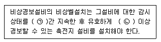

# 소방설비기사(전기분야)20150919(교사용) - 소방전기시설의 구조 및원리

> 원본: `소방설비기사(전기분야)20150919(교사용).pdf`
> 개인학습용 변환본.

## 61. 문제

61. 다음 비상전원 및 배터리 중 최소용량이 가장 큰 것은?
    ① 지하층을 제외한 11층 미만의 유도등 비상전원
    ② 비상조명등의 비상전원
    ③ 휴대용지상조명등의 충전식 배터리용량
    ❹ 무선통신보조설비 증폭기의 비상전원

### 정답

1번

### 해설

정답은 1번입니다. 선택지의 핵심개념 을 확인하세요.

## 62. 문제

62. 비상경보설비함 상부에 설치하는 발신기 위치표시등의 불빛
은 부착지점으로부터 몇 m이내 떨어진 위치에서 쉽게 식별
할 수 있어야 하는가?
    ① 5
❷ 10
    ③ 15
④ 20

### 정답

1번

### 해설

정답은 1번입니다. 선택지의 핵심개념 을 확인하세요.

## 63. 문제

63. P형 1급 발신기에 연결해야 하는 회선은?
    ① 지구선, 공통선, 소화선, 전화선
    ❷ 지구선, 공통선, 응답선, 전화선
    ③ 지구선, 공통선, 발신기선, 응답선
    ④ 신호선, 공통선, 발신기선, 응답선

### 정답

1번

### 해설

정답은 1번입니다. 선택지의 핵심개념 을 확인하세요.

## 64. 문제

64. 자동화재속보설비 속보기의 예비전원에 대한 안전장치시험
을 할 경우 1/5C이상 1C이하의 전류로 역충전하는 경우 안
전장치가 작동해야 하는 시간의 기준은?
    ① 1시간 이내
② 2시간 이내
    ③ 3시간 이내
❹ 5시간이내

### 정답

1번

### 해설

정답은 1번입니다. 선택지의 핵심개념 을 확인하세요.

## 65. 문제

65. 누전경보기의 기능검사 항목이 아닌 것은?
    ❶ 단락전압시험
② 절연저항시험
    ③ 온도특성시험
④ 단락전류강도시험

### 정답

1번

### 해설

정답은 1번입니다. 선택지의 핵심개념 을 확인하세요.

## 66. 문제

66. 휴대용비상조명등의 설치기준으로 옳지 않은 것은?
    ① 숙박시설 또는 다중이용업소에는 객실 또는 영업장 안의 
구획된 실마다 잘 보이는 곳에 1개 이상 설치
    ❷ 대규모점포에는 보행거리 30m이내 마다 2개이상 설치
    ③ 영화상영관에는 보행거리 50m이내 마다 3개이상 설치
    ④ 지하역사에는 보행거리 25m이내 마다 3개 이상 설치

### 정답

1번

### 해설

정답은 1번입니다. 선택지의 핵심개념 을 확인하세요.

## 67. 문제

67. 소방회로용으로 수전설비, 변전설비, 그 밖의 기기 및 배선
을 금속제 외함에 수납한 것은?
    ① 전용분전반
② 공용분전반
    ❸ 전용큐비클식
④ 공용큐비클식

### 정답

1번

### 해설

정답은 1번입니다. 선택지의 핵심개념 을 확인하세요.

## 68. 문제

68. 비상콘센트설비의 전원공급회로의 설치기준으로 옳지 않은 
것은?
    ① 전원회로는 단상 교류 220V인 것으로 한다.
    ② 전원회로의 공급용량은 1.5kVA 이상의 것으로 한다.
    ③ 전원회로는 주배전반에서 전용회로로 한다.
    ❹ 하나의 전용회로에 설치하는 비상콘센트는 10개 이상으
로 한다.

### 정답

1번

### 해설

정답은 1번입니다. 선택지의 핵심개념 을 확인하세요.

## 69. 문제

69. 비상방송설비의 설치기준으로 옳지않은 것은?
    ① 음량조정기의 배선은 3선식으로 할 것
    ❷ 확성기 음성입력은 5W 이상일 것
    ③ 다른 전기회로에 따라 유도장애가 생기지 아니하도록 할 
것
    ④ 조작스위치는 바닥으로부터 0.8m 이상 1.5m이하의 높이
에 설치할 것

### 정답

1번

### 해설

정답은 1번입니다. 선택지의 핵심개념 을 확인하세요.

## 70. 문제

70. 자동화재탐지설비에 있어서 지하구의 경우 하나의 경계구역
의 길이는?
    ❶ 700m 이하
② 800m 이하
    ③ 900m 이하
④ 1000m 이하

### 정답

1번

### 해설

정답은 1번입니다. 선택지의 핵심개념 을 확인하세요.

## 71. 문제

71. 무선통신보조설비의 누설동축케이블 및 공중선은 고압의 전
로로부터 몇 m 이상 떨어진 위치에 설치해야 하는가?
    ❶ 1.5
② 4.0
    ③ 100
④ 300

### 정답

1번

### 해설

정답은 1번입니다. 선택지의 핵심개념 을 확인하세요.

## 72. 문제

72. 무선통신보조설비에 사용되는 용어의 설명이 틀린 것은?
    ❶ 분파기 : 임피던스 매칭과 신호 균등분배를 위해 사용하
는 장치
    ② 혼합기 : 두 개 이상의 입력신호를 원하는 비율로 조합
한 출력이 발생하도록 하는 장치
4과목 : 소방전기시설의 구조 및 원리

소방설비기사(전기분야)
◐2015년 09월 19일 필기 기출문제 ◑
전자문제집 CBT : www.comcbt.com
최강 자격증 기출문제 전자문제집 CBT : www.comcbt.com
    ③ 증폭기 : 신호 전송 시 신호가 약해져 수신이 불가능해
지는 것을 방지하기 위해서 증폭하는 장치
    ④ 누설동축케이블 : 동축케이블의 외부도체에 가느다란 홈
을 만들어서 전파기 외부로 새어나갈 수 있도록 한 케이
블

### 정답

1번

### 해설

정답은 1번입니다. 선택지의 핵심개념 을 확인하세요.

### 그림

## 73. 문제

73. 누전경보기의 수신부는 그 정격전압에서 최소 몇 회의 누전
작동 반복시험을 실시하는 경우 구보 및 기능에 이상이 생
기지 않아야 하는가?
    ❶ 1만회
② 2만회
    ③ 3만회
④ 5만회

### 정답

1번

### 해설

정답은 1번입니다. 선택지의 핵심개념 을 확인하세요.

### 그림

## 74. 문제

74. 자동화재탐지설비의 발신기는 건축물의 각 부분으로부터 하
나의 발신기까지 수평거리는 최대 몇 m 이하인가?
    ❶ 25m
② 50m
    ③ 100m
④ 150m

### 정답

1번

### 해설

정답은 1번입니다. 선택지의 핵심개념 을 확인하세요.

### 그림

## 75. 문제

75. 피난기구의 설치기준으로 옳지 않은 것은?
    ① 숙박시설ㆍ노유자시설 및 의료시설은 그 층의 바닥면적 
500m2 마다 1개 이상 설치
    ❷ 계단실형 아파트이 경우는 각 층마다 1개 이상 설치
    ③ 복합용도의 층은 그 층의 바닥면적 800m2 머더 1개 이
상 설치
    ④ 주택법 시행령 제48조으 따른 아파트의 경우 하나의 관
리주체가 관리하는 아파트 구역마다 공기안전매트 1개 
이상 설치

### 정답

1번

### 해설

정답은 1번입니다. 선택지의 핵심개념 을 확인하세요.

### 그림

## 76. 문제

76. 열전대식 감지기의 구성요소가 아닌 것은?
    ① 열전대
② 미터릴레이
    ③ 접속전선
❹ 공기관

### 정답

1번

### 해설

정답은 1번입니다. 선택지의 핵심개념 을 확인하세요.

### 그림

## 77. 문제

77. 누전경보기의전원은 분전반으로부터 전용회로로 하고 각 극
에는 최대 몇 A 이하의 과전류 차단기를 설치해야 하는가?
    ① 5
❷ 15
    ③ 25
④ 35

### 정답

1번

### 해설

정답은 1번입니다. 선택지의 핵심개념 을 확인하세요.

### 그림

## 78. 문제

78. 부착높이가 15m 이상 20m미만에 적응성이 있는 감지기가 
아닌 것은?
    ① 이온화식 1종 감지기
② 연기복합형감지기
    ③ 불꽃감지기
❹ 차동식분포형감지기

### 정답

1번

### 해설

정답은 1번입니다. 선택지의 핵심개념 을 확인하세요.

### 그림

## 79. 문제

79. 비상콘센트 풀 박스 등의 두께의 최소 몇 mm이상의 철판을 
사용하여야 하는가?
    ① 1.2mm
② 1.5mm
    ❸ 1.6mm
④ 20.mm

### 정답

1번

### 해설

정답은 1번입니다. 선택지의 핵심개념 을 확인하세요.

### 그림

## 80. 문제

80. 다음 ( ㉠ ), ( ㉡ )에 들어갈 내용으로 옳은 것은?
    
    ① ㉠ 30분, ㉡ 30분
② ㉠ 30분, ㉡ 10분
    ③ ㉠ 60분, ㉡ 60분
❹ ㉠ 60분, ㉡10분
전자문제집 CBT 홈페이지 : www.comcbt.com
기출문제 및 해설집 다운로드  : www.comcbt.com/xe
전자문제집 CBT 앱(구글플레이) : [다운로드]
전자문제집 CBT란?
종이 문제집이 아닌 인터넷으로 문제를 풀고 자동으로 채점하며 
모의고사, 오답 노트, 해설까지 제공하는 무료 기출문제 학습 프
로그램으로 실제 시험에서 사용하는 OMR 형식의 CBT를 제공합
니다.
PC 버전 및 모바일 버전 완벽 연동
교사용/학생용 관리기능도 제공합니다.
오답 및 오탈자가 수정된 최신 자료와 해설은 전자문제집 CBT 
에서 확인하세요.
1
2
3
4
5
6
7
8
9
10
③
③
④
①
④
①
③
②
③
②
11
12
13
14
15
16
17
18
19
20
①
②
②
③
②
①
②
④
④
②
21
22
23
24
25
26
27
28
29
30
②
③
②
④
①
③
②
②
②
③
31
32
33
34
35
36
37
38
39
40
①
③
①
①
②
②
③
④
②
③
41
42
43
44
45
46
47
48
49
50
②
②
④
④
③
②
②
②
①
④
51
52
53
54
55
56
57
58
59
60
③
②
④
③
②
②
④
④
①
①
61
62
63
64
65
66
67
68
69
70
④
②
②
④
①
②
③
④
②
①
71
72
73
74
75
76
77
78
79
80
①
①
①
①
②
④
②
④
③
④

### 정답

1번

### 해설

정답은 1번입니다. 선택지의 핵심개념 을 확인하세요.

### 그림

