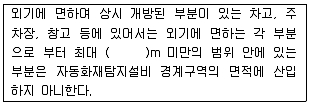
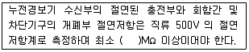
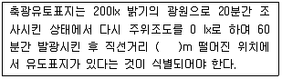

# 소방설비기사(전기분야)20160306(교사용) - 소방전기시설의 구조 및원리

> 원본: `소방설비기사(전기분야)20160306(교사용).pdf`
> 개인학습용 변환본.

## 61. 문제

61. 비상방송설비의 특징에 대한 설명으로 틀린 것은?
    ① 다른 방송설비와 공용하는 경우에는 화재 시 비상경보외
의 방송을 차단 할 수 있는 구조로 하여야 한다.
    ❷ 비상방송설비의 축전지는 감시상태를 10분간 지속한 후 
유효하게 60분 이상 경보할 수 있어야 한다.
    ③ 확성기의 음성입력은 실외에 설치한 경우 3W 이상이어
야 한다.
    ④ 음량조정기의 배선은 3선식으로 한다.

### 정답

1번

### 해설

정답은 1번입니다. 선택지의 핵심개념 을 확인하세요.

## 62. 문제

62. 자동화재탐지설비의 수신기 설치기준에 관한 사항 중, 최소 
몇 층 이상의 특정소방대상물에는 발신기와 전화통화가 가
능한 수신기를 설치하여야 하는가?
    ① 3
❷ 4
    ③ 5
④ 7

### 정답

1번

### 해설

정답은 1번입니다. 선택지의 핵심개념 을 확인하세요.

## 63. 문제

63. 지하층을 제외한 층수가 11층 이상의 층에서 피난층에 이르
는 부분의 소방시설에 있어 비상 전원을 60분 이상 유효하
게 작동시킬 수 있는 용량으로 하여야 하는 설비들로 옳게 
나열된 것은?
    ❶ 비상조명등설비, 유도등설비
    ② 비상조명등설비, 비상경보설비
    ③ 비상방송설비, 유도등설비
    ④ 비상방송설비, 비상경보설비

### 정답

1번

### 해설

정답은 1번입니다. 선택지의 핵심개념 을 확인하세요.

## 64. 문제

64. 화재안전기준에서 정하고 있는 연기감지기를 설치하지 않아
도 되는 장소는?
    ① 에스컬레이터 경사로
    ❷ 길이가 15m인 복도
    ③ 엘리베이터 권상기실
    ④ 천장의 높이가 15m 이상 20 m 미만의 장소

### 정답

1번

### 해설

정답은 1번입니다. 선택지의 핵심개념 을 확인하세요.

## 65. 문제

65. 누전경보기의 수신부 설치 제외 장소로 틀린 것은?
    ① 습도가 높은 장소
    ② 온도의 변화가 급격한 장소
    ③ 고주파 발생회로 등에 따른 영향을 받을 우려가 있는 장
소
    ❹ 부식성의 증기·가스 등이 체류하지 않는 장소

### 정답

1번

### 해설

정답은 1번입니다. 선택지의 핵심개념 을 확인하세요.

## 66. 문제

66. 상용전원이 서로 다른 소방시설은?
    ① 옥내소화전설비
❷ 비상방송설비
    ③ 비상콘센트설비
④ 스프링클러설비

### 정답

1번

### 해설

정답은 1번입니다. 선택지의 핵심개념 을 확인하세요.

## 67. 문제

67. 노유자시설로서 바닥면적이 몇 m2 이상인 층이 있는 경우에 
자동화재속보설비를 설치하는가?
    ① 200
② 300
    ❸ 500
④ 600

### 정답

1번

### 해설

정답은 1번입니다. 선택지의 핵심개념 을 확인하세요.

## 68. 문제

68. 경계구역에 관한 다음 내용 중 ( )안에 맞는 것은?
4과목 : 소방전기시설의 구조 및 원리

소방설비기사(전기분야)
◐2016년 03월 06일 필기 기출문제 ◑
전자문제집 CBT : www.comcbt.com
최강 자격증 기출문제 전자문제집 CBT : www.comcbt.com
    
    ① 3
❷ 5
    ③ 7
④ 10

### 정답

1번

### 해설

정답은 1번입니다. 선택지의 핵심개념 을 확인하세요.

### 그림

## 69. 문제

69. 절연저항시험에 관한 기준에서 ( )에 알맞은 것은?
    
    ① 0.1
② 3
    ❸ 5
④ 10

### 정답

1번

### 해설

정답은 1번입니다. 선택지의 핵심개념 을 확인하세요.

### 그림

## 70. 문제

70. 축광표지의 식별도시험에 관련한 기준에서 ( )에 알맞은 것
은?
    
    ❶ 20
② 10
    ③ 5
④ 3

### 정답

1번

### 해설

정답은 1번입니다. 선택지의 핵심개념 을 확인하세요.

### 그림

## 71. 문제

71. 환경상태가 현저하게 고온으로 되어 연기감지기를 설치할 
수 없는 건조실 또는 살균실 등에 적응성 있는 열감지기가 
아닌 것은?
    ① 정온식 1종
② 정온식 특종
    ③ 열아날로그식
❹ 보상식 스포트형 1종

### 정답

1번

### 해설

정답은 1번입니다. 선택지의 핵심개념 을 확인하세요.

### 그림

## 72. 문제

72. 누전경보기의 화재안전기준에서 규정한 용어, 설치방법, 전
원 등에 관한 설명으로 틀린 것은?
    ① 경계전로의 정격전류가 60A 를 초과하는 전로에 있어서
는 1급 누전경보기를 설치한다.
    ❷ 변류기는 옥외 인입선 제1지점의 전원측에 설치한다.
    ③ 누전경보기 전원은 분전반으로부터 전용으로 하고, 각 
극에 개폐기 및 15A 이하의 과전류차단기를 설치한다.
    ④ 누전경보기는 변류기와 수신부로 구성되어 있다.

### 정답

1번

### 해설

정답은 1번입니다. 선택지의 핵심개념 을 확인하세요.

### 그림

## 73. 문제

73. 누전경보기에서 감도조정장치의 조정범위는 최대 몇 mA인
가?
    ① 1
② 20
    ❸ 1000
④ 1500

### 정답

1번

### 해설

정답은 1번입니다. 선택지의 핵심개념 을 확인하세요.

### 그림

## 74. 문제

74. 자동화재탐지설비의 GP형 수신기에 감지기 회로의 배선을 
접속하려고 할 때 경계구역이 15개인 경우 필요한 공통선의 
최소 개수는?
    ① 1
② 2
    ❸ 3
④ 4

### 정답

1번

### 해설

정답은 1번입니다. 선택지의 핵심개념 을 확인하세요.

### 그림

## 75. 문제

75. 무선통신보조설비에 대한 설명으로 틀린 것은?
    ① 소화활동설비이다.
    ② 증폭기에는 비상전원이 부착된 것으로 하고 비상전원의 
용량은 30분 이상이다.
    ③ 누설동축케이블의 끝부분에는 무반사 종단저항을 부착한
다.
    ❹ 누설동축케이블 또는 동축케이블의 임피던스는 100 Ω 
의 것으로 한다.

### 정답

1번

### 해설

정답은 1번입니다. 선택지의 핵심개념 을 확인하세요.

### 그림

## 76. 문제

76. 비상방송설비가 기동장치에 의한 화재신고를 수신한 후 필
요한 음량으로 화재발생 상황 및 피난에 유효한 방송이 자
동으로 개시될 때까지의 소요시간은 최대 몇 초 이하인가?
    ① 5
❷ 10
    ③ 20
④ 30

### 정답

1번

### 해설

정답은 1번입니다. 선택지의 핵심개념 을 확인하세요.

### 그림

## 77. 문제

77. 지하층으로서 특정소방대상물의 바닥부분 중 최소 몇 면이 
지표면과 동일한 경우에 무선통신 보조설비의 설치를 제외
할 수 있는가?
    ① 1면 이상
❷ 2면 이상
    ③ 3면 이상
④ 4면 이상

### 정답

1번

### 해설

정답은 1번입니다. 선택지의 핵심개념 을 확인하세요.

### 그림

## 78. 문제

78. 무창층의 도매시장에 설치하는 비상조명등용 비상전원은 당
해 비상조명등을 몇 분 이상 유효하게 작동시킬 수 있는 용
량으로 하여야 하는가?
    ① 10
② 20
    ③ 40
❹ 60

### 정답

1번

### 해설

정답은 1번입니다. 선택지의 핵심개념 을 확인하세요.

### 그림

## 79. 문제

79. 청각장애인용 시각경보장치는 천장의 높이가 2m 이하인 경
우 천장으로부터 몇 m 이내의 장소에 설치해야 하는가?
    ① 0.1
❷ 0.15
    ③ 2.0
④ 2.5

### 정답

1번

### 해설

정답은 1번입니다. 선택지의 핵심개념 을 확인하세요.

### 그림

## 80. 문제

80. 신호의 전송로가 분기되는 장소에 설치하는 것으로 임피던
스 매칭과 신호 균등분배를 위해 사용되는 장치는?
    ❶ 분배기
② 혼합기
    ③ 증폭기
④ 분파기

소방설비기사(전기분야)
◐2016년 03월 06일 필기 기출문제 ◑
전자문제집 CBT : www.comcbt.com
최강 자격증 기출문제 전자문제집 CBT : www.comcbt.com
전자문제집 CBT 홈페이지 : www.comcbt.com
기출문제 및 해설집 다운로드  : www.comcbt.com/xe
전자문제집 CBT 앱(구글플레이) : [다운로드]
전자문제집 CBT란?
종이 문제집이 아닌 인터넷으로 문제를 풀고 자동으로 채점하며 
모의고사, 오답 노트, 해설까지 제공하는 무료 기출문제 학습 프
로그램으로 실제 시험에서 사용하는 OMR 형식의 CBT를 제공합
니다.
PC 버전 및 모바일 버전 완벽 연동
교사용/학생용 관리기능도 제공합니다.
오답 및 오탈자가 수정된 최신 자료와 해설은 전자문제집 CBT 
에서 확인하세요.
1
2
3
4
5
6
7
8
9
10
①
④
③
①
③
④
②
③
①
①
11
12
13
14
15
16
17
18
19
20
②
②
④
④
④
③
①
④
①
③
21
22
23
24
25
26
27
28
29
30
①
①
③
④
①
③
④
②
④
①
31
32
33
34
35
36
37
38
39
40
②
③
①
④
④
②
①
②
③
④
41
42
43
44
45
46
47
48
49
50
③
②
④
④
③
④
③
①
④
②
51
52
53
54
55
56
57
58
59
60
③
②
④
②
④
②
②
①
②
②
61
62
63
64
65
66
67
68
69
70
②
②
①
②
④
②
③
②
③
①
71
72
73
74
75
76
77
78
79
80
④
②
③
③
④
②
②
④
②
①

### 정답

1번

### 해설

정답은 1번입니다. 선택지의 핵심개념 을 확인하세요.

### 그림

