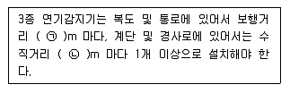

# 소방설비기사(전기분야)20160508(교사용) - 소방전기시설의 구조 및원리

> 원본: `소방설비기사(전기분야)20160508(교사용).pdf`
> 개인학습용 변환본.

## 61. 문제

61. 무선통신보조설비의 화재안전기준에서 사용하는 용어의 정
의로 옳은 것은?
    ① 혼합기는 신호의 전송로가 분기되는 장소에 설치하는 장
치를 말한다.
    ② 분배기는 서로 다른 주파수의 합성된 신호를 분리하기 
위해서 사용하는 장치를 말한다.
    ③ 증폭기는 두 개 이상의 입력 신호를 원하는 비율로 조합
한 출력이 발생되도록 하는 장치를 말한다.
    ❹ 누설동축케이블은 동축케이블 외부도체에 가느다란 홈을 
만들어서 전파가 외부로 새어나갈 수 있도록 한 케이블
을 말한다.

### 정답

1번

### 해설

정답은 1번입니다. 선택지의 핵심개념 을 확인하세요.

## 62. 문제

62. 자동화재속보설비 속보기의 예비전원을 병렬로 접속하는 경
우 필요한 조치는?
    ❶ 역충전 방지 조치
② 자동 직류전환 조치
    ③ 계속충전 유지조치
④ 접지 조치

### 정답

1번

### 해설

정답은 1번입니다. 선택지의 핵심개념 을 확인하세요.

## 63. 문제

63. 비상벨설비 또는 자동식사이렌설비에 사용하는 벨 등의 음
향장치의 설치기준이 틀린 것은?
    ❶ 음향장치용 전원은 교류전압의 옥내간선으로 하고 배선
은 다른 설비와 겸용으로 할 것
    ② 음향장치는 정격전압의 80% 전압에서 음향을 발할 수 
있도록 할 것
    ③ 음향장치의 음량은 부착된 음향장치의 중심으로부터 1m 
떨어진 위치에서 90dB 이상일 것
    ④ 지구음향장치는 특정소방대상물의 층마다 설치하되, 해
당 특정소방대상물의 각 부분으로부터 하나의 음향장치
까지의 수평거리가 25m 이하가 되도록 할 것

### 정답

1번

### 해설

정답은 1번입니다. 선택지의 핵심개념 을 확인하세요.

## 64. 문제

64. 비상콘센트설비의 화재안전기준에서 정하고 있는 저압의 정
의는?(2022년 09월 확인된 규정 적용됨)
    ❶ 직류는 1500V 이하, 교류는 1000V 이하인 것
    ② 직류는 15000V 이하, 교류는 750V 이하인 것
    ③ 직류는 1500V 를, 교류는 1000V 를 넘고 7000V 이하인 
것
    ④ 직류는 1500V 를, 교류는 750V 를 넘고 7000V 이하인 
것

### 정답

1번

### 해설

정답은 1번입니다. 선택지의 핵심개념 을 확인하세요.

## 65. 문제

65. 부착높이가 6m 이고 주요구조부를 내화구조로 한 특정소방
대상물 또는 그 부분에 정온식 스포트형감지기 특종을 설치
하고자 하는 경우 바닥면적 몇 m2 마다 1개 이상 설치해야 
하는가?
    ① 15
② 25
    ❸ 35
④ 45

### 정답

1번

### 해설

정답은 1번입니다. 선택지의 핵심개념 을 확인하세요.

## 66. 문제

66. 누전경보기의 수신부의 설치 장소로서 옳은 것은?
    ① 습도가 높은 장소
    ② 온도의 변화가 급격한 장소
4과목 : 소방전기시설의 구조 및 원리

소방설비기사(전기분야)
◐2016년 05월 08일 필기 기출문제 ◑
전자문제집 CBT : www.comcbt.com
최강 자격증 기출문제 전자문제집 CBT : www.comcbt.com
    ③ 고주파 발생회로 등에 따른 영향을 받을 우려가 있는 장
소
    ❹ 부식성의 증기ㆍ가스 등이 체류하지 않는 장소

### 정답

1번

### 해설

정답은 1번입니다. 선택지의 핵심개념 을 확인하세요.

### 그림

## 67. 문제

67. 비상방송설비는 기동장치에 의한 화재신고를 수신한 후 필
요한 음량으로 화재발생상황 및 피난에 유효한 방송이 자동
으로 개시될 때까지의 소요시간은 몇 초 이하가 되도록 하
여야 하는가?
    ① 5
❷ 10
    ③ 20
④ 30

### 정답

1번

### 해설

정답은 1번입니다. 선택지의 핵심개념 을 확인하세요.

### 그림

## 68. 문제

68. 자동화재탐지설비 감지기의 구조 및 기능에 대한 설명으로 
틀린 것은?
    ❶ 차동식분포형감지기는 그 기판면을 부착한 정위치로 45°
를 경사시킨 경우 그 기능에 이상이 생기지 않아야 한
다.
    ② 연기를 감지하는 감지기는 감시챔버로 1.3±0.05mm 크
기의 물체가 침입할 수 없는 구조이어야 한다.
    ③ 방사성물질을 사용하는 감지기는 그 방사성물질을 밀봉
선원으로 하여 외부에서 직접 접촉할 수 없도록 하여야 
한다.
    ④ 차동식분포형 감지기로서 공기관식 공기관의 두께는 
0.3mm 이상, 바깥지름은 1.9mm 이상이어야 한다.

### 정답

1번

### 해설

정답은 1번입니다. 선택지의 핵심개념 을 확인하세요.

### 그림

## 69. 문제

69. 자동화재탐지설비의 연기복합형 감지기를 설치할 수 없는 
부착높이는?
    ① 4m 이상 8m 미만
  ② 8m 이상 15m 미만
    ③ 15m 이상 20m 미만  ❹ 20m 이상

### 정답

1번

### 해설

정답은 1번입니다. 선택지의 핵심개념 을 확인하세요.

### 그림

## 70. 문제

70. 3종 연기감지기의 설치기준 중 다음 ( )안에 알맞은 것으로 
연결된 것은?
    
    ① ㉠ 15, ㉡ 10
❷ ㉠ 20, ㉡ 10
    ③ ㉠ 30, ㉡ 15
④ ㉠ 30, ㉡ 20

### 정답

1번

### 해설

정답은 1번입니다. 선택지의 핵심개념 을 확인하세요.

### 그림

## 71. 문제

71. 비상방송설비의 배선에 대한 설치기준으로 틀린 것은?
    ❶ 배선은 다른 용도의 전선과 동일한 관, 덕트, 몰드 또는 
풀박스 등에 설치할 것
    ② 전원회로의 배선은 옥내소화전설비의 화재안전기준에 따
른 내화배선을 설치할 것
    ③ 화재로 인하여 하나의 층의 확성기 또는 배선이 단락 또
는 단선되어도 다른 층의 화재통보에 지장이 없도록 할 
것
    ④ 부속회로의 전로와 대지사이 및 배선상호간의 절연저항
은 1경계구역마다 직류 250V 의 절연저항측정기를 사용
하여 측정한 절연저항이 0.1MΩ 이상이 되도록 할 것

### 정답

1번

### 해설

정답은 1번입니다. 선택지의 핵심개념 을 확인하세요.

### 그림

## 72. 문제

72. 무선통신보조설비의 설치기준으로 틀린 것은?
    ① 누설동축케이블 또는 동축케이블의 임피던스 50Ω 으로 
한다.
    ❷ 누설동축케이블 및 공중선은 고압의 전로로부터 0.5m 
이상 떨어진 위치에 설치한다.
    ③ 무선기기 접속단자 중 지상에 설치하는 접속단자는 보행
거리 300m 이내마다 설치한다.
    ④ 누설동축케이블의 끝부분에는 무반사 종단저항을 견고하
게 설치한다.

### 정답

1번

### 해설

정답은 1번입니다. 선택지의 핵심개념 을 확인하세요.

### 그림

## 73. 문제

73. 누전경보기의 수신부의 절연된 충전부와 외함간의 절연저항
은 DC 500V의 절연저항계로 측정하는 경우 몇 MΩ 이상이
어야 하는가?
    ① 0.5
❷ 5
    ③ 10
④ 20

### 정답

1번

### 해설

정답은 1번입니다. 선택지의 핵심개념 을 확인하세요.

### 그림

## 74. 문제

74. 지상 4층인 교육연구시설에 적응성이 없는 피난기구는?
    ① 완강기
② 구조대
    ③ 피난교
❹ 미끄럼대

### 정답

1번

### 해설

정답은 1번입니다. 선택지의 핵심개념 을 확인하세요.

### 그림

## 75. 문제

75. 대형피난구유도등의 설치장소가 아닌 것은?
    ① 위락시설
② 판매시설
    ③ 지하철역사
❹ 아파트

### 정답

1번

### 해설

정답은 1번입니다. 선택지의 핵심개념 을 확인하세요.

### 그림

## 76. 문제

76. 비상콘센트설비의 전원회로에서 하나의 전용회로에 설치하
는 비상콘센트는 최대 몇 개 이하로 하여야 하는가?
    ① 2
② 3
    ❸ 10
④ 20

### 정답

1번

### 해설

정답은 1번입니다. 선택지의 핵심개념 을 확인하세요.

### 그림

## 77. 문제

77. 비상조명등의 설치제외 장소가 아닌 것은?
    ① 의원의 거실
② 경기장의 거실
    ③ 의료시설의 거실
❹ 종교시설의 거실

### 정답

1번

### 해설

정답은 1번입니다. 선택지의 핵심개념 을 확인하세요.

### 그림

## 78. 문제

78. 1개 층에 계단참이 4개 있을 경우 계단통로 유도등은 최소 
몇 개 이상 설치해야 하는가?
    ① 1
❷ 2
    ③ 3
④ 4

### 정답

1번

### 해설

정답은 1번입니다. 선택지의 핵심개념 을 확인하세요.

### 그림

## 79. 문제

79. 바닥면적이 450m2일 경우 단독경보형감지기의 최소 설치계
수는?
    ① 1개
② 2개
    ❸ 3개
④ 4개

### 정답

1번

### 해설

정답은 1번입니다. 선택지의 핵심개념 을 확인하세요.

### 그림

## 80. 문제

80. 누전경보기의 정격전압이 몇 V를 넘는 기구의 금속제 외함
에는 접지단자를 설치해야 하는가?
    ① 30V
❷ 60V
    ③ 70V
④ 100V

소방설비기사(전기분야)
◐2016년 05월 08일 필기 기출문제 ◑
전자문제집 CBT : www.comcbt.com
최강 자격증 기출문제 전자문제집 CBT : www.comcbt.com
전자문제집 CBT 홈페이지 : www.comcbt.com
기출문제 및 해설집 다운로드  : www.comcbt.com/xe
전자문제집 CBT 앱(구글플레이) : [다운로드]
전자문제집 CBT란?
종이 문제집이 아닌 인터넷으로 문제를 풀고 자동으로 채점하며 
모의고사, 오답 노트, 해설까지 제공하는 무료 기출문제 학습 프
로그램으로 실제 시험에서 사용하는 OMR 형식의 CBT를 제공합
니다.
PC 버전 및 모바일 버전 완벽 연동
교사용/학생용 관리기능도 제공합니다.
오답 및 오탈자가 수정된 최신 자료와 해설은 전자문제집 CBT 
에서 확인하세요.
1
2
3
4
5
6
7
8
9
10
④
①
③
③
④
②
④
③
③
③
11
12
13
14
15
16
17
18
19
20
③
③
④
①
①
②
③
①
①
③
21
22
23
24
25
26
27
28
29
30
②
①
②
③
④
①
①
①
④
②
31
32
33
34
35
36
37
38
39
40
①
③
④
①
③
①
④
②
②
①
41
42
43
44
45
46
47
48
49
50
②
②
①
③
③
②
①
②
④
④
51
52
53
54
55
56
57
58
59
60
②
④
①
③
③
③
④
②
④
③
61
62
63
64
65
66
67
68
69
70
④
①
①
①
③
④
②
①
④
②
71
72
73
74
75
76
77
78
79
80
①
②
②
④
④
③
④
②
③
②

### 정답

1번

### 해설

정답은 1번입니다. 선택지의 핵심개념 을 확인하세요.

### 그림

