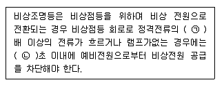
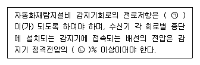

# 소방설비기사(전기분야)20161001(교사용) - 소방전기시설의 구조 및원리

> 원본: `소방설비기사(전기분야)20161001(교사용).pdf`
> 개인학습용 변환본.

## 61. 문제

61. 통로유도등의 설치기준 중 틀린 것은?
    ❶ 거실의 통로가 벽체 등으로 구획된 경우에는 거실통로유
도등을 설치한다.
    ② 거실통로유도등은 거실통로에 기둥이 설치된 경우에는 
기둥부분의 바닥으로부터 높이 1.5m 이하의 위치에 설
치할 수 있다.
    ③ 복도통로유도등은 구부러진 모퉁이 및 보행거리 20m 마
다 설치한다.
    ④ 계단통로유도등은 바닥으로부터 높이 1m이하의 위치에 
설치한다.

### 정답

1번

### 해설

정답은 1번입니다. 선택지의 핵심개념 을 확인하세요.

### 그림

## 62. 문제

62. 비상콘센트설비의 전원회로의 공급용량은 최소 몇 kVA 이상
인 것으로 설치해야 하는가?
    ❶ 1.5
② 2
    ③ 2.5
④ 3

### 정답

1번

### 해설

정답은 1번입니다. 선택지의 핵심개념 을 확인하세요.

### 그림

## 63. 문제

63. 비상조명등 비상점등 회로의 보호를 위한 기준중 다음 ( )안
에 알맞은 것은?
    
    ① ㉠ 2, ㉡ 1
❷ ㉠ 1.2, ㉡ 3
    ③ ㉠ 3, ㉡ 1
④ ㉠ 2.1, ㉡ 5

### 정답

1번

### 해설

정답은 1번입니다. 선택지의 핵심개념 을 확인하세요.

### 그림

## 64. 문제

64. 무선통신보조설비의 누설동축케이블 및 공중선은 고압의 전
류로부터 1.5m 이상 떨어진 위치에 설치해야 하나 그렇게 
하지 않아도 되는 경우는?
    ❶ 해당 전로에 정전기 차폐장치를 유효하게 설치한 경우
    ② 금속제 등의 지지금구로 일정한 간격으로 고정한 경우
    ③ 끝부분에 무반사 종단저항을 설치한 경우
    ④ 불연재료로 구획된 반자 안에 설치한 경우

### 정답

1번

### 해설

정답은 1번입니다. 선택지의 핵심개념 을 확인하세요.

### 그림

## 65. 문제

65. 유도등의 전기회로에 점멸기를 설치할 수 있는 장소에 해당
되지 않는 것은? (단, 유도등은 3선식 배선에 따라 상시 충
전되는 구조이다.)
    ① 공연장으로서 어두워야 할 필요가 있는 장소
    ② 특정소방대상물의 관계인이 주로 사용하는 장소
    ③ 외부광에 따라 피난구 또는 피난방향을 쉽게 식별할 수 
있는 장소
    ❹ 지하층을 제외한 층수가 11층 이상의 장소

### 정답

1번

### 해설

정답은 1번입니다. 선택지의 핵심개념 을 확인하세요.

### 그림

## 66. 문제

66. 각 실별 실내의 바닥면적이 25m2인 4개의 실에 단독경보형
감지기를 설치 시 몇 개의 실로 보아야 하는가? (단, 각 실
은 이웃하고 있으며, 벽체 상부가 일부 개방되어 이웃하는 
실내와 공기가 상호유통되는 경우이다.)
    ❶ 1
② 2
4과목 : 소방전기시설의 구조 및 원리

소방설비기사(전기분야)
◐2016년 10월 01일 필기 기출문제 ◑
전자문제집 CBT : www.comcbt.com
최강 자격증 기출문제 전자문제집 CBT : www.comcbt.com
    ③ 3
④ 4

### 정답

1번

### 해설

정답은 1번입니다. 선택지의 핵심개념 을 확인하세요.

### 그림

## 67. 문제

67. 피난기구 중 다수인 피난장비의 설치기준 중 틀린 것은?
    ① 사용 시에 보관실 외측 문이 먼저 열리고 탑승기가 외측
으로 자동으로 전개될 것
    ② 하강 시에 탑승기가 건물 외벽이나 돌출물에 충돌하지 
않도록 설치할 것
    ❸ 상ㆍ하층에 설치할 경우에는 탑승기의 하강경로가 중첩
되도록 할 것
    ④ 보관실은 건물 외측보다 돌출되지 아니하고, 빗물ㆍ먼지 
등으로 부터 장비를 보호할 수 있는 구조 일 것

### 정답

1번

### 해설

정답은 1번입니다. 선택지의 핵심개념 을 확인하세요.

### 그림

## 68. 문제

68. 누전경보기 수신부의 기능검사 항목이 아닌 것은?
    ① 충격시험
② 절연저항실험
    ❸ 내식성시험
④ 전원전압 변동시험

### 정답

1번

### 해설

정답은 1번입니다. 선택지의 핵심개념 을 확인하세요.

### 그림

## 69. 문제

69. 아파트형 공장의 지하 주차장에 설치된 비상방송용 스피커
의 음량조정기 배선방식은?
    ① 단선식
② 2선식
    ❸ 3선식
④ 복합식

### 정답

1번

### 해설

정답은 1번입니다. 선택지의 핵심개념 을 확인하세요.

### 그림

## 70. 문제

70. 공동주택 4층 이상 10층 이하에 적응성이 있는 피난기구
는?(단, 공동주택은 공동주택 관리법 시행령 제 2조의 규정
에 해당하는 공동주택이다.)
    ① 간이완강기
② 피난용트랩
    ③ 미끄럼대
❹ 공기안전매트

### 정답

1번

### 해설

정답은 1번입니다. 선택지의 핵심개념 을 확인하세요.

### 그림

## 71. 문제

71. 감지기의 설치기준 중 부착높이 20m이상에 설치되는 광전
식 중 아날로그장식의 감지기는 공칭감지농도 하한값이 감
광율 몇 %/m 미만인 것으로 하는가?
    ① 3
❷ 5
    ③ 7
④ 10

### 정답

1번

### 해설

정답은 1번입니다. 선택지의 핵심개념 을 확인하세요.

### 그림

## 72. 문제

72. 연기감지기 설치 시 천장 또는 반자부근에 배기구가 있는 
경우에 감지기의 설치위치로 옳은 것은?
    ❶ 배기구가 있는 그 부근
    ② 배기구로부터 가장 먼 곳
    ③ 배기구로부터 0.6m 이상 떨어진 곳
    ④ 배기구로부터 1.5m 이상 떨어진 곳

### 정답

1번

### 해설

정답은 1번입니다. 선택지의 핵심개념 을 확인하세요.

### 그림

## 73. 문제

73. 자동화재탐지설비 배선의 설치기준 중 다음 ( )안에 알맞은 
것은?    
    ① ㉠ 50Ω 이상, ㉡ 70
❷ ㉠ 50Ω 이하, ㉡ 80
    ③ ㉠ 40Ω 이상, ㉡ 70
④ ㉠ 40Ω 이하, ㉡ 80

### 정답

1번

### 해설

정답은 1번입니다. 선택지의 핵심개념 을 확인하세요.

### 그림

## 74. 문제

74. 누전경보기의 변류기는 경계전로에 정격전류를 흘리는 경우 
그 경계전로의 전압강하는 몇 V 이하여야 하는가? (단, 경
계전로의 전선을 그 변류기에 관통시키는 것은 제외한다.)
    ① 0.3
❷ 0.5
    ③ 1.0
④ 3.0

### 정답

1번

### 해설

정답은 1번입니다. 선택지의 핵심개념 을 확인하세요.

### 그림

## 75. 문제

75. 무선통신보조설비 증폭기의 설치기준으로 틀린 것은?
    ① 증폭기는 비상전원이 부착된 것으로 한다.
    ❷ 증폭기의 전면에는 표시등 및 전류계를 설치한다.
    ③ 전원은 전기가 정상적으로 공급되는 축전지 또는 교류전
압 옥내간선으로 하고 전원까지의 배선은 전용으로 한
다,
    ④ 증폭기의 비상전원용량은 무선통신보조설비 유효하게 30
분 이상 작동시킬 수 있는 것으로 한다.

### 정답

1번

### 해설

정답은 1번입니다. 선택지의 핵심개념 을 확인하세요.

### 그림

## 76. 문제

76. 비상콘센트의 배치는 아파트 또는 바닥면적이 1000m2 미만
인 층은 계단의 출입구로부터 몇 m 이내에 설치해야 하는
가? (단. 계단의 부속실을 포함하며 계단이 2 이상 있는 경
우에는 그 중 1개의 계단을 말한다.)
    ① 10
② 8
    ❸ 5
④ 3

### 정답

1번

### 해설

정답은 1번입니다. 선택지의 핵심개념 을 확인하세요.

### 그림

## 77. 문제

77. 비상방송설비는 기동장치에 따른 화재신고를 수신한 후 필
요한 음량으로 화재발생 상황 및 피난에 유효한 방송이 자
동으로 개시될 때까지의 소요시간은 몇 초 이하여야 하는
가?
    ① 5
❷ 10
    ③ 30
④ 60

### 정답

1번

### 해설

정답은 1번입니다. 선택지의 핵심개념 을 확인하세요.

### 그림

## 78. 문제

78. 누전경보기 음향장치의 설치위치로 옳은 것은?
    ① 옥내의 점검에 편리한 장소
    ② 옥외 인입선의 제1지점의 부하측의 점검이 쉬운 위치
    ❸ 수위실 등 상시 사람이 근무하는 장소
    ④ 옥외인입선의 제2종 접지선측의 점검이 쉬운 위치

### 정답

1번

### 해설

정답은 1번입니다. 선택지의 핵심개념 을 확인하세요.

### 그림

## 79. 문제

79. 광전식 분리형감지기의 설치기준 중 틀린 것은?
    ① 감지기의 광축의 길이는 공칭감시거리 범위 이내 일것
    ② 감지기의 송광부와 수광부는 설치된 뒷벽으로부터 1m 
이내 위치에 설치할 것
    ③ 광축의 높이는 천장 등 (천장의 실내에 면한 부분 또는 
상층의 바닥하부면) 높이의 80% 이상일 것
    ❹ 광축은 나란한 벽으로부터 0.5m 이상 이격하여 설치할 
것

### 정답

1번

### 해설

정답은 1번입니다. 선택지의 핵심개념 을 확인하세요.

### 그림

## 80. 문제

80. 자동화재속보설비 속보기의 구조에 대한 설명 중 틀린 것
은?
    ① 수동통화용 송수화장치를 설치하여야 한다.
    ❷ 접지전극에 직류전류를 통하는 회로방식을 사용하여야 
한다.
    ③ 작동 시 그 작동시간과 작동회수를 표시할 수 있는 장치
를 하여야 한다.
    ④ 부식에 의한 기계적 기능에 영향을 초래할 우려가 있는 
부분은 기계식 내식가공을 하거나 방청가공을 아여야 한
다.

소방설비기사(전기분야)
◐2016년 10월 01일 필기 기출문제 ◑
전자문제집 CBT : www.comcbt.com
최강 자격증 기출문제 전자문제집 CBT : www.comcbt.com
전자문제집 CBT 홈페이지 : www.comcbt.com
기출문제 및 해설집 다운로드  : www.comcbt.com/xe
전자문제집 CBT 앱(구글플레이) : [다운로드]
전자문제집 CBT란?
종이 문제집이 아닌 인터넷으로 문제를 풀고 자동으로 채점하며 
모의고사, 오답 노트, 해설까지 제공하는 무료 기출문제 학습 프
로그램으로 실제 시험에서 사용하는 OMR 형식의 CBT를 제공합
니다.
PC 버전 및 모바일 버전 완벽 연동
교사용/학생용 관리기능도 제공합니다.
오답 및 오탈자가 수정된 최신 자료와 해설은 전자문제집 CBT 
에서 확인하세요.
1
2
3
4
5
6
7
8
9
10
④
①
①
③
③
④
①
②
②
③
11
12
13
14
15
16
17
18
19
20
①
②
④
④
④
①
②
①
③
②
21
22
23
24
25
26
27
28
29
30
④
②
④
④
②
④
③
①
④
②
31
32
33
34
35
36
37
38
39
40
①
①
②
④
①
④
③
①
③
③
41
42
43
44
45
46
47
48
49
50
②
②
①
②
④
③
③
①
③
②
51
52
53
54
55
56
57
58
59
60
①
④
③
③
①
②
④
④
④
③
61
62
63
64
65
66
67
68
69
70
①
①
②
①
④
①
③
③
③
④
71
72
73
74
75
76
77
78
79
80
②
①
②
②
②
③
②
③
④
②

### 정답

1번

### 해설

정답은 1번입니다. 선택지의 핵심개념 을 확인하세요.

### 그림

