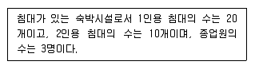
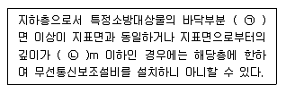
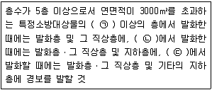

# 소방설비기사(전기분야)20170305(해설집) - 소방전기시설의 구조 및원리

> 원본: `소방설비기사(전기분야)20170305(해설집).pdf`
> 개인학습용 변환본.

## 61. 문제

61. 감지기의 설치기준 중 옳은 것은?
    ① 보상식 스포트형 감지기는 정온점이 감지기 주위의 평상 
시 최고 온도보다 20℃ 이상 높은 것으로 설치할 것
    ② 정온식 감지기는 주방ㆍ보일러실 등으로서 다량의 화기
를 취급하는 장소에 설치하되, 공칭작동온도가 최고주위
온도보다 30℃ 이상 높은 것으로 설치할 것
    ③ 스포트형 감지기는 15°이상 경사되지 아니하도록 부착할 
4과목 : 소방전기시설의 구조 및 원리

본 해설집은 최강 자격증 기출문제 전자문제집 CBT 해설달기 프로젝트에 의해서 만들어진 자료입니다. 해설을 제공해 주신 모든 분들께 감사 드립니다.
소방설비기사(전기분야)
◐2017년 03월 05일 필기 기출문제 및 해설집◑
전자문제집 CBT : www.comcbt.com
기출문제 해설은 최강 자격증 기출문제 전자문제집 CBT : www.comcbt.com 통해서 실시간으로 변경됩니다.
것
    ④ 공기관식 차동식분포형 감지기의 검출부는 45°이상 경사
되지 아니하도록 부착할 것
<문제 해설>

### 정답

1번

### 해설

정답은 1번입니다. 선택지의 핵심개념 을 확인하세요.

### 그림

## 62. 문제

62. 휴대용비상조명등의 설치기준 중 틀린 것은?
    ① 영화상영관에는 보행거리 50m 이내마다 3개이상 설치할 
것
    ② 지하상가 및 지하역사에는 보행거리 30m 이내마다 3개 
이상 설치할 것
    ③ 숙박시설 또는 다중이용업소에는 객실 또는 영업장안의 
구획된 실마다 잘 보이는 곳에 1개 이상 설치할 것
    ④ 건전지 및 충전식 밧데리의 용량은 20분 이상 유효하게 
사용할 수 있는 것으로 할 것
<문제 해설>
휴대용비상조명등
지하상가 및 지하역사에서 보행거리 25m마다 3개 이상 설치
[해설작성자 : 의정부소방관]

### 정답

1번

### 해설

정답은 1번입니다. 선택지의 핵심개념 을 확인하세요.

### 그림

## 63. 문제

63. 경사강하식 구조대의 구조 기준 중 틀린 것은?
    ① 손잡이는 출구 부근에 좌우 각 3개 이상 균일한 간격으
로 견고하게 부착하여야 한다.
    ② 입구틀 및 취부틀의 입구는 지름 30cm 이상의 구체가 
통과할 수 있어야 한다.
    ③ 구조대 본체의 활강부는 낙하방지를 위해 포를 2중구조
로 하거나 또는 망목의 변의 길이가 8cm 이하인 망을 
설치하여야 한다.
    ④ 구조대본체의 끝부분에는 길이 4m 이상, 지름4mm 이상
의 유도선을 부착하여야 하며, 유도선 끝에는 중량 
3N(300g) 이상의 모래주머니 등을 설치하여야 한다.
<문제 해설>
입구틀    고정틀의 입구는 지름 60cm 이상의 구체가 통과할 
수 있어야 합니다.
[해설작성자 : 모두에게 행운이]

### 정답

1번

### 해설

정답은 1번입니다. 선택지의 핵심개념 을 확인하세요.

### 그림

## 64. 문제

64. 전기사업자로부터 저압으로 수전하는 경우 비상전원설비로 
옳은 것은?
    ① 방화구획형
② 전용배전반(1ㆍ2종)
    ③ 큐비클형
④ 옥외개방형
<문제 해설>
특별고압 또는 고압으로 수전하는 경우 -> 일반전기사업자로부
터 특별고압 또는 고압으로 수전하는 비상전원 수전설비는 방화
구획형, 옥외개방형 또는 큐비클(Cubicle)형으로 하여야 한다.
저압으로 수전하는 경우 전기사업자로부터 저압으로 수전하는 
비상전원설비는 전용배전반 (1·2종)·전용분전반(1·2종)또는 공용
분전반(1·2종)으로 하여야 한다.
[해설작성자 : 일열심]

### 정답

1번

### 해설

정답은 1번입니다. 선택지의 핵심개념 을 확인하세요.

### 그림

## 65. 문제

65. 비상콘센트의 배치 기준 중 바닥면적이 1000m2미만인 층은 
계단의 출입구로부터 몇m 이내에 설치하여야 하는가?
    ① 1.5
② 5
    ③ 7
④ 10
<문제 해설>
비상콘센트설비 화재안전기준 제4조 전원 및 콘센트 등
비상콘센트는 아파트/바닥면적이 1,000m2 미만인 층은 계단의 
출입구로부터 5m 이내에 설치
[해설작성자 : BTC다람]

### 정답

1번

### 해설

정답은 1번입니다. 선택지의 핵심개념 을 확인하세요.

### 그림

## 66. 문제

66. 광원점등방식 피난유도선의 설치기준 중 틀린 것은?
    ① 피난유도 표시부는 50cm 이내의 간격으로 연속되도록 
설치하되 실내장식물 등으로 설치가 곤란할 경우 2m 이
내로 설치할 것
    ② 피난유도 표시부는 바닥으로부터 높이 1m 이하의 위치 
또는 바닥 면에 설치할 것
    ③ 피난유도 제어부는 조작 및 관리가 용이 하도록 바닥으
로부터 0.8m 이상 1.5m 이하의 높이에 설치할 것
    ④ 구획된 각 실로부터 주 출입구 또는 비상구까지 설치할 
것
<문제 해설>
피난유도 표시부는 50cm 이내의 간격으로 연속되도록 설치하되 
실내장식물 드응로 설치가 곤란할 경우 1m 이내로 설치 할것.
[해설작성자 : 해송]

### 정답

1번

### 해설

정답은 1번입니다. 선택지의 핵심개념 을 확인하세요.

### 그림

## 67. 문제

67. 자동화재속보설비의 속보기는 연동 또는 수동작동에 의한 
다이얼링 후 소방관서와 전화접속이 이루어지지 않는 경우
에는 최초 다이얼링을 포함하여 몇 회 이상 반복적으로 접
속을 위한 다이얼링이 이루어져야 하는가? (단, 이 경우 매
회 다이얼링 완료 후 호출은 30초 이상 지속한다.)
    ① 3회
② 5회
    ③ 10회
④ 20회
<문제 해설>
속보기는 연동 또는 수동 작동에 의한 다이얼링 후 소방관서와 
전화접속이 이루어지지 않는 경우에는
최초 다이얼링을 포함하여 10회 이상 반복접속 을 위한 다이얼
링이 이루어져야 한다
[해설작성자 : 낙양거사]

### 정답

1번

### 해설

정답은 1번입니다. 선택지의 핵심개념 을 확인하세요.

### 그림

## 68. 문제

68. 무선통신보조설비의 설치제외 기준 중 다음 ( )안에 알맞은 
것으로 연결된 것은?
    
    ① ㉠ 2, ㉡ 1
② ㉠ 2, ㉡ 2
    ③ ㉠ 3, ㉡ 1
④ ㉠ 3, ㉡ 2

본 해설집은 최강 자격증 기출문제 전자문제집 CBT 해설달기 프로젝트에 의해서 만들어진 자료입니다. 해설을 제공해 주신 모든 분들께 감사 드립니다.
소방설비기사(전기분야)
◐2017년 03월 05일 필기 기출문제 및 해설집◑
전자문제집 CBT : www.comcbt.com
기출문제 해설은 최강 자격증 기출문제 전자문제집 CBT : www.comcbt.com 통해서 실시간으로 변경됩니다.
<문제 해설>
무선통신보조설비의 화재안전기술기준(NFTC 505)

### 정답

1번

### 해설

정답은 1번입니다. 선택지의 핵심개념 을 확인하세요.

### 그림

## 69. 문제

69. 5~10회로까지 사용할 수 있는 누전경보기의 집합형 수신기 
내부결선도에서 그 구성요소가 아닌 것은?
    ① 제어부
    ② 조작부
    ③ 증폭부
    ④ 도통시험 및 동작시험부
<문제 해설>
- 집합형 수신기의 구성요소
자동입력전환부
증폭부
제어부
회로집합부
전원부
도통시험 및 동작시험부
동작회로표시부
[해설작성자 : 소방따자]
조작부는 직접 수동으로 조작해야 하는데 내부에 들어가 있으면 
수동으로 조작하지 못한다.
즉, 조작부는 내부가 아닌 외부에 있어야 함
[해설작성자 : 한번만봐달라니까]

### 정답

1번

### 해설

정답은 1번입니다. 선택지의 핵심개념 을 확인하세요.

## 70. 문제

70. 무선통신보조설비의 증폭기 전면에 주회로의 전원이 정상 
인지의 여부를 표시할 수 있도록 설치하는 것으로 옳은 것
은?
    ① 전력계 및 전류계
    ② 전류계 및 전압계
    ③ 표시등 및 전압계
    ④ 표시등 및 전력계
<문제 해설>
증폭기 전면에는 전압계, 표시등 설치
[해설작성자 : 미스터차차]

### 정답

1번

### 해설

정답은 1번입니다. 선택지의 핵심개념 을 확인하세요.

## 71. 문제

71. 피난기구의 설치개수 기준 중 틀린 것은?
    ① 설치한 피난기구 외에 아파트의 경우에는 하나의 관리주
체가 관리하는 아파트 구역마다 공기안전매트 1개 이상
을 추가로 설치할 것
    ② 휴양콘도미니엄을 제외한 숙박시설의 경우에는 추가로 
객실마다 완강기 또는 1개이상의 간이완강기를 설치할 
것
    ③ 층마다 설치하되, 숙박시설ㆍ노유자시설 및 의료시설로 
사용되는 층에 있어서는 그 층의 바닥면적 500m2 마다 
1개 이상 설치할 것
    ④ 층마다 설치하되, 위락시설ㆍ문화집회 및 운동시설ㆍ판
매시설로 사용되는 층 또는 복합용도의 층에 있어서는 
그 층은 바닥면적 800m2 마다 1개 이상 설치할 것
<문제 해설>
간이완강기는 둘 이상 설치 할것.

### 정답

1번

### 해설

정답은 1번입니다. 선택지의 핵심개념 을 확인하세요.

## 72. 문제

72. 비상콘센트설비의 전원회로의 설치기준 중 틀린 것은?
    ① 비상콘센트용 풀박스 등은 방청도장을 한 것으로서, 두
께 1.6mm 이상의 철판으로 할 것
    ② 하나의 전용회로에 설치하는 비상콘센트는 10개 이하로 
할 것
    ③ 콘센트마다 배선용 차단기(KS C 8321)를 설치하여야 하
며, 충전부가 노출되지 아니하도록 할 것
    ④ 전원회로는 단상교류 220V인 것으로서, 그 공급용량은 
3kVA 이상인 것으로 할 것
<문제 해설>
전원회로는 단상교류 220V인 것으로서, 그 공급용량은 1.5kVA 
이상인 것으로 할 것

### 정답

1번

### 해설

정답은 1번입니다. 선택지의 핵심개념 을 확인하세요.

## 73. 문제

73. 특정소방대상물의 그 부분에서 피난층에 이르는 부분의 비
상조명등을 60분 이상 유효하게 작동시킬 수 있는 용량으로 
하여야 하는 경우가 아닌 것은?
    ① 지하층을 제외한 층수가 11층 이상의 층
    ② 지하층 또는 무창층으로서 용도가 도매시장ㆍ소매시장
    ③ 지하층 또는 무창층으로서 용도가 여객자동차터미널ㆍ지
하역사 또는 지하상가
    ④ 지하가 터널로서 길이 500m 이상
<문제 해설>

### 정답

1번

### 해설

정답은 1번입니다. 선택지의 핵심개념 을 확인하세요.

## 74. 문제

74. 주요구조부를 내화구조로 한 특정소방대상물의 바닥면적이 
370m2인 부분에 설치해야 하는 감지기의 최소 수량은? (단, 
감지기의 부착높이는 바닥으로부터 4.5m 이고, 보상식 스포
트형 1종을 설치한다.)
    ① 6개
② 7개
    ③ 8개
④ 9개
<문제 해설>
보상식 1종 감지기 설치로 4m 이상 8m 미만 내화구조이므로,

본 해설집은 최강 자격증 기출문제 전자문제집 CBT 해설달기 프로젝트에 의해서 만들어진 자료입니다. 해설을 제공해 주신 모든 분들께 감사 드립니다.
소방설비기사(전기분야)
◐2017년 03월 05일 필기 기출문제 및 해설집◑
전자문제집 CBT : www.comcbt.com
기출문제 해설은 최강 자격증 기출문제 전자문제집 CBT : www.comcbt.com 통해서 실시간으로 변경됩니다.
370/45=8.2(9개)
[해설작성자 : 챠디]

### 정답

1번

### 해설

정답은 1번입니다. 선택지의 핵심개념 을 확인하세요.

### 그림

## 75. 문제

75. 자동화재탐지설비의 경계구역 설정 기준으로 옳은 것
은?(2021년 01월 15일 개정된 규정 적용됨)
    ① 하나의 경계구역이 3개 이상의 건축물에 미치지 아니하
도록 하여야 한다.
    ② 하나의 경계구역의 면적은 500m2 이하로 하고 한 변의 
길이는 60m 이하로 하여야 한다.
    ③ 500m2 이하의 범위안에서는 2개의 층을 하나의 경계구
역으로 할 수 있다
    ④ 특정소방대상물의 주된 출입구에서 그 내부 전체가 보이
는 것에 있어서는 한 변의 길이가 100m의 범위내에서 
1500m2 이하로 할 수 있다.
<문제 해설>
[2021년 01월 15일 개정된 규정]
제4조(경계구역)
① 자동화재탐지설비의 경계구역은 다음 각호의 기준에 따라 설
정하여야 한다..다만, 감지기의 형식승인 시 감지거리, 감지면적 
등에 대한 성능을 별도로 인정받은 경우에는 그 성능인정범위를 
경계구역으로 할 수 있다..

### 정답

1번

### 해설

정답은 1번입니다. 선택지의 핵심개념 을 확인하세요.

### 그림

## 76. 문제

76. 피난구유도등의 설치제외 기준 중 틀린 것은?
    ① 거실 각 부분으로부터 하나의 출입구에 이르는 보행거리
가 20m 이하이고 비상조명등과 유도표지가 설치된 거실
의 출입구
    ② 바닥면적이 500m2 미만인 층으로서 옥내로부터 직접 지
상으로 통하는 출입구(외부의 식별이 용이하지 않은 경
우에 한함)
    ③ 출입구가 3 이상 있는 거실로서 그 거실 각 부분으로부
터 하나의 출입구에 이르는 보행거리가 30m 이하인 경
우에는 주된 출입구 2개소외의 출입구 (유도표지가 부착
된 출입구)
    ④ 거실 각 부분으로부터 쉽게 도달할 수 있는 출입구
<문제 해설>
바닥면적이 1,000m2 미만인 층으로서 옥내로부터 직접 지상으
로 통하는 출입구(외부의 식별이 용이하지 않은 경우에 한함)
[해설작성자 : bsk6123]
외부의 식별이 용이한 경우에 한함이
설치 제외에 맞습니다
[해설작성자 : Dacku]

### 정답

1번

### 해설

정답은 1번입니다. 선택지의 핵심개념 을 확인하세요.

### 그림

## 77. 문제

77. 각 설비와 비상전원의 최소용량 연결이 틀린 것은?
    ① 비상콘센트 설비 - 20분 이상
    ② 제연설비 - 20분 이상
    ③ 비상경보설비 - 20분 이상
    ④ 무선통신보조설비의 증폭기 - 30분 이상
<문제 해설>

### 정답

1번

### 해설

정답은 1번입니다. 선택지의 핵심개념 을 확인하세요.

### 그림

## 78. 문제

78. 비상방송설비의 배선의 설치기준 중 부속회로의 전로와 대
지 사이 및 배선상호간의 절연저항은 1경계구역마다 직류 
250V의 절연저항측정기를 사용하여 측정한 절연저항이 몇 
MΩ 이상이 되도록 해야 하는가?
    ① 0.1
② 0.2
    ③ 10
④ 20
<문제 해설>
250V - 0.1
500V - 20
[해설작성자 : 우현아 힘내자]

### 정답

1번

### 해설

정답은 1번입니다. 선택지의 핵심개념 을 확인하세요.

### 그림

## 79. 문제

79. 감지기의 부착면과 실내 바닥과의 거리가 2.3m 이하인 곳
으로서 일시적으로 발생한 열ㆍ연기 또는 먼지 등으로 인하
여 화재신호를 발신할 우려가 있는 장소에 적응성이 있는 
감지기가 아닌 것은?
    ① 불꽃감지기
    ② 축적방식의 감지기
    ③ 정온식 감지선형 감지기
    ④ 광전식 스포트형 감지기
<문제 해설>
자동화재탐지설비 화재안전기준 제7조 감지기
지하층/무창층 등으로서 환기가 잘되지 아니하거나 실내면적이 
40m2 미만인 장소,
감지기의 부착면과 실내 바닥과의 거리가 2.3m 이하인 곳으로
서 일시적으로 발생한 열/연기/먼지 등으로 인하여 화재신호를 
발신할 우려가 있는 장소
: 불꽃/[정온식 감지선형/분포형/복합형]/광전식 분리형/아날로
그방식/다신호방식/축적방식
[해설작성자 : BTC다람]

### 정답

1번

### 해설

정답은 1번입니다. 선택지의 핵심개념 을 확인하세요.

### 그림

## 80. 문제

80. 비상방송설비의 음향장치의 설치기준 중 다음 ( )안에 알맞
은 것으로 연결된 것은?
    
    ① ㉠2층, ㉡1층, ㉢지하층
    ② ㉠1층, ㉡2층, ㉢지하층
    ③ ㉠2층, ㉡지하층, ㉢1층

본 해설집은 최강 자격증 기출문제 전자문제집 CBT 해설달기 프로젝트에 의해서 만들어진 자료입니다. 해설을 제공해 주신 모든 분들께 감사 드립니다.
소방설비기사(전기분야)
◐2017년 03월 05일 필기 기출문제 및 해설집◑
전자문제집 CBT : www.comcbt.com
기출문제 해설은 최강 자격증 기출문제 전자문제집 CBT : www.comcbt.com 통해서 실시간으로 변경됩니다.
    ④ ㉠2층, ㉡1층, ㉢모든 층
<문제 해설>
제8조(음향장치 및 시각경보장치) ① 자동화재탐지설비의 음향
장치는 다음 각 호의 기준에 따라 설치하여야 한다.

### 정답

1번

### 해설

정답은 1번입니다. 선택지의 핵심개념 을 확인하세요.

### 그림

