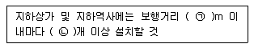
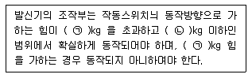
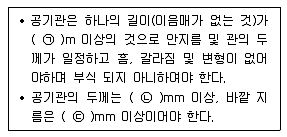

# 소방설비기사(전기분야)20170507(해설집) - 소방전기시설의 구조 및원리

> 원본: `소방설비기사(전기분야)20170507(해설집).pdf`
> 개인학습용 변환본.

## 61. 문제

61. 비상방송설비는 기동장치에 따른 화재신고를 수신한 후 필
요한 음량으로 화재발생 상황 및 피난에 유효한 방송이 자
동으로 개시될 때까지의 소요시간은 몇 초 이하로 하여야 
하는가?
    ① 5
② 10
    ③ 20
④ 30
<문제 해설>
방송개시소요 시간 - 10이하
[해설작성자 : 해송]

### 정답

1번

### 해설

정답은 1번입니다. 선택지의 핵심개념 을 확인하세요.

### 그림

## 62. 문제

62. 비상콘센트설비 전원회로의 설치기준 중 옳은 것은?
    ① 전원회로는 단상교류 220V 인 것으로서, 그 공급용량은 
3.0kVA이상인 것으로 할 것
    ② 비상콘센트용의 풀박스 등은 방청도장을 한 것으로, 두
께 2.0mm이상의 철판으로 할 것
    ③ 하나의 전용회로에 설치하는 비상콘센트는 8개 이하로 
할 것
    ④ 전원으로부터 각 층의 비상콘센트에 분기되는 경우에는 
분기배선용 차단기를 보호함안에 설치할 것
<문제 해설>
1번 1.5kva이상
2번 두께 1.6mm이상
3번 10개 이하
[해설작성자 : 구일오]

### 정답

1번

### 해설

정답은 1번입니다. 선택지의 핵심개념 을 확인하세요.

### 그림

## 63. 문제

63. 비상벨 설비 또는 자동사이렌설비의 지구 음향 장치는 특정
소방대상물의 층마다 설치하되, 음향장치까지의 수평거리가 
몇 m 이하가 되도록 하여야 하는가?
    ① 15
② 25
    ③ 40
④ 50
<문제 해설>
[비상방송설비 음향장치]
    (1) 층수 5층이상으로서 연면적 3000m2초과
    (2) 확성기 3w , 실내 1w 이상
    (3) 각 층마다 설치하되, 수평거리 25m 이하
    (4) 음량조정기 설치하는 경우 3선식
    (5) 다른 전기회로에 따라 유도장애가 생기지 않도록 한다.
    (6) 기동장치에 따른 화재신고를 수신한 후 필요한 음량으
로 화재발생 상황 및 피난에 유효한 방송이 자동적으로 개시될 
떄까지의 소요시간은 10초 이하
    (7) 다른 방송설비와 공용하는 것에 있어서는 화재 시 비상
경보 외의 방송을 차단 할 수 있는 구조
    (8) 증폭기 및 조작부는 수위실 등 상시 사람이 근무하는 
장소로서 점검이 편리하고 방화상 유효한 곳에 설치할 것
    (9) 음향장치는 자동화재속보설비의 작동과 연동하여 작동
할 수 있는 것
[해설작성자 : 해피준]

### 정답

1번

### 해설

정답은 1번입니다. 선택지의 핵심개념 을 확인하세요.

### 그림

## 64. 문제

64. 자동화재탐지설비 중계기에 예비전원을 사용하는 경우 구조 
및 기능 기준 중 다음 ( )안에 알맞은 것은?
    
    ① ㉠ 1.0, ㉡ 1.5
② ㉠ 1.0, ㉡ 1.75
    ③ ㉠ 1.6, ㉡ 1.5
④ ㉠ 1.6, ㉡ 1.75
<문제 해설>
방전종지전압이라 함은 알카리계 2차 축전지는 셀당 1.0 V의 상
태를, 리튬계 2차 축전지는 셀당 2.75 V의 상태를, 무보수밀폐
형연축전지는 단전지당 1.75 V의상태를 말한다.
[해설작성자 : 낙양거사]

### 정답

1번

### 해설

정답은 1번입니다. 선택지의 핵심개념 을 확인하세요.

### 그림

## 65. 문제

65. 비상콘센트설비의 화재안전기준에 따른 용어의 정의 중 옳
은 것은?(2021년 변경된 KEC 규정 적용됨)
    ① “저압”이란 직류는 1500V 이하, 교류는 1000V 이하인 
것을 말한다.
    ② “저압”이란 직류는 700V 이하, 교류는 600V 이하인 것
을 말한다.
    ③ “고압”이란 직류는 700V 를, 교류는 600V를 초과하는 
것을 말한다.
    ④ “특고압” 이란 8kV를 초과하는 것을 말한다.
<문제 해설>
산자부는 최근 저압 범위를 직류(DC) 750V, 교류(AC) 600V 이
하로 정의하던 것을 국제표준(IEC)에서 규정한 직류 1500V, 교
류 1000V 이하로 확대하는 내용의 전기사업법 시행규칙 개정안
을 확정했다..개정된 전압 체계는 3년의 유예기간을 거친 후 
2021년 1월 1일부터 시행한다
[해설작성자 : BTC다람]
2021년 개정된 KEC 규정
4과목 : 소방전기시설의 구조 및 원리

본 해설집은 최강 자격증 기출문제 전자문제집 CBT 해설달기 프로젝트에 의해서 만들어진 자료입니다. 해설을 제공해 주신 모든 분들께 감사 드립니다.
소방설비기사(전기분야)
◐2017년 05월 07일 필기 기출문제 및 해설집◑
전자문제집 CBT : www.comcbt.com
기출문제 해설은 최강 자격증 기출문제 전자문제집 CBT : www.comcbt.com 통해서 실시간으로 변경됩니다.
          AC(교류)                    DC(직류)
저         1kv이하                    1.5kv이하
고         1kv초과~7kv이하         1.5kv초과~7kv이하
특                                     7kv초과

### 정답

1번

### 해설

정답은 1번입니다. 선택지의 핵심개념 을 확인하세요.

### 그림

## 66. 문제

66. 자동화재속보설비 속보기의 기능 기준 중 옳은 것은?
    ① 작동신호를 수신하거나 수동으로 동작시키는 경우 10초 
이내에 소방관서에 자동적으로 신호를 발하여 통보하되, 
3회 이상 속도할 수 있어야 한다.
    ② 예비전원을 병렬로 접속하는 경우에는 역충전 방지 등의 
조치를 하여야 한다.
    ③ 예비전원은 감시상태를 30분간 지속한 후 10분은 이상 
동작이 지속될 수 있는 용량이어야한다.
    ④ 속보기는 연동 또는 수동 작동에 의한 다이얼링 후 소방
관서와 전화접속이 이루어지지 않는 경우에는 않는 경우
에는 최초 다이얼링을 포함하여 20회 이상 반복적으로 
접속을 위한 다이얼링이 이루어야 한다. 이 경우 매회 
지속되어야 한다.
<문제 해설>
1번 20초이내
3번 60분간 지속
4번 10회이상 반복적 접속
[해설작성자 : 구일오]

### 정답

1번

### 해설

정답은 1번입니다. 선택지의 핵심개념 을 확인하세요.

### 그림

## 67. 문제

67. 휴대용비상조명등의 설치 기준 중 다음 ( )안에 알맞은 것
은?
    
    ① ㉠ 25, ㉡ 1
② ㉠ 25, ㉡ 3
    ③ ㉠ 50, ㉡ 1
④ ㉠ 50, ㉡ 3
<문제 해설>
지하상가 및 지하역사 보행거리 25, 3개
영화상연관 보행거리 50, 3개
[해설작성자 : 미스터차차]
지하상가 및 지하역사의 보행거리 25m 이내마다    3개이상
대규모점포(백화점, 대형점, 쇼핑센터) 및 영화상영관의 보행거
리 50m 이내마다 3개이상
[해설작성자 : 안군이]

### 정답

1번

### 해설

정답은 1번입니다. 선택지의 핵심개념 을 확인하세요.

### 그림

## 68. 문제

68. 무선통신보조설비의 누설동축케이블 또는 동축케이블의 임
피던스는 몇 Ω으로 하여야 하는가?
    ① 5Ω
② 10Ω
    ③ 50Ω
④ 100Ω
<문제 해설>
① 무선통신보조설비의 누설동축케이블 등은 다음 각 호의 기준
에 따라 설치하여야 한다.

### 정답

1번

### 해설

정답은 1번입니다. 선택지의 핵심개념 을 확인하세요.

### 그림

## 69. 문제

69. 무선통신보조설비 증폭기 무선이동중계기를 설치하는 경우
의 설치기준으로 틀린 것은?
    ① 전원은 전기가 정상적으로 공급되는 축전지, 전지저장장
치 또는 교류전압 옥내간선으로 하고, 전원까지의 배선
은 전용으로 할 것
    ② 증폭기의 전면에는 주 회로의 전원이 정상인지의 여부를 
표시할 수 있는 표시등 및 전류계를 설치 할 것
    ③ 증폭기에는 비상전원이 부착된것으로 하고 해당 비상전
원 용량은 무선통신보조설비를 유효하게 30분 이상 작동
시킬 수 있는 것으로 할 것

본 해설집은 최강 자격증 기출문제 전자문제집 CBT 해설달기 프로젝트에 의해서 만들어진 자료입니다. 해설을 제공해 주신 모든 분들께 감사 드립니다.
소방설비기사(전기분야)
◐2017년 05월 07일 필기 기출문제 및 해설집◑
전자문제집 CBT : www.comcbt.com
기출문제 해설은 최강 자격증 기출문제 전자문제집 CBT : www.comcbt.com 통해서 실시간으로 변경됩니다.
    ④ 무선이동중계기를 설치하는 경우에는 「전파법」의 규정
에 따른 적합성평가를 받은 제품으로 설치할 것
<문제 해설>
증폭기의 전면에는 주 회로의 전원이 정상인지의 여부를 표시할 
수 있는 표시등 및 전압계를 설치 할 것
[해설작성자 : Ju]

### 정답

1번

### 해설

정답은 1번입니다. 선택지의 핵심개념 을 확인하세요.

### 그림

## 70. 문제

70. 피난설비의 설치면제 요건의 규정에 따라 옥상의 면적이 몇 
m2 이상이어야 그 옥상의 직하층 또는 직상층 (관람집회 및 
운동시설 또는 판매시설 제외) 그부분에 피난기구를 설치하
지 아니할 수 있는가? (단, 숙박시설[휴양콘도미니엄을 제
외]에 설치되는 완강기 및 간이완강기의 경우에 제외한다.)
    ① 500
② 800
    ③ 1000
④ 1500
<문제 해설>
피난설비 설치제외
다음 소방대상물 중 그 옥상의 직하층 또는 최상층
가. 주요구조부가 내화구조로 되어 있어야 할 것
나. 옥상의 면적이 1,500m2 이상이어야 할 것
다..옥상으로 쉽게 통할 수 있는 창 또는 출입구가 설치되어 있
어야 할 것
라. 옥상이 소방사다리차가 쉽게 통행할 수 있는 도로(폭 6m 이
상)
[해설작성자 : 낙양거사]
위 문제는 오류 신고가 접수된 문제입니다.
전자문제집 CBT에서 최신 해설을 확인하세요.

### 정답

1번

### 해설

정답은 1번입니다. 선택지의 핵심개념 을 확인하세요.

### 그림

## 71. 문제

71. 청각장애인용 시각정보장치의 설치기준 중 천장의 높이가 
2m 이하인 경우에는 천장으로 부터 m 이내의 장소에 설치
하여야 하는가?
    ① 0.15
② 0.3
    ③ 0.5
④ 0.7
<문제 해설>
청각장애인용 시각정보장치의 설치기준
- 설치 높이 : 2m 이상 2.5m 이하
#단, 천장 높이가 2m이하인 경우 0.15 이내의 장소에 설치
[해설작성자 : 해송]

### 정답

1번

### 해설

정답은 1번입니다. 선택지의 핵심개념 을 확인하세요.

### 그림

## 72. 문제

72. 주요구조부가 내화구조인 특정소방대상물에 자동화재탐지설
비의 감지기를 열전대식 차동식분포형으로 설치하려고 한
다. 바닥면적이 256m2일 경우 열전대부와 검출부는 각각 최
소 몇 개 이상으로 설치하여야 하는가?
    ① 열전대부 11개, 검출부 1개
    ② 열전대부 12개, 검출부 1개
    ③ 열전대부 11개, 검출부 2개
    ④ 열전대부 12개, 검출부 2개
<문제 해설>
열전대식 감지기의 설치기준
내화구조: 22(바닥면적)
기타구조: 18(바닥면적)
256/22 = 11.636    ===> 반올림 12개
하나의 검출부에 접속하는 열전대부는 4~20개 이므로 검출부는 
1개
[해설작성자 : hanjjcc]
[위 해설에 대한 오류신고]
소숫점 이하는 반올림이 아니라 절상(무조건 올림)입니다.

### 정답

1번

### 해설

정답은 1번입니다. 선택지의 핵심개념 을 확인하세요.

### 그림

## 73. 문제

73. 자동화재탐지설비 발신기의 작동기능 기준 중 다음 ( )안에 
알맞은 것은? (단, 이 경우 누름판이 있는 구조로서 손끝으
로 눌러 작동하는 방식의 작동스위치는 누름판을 포함한다.)
    
    ① ㉠ 2, ㉡ 8
② ㉠ 3, ㉡ 7
    ③ ㉠ 2, ㉡ 7
④ ㉠ 3, ㉡ 8
<문제 해설>
[발신기의 형식승인 및 제품검사의 기술기준]
제4조의2(발신기의 작동기능)

### 정답

1번

### 해설

정답은 1번입니다. 선택지의 핵심개념 을 확인하세요.

### 그림

## 74. 문제

74. 객석 통로의 직선부분의 길이가 25m 안 영화관의 통로에 
객석유도등을 설치하는 경우 최소 설치 개수는?
    ① 5
② 6
    ③ 7
④ 8
<문제 해설>
객석유동은 (25/4)-1 = 5.2 절상6

### 정답

1번

### 해설

정답은 1번입니다. 선택지의 핵심개념 을 확인하세요.

### 그림

## 75. 문제

75. 공기관식 차동식분포형 감지기의 구조 및 기능 기준 중 다
음 ( ) 안에 알맞은 것은?
    
    ① ㉠ 10, ㉡ 0.5, ㉢ 1.5
    ② ㉠ 20, ㉡ 0.3, ㉢ 1.9
    ③ ㉠ 10, ㉡ 0.3, ㉢ 1.9
    ④ ㉠ 20, ㉡ 0.5, ㉢ 1.5
<문제 해설>
공기관식 감지기의 구조 및 기능
공기관은 하나의 길이가 20m 이상
공기관의 두께 0.3mm 이상 바깥지름은 1.9mm 이상

본 해설집은 최강 자격증 기출문제 전자문제집 CBT 해설달기 프로젝트에 의해서 만들어진 자료입니다. 해설을 제공해 주신 모든 분들께 감사 드립니다.
소방설비기사(전기분야)
◐2017년 05월 07일 필기 기출문제 및 해설집◑
전자문제집 CBT : www.comcbt.com
기출문제 해설은 최강 자격증 기출문제 전자문제집 CBT : www.comcbt.com 통해서 실시간으로 변경됩니다.
리크저항,접점수고를 쉽게 시험할 수 있다.
[해설작성자 : 치악산호랑이]

### 정답

1번

### 해설

정답은 1번입니다. 선택지의 핵심개념 을 확인하세요.

### 그림

## 76. 문제

76. 광전식분리형감지기의 설치기준 중 광축은 나란한 벽으로부
터 몇 m 이상 이격하여 설치하여야 하는가?
    ① 0.6
② 0.8
    ③ 1
④ 1.5
<문제 해설>
감지기 수광부,송광부 : 1미터
광축 : 0.6미터
[해설작성자 : 자격증중독자]

### 정답

1번

### 해설

정답은 1번입니다. 선택지의 핵심개념 을 확인하세요.

## 77. 문제

77. 근린생활시설 중 입원실이 있는 의원 지하층에 적응성을 가
진 피난기구는?
    ① 피난용트랩
② 피난사다리
    ③ 피난교
④ 구조대
<문제 해설>
의료시설,노유자시설-지하층:피난용트랩
숙박시설의 3층이상:간이완강기 및 피난밧줄
아파트:공기안전매트
[해설작성자 : comcbt.com 이용자]
위 문제는 오류 신고가 접수된 문제입니다.
전자문제집 CBT에서 최신 해설을 확인하세요.

### 정답

1번

### 해설

정답은 1번입니다. 선택지의 핵심개념 을 확인하세요.

## 78. 문제

78. 누전경보기 부품의 구조 및 기능 기준 중 누전경보기에 변
압기를 사용하는 경우 변압기의 정격 1차 전압은 몇 V 이하
로 하는가?
    ① 100
② 200
    ③ 300
④ 400
<문제 해설>
변압기1차전압:300v / 경계전로전압 : 600v
[해설작성자 : 죽향]

### 정답

1번

### 해설

정답은 1번입니다. 선택지의 핵심개념 을 확인하세요.

## 79. 문제

79. 누전경보기 수신부의 구조 기준 중 틀린 것은?
    ① 2급 수신부에는 전원 입력측의 회로에 단락이 생기는 경
우에 유효하게 보호되는 조치를 강구하여야 한다.
    ② 주전원의 양극을 동시에 개폐할 수 있는 전원스위치를 
설치하여야 한다. 다만, 보수시에 전원공급이 자동적으로 
중단되는 방식은 궂이 아니하다.
    ③ 감도조정장치를 제외하고 감도조정부는 외함의 바깥쪽에 
노출되지 아니 하여야 한다.
    ④ 전원입력측의 양건 (1회선용은 1선 이상) 및 외부부하에 
집적 전원을 소출하도록 구성된 회로에는 퓨즈 또는 브
레이커 등을 설치하여야 한다.
<문제 해설>
전원 입력측의 회로에 단락이 생기는 경우에 유효하게 보호되는 
조치를 강구하여야 한다.(2급 수신부 제외)
[해설작성자 : Ju]

### 정답

1번

### 해설

정답은 1번입니다. 선택지의 핵심개념 을 확인하세요.

## 80. 문제

80. 발신기의 외함을 합성수지를 사용하는 경우 외함의 최소 두
께는 몇 mm 이상이어야 하는가?
    ① 5
② 3
    ③ 1.6
④ 1.2
<문제 해설>
강판 외함 1.2mm 외함(벽 속 매립 1.6),    합성수지 외함 
3mm(벽 속 매립 4mm)
[해설작성자 : 치악산호랑이]
본 해설집의 저작권은 www.comcbt.com에 있으며
카페, 블로그 등의 업로드 및 개인적 활용 이외에
문서의 수정 및 DB 저장, 기타 금전적 이익을 취하는
일체의 행위를 금지 합니다.
전자문제집 CBT 홈페이지 : www.comcbt.com
기출문제 및 해설집 다운로드 : www.comcbt.com/xe
전자문제집 CBT 앱(구글플레이) : [다운로드]
전자문제집 CBT란?
인터넷으로 종이 없이 문제를 풀고 자동채점하는 프로그램으로 
워드, 컴활, 기능사 등의 상설검정에서 사용하는 실제 프로그램 
방식입니다.
해설을 제공하며 PC 버전 및 모바일 버전 완벽 연동
교사용/학생용 관리기능도 제공합니다.
오답 및 오탈자가 수정된 최신 자료와 해설은 전자문제집 CBT 
에서 확인하세요.
1
2
3
4
5
6
7
8
9
10
③
④
②
③
④
③
①
②
②
③
11
12
13
14
15
16
17
18
19
20
②
①
③
④
④
①
④
①
④
①
21
22
23
24
25
26
27
28
29
30
①
②
③
②
①
①
②
③
④
②
31
32
33
34
35
36
37
38
39
40
①
②
③
④
①
①
④
④
②
③
41
42
43
44
45
46
47
48
49
50
②
③
①
①
②
②
①
①
④
④
51
52
53
54
55
56
57
58
59
60
②
③
③
②
②
③
③
②
④
②
61
62
63
64
65
66
67
68
69
70
②
④
②
②
①
②
②
③
②
④
71
72
73
74
75
76
77
78
79
80
①
②
①
②
②
①
①
③
①
②

### 정답

1번

### 해설

정답은 1번입니다. 선택지의 핵심개념 을 확인하세요.
