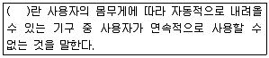
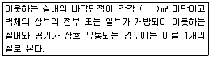
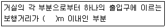

# 소방설비기사(전기분야)20170923(교사용) - 소방전기시설의 구조 및원리

> 원본: `소방설비기사(전기분야)20170923(교사용).pdf`
> 개인학습용 변환본.

## 61. 문제

61. 자동화재속보설비를 설치하여야 하는 특정소방 대상물의 기
준 중 다음 ( ) 안에 알맞은 것은?
    
    ① 300
❷ 500
    ③ 1000
④ 1500

### 정답

1번

### 해설

정답은 1번입니다. 선택지의 핵심개념 을 확인하세요.

### 그림

## 62. 문제

62. 무선통신보조설비 무선기기 접속단자의 설치기준 중 다음 ( 
) 안에 알맞은 것은?
    
    ① ㉠ 500, ㉡ 5
② ㉠ 500, ㉡ 3
    ❸ ㉠ 300, ㉡ 5
④ ㉠ 300, ㉡ 3

### 정답

1번

### 해설

정답은 1번입니다. 선택지의 핵심개념 을 확인하세요.

### 그림

## 63. 문제

63. 객석유도등을 설치하여야 하는 특정소방 대상물의 대상으로 
옳은 것은?
    ① 운수시설
❷ 운동시설
    ③ 의료시설
④ 근린생활시설

### 정답

1번

### 해설

정답은 1번입니다. 선택지의 핵심개념 을 확인하세요.

### 그림

## 64. 문제

64. 누전경보기의 구성요소에 해당하지 않는 것은?
    ① 차단기
② 영상변류기(ZCT)
    ③ 음향장치
❹ 발신기

### 정답

1번

### 해설

정답은 1번입니다. 선택지의 핵심개념 을 확인하세요.

### 그림

## 65. 문제

65. 자동화재탐지설비 수신기의 설치기준 중 다음 ( ) 안에 알맞
은 것은?(관련 규정 개정전 문제로 여기서는 기존 정답인 2
번을 누르면 정답 처리됩니다. 자세한 내용은 해설을 참고
하세요.)
    
4과목 : 소방전기시설의 구조 및 원리

소방설비기사(전기분야)
◐2017년 09월 23일 필기 기출문제 ◑
전자문제집 CBT : www.comcbt.com
최강 자격증 기출문제 전자문제집 CBT : www.comcbt.com
    ① 2
❷ 4
    ③ 6
④ 11

### 정답

1번

### 해설

정답은 1번입니다. 선택지의 핵심개념 을 확인하세요.

### 그림

## 66. 문제

66. 피난기구 용어의 정의 중 다음 ( ) 안에 알맞은 것은?
    
    ❶ 간이완강기
② 공기안전매트
    ③ 완강기
④ 승강식 피난기

### 정답

1번

### 해설

정답은 1번입니다. 선택지의 핵심개념 을 확인하세요.

### 그림

## 67. 문제

67. 무선통신보조설비를 설치하여야 하는 특정소방 대상물의 기
준 중 옳은 것은? (단, 위험물 저장 및 처리 시설 중 가스시
설은 제외한다.)
    ① 지하가(터널은 제외)로서 연면적 500m2 이상인 것
    ② 지하가 중 터널로서 길이가 1000m 이상인 것
    ③ 층수가 30층 이상인 것으로서 15층 이상 부분의 모든 
층
    ❹ 지하층의 층수가 3층 이상이고 지하층의 바닥면적의 합
계가 1000m2 이상인 것은 지하층의 모든 층

### 정답

1번

### 해설

정답은 1번입니다. 선택지의 핵심개념 을 확인하세요.

### 그림

## 68. 문제

68. 피난기구의 종류가 아닌 것은?
    ① 미끄럼대
❷ 공기호흡기
    ③ 승강식피난기
④ 공기안전매트

### 정답

1번

### 해설

정답은 1번입니다. 선택지의 핵심개념 을 확인하세요.

### 그림

## 69. 문제

69. 누전경보기의 전원은 배선용 차단기에 있어서는 몇 A 이하
의 것으로 각 극을 개폐할 수 있는 것을 설치하여야 하는
가?
    ① 10
② 15
    ❸ 20
④ 30

### 정답

1번

### 해설

정답은 1번입니다. 선택지의 핵심개념 을 확인하세요.

### 그림

## 70. 문제

70. 자동화재탐지설비 배선의 설치기준 중 틀린 것은?
    ① 감지기 사이의 회로의 배선은 송배전식으로 할 것
    ② 감지기회로의 도통시험을 위한 종단저항은 전용함을 설
치하는 경우 그 설치 높이는 바닥으로부터 1.5m 이내로 
할 것
    ③ 감지기회로 및 부속회로의 전로와 대지 사이 및 배선 상
호간의 절연저항은 1경계구역마다 직류 250V의 절연저
항측정기를 사용하여 측정한 절연저항이 0.1MΩ 이상이 
되도록 할 것
    ❹ 피(P) 형 수신기 및 지피(G.P.)형 수신기의 감지기 회로
의 배선에 있어서 하나의 공통선에 접속할 수 있는 경계
구역은 9개 이하로 할 것

### 정답

1번

### 해설

정답은 1번입니다. 선택지의 핵심개념 을 확인하세요.

### 그림

## 71. 문제

71. 비상경보설비를 설치하여야 할 특정소방 대상물의 기준 중 
옳은 것은? (단, 지하구, 모래·석재 등 불연재료 창고 및 위
험물 저장·처리 시설 중 가스시설은 제외한다.)
    ❶ 지하층 또는 무창층의 바닥면적이 150m2 (공연장의 경
우 100m2) 이상인 것
    ② 연면적 500m2(지하가 중 터널 또는 사람이 거주하지 않
거나 벽이 없는 축사 등 동·식물 관련시설은 제외) 이상
인 것
    ③ 30명 이상의 근로자가 작업하는 옥내 작업장
    ④ 지하가 중 터널로서 길이가 1000m 이상인 것

### 정답

1번

### 해설

정답은 1번입니다. 선택지의 핵심개념 을 확인하세요.

### 그림

## 72. 문제

72. 단독경보형감지 기를 설치하여 야 하는 특정소방 대상물의 
기준 중 옳은 것은?
    ❶ 연면 적 1000m2 미만의 아파트 등
    ② 연면 적 2000m2 미만의 기숙사
    ③ 교육연구시설 또는 수련시설 내에 있는 합숙소 또는 기
숙사로서 연면적 1000m2 미만인 것
    ④ 연면적 1000m2 미만의 숙박시설

### 정답

1번

### 해설

정답은 1번입니다. 선택지의 핵심개념 을 확인하세요.

### 그림

## 73. 문제

73. 비상방송설비의 설치기준 중 기동장치에 따른 화재신고를 
수신한 후 필요한 음량으로 화재 발생 상황 및 피난에 유효
한 방송이 자동으로 개시될 때까지의 소요시간은 몇 초 이
하로 하여야 하는가?
    ❶ 10
② 15
    ③ 20
④ 25

### 정답

1번

### 해설

정답은 1번입니다. 선택지의 핵심개념 을 확인하세요.

### 그림

## 74. 문제

74. 비상방송설비를 설치하여야 하는 특정소방 대상물의 기준 
중 틀린 것은? (단, 위험물 저장 및 처리 시설 중 가스시설, 
사람이 거주하지 않는 동물 및 식물 관련 시설, 지하가 중 
터널, 축사 및 지하구는 제외한다.)
    ① 연면적 3500m2 이상인 것
    ② 지하층을 제외한 층수가 11층 이상인 것
    ③ 지하층의 층수가 3층 이상인 것
    ❹ 50명 이상의 근로자가 작업하는 옥내 작업장

### 정답

1번

### 해설

정답은 1번입니다. 선택지의 핵심개념 을 확인하세요.

### 그림

## 75. 문제

75. 지하층·무창층 등으로서 환기가 잘되지 아니하거나 실내면
적 이 40m2 미만인 장소에 설치하여야 하는 적응성이 있는 
감지기가 아닌 것은?
    ❶ 정온식스포트형감지기    ② 불꽃감지기
    ③ 광전식분리형감지기      ④ 아날로그방식의 감지기

### 정답

1번

### 해설

정답은 1번입니다. 선택지의 핵심개념 을 확인하세요.

### 그림

## 76. 문제

76. 단독경보형감지기의 설치기준 중 다음 ( ) 안에 알맞은 것
은?
    
    ❶ 30
② 50
    ③ 100
④ 150

### 정답

1번

### 해설

정답은 1번입니다. 선택지의 핵심개념 을 확인하세요.

### 그림

## 77. 문제

77. 비상콘센트설비의 전원부와 외함사이의 절연저항은 전원부
와 외함사이를 500V 절연저항계로 측정할 때 몇 MΩ 이상
이어야 하는가?
    ① 10
② 15
    ❸ 20
④ 25

### 정답

1번

### 해설

정답은 1번입니다. 선택지의 핵심개념 을 확인하세요.

### 그림

## 78. 문제

78. 비상콘센트설비를 설치하여야 하는 특정소방 대상물의 기준
으로 옳은 것은? (단, 위험물 저장 및 처리시설 중 가스시설 
또는 지하구는 제외한다.)
    ① 지하가(터널은 제외)로서 연면적 1000m2 이상인 것
    ❷ 층수가 11층 이상인 특정소방대상물의 경우에는 11층 
이상의 층
    ③ 지하층의 층수가 3층 이상이고 지하층의 바닥면적의 합
계가 1500m2 이상인 것은 지하층의 모든 층
    ④ 창고시설 중 물류터미널로서 해당 용도로 사용되는 부분
의 바닥면적의 합계가 1000m 이상인 것

### 정답

1번

### 해설

정답은 1번입니다. 선택지의 핵심개념 을 확인하세요.

### 그림

## 79. 문제

79. 비상조명등의 설치제외 기준 중 다음 ( ) 안에 알맞은 것은?

소방설비기사(전기분야)
◐2017년 09월 23일 필기 기출문제 ◑
전자문제집 CBT : www.comcbt.com
최강 자격증 기출문제 전자문제집 CBT : www.comcbt.com
    
    ① 2
② 5
    ❸ 15
④ 25

### 정답

1번

### 해설

정답은 1번입니다. 선택지의 핵심개념 을 확인하세요.

### 그림

## 80. 문제

80. 자동화재탐지설비 수신기의 구조기준 중 정격전압이 몇 V를 
넘는 기구의 금속제 외함에는 접지단자를 설치하여야 하는
가?
    ① 30
❷ 60
    ③ 100
④ 300
전자문제집 CBT 홈페이지 : www.comcbt.com
기출문제 및 해설집 다운로드  : www.comcbt.com/xe
전자문제집 CBT 앱(구글플레이) : [다운로드]
전자문제집 CBT란?
종이 문제집이 아닌 인터넷으로 문제를 풀고 자동으로 채점하며 
모의고사, 오답 노트, 해설까지 제공하는 무료 기출문제 학습 프
로그램으로 실제 시험에서 사용하는 OMR 형식의 CBT를 제공합
니다.
PC 버전 및 모바일 버전 완벽 연동
교사용/학생용 관리기능도 제공합니다.
오답 및 오탈자가 수정된 최신 자료와 해설은 전자문제집 CBT 
에서 확인하세요.
1
2
3
4
5
6
7
8
9
10
②
④
①
③
③
④
③
①
②
①
11
12
13
14
15
16
17
18
19
20
②
③
②
①
④
②
②
③
①
④
21
22
23
24
25
26
27
28
29
30
④
④
②
②
①
②
②
①
④
④
31
32
33
34
35
36
37
38
39
40
③
②
④
③
①
①
②
①
③
③
41
42
43
44
45
46
47
48
49
50
④
②
①
②
④
②
④
①
②
①
51
52
53
54
55
56
57
58
59
60
④
③
④
③
④
①
③
③
①
②
61
62
63
64
65
66
67
68
69
70
②
③
②
④
②
①
④
②
③
④
71
72
73
74
75
76
77
78
79
80
①
①
①
④
①
①
③
②
③
②

### 정답

1번

### 해설

정답은 1번입니다. 선택지의 핵심개념 을 확인하세요.

### 그림

