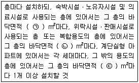
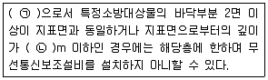
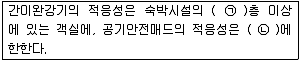
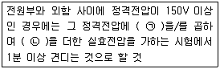
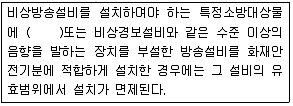

# 소방설비기사(전기분야)20180304(교사용) - 소방전기시설의 구조 및원리

> 원본: `소방설비기사(전기분야)20180304(교사용).pdf`
> 개인학습용 변환본.

## 61. 문제

61. 누전경보기를 설치하여야 하는 특정소방 대상물의 기준 중 
다음 ( ) 안에 알맞은 것은? (단, 위험물 저장 및 처리 시설 
중 가스시설, 지하가 중 터널 또는 지하구의 경우는 제외한
다.)
    
    ① 60
❷ 100
    ③ 200
④ 300

### 정답

1번

### 해설

정답은 1번입니다. 선택지의 핵심개념 을 확인하세요.

### 그림

## 62. 문제

62. 복도통로유도등의 식별도 기준 중 다음 ( ) 안에 알맞은 것
은?
    
    ① ㉠ 15, ㉡ 20
❷ ㉠ 20, ㉡ 15
    ③ ㉠ 30, ㉡ 20
④ ㉠ 20, ㉡ 30

### 정답

1번

### 해설

정답은 1번입니다. 선택지의 핵심개념 을 확인하세요.

### 그림

## 63. 문제

63. 지하층을 제외한 층수가 7층 이상으로서 연면적이 2000 
m2 이상이거나 지하층의 바닥면적의 합계가 3000 m2 이상
인 특정소방대상물의 비상콘센트 설비에 설치하여야 할 비
상전원의 종류가 아닌 것은?(관련 규정 개정전 문제로 여기
서는 기존 정답인 4번을 누르면 정답 처리됩니다. 자세한 
내용은 해설을 참고하세요.)
    ① 비상전원수전설비
② 자가발전설비
    ③ 전기저장장치
❹ 축전지설비

### 정답

1번

### 해설

정답은 1번입니다. 선택지의 핵심개념 을 확인하세요.

### 그림

## 64. 문제

64. 수신기의 구조 및 일반기능에 대한 설명 중 틀린 것은? (단, 
간이형수신기는 제외한다.)
    ① 수신기(1회선용은 제외한다)는 2회선이 동시에 작동하여
도 화재표시가 되어야 하며, 감지기의 감지 또는 발신기
의 발신개시로부터 P형, P형복합식, GP형, GP형복합식, 
R형, R형복합식 수신기의 수신완료까지의 소요시간은 5
초(축적형의 경우에는 60초)이내이어야 한다.
    ❷ 수신기의 외부배선 연결용 단자에 있어서 공통신호선용 
단자는 10개 회로마다 1개 이상 설치하여야 한다.
    ③ 화재신호를 수신하는 경우 P형, P형복합식, GP형, GP형
복합식, R형, R형복합식, GR형 또는 GR형복합식의 수신
기에 있어서는 2이상의 지구표시장치에 의하여 각각 화
재를 표시할 수 있어야 한다.
    ④ 정격전압이 60V를 넘는 기구의 급속제 외함에는 접지단
자를 설치하여야 한다.

### 정답

1번

### 해설

정답은 1번입니다. 선택지의 핵심개념 을 확인하세요.

### 그림

## 65. 문제

65. 비상벨설비 또는 자동식사이렌설비의 설치기준 중 틀린 것
은?
    ① 전원은 전기가 정상적으로 공급되는 축전지, 전기저장장
치 또는 교류전압의 옥내 간선으로 하고, 전원까지의 배
선은 전용으로 설치하여야 한다.
    ② 비상벨설비 또는 자동식사이렌설비에는 그 설비에 대한 
감시상태를 60분간 지속한 후 유효하게 10분 이상 경보
할 수 있는 축전지 설비(수신기에 내장하는 경우를 포함) 
또는 전기저장장치를 설치하여야 한다.
    ③ 특정소방대상물의 층마다 설치하되, 해당 특정소방대상
물의 각 부분으로부터 하나의 발신기까지의 수평거리가 
25m 이하가 되도록 할 것. 다만, 복도 또는 별도로 구획
된 실로서 보행거리가 40m 이상일 경우에는 추가로 설
치하여야 한다.
    ❹ 발신기의 위치표시등은 함의 상부에 설치하되, 그 불빛
은 부착 면으로부터 45° 이상의 범위 안에서 부착지점으
로부터 10m 이내의 어느 곳에서도 쉽게 식별할 수 있는 
적색등으로 설치하여야 한다.

### 정답

1번

### 해설

정답은 1번입니다. 선택지의 핵심개념 을 확인하세요.

### 그림

## 66. 문제

66. 비상방송설비 음향장치의 설치기준 중 옳은 것은?
    ① 확성기는 각층마다 설치하되, 그 층의 각 부분으로부터 
하나의 확성기까지의 수평거리가 15m 이하가 되도록 하
고, 해당층의 각 부분에 유효하게 경보를 발할 수 있도
록 설치할 것
    ② 층수가 5층 이상으로서 연면적이 3000 m2를 초과하는 
특정소방대상물의 지하층에서 발화한 때에는 직상층에만 
경보를 발할 것
    ❸ 음향장치는 자동화재탐지설비의 작동과 연동하여 작동할 
수 있는 것으로 할 것
    ④ 음향장치는 정격전압의 60% 전압에서 음향을 발할 수 
있는 것으로 할 것

### 정답

1번

### 해설

정답은 1번입니다. 선택지의 핵심개념 을 확인하세요.

### 그림

## 67. 문제

67. 자동화재속보설비 속보기의 기능에 대한 기준 중 틀린 것
은?
    ❶ 작동신호를 수신하거나 수동으로 동작시키는 경우 30초 
이내에 소방관서에 자동적으로 신호를 발하여 통보하되, 
3회 이상 속보할 수 있어야 한다.
4과목 : 소방전기시설의 구조 및 원리

소방설비기사(전기분야)
◐2018년 03월 04일 필기 기출문제 ◑
전자문제집 CBT : www.comcbt.com
최강 자격증 기출문제 전자문제집 CBT : www.comcbt.com
    ② 예비전원을 병렬로 접속하는 경우에는 역충전 방지 등의 
조치를 하여야 한다.
    ③ 연동 또는 수동으로 소방관서에 화재발생 음성정보를 속
보중인 경우에도 송수화장치를 이용한 통화가 우선적으
로 가능하여야 한다.
    ④ 속보기의 송수화장치가 정상위치가 아닌 경우에도 연동 
또는 수동으로 속보가 가능하여야 한다.

### 정답

1번

### 해설

정답은 1번입니다. 선택지의 핵심개념 을 확인하세요.

### 그림

## 68. 문제

68. 피난기구 설치 개수의 기준 중 다음 ( ) 안에 알맞은 것은?
    
    ① ㉠ 300, ㉡ 500, ㉢ 1000
    ❷ ㉠ 500, ㉡ 800, ㉢ 1000
    ③ ㉠ 300, ㉡ 500, ㉢ 1500
    ④ ㉠ 500, ㉡ 800, ㉢ 1500

### 정답

1번

### 해설

정답은 1번입니다. 선택지의 핵심개념 을 확인하세요.

### 그림

## 69. 문제

69. 비상조명등의 비상전원은 지하층 또는 무창층으로서 용도가 
도매시장ㆍ소매시장ㆍ여객자동차터미널ㆍ지하역사 또는 지
하상가인 경우 그 부분에서 피난층에 이르는 부분의 비상조
명등을 몇 분 이상 유효하게 작동시킬수 있는 용량으로 하
여야 하는가?
    ① 10
② 20
    ③ 30
❹ 60

### 정답

1번

### 해설

정답은 1번입니다. 선택지의 핵심개념 을 확인하세요.

### 그림

## 70. 문제

70. 무선통신보조설비를 설치하지 아니할 수 있는 기준 중 다음 
( ) 안에 알맞은 것은?
    
    ❶ ㉠ 지하층, ㉡ 1
② ㉠ 지하층, ㉡ 2
    ③ ㉠ 무창층, ㉡ 1
④ ㉠ 무창층, ㉡ 2

### 정답

1번

### 해설

정답은 1번입니다. 선택지의 핵심개념 을 확인하세요.

### 그림

## 71. 문제

71. 일시적으로 발생한 열ㆍ연기 또는 먼지 등으로 인하여 화재
신호를 발신할 우려가 있는 장소의 설치장소별 감지기 적응
성 기준 중 항공기 격납고, 높은 천장의 창고 등 감지기 부
착 높이가 8m 이상의 장소에 적응성을 갖는 감지기가 아닌 
것은? (단, 연기감지기를 설치할 수 있는 장소이며, 설치장
소는 넓은 공간으로 천장이 높아 열 및 연기가 확산하는 환
경상태이다.)
    ❶ 광전식 스포트형 감지기    ② 차동식 분포형 감지기
    ③ 광전식 분리형 감지기      ④ 불꽃감지기

### 정답

1번

### 해설

정답은 1번입니다. 선택지의 핵심개념 을 확인하세요.

### 그림

## 72. 문제

72. 비상벨설비 음향장치의 음량은 부착된 음향장치의 중심으로
부터 1m 떨어진 위치에서 몇 dB 이상이 되는 것으로 하여
야 하는가?
    ❶ 90
② 80
    ③ 70
④ 60

### 정답

1번

### 해설

정답은 1번입니다. 선택지의 핵심개념 을 확인하세요.

### 그림

## 73. 문제

73. 소방대상물의 설치장소별 피난기구의 적응성 기준 중 다음 
( ) 안에 알맞은 것은?
    
    ❶ ㉠ 3, ㉡ 공동주택
② ㉠ 4, ㉡ 공동주택
    ③ ㉠ 3, ㉡ 단독주택
④ ㉠ 4, ㉡ 단독주택

### 정답

1번

### 해설

정답은 1번입니다. 선택지의 핵심개념 을 확인하세요.

### 그림

## 74. 문제

74. 승강식피난기 및 하향식 피난구용 내림식 사다리의 설치기
준 중 틀린 것은?(관련 규정 개정전 문제로 여기서는 기존 
정답인 2번을 누르면 정답 처리됩니다. 자세한 내용은 해설
을 참고하세요.)
    ① 착지점과 하강구는 상호 수평거리 15cm 이상의 간격을 
두어야 한다.
    ❷ 대피실 출입문이 개방되거나, 피난기구 작동시 해당층 
및 직상층 거실에 설치된 표시등 및 경보장치가 작동되
고, 잠시 제어반에서는 피난기구의 작동을 확인 할 수 
있어야 한다.
    ③ 하강구 내측에는 기구의 연결 금속구 등이 없어야 하며 
전개된 피난기구는 하강구 수평투영면적 공간 내의 범위
를 침범하지 않는 구조이어야 할 것. 단, 직경 60cm 크
기의 범위를 벗어난 경우이거나, 직하층의 바닥 면으로
부터 높이 50cm 이하의 범위는 제외한다.
    ④ 대피실 내에는 비상조명등을 설치하여야 한다.

### 정답

1번

### 해설

정답은 1번입니다. 선택지의 핵심개념 을 확인하세요.

### 그림

## 75. 문제

75. 비상콘센트설비의 전원부와 외함 사이의 절연 내력 기준 중 
다음 ( ) 안에 알맞은 것은?
    
    ① ㉠ 2, ㉡ 1500
② ㉠ 3, ㉡ 1500
    ❸ ㉠ 2, ㉡ 1000
④ ㉠ 3, ㉡ 1000

### 정답

1번

### 해설

정답은 1번입니다. 선택지의 핵심개념 을 확인하세요.

### 그림

## 76. 문제

76. 누전경보기 수신부의 구조 기준 중 옳은 것은?
    ① 감도조정장치와 감도조정부는 외함의 바깥쪽에 노출되지 
아니하여야 한다.
    ② 2급 수신부는 전원을 표시하는 장치를 설치하여야 한다.
    ❸ 전원입력측의 양선(1회선용은 1선 이상) 및 외부부하에 
직접 전원을 송출하도록 구성된 회로에는 퓨즈 또는 브
레이커 등을 설치 하여야 한다.
    ④ 2급 수신부에는 전원 입력측의 회로에 단락이 생기는 경
우에는 유효하게 보호되는 조치를 강구하여야 한다.

### 정답

1번

### 해설

정답은 1번입니다. 선택지의 핵심개념 을 확인하세요.

### 그림

## 77. 문제

77. 특정소방대상물의 비상방송설비 설치의 면제 기준 중 다음 
( ) 안에 알맞은 것은?
    
    ① 자동화재속보설비
② 시각경보기
    ③ 단독경보형 감지기
❹ 자동화재탐지설비

소방설비기사(전기분야)
◐2018년 03월 04일 필기 기출문제 ◑
전자문제집 CBT : www.comcbt.com
최강 자격증 기출문제 전자문제집 CBT : www.comcbt.com

### 정답

1번

### 해설

정답은 1번입니다. 선택지의 핵심개념 을 확인하세요.

### 그림

## 78. 문제

78. 비상조명등의 일반구조 기준 중 틀린 것은?
    ❶ 상용전원전압의 130% 범위안에서는 비상조명등 내부의 
온도상승이 그 기능에 지장을 주거나 위해를 발생시킬 
염려가 없어야 한다.
    ② 사용전압은 300 V이하이어야 한다. 다만, 충전부가 노출
되지 아니한 것은 300 V를 초과할 수 있다.
    ③ 전선의 굵기가 인출선인 경우에는 단면적이 0.75mm2이
상, 인출선외의 경우에는 단면적이 0.5mm2이상이어야 
한다.
    ④ 인출선의 길이는 전선인출 부분으로부터 150mm 이상이
어야 한다. 다만, 인출선으로 하지 아니할 경우에는 풀어
지지 아니하는 방법으로 전선을 쉽고 확실하게 부착할 
수 있도록 접속단자를 설치하여야 한다.

### 정답

1번

### 해설

정답은 1번입니다. 선택지의 핵심개념 을 확인하세요.

## 79. 문제

79. 광전식분리형감지기의 설치기준 중 틀린 것은?
    ① 감지기의 수광면은 햇빛을 직접 받지 않도록 설치할 것
    ② 광축은 나란한 벽으로부터 0.6m 이상 이격하여 설치할 
것
    ❸ 감지기의 송광부와 수광부는 설치된 뒷벽으로부터 0.5m 
이내 위치에 설치할 것
    ④ 광축의 높이는 천장 등 높이의 80% 이상일 것

### 정답

1번

### 해설

정답은 1번입니다. 선택지의 핵심개념 을 확인하세요.

## 80. 문제

80. 자동화재탐지설비 배선의 설치기준 중 옳은 것은?
    ① 감지기 사이의 회로의 배선은 교차회로 방식으로 설치하
여야 한다.
    ② 피(P)형 수신기 및 지피(G.P.)형 수신기의 감지기 회로의 
배선에 있어서 하나의 공통선에 접속할 수 있는 경계구
역은 10개 이하로 설치하여야 한다.
    ③ 자동화재탐지설비의 감지기회로의 전로저항은 80Ω 이하
가 되도록 하여야 하며, 수신기의 각 회로별 종단에 설
치되는 감지기에 접속되는 배선의 전앞은 감지기 정격전
압의 50% 이상이어야 한다.
    ❹ 자동화재탐지설비의 배선은 다른 전선과 별도의 관ㆍ덕
트ㆍ몰드 또는 풀박스 등에 설치할 것. 다만, 60V 미만
의 약 전류회로에 사용하는 전선으로서 각각의 전압이 
같을 때에는 그러하지 아니하다.
전자문제집 CBT 홈페이지 : www.comcbt.com
기출문제 및 해설집 다운로드  : www.comcbt.com/xe
전자문제집 CBT 앱(구글플레이) : [다운로드]
전자문제집 CBT란?
종이 문제집이 아닌 인터넷으로 문제를 풀고 자동으로 채점하며 
모의고사, 오답 노트, 해설까지 제공하는 무료 기출문제 학습 프
로그램으로 실제 시험에서 사용하는 OMR 형식의 CBT를 제공합
니다.
PC 버전 및 모바일 버전 완벽 연동
교사용/학생용 관리기능도 제공합니다.
오답 및 오탈자가 수정된 최신 자료와 해설은 전자문제집 CBT 
에서 확인하세요.
1
2
3
4
5
6
7
8
9
10
④
①
②
②
①
④
③
④
④
④
11
12
13
14
15
16
17
18
19
20
①
③
③
①
③
④
③
①
②
④
21
22
23
24
25
26
27
28
29
30
①
①
④
④
④
④
②
③
①
③
31
32
33
34
35
36
37
38
39
40
②
④
④
②
②
②
①
②
④
③
41
42
43
44
45
46
47
48
49
50
①
④
①
②
①
③
④
②
①
②
51
52
53
54
55
56
57
58
59
60
①
③
②
③
①
④
④
④
③
①
61
62
63
64
65
66
67
68
69
70
②
②
④
②
④
③
①
②
④
①
71
72
73
74
75
76
77
78
79
80
①
①
①
②
③
③
④
①
③
④

### 정답

1번

### 해설

정답은 1번입니다. 선택지의 핵심개념 을 확인하세요.
