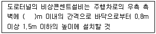
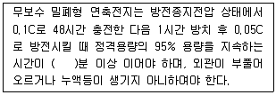
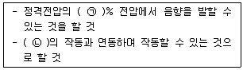
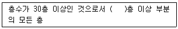

# 소방설비기사(전기분야)20180428(학생용) - 소방전기시설의 구조 및원리

> 원본: `소방설비기사(전기분야)20180428(학생용).pdf`
> 개인학습용 변환본.

## 61. 문제

61. 비상콘센트설비 전원회로의 설치기준 중 틀린 것은?
    ① 전원회로는 3상교류 380V 이상인 것으로서, 그 전원공급
용량은 3kVA 이상인 것으로 하여야 한다.
    ② 전원회로는 각층에 2 이상이 되도록 설치할 것. 다만, 설
치하여야 할 층의 비상콘센트가 1개인 때에는 하나의 회
로로 할 수 있다.
    ③ 비상콘센트용의 풀박스 등은 방청도장을 한 것으로서, 
두께 1.6mm 이상의 철판으로 하여야 한다.
    ④ 하나의 전용회로에 설치라는 비상콘센트는 10개 이하로 
할 것. 이 경우 전선의 용량은 각 비상콘센트(비상콘센트
가 3개 이상인 경우에는 3개)의 공급용량을 합한 용량 
이상의 것으로 하여야 한다.

### 정답

1번

### 해설

정답은 1번입니다. 선택지의 핵심개념 을 확인하세요.

### 그림

## 62. 문제

62. 불꽃감지기 중 도로형의 최대시야각 기준으로 옳은 것은?
    ① 30°이상
② 45°이상
    ③ 90°이상
④ 180°이상

### 정답

1번

### 해설

정답은 1번입니다. 선택지의 핵심개념 을 확인하세요.

### 그림

## 63. 문제

63. 비상경보설비를 설치하여야 하는 특정 소방대상물의 기준으
로 옳은 것은? (단, 지하구, 모래∙석재 등 불연재료 창고 및 
위험물 저장 ㆍ 처리 시설 중 가스시설은 제외한다.)
    ① 공연장의 경우 지하층 또는 무창층의 바닥면적이 100m2
이상인 것
    ② 지하층을 제외한 층수가 11층 이상인 것
    ③ 지하층의 층수가 3층 이상인 것
    ④ 30명 이상의 근로자가 작업하는 옥내작업장

### 정답

1번

### 해설

정답은 1번입니다. 선택지의 핵심개념 을 확인하세요.

### 그림

## 64. 문제

64. 휴대용비상조명등의 설치기준 중 틀린 것은?
    ① 대규모점포(지하상가 및 지하역사는 제외)와 영화상영관
에는 보행거리 50m 이내마다 3개 이상 설치할 것
    ② 사용 시 수동으로 점등되는 구조일 것
    ③ 건전지 및 충전식 밧데리의 용량은 20분 이상 유효하게 
사용할 수 있는 것으로 할 것
    ④ 지하상가 및 지하역사에서는 보행거리 25m 이내마다 3
개 이상 설치할 것

### 정답

1번

### 해설

정답은 1번입니다. 선택지의 핵심개념 을 확인하세요.

### 그림

## 65. 문제

65. 객석내의 통로가 경사로 또는 수평로로 되어 있는 부분에 
설치하여야 하는 객석유도등의 설치개수 산출 공식으로 옳
은 것은?
    ① 
    ② 
    ③ 
    ④

### 정답

1번

### 해설

정답은 1번입니다. 선택지의 핵심개념 을 확인하세요.

### 그림

## 66. 문제

66. 객석유도등을 설치하지 아니하는 경우의 기준 중 다음 ( ) 
안에 알맞은 것은?
    
    ① 15
② 20
    ③ 30
④ 50

### 정답

1번

### 해설

정답은 1번입니다. 선택지의 핵심개념 을 확인하세요.

### 그림

## 67. 문제

67. 비상벨설비의 설치기준 중 다음 ( ) 안에 알맞은 것은?
    
    ① ㉠ 30, ㉡ 10
② ㉠ 10, ㉡ 30
    ③ ㉠ 60, ㉡ 10
④ ㉠ 10, ㉡ 60

### 정답

1번

### 해설

정답은 1번입니다. 선택지의 핵심개념 을 확인하세요.

### 그림

## 68. 문제

68. 누전경보기 변류기의 절연저항시험 부위가 아닌 것은?
    ① 절연된 1차권선과 단자판 사이
    ② 절연된 1차권선과 외부금속부 사이
    ③ 절연된 1차권선과 2차권선 사이
    ④ 절연된 2차권선과 외부금속부 사이

### 정답

1번

### 해설

정답은 1번입니다. 선택지의 핵심개념 을 확인하세요.

### 그림

## 69. 문제

69. 피난기구의 설치기준 중 틀린 것은?
    ① 피난기구를 설치하는 개구부는 서로 동일 직선상이 아닌 
위치에 있을 것. 다만, 피난교∙피난용트랩 ㆍ 간이완강기 
ㆍ 아파트에 설치되는 피난기구(다수인 피난장비는 제외) 
기타 피난 상 지장이 없는 것에 있어서는 그러하지 아니
4과목 : 소방전기시설의 구조 및 원리

소방설비기사(전기분야)
◐2018년 04월 28일 필기 기출문제 ◑
전자문제집 CBT : www.comcbt.com
최강 자격증 기출문제 전자문제집 CBT : www.comcbt.com
하다.
    ② 4층 이상의 층에 하향식 피난구용 내림식 사다리를 설치
하는 경우에는 금속성 고정 사다리를 설치하고, 당해 고
정사다리에는 쉽게 피난할 수 있는 구조의 노대를 설치
하여야 한다.
    ③ 다수인피난장비 보관실은 건물 외측보다 돌출되지 아니
하고, 빗물 ㆍ 먼지 등으로부터 장비를 보호할 수 있는 
구조이어야 한다.
    ④ 승강식피난기 및 하향식 피난구용 내림식 사다리의 착지
점과 하강구는 상호 수평거리 15cm 이상의 간격을 두어
야 한다.

### 정답

1번

### 해설

정답은 1번입니다. 선택지의 핵심개념 을 확인하세요.

### 그림

## 70. 문제

70. 소방시설용 비상전원수전설비에서 전력수급용 계기용변성기 
ㆍ 주차단장치 및 그 부속기기로 정의되는 것은?
    ① 큐비클설비
② 배전반설비
    ③ 수전설비
④ 변전설비

### 정답

1번

### 해설

정답은 1번입니다. 선택지의 핵심개념 을 확인하세요.

### 그림

## 71. 문제

71. 비상콘센트설비의 설치기준 중 다음 ( ) 안에 알맞은 것은?
    
    ① 15
② 25
    ③ 30
④ 50

### 정답

1번

### 해설

정답은 1번입니다. 선택지의 핵심개념 을 확인하세요.

### 그림

## 72. 문제

72. 자동화재속보설비 속보기 예비전원의 주위온도 충방전시험 
기준 중 다음 ( ) 안에 알맞은 것은?
    
    ① 10
② 25
    ③ 30
④ 40

### 정답

1번

### 해설

정답은 1번입니다. 선택지의 핵심개념 을 확인하세요.

### 그림

## 73. 문제

73. 비상방송설비 음향장치 설치기준 중 층수가 5층 이상으로서 
연면적 3000m2를 초과하는 특정소방대상물의 1층에서 발화
한 때의 경보 기준으로 옳은 것은?
    ① 발화층에 경보를 발할 것
    ② 발화층 및 그 직상층에 경보를 발할 것
    ③ 발화층 ㆍ 그 직상층 및 기타의 지하층에 경보를 발할 
것
    ④ 발화층 ㆍ 그 직상층 및 지하층에 경보를 발할 것

### 정답

1번

### 해설

정답은 1번입니다. 선택지의 핵심개념 을 확인하세요.

### 그림

## 74. 문제

74. 비상방송설비 음향장치의 구조 및 성능 기준 중 다음 ( ) 안
에 알맞은 것은?
    
    ① ㉠ 65, ㉡ 자동화재탐지설비
    ② ㉠ 80, ㉡ 자동화재탐지설비
    ③ ㉠ 65, ㉡ 단독경보형감지기
    ④ ㉠ 80, ㉡ 단독경보형감지기

### 정답

1번

### 해설

정답은 1번입니다. 선택지의 핵심개념 을 확인하세요.

### 그림

## 75. 문제

75. 무선통신보조설비를 설치하여야 할 특정소방 대상물의 기준 
중 다음 ( ) 안에 알맞은 것은?
    
    ① 11
② 15
    ③ 16
④ 20

### 정답

1번

### 해설

정답은 1번입니다. 선택지의 핵심개념 을 확인하세요.

### 그림

## 76. 문제

76. 자동화재탐지설비 수신기의 설치기준 중 다음 ( ) 안에 알맞
은 것은?
    
    ① 감지기
② 발신기
    ③ 중계기
④ 시각경보기

### 정답

1번

### 해설

정답은 1번입니다. 선택지의 핵심개념 을 확인하세요.

### 그림

## 77. 문제

77. 노유자시설 지하층에 적응성을 가진 피난 기구는?
    ① 미끄럼대
② 다수인피난장비
    ③ 피난교
④ 피난용트랩

### 정답

1번

### 해설

정답은 1번입니다. 선택지의 핵심개념 을 확인하세요.

### 그림

## 78. 문제

78. 자동화재탐지설비의 감지기 중 연기를 감지하는 감지기는 
감시챔버로 몇 mm 크기의 물체가 침입할 수 없는 구조이어
야 하는가?
    ① (1.3 ± 0.05)
② (1.5 ± 0.05)
    ③ (1.8 ± 0.05)
④ (2.0 ± 0.05)

### 정답

1번

### 해설

정답은 1번입니다. 선택지의 핵심개념 을 확인하세요.

### 그림

## 79. 문제

79. 무선통신보조설비 증폭기의 비상전원 용량은 무선통신보조
설비를 유효하게 몇 분 이상 작동시킬 수 있는 것으로 설치
하여야 하는가?
    ① 10
② 20
    ③ 30
④ 60

### 정답

1번

### 해설

정답은 1번입니다. 선택지의 핵심개념 을 확인하세요.

### 그림

## 80. 문제

80. 광전식 분리형 감지기의 설치기준 중 옳은 것은?
    ① 감지기의 수광면은 햇빛을 직접 받도록 설치할 것
    ② 광축(송광면과 수광면의 중심을 연결한 선)은 나란한 벽
으로부터 1.5m 이상 이격하여 설치할 것
    ③ 감지기의 송광부와 수광부는 설치된 뒷벽으로부터 0.6m 
이내 위치에 설치할 것
    ④ 광축의 높이는 천장 등(천장의 실내에 면한 부분 또는 
상층의 바닥하부면) 높이의 80% 이상일 것

소방설비기사(전기분야)
◐2018년 04월 28일 필기 기출문제 ◑
전자문제집 CBT : www.comcbt.com
최강 자격증 기출문제 전자문제집 CBT : www.comcbt.com
전자문제집 CBT 홈페이지 : www.comcbt.com
기출문제 및 해설집 다운로드  : www.comcbt.com/xe
전자문제집 CBT 앱(구글플레이) : [다운로드]
전자문제집 CBT란?
종이 문제집이 아닌 인터넷으로 문제를 풀고 자동으로 채점하며 
모의고사, 오답 노트, 해설까지 제공하는 무료 기출문제 학습 프
로그램으로 실제 시험에서 사용하는 OMR 형식의 CBT를 제공합
니다.
PC 버전 및 모바일 버전 완벽 연동
교사용/학생용 관리기능도 제공합니다.
오답 및 오탈자가 수정된 최신 자료와 해설은 전자문제집 CBT 
에서 확인하세요.
1
2
3
4
5
6
7
8
9
10
②
④
②
②
④
①
②
④
①
①
11
12
13
14
15
16
17
18
19
20
④
④
③
④
④
①
②
②
③
①
21
22
23
24
25
26
27
28
29
30
④
①
③
②
①
②
③
④
②
②
31
32
33
34
35
36
37
38
39
40
②
①
③
②
③
①
②
①
③
④
41
42
43
44
45
46
47
48
49
50
③
②
②
④
①
①
④
④
①
①
51
52
53
54
55
56
57
58
59
60
①
①
④
②
③
④
②
②
④
③
61
62
63
64
65
66
67
68
69
70
①
④
①
②
②
②
③
①
②
③
71
72
73
74
75
76
77
78
79
80
④
③
④
②
③
②
④
①
③
④

### 정답

1번

### 해설

정답은 1번입니다. 선택지의 핵심개념 을 확인하세요.

### 그림

